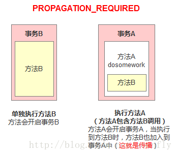
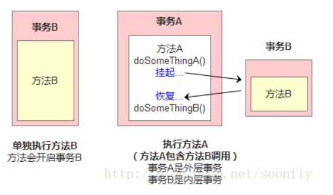
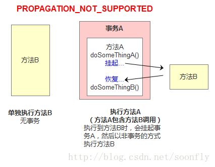

# Spring

## Spring框架概述

- Spring是轻量级的开源的JavaEE框架
- Spring可以解决企业应用开发的复杂性
- Spring中有两个核心部分：IOC和Aop
  - IOC：控制反转，把创建对象过程交给Spring进行
  - Aop：面向切面，不修改源代码的情况下进行功能增强

## IOC容器

### IOC底层原理

- IOC，Inversion of Control 控制反转，把对象创建和对象之间的调用过程，交给Spring进行管理。

- 使用IOC目的：为了降低耦合度

  > 好的设计，高内聚、低耦合

- IOC实现

  - xml解析、工厂模式、反射

  - IOC实现过程

    1. xml配置文件，配置创建的对象

       ```xml
       <bean id="dao" class="com.lks.UserDao"></bean>
       ```

    2. 有Service类和Dao类，创建工厂类

       ```java
       class UserFactory {
           public static UserDao getDao(){
               String classValue = class属性值;// xml解析
               Class clazz = Class.forName(classValue);
               return (UserDao)clazz.newInstance();
           }
       }
       ```

       

### IOC接口（BeanFactory）

- IOC思想基于IOC容器完成，IOC容器底层就是对象工厂
- Spring提供IOC容器实现的两种方式：（两个接口）
  - `BeanFactory`：IOC容器基本实现，是Springnebula的使用接口，不提供开发人员进行使用。
    - 特点：加载配置文件时不会创建对象，获取（使用）对象时才会去创建对象。
  - `ApplicationContext`：BeanFactory接口的子接口，提供更多、更强大的功能，一般由开发人员进行使用
    - 特点：加载配置文件时就会把配置文件中的对象进行创建
- `ApplicationContext`接口的最终实现类：
  - FileSystemXmlApplicationContext
  - ClassPathXmlApplicationContext

### IOC操作 Bean管理

- Bean管理是指两个操作
  - Spring创建对象
  - Spring注入属性
- Bean管理操作有两种实现方式
  - 基于Xml配置文件方式实现
  - 基于注解方式实现

#### 工厂bean(FactoryBean)

- Spring有两种类型bean，一种普通bean，另一种工厂bean（FactoryBean）

  - 普通bean：在配置文件中定义bean类型就是返回类型
  - 工厂bean：在配置文件定义bean类型可以和返回类型不一样

- 过程：

  - 创建类，让这个类作为工厂bean，实现接口FactoryBean

  - 实现接口里面的方法，在实现的方法中定义返回的bean类型

    ```java
    public class MyBean implements FactoryBean<Course> {
    
        // 定义返回bean
        @Override
        public Course getObject() throws Exception {
            Course course = new Course();
            course.setcName("Eng");
            return course;
        }
    
        @Override
        public Class<?> getObjectType() {
            return null;
        }
    
        @Override
        public boolean isSingleton() {
            return FactoryBean.super.isSingleton();
        }
    }
    ```

    ```xml
        <bean id="myBean" class="com.littlekids8.factory_bean.MyBean"></bean>
    ```

    ```java
        @Test
        public void test3(){
            ApplicationContext context = new ClassPathXmlApplicationContext("bean3.xml");
            Course course = context.getBean("myBean", Course.class);
            System.out.println(course);
        }
    ```

#### bean的作用域

- 在Spring中，可以设置bean实例是单实例还是多实例
  - 单实例：同一个bean获取的对象始终是同一个对象。
- 默认情况下，bean是单实例对象
- 在Spring配置文件中的bean标签里有一个属性scope用于设置单实例或多实例
  - scope属性值：singleton（单例）、prototype（多实例）、request（对象会放到request中）、session（对象会放到session中）等。
  - singleton：单实例，在加载spring配置文件时，就会创建单实例对象
  - prototype：多实例，在调用getBean()方法时才会创建对象。

#### bean的生命周期

- 生命周期：对象创建到对象销毁
- bean的生命周期
  - 通过构造器创建bean实例（无参构造）
  - 为bean的属性设置值和对其他bean引用（调用set方法）
  - 把bean实例传递给bean后置处理器（BeanPostProcessor）的postProcessBeforeInitialization方法
  - 调用bean的初始化的方法（需进行配置）
  - 把bean实例传递给bean后置处理器的postProcessAfterInitialization方法
  - bean可以使用了（对象获取到了）
  - 当容器关闭时，调用bean的销毁方法（需要进行配置销毁的方法）

#### 基于xml的Bean管理

##### 基于xml方式创建对象

```xml
<bean id="dao" class="com.lks.UserDao"></bean>
```

- 在Spring配置文件中，使用bean标签，标签里添加对应属性，即可实现对象创建
- bean标签中的常用属性：
  - id属性：唯一标识，不是指对象名
  - class属性：类全路径（包类属性）
- 创建对象时，默认执行无参构造方法

##### 基于xml方式注入属性

- DI：依赖注入，就是注入属性

###### set方法注入

1. 编写类，编写类各个属性的set方法

```java
class Book{
    String bName;
    String bAuthor;
    public void setBName(String name){
        this.bName = name;
    }
    public void setBAuthor(String author){
        this.bAuthor = author;
    }
}
```

2. 在Spring配置文件中配置对象创建、配置属性注入

```xml
<bean id="book" class="com.lks.Book">
    <!--使用property完成属性注入
		name：类中属性的名称
		value：向属性注入的值-->
	<property name="bName" value="道德经"></property>
    <property name="bAuthor" value="老子"></property>
</bean>
```

###### 有参构造注入

1. 编写类，编写有参构造方法

```java
class Book{
    String bName;
    String bAuthor;
	public Book(String bName, String bAuthor){
        this.bName = bName;
        this.bAuthor = bAuthor;
    }
}
```

2. 在Spring配置文件中配置对象创建，同时配置构造方法的各个参数

```xml
<bean id="book" class="com.lks.Book">
    <!---->
	<constructor-arg name="bName" value="道德经"></constructor-arg>
    <constructor-arg name="bAuthor" value="老子"></constructor-arg>
</bean>
```

###### p名称空间注入

- 使用p名称空间注入，可以简化xml配置方式

##### xml注入属性的不同情况

###### 注入属性-空值和特殊符号

- null值：

  ```xml
  <bean id="book" class="com.lks.Book">
  	<property name="bName">
          <null/>
      </property>
  </bean>
  ```

- 特殊符号：

  - 把符号<>进行转义`&lt;`、 `&gt;`
  - 把带特殊符号的内容写到CDATA

  ```xml
  <bean id="book" class="com.lks.Book">
  	<property name="bName"  >
          <value><![CDATA[<<南京>>]]></value>
      </property>
  </bean>
  ```

###### 注入属性-外部Bean

- 过程：

  1. 创建两个类Service类和Dao类

     ```java
     public class UserService{
         
         private UserDao userDao;
         
         public void setUserDao(UserDao userDao){
             this.UserDao = userDao;
         }
         public void add(){
             System.out.println("service add...");
         }
     }
     ```

     ```java
     public interface UserDao{
         public void update();
     }
     ```

     ```java
     public class UserDaoImpl implements UserDao{
         @Override
         public void update(){
             System.out.println("dao update...");
         }
     }
     ```

     

  2. 在Service调用dao里的方法

  3. 在Spring配置文件中配置

     ```xml
     <bean id="userService" class="com.lks.service.UserService">
     	<!--注入userDao对象
     		name为UserService类中的成员属性
     		ref属性值为其他bean的id值
     	-->
         <property name="userDao" ref="userDaoImpl"></property>
     </bean>
     <bean id="userDaoImpl" class="com.lks.dao.UserDaoImpl"></bean>
     ```

###### 注入属性-内部bean

- 一对多关系：部门和员工，一个部门有多个员工，一个员工属于一个部门。

- 在实体类之间表示一对多关系

  ```java
  // 部门
  public class Department {
      private String dname;
  
      public void setDname(String dname) {
          this.dname = dname;
      }
  }
  ```

  ```java
  // 员工
  public class Employee {
      private String eName;
      private String gender;
      private Department department;// 所属部门
  
      public void setGender(String gender) {
          this.gender = gender;
      }
  
      public void seteName(String eName) {
          this.eName = eName;
      }
      public void setDepartment(Department department) {
          this.department = department;
      }
  }
  ```

- 在Spring配置文件中进行配置

  ```xml
  <?xml version="1.0" encoding="UTF-8"?>
  <beans xmlns="http://www.springframework.org/schema/beans"
         xmlns:xsi="http://www.w3.org/2001/XMLSchema-instance"
         xsi:schemaLocation="http://www.springframework.org/schema/beans http://www.springframework.org/schema/beans/spring-beans.xsd">
      <!--内部bean-->
      <bean id="employee" class="com.littlekids8.bean.Employee">
          <property name="eName" value="lucy"></property>
          <property name="gender" value="女"></property>
          <!-- 对象类型属性-->
          <property name="department">
  <!--            内部bean-->
              <bean id="dept" class="com.littlekids8.bean.Department">
                  <property name="dname" value="安保部"></property>
              </bean>
          </property>
      </bean>
  </beans>
  ```

###### 注入属性-级联赋值

- 需要实现get方法

  ```java
  // 员工
  public class Employee {
      private String eName;
      private String gender;
      private Department department;
  
      public void setGender(String gender) {
          this.gender = gender;
      }
  
      public void seteName(String eName) {
          this.eName = eName;
      }
      public void setDepartment(Department department) {
          this.department = department;
      }
  	// 需要实现get方法
      public Department getDepartment() {
          return department;
      }
  }
  ```

- 配置文件

  ```xml
  
      <bean id="employee" class="com.littlekids8.bean.Employee">
          <property name="eName" value="lucy"></property>
          <property name="gender" value="女"></property>
          <!-- 对象类型属性-->
          <property name="department" ref="dept"></property>
          <!-- 级联赋值-->
          <property name="department.dname" value="技术部"></property>
      </bean>
      <bean id="dept" class="com.littlekids8.bean.Department"></bean>
  
  ```

###### 注入属性-注入集合类型属性

- **注入数组类型属性**
- **注入List集合类型属性**
- **注入Map集合类型属性**

- 过程：

  - 创建类、定义数组、List、Map、Set类型，生成对应set方法

    ```java
    public class Student {
        // 数组类型属性
        private String[] courses;
        // List集合类型属性
        private List<String> list;
        // map集合类型属性
        private Map<String, String> maps;
        // set集合类型属性
        private Set<String> sets;
    
        public void setCourses(String[] courses) {
            this.courses = courses;
        }
        public void setList(List<String> list) {
            this.list = list;
        }
        public void setMaps(Map<String, String> maps) {
            this.maps = maps;
        }
        public void setSets(Set<String> sets) {
            this.sets = sets;
        }
    }
    ```

  - 配置文件：

    ```xml
    
        <bean id="student" class="com.littlekids8.collection_type.Student">
    <!--        数组类型属性注入-->
            <property name="courses">
                <array>
                    <value>Java入门</value>
                    <value>Database数据库</value>
                </array>
            </property>
    <!--        List类型属性注入-->
            <property name="list">
                <list>
                    <value>张三</value>
                    <value>小张</value>
                </list>
            </property>
    <!--        map类型属性注入-->
            <property name="maps">
                <map>
                    <entry key="JAVA" value="java"></entry>
                    <entry key="PHP" value="php"></entry>
                </map>
            </property>
    <!--        set类型属性注入-->
            <property name="sets">
                <set>
                    <value>MySql</value>
                    <value>Redis</value>
                </set>
            </property>
        </bean>
    ```

- 在集合中设置引用类型值

  ```xml
      <bean id="student" class="com.littlekids8.collection_type.Student">
  <!-- .........-->
  <!--        注入List集合类型，值是对象-->
          <property name="courseList">
              <list>
                  <ref bean="course1"></ref>
                  <ref bean="course2"></ref>
              </list>
          </property>
      </bean>
  <!--    创建多个Course对象-->
      <bean id="course1" class="com.littlekids8.collection_type.Course">
          <property name="cName" value="程序设计方法"></property>
      </bean> 
      <bean id="course2" class="com.littlekids8.collection_type.Course">
          <property name="cName" value="Python数据科学"></property>
      </bean>
      
  </beans>
  ```

  

- 可将集合注入部分提取出来

  - 有Book类

    ```java
    public class Book {
        private List<String> list;
    
        public void setList(List<String> list) {
            this.list = list;
        }
    }
    ```

  - 在Spring配置文件中引入名称空间util

    ```xml
    <beans xmlns="http://www.springframework.org/schema/beans"
           xmlns:xsi="http://www.w3.org/2001/XMLSchema-instance"
           xmlns:util="http://www.springframework.org/schema/util"
           xsi:schemaLocation="http://www.springframework.org/schema/beans http://www.springframework.org/schema/beans/spring-beans.xsd
    http://www.springframework.org/schema/util http://www.springframework.org/schema/util/spring-util.xsd">
    ```

  - 使用util标签完成list集合注入

    ```xml
    <?xml version="1.0" encoding="UTF-8"?>
    <beans xmlns="http://www.springframework.org/schema/beans"
           xmlns:xsi="http://www.w3.org/2001/XMLSchema-instance"
           xmlns:util="http://www.springframework.org/schema/util"
           xsi:schemaLocation="http://www.springframework.org/schema/beans http://www.springframework.org/schema/beans/spring-beans.xsd
    http://www.springframework.org/schema/util http://www.springframework.org/schema/util/spring-util.xsd">
        <!--    提取list集合类型属性注入-->
        <util:list id="bookList">
            <value>算法</value>
            <value>深入理解Java虚拟机</value>
            <value>深度学习</value>
        </util:list>
        
    <!--    注入-->
        <bean id="book" class="com.littlekids8.collection_type.Book">
            <property name="list" ref="bookList"></property>
        </bean>
    
    </beans>
    ```


##### xml自动装配

- 自动装配：根据指定的装配规则（属性名称或者属性类型），Spring自动将匹配的属性值进行注入。

  ```xml
  <!--    实现自动装配
          bean标签属性autowire，配置自动装配
          autowire属性常用两个值：
              byName根据属性名注入：注入值bean的ID值和类中成员属性的名称必须一致
              byType根据属性类型注入：要保证同类型的bean只有一个。
          -->
      <bean id="emp" class="com.littlekids8.autowire.Employee" autowire="byName">
  <!--        <property name="department" ref="dept"></property>-->
      </bean>
      <bean id="department" class="com.littlekids8.autowire.Department"></bean>
  ```

  ```java
  public class Employee {
      private Department department;// 要保证这个名称与bean中的ID值一致，才能实现ByName的自动装配
  
      public void setDepartment(Department department) {
          this.department = department;
      }
  }
  ```

##### xml方式的外部属性文件

- 对于某些属性较多的bean，发生修改时去改xml配置文件比较麻烦，可将部分属性单独存放到别的文件中，这样减轻单个xml文件的修改难度。

- 例子：配置数据库信息

  - 直接配置数据库信息

    ```xml
    <!--    直接配置连接池-->
        <bean id="dataSource" class="com.alibaba.druid.pool.DruidDataSource">
            <property name="driverClassName" value="com.mysql.jdbc.Driver"></property>
            <property name="url" value="jdbc:mysql://localhost:3306/UserDb"></property>
            <property name="username" value="root"></property>
            <property name="password" value="root"></property>
        </bean>
    ```

  - 引入外部属性文件配置数据库连接池

    - 创建外部属性文件，properties格式，写数据库信息

      ```properties
      prop.driverClass=com.mysql.jdbc.Driver
      prop.url=jdbc:mysql://localhost:3306/UserDb
      prop.userName=root
      prop.password=root
      ```

    - 把外部properties文件引入到Spring配置文件

      ```xml
      <beans xmlns="http://www.springframework.org/schema/beans"
             xmlns:xsi="http://www.w3.org/2001/XMLSchema-instance"
             xmlns:context="http://www.springframework.org/schema/context"
             xsi:schemaLocation="http://www.springframework.org/schema/beans http://www.springframework.org/schema/beans/spring-beans.xsd
      http://www.springframework.org/schema/context http://www.springframework.org/schema/context/spring-context.xsd">
      ```

    - 在Spring配置文件种使用标签引入外部属性文件，使用表达式引用外部文件的属性值

      ```xml
       <!--引入外部属性文件-->
          <context:property-placeholder location="classpath:jdbc.properties"/>
          <!--配置数据库连接-->
          <bean id="dataSource" class="com.alibaba.druid.pool.DruidDataSource">
              <property name="driverClassName" value="${prop.driverClass}"></property>
              <property name="url" value="${prop.url}"></property>
              <property name="username" value="${prop.userName}"></property>
              <property name="password" value="${prop.password}"></property>
          </bean>
      ```

#### 基于注解方式的Bean管理

- 注解是代码特殊标记，格式为：`@注解名称(属性名称=属性值,...)`
- 使用注解的地方：类、方法、属性上面
- 使用注解的目的：简化xml配置

##### 基于注解方式的对象创建

- Spring中针对创建对象提供的注解

  - `@Component`：用于一般的组件
  - `@Service`：用在业务逻辑层或者Service层上
  - `@Controller`：用在Web层上
  - `Repository`：用在Dao层或持久层上
  - 上面四个注解功能是一样的，都可以用来创建bean实例，并不强制要求一定准确使用在某个层上，可以混用。

- 基于注解实现对象的创建-过程：

  - 引入依赖spring-aop.jar

  - 开启组件扫描

    ```xml
    <?xml version="1.0" encoding="UTF-8"?>
    <beans xmlns="http://www.springframework.org/schema/beans"
           xmlns:xsi="http://www.w3.org/2001/XMLSchema-instance"
           xmlns:context="http://www.springframework.org/schema/context"
           xsi:schemaLocation="http://www.springframework.org/schema/beans http://www.springframework.org/schema/beans/spring-beans.xsd
    http://www.springframework.org/schema/context  http://www.springframework.org/schema/context/spring-context.xsd">
        <!--开启组件扫描
            如果扫描多个包，多个包使用逗号隔开-->
        <context:component-scan base-package="com.littlekids8"></context:component-scan>
    
    </beans>
    ```

  - 创建类，在类上面添加创建对象注解

    ```java
    // 在注解里面value属性值可以省略不写
    // 默认是首字母小写的类名
    @Component(value = "userService")// <bean id="userService" class=".." >
    public class UserService {
        public void add(){
            System.out.println("service add ...");
        }
    }
    
    ```

- 组件扫描的配置的一些情况

  ```xml
      <!--实例1
          use-default-filters="false":表示现在不使用默认的filter，自己配置filter
          context:include-filter,设置扫描那些内容
          -->
      <context:component-scan base-package="com.littlekids8" use-default-filters="false">
          <!--只扫描Controller的注解-->
          <context:include-filter type="annotation" expression="org.springframework.stereotype.Controller"/>
      </context:component-scan>
  
      <!--示例2
          下面配置扫描包所有内容
          context:include-filter：设置哪些内容不进行扫描
          -->
      <context:component-scan base-package="com.littlekids8" >
          <!--扫描除了Controller的注解-->
          <context:include-filter type="annotation" expression="org.springframework.stereotype.Controller"/>
      </context:component-scan>
  ```

##### 基于注解方式实现的属性注入

- 属性注入提供的注解

  - `@AutoWired`：根据属性类型进行自动装配
  - `@Qualifier`：根据属性名称进行注入
  - `@Resource`：可以根据类型注入，也可以根据名称注入
  - `@value`：注入普通类型属性

- `@AutoWired`注解使用过程：

  - 编写service和dao类，在service和dao类中添加创建对象的注解
  - 在service注入dao对象，在service类中添加dao类型的成员属性(无需实现set方法），在属性上面添加属性注入的注解

  ```java
  @Repository
  public class UserDaoImpl implements UserDao{
      @Override
      public void add() {
          System.out.println("dao add ...");
      }
  }
  ```

  

  ```java
  @Service(value = "userService")
  public class UserService {
      // 定义dao类型属性
      @Autowired // 根据类型进行注入
      private UserDao userDao;
  
      public void add(){
          System.out.println("service add ...");
          userDao.add();
      }
  }
  ```

- `@Qualifier`注解的使用需和`@AutoWired`一起使用：

  ```java
  @Repository(value = "userDaoImpl1")
  public class UserDaoImpl implements UserDao{
      @Override
      public void add() {
          System.out.println("dao add ...");
      }
  }
  
  ```

  ```java
  @Service(value = "userService")// <bean id="userService" class=".." >
  public class UserService {
  
      @Autowired // 根据类型进行注入
      @Qualifier(value = "userDaoImpl1")// 同时根据名称注入
      private UserDao userDao;
  
      public void add(){
          System.out.println("service add ...");
          userDao.add();
      }
  }
  ```

- `@Resource`注解的使用：

  - 注意：Resource注解不是Spring提供的，它是由javax包提供的

  ```java
  //    @Resource //根据类型注入
      @Resource(name = "userDaoImpl1") // 根据名称注入
      private UserDao userDao;
  
  ```

- `@Value`注解：注入普通类型属性

  ```java
      @Value(value = "hello")
      private String name;
  ```

##### 完全注解开发

- 创建配置类，代替xml配置文件

  ```java
  @Configuration // 作为配置类，代替xml配置文件
  @ComponentScan(basePackages = {"com.littlekids8"})
  public class SpringConfig {
  }
  ```

- 编写测试类

  ```java
      @Test
      public void testService2(){
          ApplicationContext context = new AnnotationConfigApplicationContext(SpringConfig.class);
          UserService userService = context.getBean("userService" ,UserService.class);
          System.out.println(userService);
          userService.add();
      }
  ```


## AOP面向切面编程

- AOP，Aspect Oriented Programming,面向切面（方面）编程，通过预编译一方式和运行期间动态代码实现程序功能的统一维护的一种技术。（可以不通过修改源代码方式，在主干功能里面添加新功能）
- 利用AOP可以对业务逻辑的各个部分进行隔离，从而使得业务逻辑各部分之间的耦合度降低，提高程序的可重用性，同时提高了开发的效率。

### AOP底层原理

- AOP底层使用动态代理，有两种情况动态代理
  - 第一种情况，有接口的情况下，使用JDK动态代理
    - 创建接口实现类代理对象，增强类的方法
  - 第二种情况，没有接口的情况下，使用CGLIB动态代理
    - 创建当前类子类的代理对象

#### JDK动态代理的实现

- JDK动态代理，主要是可以在不更改原类的源代码的情况下，对该类中的方法实现更改。

- JDK动态代理，需要使用`Proxy`类里面的方法创建代理对象

  - `static Object newProxyInstance(ClassLoader loader, Class<?>[] interface, InvocationHandler h)` ：返回指定接口的代理类的实例，该接口将方法调用分派给指定的调用处理程序。
  - 第一个参数ClassLoader：类加载器
  - 第二个参数interface：增强方法所在的类，这个类实现的接口，支持多个接口
  - 第三个参数InvocationHandler ：实现这个接口InvocationHandler ，创建代理对象，写增强的部分
  
- JDK动态代理实现过程：

  - 创建接口，定义方法

  - 创建接口实现类，实现方法

    ```java
    public interface UserDao {
        public int add(int a, int b);
        public String update(String id);
    }
    
    public class UserDaoImpl implements UserDao{
        @Override
        public int add(int a, int b) {
            System.out.println("add方法执行了。。");
            return a+b;
        }
    
        @Override
        public String update(String id) {
            System.out.println("update方法执行了。。");
            return id;
        }
    }
    ```

  - 实现InvocationHandler接口，在其的invoke()方法中编写增强的逻辑，注意该逻辑会覆盖原UserDaoImpl的各个方法；然后使用Proxy类创建接口代理对象。使用通过Proxy获得的代理对象，调用方法，即可看到原方法的逻辑都被覆盖了。

    ```java
    public class JDKProxy {
    
        public static void main(String[] args) {
    
            Class[] interfaces = {UserDao.class};
            UserDaoImpl userDao = new UserDaoImpl();
            // 创建接口实现类的代理对象
            UserDao dao = (UserDao) Proxy.newProxyInstance(JDKProxy.class.getClassLoader(), interfaces, new UserDaoProxy(userDao));
            int r = dao.add(1,2);// 会调用增强的逻辑
            dao.update("hello");// 也会调用增强的逻辑
            System.out.println(r);
        }
    }
    
    // 创建代理对象代码
    class UserDaoProxy implements InvocationHandler {
    
        // 需要传递被代理的对象过来（谁要增强谁就进来）
        // 有参构造传递
        private Object obj;
        public UserDaoProxy(Object obj){
            this.obj = obj;
        }
       // 增强的逻辑,invoke方法里面的逻辑，将会覆盖原来的所有方法
        @Override
        public Object invoke(Object proxy, Method method, Object[] args) throws Throwable {
    
            // 原方法之前
            System.out.println("方法之前执行..."+method.getName()+": 传递的参数："+ Arrays.toString(args));
    
            // 原方法执行
            Object result = method.invoke(obj, args);
            // 可以通过判断method.getName()来执行不同的逻辑增强
    
            // 原方法之后
            System.out.println("方法执行之后..."+obj);
            return result;
        }
    }
    ```

    

### AOP操作

#### AOP操作的术语

- 连接点：类里面可以被增强的方法称为连接点
- 切入点：实际被真正增强的方法，称为切入点
- 通知（增强）：实际增加的增强的逻辑部分 称为通知（增强）；通知有多种类型：
  - 前置通知：原方法执行之前的增强部分
  - 后置通知：原方法执行之后的增强部分
  - 环绕通知：原方法执行前后的通知（增强）
  - 异常通知：对原方法执行出现异常时进行异常处理部分增强
  - 最终通知：类似于finally块中的增强
- 切面：是一个动作，把通知（增强）应用到切入点的过程称为切面

#### AOP操作-准备工作

- Spring框架一般基于AspectJ实现AOP操作
  - AspectJ不是Spring组成部分，其是一个独立的AOP框架，一般把AspectJ和Spring框架一起使用，进行AOP操作
- 基于AspectJ实现AOP操作有两种方式：
  - 基于xml配置文件实现
  - 基于注解方式实现（推荐）
- 切入点表达式
  - 切入点表达式作用：知道对哪个类里面的哪个方法进行增强
  - 语法结构：`execution([权限修饰符][返回类型][类全路径][方法名称]([参数列表]))`
  - 举例：
    - `execution(* com.lks.dao.BookDao.add(..))`
    - `execution(* com.lks.dao.BookDao.*(..))`对BookDao类的所有方法进行增强
    - `execution(* com.lks.dao.*.*(..))` 对dao包里的所有类的所有方法进行增强
- 过程：
  - 在项目工程中引入AOP相关依赖

#### AOP操作-Aspect注解方式

- 过程

  - 创建类，在类中定义方法

    ```java
    // 被增强的类
    @Component
    public class User {
        public void add(){
            System.out.println("add..");
        }
    }
    ```

  - 创建增强类（编写增强逻辑）。在增强类里面，创建方法，让不同的方法代表不同的通知类型。

    ```java
    // 增强的类
    @Component
    @Aspect
    public class UserProxy {
    
        // 前置通知
        public void before(){
            System.out.println("before...");
        }
    }
    ```

    

  - 进行通知的配置

    - 在spring配置文件中，开启注解扫描

      ```xml
      <?xml version="1.0" encoding="UTF-8"?>
      <beans xmlns="http://www.springframework.org/schema/beans"
             xmlns:xsi="http://www.w3.org/2001/XMLSchema-instance"
             xmlns:context="http://www.springframework.org/schema/context"
             xmlns:aop="http://www.springframework.org/schema/aop"
             xsi:schemaLocation="http://www.springframework.org/schema/beans http://www.springframework.org/schema/beans/spring-beans.xsd
      http://www.springframework.org/schema/context http://www.springframework.org/schema/context/spring-context.xsd
      http://www.springframework.org/schema/aop http://www.springframework.org/schema/aop/spring-aop.xsd">
          <!--开启注解扫描-->
          <context:component-scan base-package="com.littlekids8.aop_anno"></context:component-scan>
      </beans>
      ```

      

    - 使用注解创建User和UserProxy对象

    - 在增强类上面添加注解`@Aspect`

    - 在Spring配置文件中生成代理对象

      ```xml
      <?xml version="1.0" encoding="UTF-8"?>
      <beans xmlns="http://www.springframework.org/schema/beans"
             xmlns:xsi="http://www.w3.org/2001/XMLSchema-instance"
             xmlns:context="http://www.springframework.org/schema/context"
             xmlns:aop="http://www.springframework.org/schema/aop"
             xsi:schemaLocation="http://www.springframework.org/schema/beans http://www.springframework.org/schema/beans/spring-beans.xsd
      http://www.springframework.org/schema/context http://www.springframework.org/schema/context/spring-context.xsd
      http://www.springframework.org/schema/aop http://www.springframework.org/schema/aop/spring-aop.xsd">
          <!--开启注解扫描-->
          <context:component-scan base-package="com.littlekids8.aop_anno"></context:component-scan>
          <!--生成Aspect生成代理对象-->
          <aop:aspectj-autoproxy></aop:aspectj-autoproxy>
          <!--在完全注解开发中，可以使用`@EnableAspectJAutoProxy(proxyTargetClass=True)`来代替-->
          
      </beans>
      ```

    - 配置不同类型的通知：在增强类的里面，在作为通知方法上面添加通知类型注解，使用切入点表达式进行配置

      ```java
      // 增强的类
      @Component
      @Aspect
      public class UserProxy {
      
          // 前置通知
          // @before注解表示作为前置通知
          @Before(value = "execution(* com.littlekids8.aop_anno.User.add(..))")
          public void before(){
              System.out.println("before...");
          }
          // 后置通知
          @After(value = "execution(* com.littlekids8.aop_anno.User.add(..))")
          public void after(){
              System.out.println("after..");
          }
      
          // 最终通知
          @AfterReturning(value = "execution(* com.littlekids8.aop_anno.User.add(..))")
          public void afterReturning(){
              System.out.println("afterReturning..");
          }
      
          // 异常通知
          @AfterThrowing(value = "execution(* com.littlekids8.aop_anno.User.add(..))")
          public void afterThrowing(){
              System.out.println("AfterThrowing..");
          }
      
          // 环绕通知:会在方法
          @Around(value = "execution(* com.littlekids8.aop_anno.User.add(..))")
          public void around(ProceedingJoinPoint proceedingJoinPoint) throws Throwable {
              System.out.println("环绕的前面..");
              proceedingJoinPoint.proceed();//原方法的执行
              System.out.println("环绕的后面");
          }
      }
      
      ```

  - 此时测试：

    ```java
    @Test
        public void test01(){
            ApplicationContext context = new ClassPathXmlApplicationContext("bean1.xml");
            User user = context.getBean("user", User.class);
            user.add();
        }
    ```

    输出：

    ```text
    环绕的前面..
    before...
    add..
    afterReturning..
    after..
    环绕的后面
    ```

- （相同的）公共切入点抽取：使用`@PointCut`注解

  ```java
      // 相同切入点抽取
      @Pointcut(value = "execution(* com.littlekids8.aop_anno.User.add(..))")
      public void pointDemo(){
      }
  
      // 前置通知  // @before注解表示作为前置通知
      @Before(value = "pointDemo()")
      public void before(){
          System.out.println("before...");
      }
  ```

- 有多个增强类对同一个方法进行增强，可以设置增强类优先级

  - 在各个增强类上面添加注解`@Order(数字)`，数字小的先执行

  ```java
  @Component
  @Aspect
  @Order(1)
  ```

- 在完全注解开发中，可以使用`@EnableAspectJAutoProxy(proxyTargetClass=True)`来代替配置文件中的`<aop:aspectj-autoproxy></aop:aspectj-autoproxy>`

#### AOP操作-Aspect配置文件方式

- 在配置文件中配置

  ```xml
  <!--创建对象-->
      <bean id="user" class="com.littlekids8.aop_anno.User"></bean>
      <bean id="userProxy" class="com.littlekids8.aop_anno.UserProxy"></bean>
      
      <!--配置aop增强-->
      <aop:config>
          <!--切入点-->
          <aop:pointcut id="p" expression="execution(* com.littlekids8.aop_anno.User.add(..))"/>
          <!--配置切面-->
          <aop:aspect ref="userProxy">
              <!--增强作用在具体的方法上-->
              <aop:before method="before" pointcut-ref="p"></aop:before>
          </aop:aspect>
      </aop:config>
  ```

  

## JDBC Template

### 概念

- Jdbc 模板,是Spring框架对JDBC进行的封装，使用JDBC Template方便实现对数据库操作

- 准备工作：

  - 引入依赖

  - 配置druid数据库连接池

    ```xml
        <!-- 数据库连接池 -->
        <bean id="dataSource" class="com.alibaba.druid.pool.DruidDataSource"
              destroy-method="close">
            <property name="url" value="jdbc:mysql://localhost:3306/bookshare?allowPublicKeyRetrieval=true&amp;serverTimezone=UTC&amp;useUnicode=true&amp;characterEncoding=UTF-8&amp;useSSL=false" />
            <property name="username" value="root" />
            <property name="password" value="root" />
            <property name="driverClassName" value="com.mysql.jdbc.Driver" />
        </bean>
    ```

  - 配置JdbcTemplate对象，注入DataSource

    ```xml
        <!--JdbcTemplate对象-->
        <bean id="jdbcTemplate" class="org.springframework.jdbc.core.JdbcTemplate">
            <!--注入dataSource-->
            <property name="dataSource" ref="dataSource"></property>
        </bean>
    ```

  - 创建service类，创建dao类，在dao注入jdbcTemplate对象

    - 开启组件扫描

      ```xml
      <context:component-scan base-package="com.littlekids8"></context:component-scan>
      ```

    - Service

      ```java
      @Service
      public class BookService {
          // 注入dao
          @Autowired
          private BookDao bookDao;
      
          // 往数据库添加数据
          public void addBook(Book book) {
              bookDao.add(book);
          }
              // 更新数据
          public void updateBook(Book book) {
              bookDao.update(book);
          }
          // 删除数据
          public void deleteBook(Book book) {
              bookDao.delete(book);
          }
      
      }
      ```

    - Dao

      ```java
      public interface BookDao {
         void add(Book book);
      
          void update(Book book);
      
          void delete(Book book);
      }
      @Repository
      public class BookDaoImpl implements BookDao{
      
          // 注入jdbctemplate
          @Autowired
          private JdbcTemplate jdbcTemplate;
      }
      ```

### JdbcTemplate操作数据库

- 创建数据库对应实体类

  ```java
  public class Book {
      private String bookId;
      private String bookName;
      private String comment;
  
      public String getBookId() {
          return bookId;
      }
  
      public void setBookId(String bookId) {
          this.bookId = bookId;
      }
  
      public String getBookName() {
          return bookName;
      }
  
      public void setBookName(String bookName) {
          this.bookName = bookName;
      }
  
      public String getComment() {
          return comment;
      }
  
      public void setComment(String comment) {
          this.comment = comment;
      }
  }
  ```

#### 添加、更新和删除数据操作

- JdbcTemplate操作数据库添加、更新、删除数据的方法都为`update(String sql, Object... args)`方法
  - 第一个参数为sql语句
  - 第二个参数为可变参数，用于设置sql语句中的值

- 编写service和dao

  - 在dao进行数据库添加操作

    ```java
    @Repository
    public class BookDaoImpl implements BookDao{
    
        // 注入jdbctemplate
        @Autowired
        private JdbcTemplate jdbcTemplate;
    	// 添加
        @Override
        public void add(Book book) {
            // sql语句
            String sql = "insert into book values(?,?,?)";
            
            int update = jdbcTemplate.update(sql, book.getBookId(), book.getBookName(), book.getComment());
            System.out.println(update);
        }
        
        // 修改
            @Override
        public void update(Book book) {
            String sql = "update book set bookname=?, comment=? where book_id=?";
            int update = jdbcTemplate.update(sql, book.getBookName(), book.getComment(), book.getBookId());
            System.out.println(update);
        }
    
        // 删除
        @Override
        public void delete(String id) {
            String sql = "delete from book where book_id =?";
            int update = jdbcTemplate.update(sql, id);
            System.out.println(update);
        }
    }
    ```

  - 测试：

    ```java
        @Test
        public void test01(){
            ApplicationContext context = new ClassPathXmlApplicationContext("bean1.xml");
            BookService bookService = context.getBean("bookService", BookService.class);
            Book book = new Book();
            book.setBookId("1");
            book.setBookName("《算法》");
            book.setComment("abc");
            bookService.addBook(book);
            
           
    
        }
    ```

    

#### 查询数据操作

##### 查询返回某个值

- 可以使用JdbcTemplate的`queryForObject(String sql, Class<T> requiredType)`方法

  ```java
      @Override
      public int selectCount() {
          String sql = "select count(*) from book";
          Integer count = jdbcTemplate.queryForObject(sql, Integer.class);
          return count;
      }
  ```

  

##### 查询返回对象

- 可以使用JdbcTemplate的`queryForObject(String sql,RowMapper<T> rowMapper,Object...args)`方法

  - 其中第二个参数为`RowMapper`，是一个接口，返回不同类型数据，使用该接口的实现类如`BeanPropertyRowMapper`完成数据的封装

  ```java
      @Override
      public Book findBookInfo(String id) {
          String sql = "select * from book where book_id=?";
          Book book = jdbcTemplate.queryForObject(sql, new BeanPropertyRowMapper<Book>(Book.class),id);
          return book;
      }
  ```

  

##### 查询返回集合

- 可以使用JdbcTemplate的`query(String sql, RowMapper<T> rowMapper,Object...args)`方法，该方法返回一个集合

  ```java
      @Override
      public List<Book> findAllBooks() {
          String sql = "select * from book";
          List<Book> bookList = jdbcTemplate.query(sql, new BeanPropertyRowMapper<Book>(Book.class));
          
          return bookList;
      }
  ```

##### 批量操作

- 批量操作：操作表里面多条记录

- 批量更新（添加、修改、删除）：JdbcTemplate中的`batchUpdate(String sql, List<Object[]> batchArgs)`

  - 第二个参数为List集合，代表需要操作的多条记录数据，实际一个Object[]为同一条记录的各个属性值。

  ```java
     //批量添加
  @Override
      public void batchAddBook(List<Object[]> batchArgs) {
          String sql = "insert into book values(?,?,?)";
          int[] ints = jdbcTemplate.batchUpdate(sql, batchArgs);
          System.out.println(Arrays.toString(ints));
      }
  
      @Test
      public void test05() {
          ApplicationContext context = new ClassPathXmlApplicationContext("bean1.xml");
          BookService bookService = context.getBean("bookService", BookService.class);
  
          List<Object[]> batchArgs = new ArrayList<>();
          Object[] o1 = {"3","青年", "123"};
          Object[] o2 = {"4","青年2", "123"};
          Object[] o3= {"5","青年3", "123"};
          batchArgs.add(o1);
          batchArgs.add(o2);
          batchArgs.add(o3);
          bookService.batchAdd(batchArgs);
      }
  ```

  

## 事务（Transaction）操作

### 事务概念

- 事务是数据库操作最基本的单元，事务逻辑上的一组操作，要么都成功，如果有一个失败所有操作都失败
- 典型场景：银行转账
- 事务应该具有4个属性：原子性、一致性、隔离性、持久性。这四个属性通常称为**ACID特性**。
  - 原子性（atomicity）。一个事务是一个不可分割的工作单位，事务中包括的操作要么都做，要么都不做。
  - 一致性（consistency）。事务必须是使数据库从一个一致性状态变到另一个一致性状态。一致性与原子性是密切相关的。
  - 隔离性（isolation）。一个事务的执行不能被其他事务干扰。即一个事务内部的操作及使用的数据对并发的其他事务是隔离的，并发执行的各个事务之间不能互相干扰。
  - 持久性（durability）。持久性也称永久性（permanence），指一个事务一旦提交，它对数据库中数据的改变就应该是永久性的。接下来的其他操作或故障不应该对其有任何影响。

### 搭建事务操作环境

- 环境（以转账为例）

  - Service层：业务的操作
    - 创建转账的方法，调用dao的两个操作
  - Dao层：数据库操作，不写业务
    - 创建两个方法：一方少钱、一方多钱

- 过程：

  - 创建数据库表，添加记录

  - 创建Service，搭建dao，完成对象创建和注入关系

    - Service注入dao，在Dao注入JdbcTemplate，在JdbcTemplate注入DataSource
    - 完成各个方法。

  - 配置文件：

    ```xml
    <?xml version="1.0" encoding="UTF-8"?>
    <beans xmlns="http://www.springframework.org/schema/beans"
           xmlns:xsi="http://www.w3.org/2001/XMLSchema-instance"
           xmlns:context="http://www.springframework.org/schema/context"
           xmlns:aop="http://www.springframework.org/schema/aop"
           xsi:schemaLocation="http://www.springframework.org/schema/beans http://www.springframework.org/schema/beans/spring-beans.xsd
    http://www.springframework.org/schema/context http://www.springframework.org/schema/context/spring-context.xsd
    http://www.springframework.org/schema/aop http://www.springframework.org/schema/aop/spring-aop.xsd">
        <context:component-scan base-package="com.littlekids8"></context:component-scan>
        <!-- 数据库连接池 -->
        <bean id="dataSource" class="com.alibaba.druid.pool.DruidDataSource"
              destroy-method="close">
            <property name="url" value="jdbc:mysql://localhost:3306/bookshare?allowPublicKeyRetrieval=true&amp;serverTimezone=UTC&amp;useUnicode=true&amp;characterEncoding=UTF-8&amp;useSSL=false" />
            <property name="username" value="root" />
            <property name="password" value="8510514guo" />
            <property name="driverClassName" value="com.mysql.jdbc.Driver" />
        </bean>
        <!--JdbcTemplate对象-->
        <bean id="jdbcTemplate" class="org.springframework.jdbc.core.JdbcTemplate">
            <!--注入dataSource-->
            <property name="dataSource" ref="dataSource"></property>
        </bean>
    </beans>
    ```

  - Dao：

    ```java
    public interface AccountDao {
        // 多钱
        public void addMoney();
        // 少钱
        public void reduceMoney();
    }
    
    
    /**
     * 模拟转账：Lucy给Marry转100块。
     */
    @Repository
    public class AccountDaoImpl implements AccountDao {
        // 注入jdbcTemplate
        @Autowired
        private JdbcTemplate jdbcTemplate;
    
        // lucy账户少100；
        @Override
        public void reduceMoney() {
            String sql = "update account set money = money-? where username=?";
            jdbcTemplate.update(sql, 100,"lucy");
        }
    
        // marry的账户多100
        @Override
        public void addMoney() {
            String sql = "update account set money = money+? where username=?";
            jdbcTemplate.update(sql, 100,"marry");
        }
    }
    ```

    

  - Service：

    ```java
    @Service
    public class AccountService {
        // 注入dao
        @Autowired
        private AccountDao accountDao;
    
        // 转账的方法
        public void transferMoney(){
            // lucy少100
            accountDao.reduceMoney();
            // marry多一百
            accountDao.addMoney();
        }
    }
    ```

  - 测试：

    ```java
        @Test
        public void test01() {
            ApplicationContext context = new ClassPathXmlApplicationContext("bean1.xml");
            AccountService accountService = context.getBean("accountService", AccountService.class);
            accountService.transferMoney();
        }
    ```

- 以上代码可能会导致转账不一致（总金额异常）等诸多问题。

### 事务操作

- 事务操作的隐藏的过程：
  1. 开启事务
  2. 执行业务
  3. 没出现异常，提交事务
  4. 出现异常，事务回滚
- 事务一般添加到JavaEE三层结构里面的service层（业务逻辑层）
- 在Spring进行事务管理操作有两种方式：
  - 编程式事务管理
  - **声明式事务管理（一般使用）**

- 声明式事务管理的两种方式：
  - **基于注解方式**
  - 基于xml配置文件方式

- 在Spring进行声明式事务管理，**底层使用AOP原理**
- Spring事务管理API
  - 提供一个接口`PlatformTransactionManager`，代表事务管理器,其针对不同的框架（如jdbcTemplate，mybatis等）有不同的实现类，如`DataSourceTransactionManager`、`HibernateTransactionManager`等。

#### Spring声明式事务管理（注解方式）

- 过程：

  - 在Spring配置文件中配置事务管理器
  
  - 在Spring配置文件中开启事务注解
  
      - 引入名称空间
      - 开启事务注解
      
      ```xml
      <?xml version="1.0" encoding="UTF-8"?>
      <beans xmlns="http://www.springframework.org/schema/beans"
             xmlns:xsi="http://www.w3.org/2001/XMLSchema-instance"
             xmlns:context="http://www.springframework.org/schema/context"
             xmlns:aop="http://www.springframework.org/schema/aop"
             xmlns:tx="http://www.springframework.org/schema/tx"
             xsi:schemaLocation="http://www.springframework.org/schema/beans http://www.springframework.org/schema/beans/spring-beans.xsd
      http://www.springframework.org/schema/context http://www.springframework.org/schema/context/spring-context.xsd
      http://www.springframework.org/schema/aop http://www.springframework.org/schema/aop/spring-aop.xsd
      http://www.springframework.org/schema/tx http://www.springframework.org/schema/tx/spring-tx.xsd">
      
          <context:component-scan base-package="com.littlekids8"></context:component-scan>
          <!-- 数据库连接池 -->
          <bean id="dataSource" class="com.alibaba.druid.pool.DruidDataSource"
                destroy-method="close">
              <property name="url" value="jdbc:mysql://localhost:3306/bookshare?allowPublicKeyRetrieval=true&amp;serverTimezone=UTC&amp;useUnicode=true&amp;characterEncoding=UTF-8&amp;useSSL=false" />
              <property name="username" value="root" />
              <property name="password" value="8510514guo" />
              <property name="driverClassName" value="com.mysql.jdbc.Driver" />
          </bean>
          <!--JdbcTemplate对象-->
          <bean id="jdbcTemplate" class="org.springframework.jdbc.core.JdbcTemplate">
              <!--注入dataSource-->
              <property name="dataSource" ref="dataSource"></property>
          </bean>
      
          <!--创建事务管理器-->
          <bean id="transactionManager" class="org.springframework.jdbc.datasource.DataSourceTransactionManager">
              <!--注入数据源-->
              <property name="dataSource" ref="dataSource"></property>
          </bean>
          <!--开启事务注解-->
          <tx:annotation-driven transaction-manager="transactionManager"></tx:annotation-driven>
      </beans>
      ```
  
  - 在Service类上面（或者service类里面的某个方法上面）添加事务注解`@Transactional`
  
    - `@Transactional`添加在类上面时，代表这个类里面所有方法都添加事务管理
    - `@Transactional`添加在方法上面时，仅为该方法添加事务管理
  
    ```java
    @Service
    @Transactional
    public class AccountService {
        // 注入dao
        @Autowired
        private AccountDao accountDao;
    
        // 转账的方法
        public void transferMoney(){
                // lucy少100
                accountDao.reduceMoney();
                // 模拟异常
                //int i = 10/0;
                // marry多一百
                accountDao.addMoney();
        }
    }
    ```
  
- `@Transactional`的一些参数配置

  - propagation：事务传播行为（propagation behavior）指的就是当一个事务方法被另一个事务方法调用时，这个事务方法应该如何进行。 

    - 例如：methodA事务方法调用methodB事务方法时，methodB是继续在调用者methodA的事务中运行呢，还是为自己开启一个新事务运行，这就是由**methodB**的事务传播行为决定的。

    - 

    - REQUIRED时的事务传播

      

    - REQUIRED_NEW时的事务传播

      

    - NOT_SUPPORTED时的事务传播

      

  - isolation：事务隔离级别

    - 事务的一个特性为隔离性，该性质会使多事务操作之间不会产生相互的影响。

    - 不考虑隔离性可能会导致如脏读、不可重复读、虚读（幻读）等三个读问题。

    - 脏读：事务A更新了数据，但事务A还未提交（可能还会回滚），数据就被事务B读了

    - 不可重复读：一个事务范围内两个相同的查询却返回了不同数据。比如事务T1读取某一数据，事务T2读取并修改了该数据，T1为了对读取值进行检验而再次读取该数据，便得到了不同的结果。

    - 虚读（幻读）：Transaction1读取满足某种搜索条件的一些行，然后Transaction2插入了符合Transaction1的搜索条件的一个新行。如果Transaction1重新执行产生原来那些行的查询，就会得到不同的行。

    - 可通过设置事务隔离级别，解决读问题。

      

      

  - timeout：超时时间，事务在一定时间内提交，如果在时间范围后不提交，那就执行回滚操作。

    - 默认值为-1，不回滚。单位为秒。

  - readOnly：是否只能执行查询操作。

    - 默认值为false。
    - 当该值为true时，事务中只能进行查询操作（进行写操作时会抛出异常）。

  - rollbackFor：回滚，可以设置出现哪些异常时进行回滚操作

  - noRollbackFor：不回滚，可以设置出现哪些异常时不进行回滚操作。

- 完全注解开发：

  - 创建配置类，使用配置类代替xml配置文件

    ```java
    @Configuration // 配置类
    @ComponentScan(basePackages = "com.littlekids8") // 开启组件扫描
    @EnableTransactionManagement // 开启事务管理器
    public class TxConfiguration {
        // 创建数据库连接池
        @Bean
        public DruidDataSource getDruidDataSource(){
            DruidDataSource dataSource = new DruidDataSource();
            dataSource.setDriverClassName("com.mysql.jdbc.Driver");
            dataSource.setUrl("jdbc:mysql://localhost:3306/bookshare?allowPublicKeyRetrieval=true&amp;serverTimezone=UTC&amp;useUnicode=true&amp;characterEncoding=UTF-8&amp;useSSL=false");
            dataSource.setUsername("root");
            dataSource.setPassword("8510514guo");
            return dataSource;
        }
        
        // 创建jdbcTemplate
        @Bean
        public JdbcTemplate getJdbcTemplate(DataSource dataSource){
            JdbcTemplate jdbcTemplate = new JdbcTemplate();
            // 注入dataSource
            jdbcTemplate.setDataSource(dataSource);
            return jdbcTemplate;
        }
        // 创建事务管理器
        @Bean
        public DataSourceTransactionManager getDataSourceTransactionManager(DataSource dataSource){
            DataSourceTransactionManager dataSourceTransactionManager = new DataSourceTransactionManager();
            dataSourceTransactionManager.setDataSource(dataSource);
            return dataSourceTransactionManager;
        } 
    }
    ```

  - 测试：

    ```java
        @Test
        public void test02() {
            ApplicationContext context = new AnnotationConfigApplicationContext(TxConfiguration.class);
            AccountService accountService = context.getBean("accountService", AccountService.class);
            accountService.transferMoney();
        }
    ```

    


#### Spring声明式事务管理（xml方式）

- 配置事务管理器

- 配置通知（增强的部分）

- 配置切入点和切面

  ```xml
  <?xml version="1.0" encoding="UTF-8"?>
  <beans xmlns="http://www.springframework.org/schema/beans"
         xmlns:xsi="http://www.w3.org/2001/XMLSchema-instance"
         xmlns:context="http://www.springframework.org/schema/context"
         xmlns:aop="http://www.springframework.org/schema/aop"
         xmlns:tx="http://www.springframework.org/schema/tx"
         xsi:schemaLocation="http://www.springframework.org/schema/beans http://www.springframework.org/schema/beans/spring-beans.xsd
  http://www.springframework.org/schema/context http://www.springframework.org/schema/context/spring-context.xsd
  http://www.springframework.org/schema/aop http://www.springframework.org/schema/aop/spring-aop.xsd
  http://www.springframework.org/schema/tx http://www.springframework.org/schema/tx/spring-tx.xsd">
  
      <context:component-scan base-package="com.littlekids8"></context:component-scan>
      <!-- 数据库连接池 -->
      <bean id="dataSource" class="com.alibaba.druid.pool.DruidDataSource"
            destroy-method="close">
          <property name="url" value="jdbc:mysql://localhost:3306/bookshare?allowPublicKeyRetrieval=true&amp;serverTimezone=UTC&amp;useUnicode=true&amp;characterEncoding=UTF-8&amp;useSSL=false" />
          <property name="username" value="root" />
          <property name="password" value="8510514guo" />
          <property name="driverClassName" value="com.mysql.jdbc.Driver" />
      </bean>
      <!--JdbcTemplate对象-->
      <bean id="jdbcTemplate" class="org.springframework.jdbc.core.JdbcTemplate">
          <!--注入dataSource-->
          <property name="dataSource" ref="dataSource"></property>
      </bean>
  
      <!--1. 创建事务管理器-->
      <bean id="transactionManager" class="org.springframework.jdbc.datasource.DataSourceTransactionManager">
          <!--注入数据源-->
          <property name="dataSource" ref="dataSource"></property>
      </bean>
     <!--2. 配置通知,其中transaction-manager会默认赋值，可省略-->
      <tx:advice id="txadvice" transaction-manager="transactionManager">
          <!--配置事务参数-->
          <tx:attributes>
              <!--指定在哪种规则的方法上面添加事务-->
              <tx:method name="transferMoney" propagation="REQUIRED"/>
              <!--<tx:method name="transfer*"/>表示transfer开头的所有方法都添加事务-->
          </tx:attributes>
      </tx:advice>
      <!--3. 配置切入点和切面-->
      <aop:config>
          <!--配置切入点-->
          <aop:pointcut id="pt" expression="execution(* com.littlekids8.service.AccountService.*(..))"/>
          <!--配置切面， 把通知设置到切入点上-->
          <aop:advisor advice-ref="txadvice" pointcut-ref="pt"></aop:advisor>
      </aop:config>
  </beans>
  ```

  

