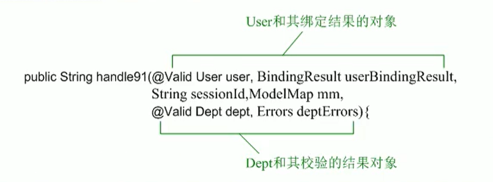
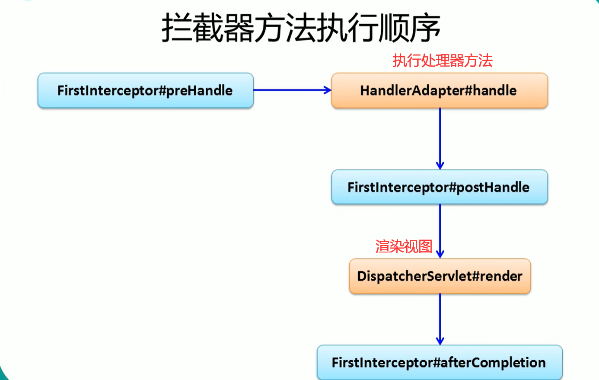

#  Spring MVC

[TOC]


## 概述

- SpringMVC通过一套MVC注解，让POJO（Plain Ordinary Java Object简单的Java对象，实际就是普通JavaBeans）成为处理请求的控制器，而无需实现任何接口。
- 支持REST风格的URL请求。（REST即Representational State Transfer，表述性状态传递）
- 采用了松散耦合可拔插组件结构，比其他MVC框架更具扩展性和灵活性。
- Spring MVC是Spring提供的一个强大而灵活的web框架。借助于注解，Spring MVC提供了几乎是POJO的开发模式，使得控制器的开发和测试更加简单。这些控制器一般不直接处理请求，而是将其委托给Spring上下文中的其他bean，通过Spring的依赖注入功能，这些bean被注入到控制器中。
- Spring MVC主要由DispatcherServlet、处理器映射、处理器(控制器)、视图解析器、视图组成。他的两个核心是两个核心：

  - **处理器映射**：选择使用哪个控制器来处理请求 
  - **视图解析器**：选择结果应该如何渲染
- 通过以上两点，Spring MVC保证了如何选择控制处理请求和如何选择视图展现输出之间的松耦合。
- 在整个 Spring MVC 框架中， DispatcherServlet 处于核心位置，负责协调和组织不 同组件以完成请求处理并返回响应的工作 SpringMVC 处理请求过程： 
  - 1). 若一个请求匹配 DispatcherServlet 的请求映射路径(在 web.xml 中指定), WEB  容器将该请求转交给 DispatcherServlet 处理 
  - 2). DispatcherServlet 接收到请求后, 将根据请求信息(包括 URL、HTTP 方法、请求 头、请求参数、Cookie 等)及 HandlerMapping 的配置找到处理请求的处理器(Handler).  可将 HandlerMapping 看成路由控制器，将 Handler 看成目标主机。 
  - 3). 当 DispatcherServlet 根据 HandlerMapping 得到对应当前请求的 Handler 后， 通过 HandlerAdapter 对 Handler 进行封装，再以统一的适配器接口调用 Handler。 
  - 4). 处理器完成业务逻辑的处理后将返回一个 ModelAndView 给 DispatcherServlet,  ModelAndView 包含了视图逻辑名和模型数据信息 
  - 5). DispatcherServlet 借助 ViewResoler 完成逻辑视图名到真实视图对象的解析 
  - 6). 得 到 真 实 视 图 对 象 View 后 , DispatcherServlet 使 用 这 个 View 对 ModelAndView 中的模型数据进行视图渲染

- 

### Spring MVC运行原理

> 版权声明：本文为CSDN博主「jianyuerensheng」的原创文章，遵循CC 4.0 BY-SA版权协议，转载请附上原文出处链接及本声明。
> 原文链接：https://blog.csdn.net/jianyuerensheng/article/details/51258942


(1) Http请求：客户端请求提交到DispatcherServlet。
(2) 寻找处理器：由DispatcherServlet控制器查询一个或多个HandlerMapping，找到处理请求的Controller。
(3) 调用处理器：DispatcherServlet将请求提交到Controller。
(4)(5)调用业务处理和返回结果：Controller调用业务逻辑处理后，返回ModelAndView。
(6)(7)处理视图映射并返回模型： DispatcherServlet查询一个或多个ViewResoler视图解析器，找到ModelAndView指定的视图。
(8) Http响应：视图负责将结果显示到客户端。

### SpringMVC接口解释

> 版权声明：本文为CSDN博主「jianyuerensheng」的原创文章，遵循CC 4.0 BY-SA版权协议，转载请附上原文出处链接及本声明。
> 原文链接：https://blog.csdn.net/jianyuerensheng/article/details/51258942

- **DispatcherServlet**接口：
  - Spring提供的前端控制器，所有的请求都有经过它来统一分发。在DispatcherServlet将请求分发给Spring Controller之前，需要借助于Spring提供的HandlerMapping定位到具体的Controller。
  - DispatcherServlet是整个Spring MVC的核心。它负责接收HTTP请求组织协调Spring MVC的各个组成部分。其主要工作有以下三项：
    （1）截获符合特定格式的URL请求。
    （2）初始化DispatcherServlet上下文对应WebApplicationContext，并将其与业务层、持久化层的WebApplicationContext建立关联。
    （3）初始化Spring MVC的各个组成组件，并装配到DispatcherServlet中。
- **HandlerMapping**接口：
  - 能够完成客户请求到Controller映射。
- **Controller**接口：
  - 需要为并发用户处理上述请求，因此实现Controller接口时，必须保证线程安全并且可重用。
    Controller将处理用户请求，这和Struts Action扮演的角色是一致的。一旦Controller处理完用户请求，则返回ModelAndView对象给DispatcherServlet前端控制器，ModelAndView中包含了模型（Model）和视图（View）。
    从宏观角度考虑，DispatcherServlet是整个Web应用的控制器；从微观考虑，Controller是单个Http请求处理过程中的控制器，而ModelAndView是Http请求过程中返回的模型（Model）和视图（View）。
- **ViewResolver**接口：
  - Spring提供的视图解析器（ViewResolver）在Web应用中查找View对象，从而将相应结果渲染给客户。

## Spring MVC HelloWorld

- 配置jar依赖包

- 在web.xml中配置DispatcherServlet

  ```xml
  <?xml version="1.0" encoding="UTF-8"?>
  <web-app xmlns="http://xmlns.jcp.org/xml/ns/javaee"
           xmlns:xsi="http://www.w3.org/2001/XMLSchema-instance"
           xsi:schemaLocation="http://xmlns.jcp.org/xml/ns/javaee http://xmlns.jcp.org/xml/ns/javaee/web-app_4_0.xsd"
           version="4.0">
      <!--配置DispatcherServlet -->
      <servlet>
          <servlet-name>springDispatcherServlet</servlet-name>
          <servlet-class>org.springframework.web.servlet.DispatcherServlet</servlet-class>
          <init-param>
              <param-name>contextConfigLocation</param-name>
              <param-value>classpath:springmvc.xml</param-value>
          </init-param>
          <load-on-startup>1</load-on-startup>
      </servlet>
      <servlet-mapping>
          <servlet-name>springDispatcherServlet</servlet-name>
          <url-pattern>/</url-pattern>
      </servlet-mapping>
  </web-app>
  ```

  

- 加入SpringMVC的配置文件，置于src目录下

  ```xml
  <?xml version="1.0" encoding="UTF-8"?>
  <beans xmlns="http://www.springframework.org/schema/beans"
         xmlns:xsi="http://www.w3.org/2001/XMLSchema-instance"
         xmlns:context="http://www.springframework.org/schema/context"
         xsi:schemaLocation="http://www.springframework.org/schema/beans http://www.springframework.org/schema/beans/spring-beans.xsd
  http://www.springframework.org/schema/context http://www.springframework.org/schema/context/spring-context.xsd">
  
      <!--配置自定义扫描包-->
      <context:component-scan base-package="com.littlekids8.handlers"></context:component-scan>
  
      <!-- 配置视图解析器：如何把handeler方法返回值解析未实际的物理视图-->
      <bean class="org.springframework.web.servlet.view.InternalResourceViewResolver">
          <property name="prefix" value="/WEB-INF/views/"></property>
          <property name="suffix" value=".jsp"></property>
      </bean>
  
  </beans>
  ```

- 编写处理请求的处理器，并标识为处理器

  ```java
  @Controller
  public class Hello {
      /**
       *   1. 使用请求映射来配置请求
       *   2. 返回值会通过视图解析器解析为实际的物理视图，对于InternalResourceViewResolver 视图解析器，会做如下的解析：
       *   通过prefix+returnVal+ suffix 这样的方式得到实际的物理视图，然后做转发操作
       *   如：        <property name="prefix" value="/WEB-INF/views"></property>
       *         <property name="suffix" value=".jsp"></property>
       *         返回值为：success
       *         则：prefix+returnVal+ suffix= "/WEB-INF/views/success.jsp"
        */
  
      @RequestMapping("/hello")
      public String hello(){
          System.out.println("hello");
          return "success";
      }
  }
  ```

  

- 编写视图

  - index.jsp

    ```jsp
    <%@ page contentType="text/html;charset=UTF-8" language="java" %>
    <html>
    <head>
        <title>Title</title>
    </head>
    <body>
        <a href="hello">hello</a>
    </body>
    </html>
    ```

  - /WEB-INF/views/success.jsp

    ```jsp
    <%@ page contentType="text/html;charset=UTF-8" language="java" %>
    <html>
    <head>
        <title>Title</title>
    </head>
    <body>
        <a href="hello">hello</a>
    </body>
    </html>
    ```

##  @RequestMapping注解

### 使用@RequestMapping 映射请求

- Spring MVC使用`@RequestMapping` 注解为控制器指定可以处理哪些URL请求,其作用就是将请求和请求的控制方法关联起来。SpringMVC接收到指定的请求，就会找到在映射关系中对应的控制器方法来处理这个请求。
  - 基础格式：`@RequestMapping("/uri")`
- 在控制器的**类定义**、**方法定义**处都可标注
  - 类定义处：提供初步的请求映射信息。相对于WEB应用的根目录
  - 方法定义处：提供进一步的细分映射信息。相对于类定义处的URL，若类定义处未标注`@RequestMapping`，则方法处标记的URL相对于WEB应用的根目录。
- DispatcherServlet截获请求后，就通过控制器上的`@RequestMapping` 提供的映射信息确定请求所对应的处理方法。
- `@RequestMapping` 除了可以使用请求URL映射请求外，还可以使用请求方法、请求参数及请求头映射请求。
- `@RequestMapping` 的`value`、`method`、`params`、`heads`分别表示请求URL、请求方法、请求参数及请求头的映射条件，他们是与的关系，联合使用多个条件可让请求映射更加精确化。
  - `method`：常使用method属性来指定请求方式，如指定POST方式访问为`@RequestMapping(value="/test",method=RequestMethod.POST)`
  - params 和 headers 支持简单的表达式 
    - param1:表示请求必须包含名为 param1的请求参数
    - !param1: 表示请求不能包含名为 param1的请求参数 
    - param1!= value1:表示请求包含名为 param1的请求参数,但其值不能为 value1
    - {"param1=value1", "param2"}: 请求必须包含名为 param1 和 param2的两个请求参数,且 param1参数的值必须为 value1
    - 如：`@RequestMapping(value="/test",params={"username","age!=10"})`表示请求参数中必须包含名为username和age参数，且age参数不能为10。

- `@RequestMapping`支持Ant风格的资源地址写法，主要有三种匹配符：
  - `?`：匹配文件名中的一个字符
  - `*`：匹配文件名中的任意字符
  - `**`：匹配多层路径 
  - 例子：
    - `/user/*/createUser`:匹配`/user/aaa/createUser`、`/user/bbb/createUser` 等URL 
    - `/user/**/createUser`:匹配`/user/createUser`、`/user/aaa/bbb/createUser` 等URL 
    - `/user/createUser??`:匹配`/user/createUseraa`、`/user/createUserbb` 等URL

### PathVariable注解——支持路径中的占位符

- 带占位符的 URL 是 Spring3.0新增的功能，该功能在 SpringMVC 向 REST 目标挺进发展过程中具有里程碑的意义

- 通过`@PathVariable` 可以将 URL 中占位符参数绑定到控制器处理方法的入参中：URL 中的`{xxx}`占位符可以通过`@PathVariable("xxx")`绑定到操作方法的形参中。

  ```java
  @RequestMapping("/delete/{id}/{username}")
  public String delete(@PathVariable("id") Integer id, PathVariable("username")String username)
  {
      UserDao.delete(id);
      System.out.println("id:"+id+",username:"+username);
      return "redirect:/user/list.action";
  }
  ```

## REST

- REST：即 Representational State Transfer。(资源)表现状态转化。是目前最流行的一种互联网软件架构。它结构清晰、符合标准、易于理解、扩展方便，所以正得到越来越多网站的采用

- 资源(Resources) ：网络上的一个实体， 或者说是网络上的一个具体信息。它可以是一段文本、一张图片、一首歌曲、一种服务，总之就是一个具体的存在。可以用一个 URI(统一资源定位符) 指向它， 每种资源对应一个特定的 URI。要获取这个资源， 访问它的 URI 就可以， 因此 URI 即为每一个资源的独一无二的识别符

- 表现(Representation)：把资源具体呈现出来的形式，叫做资源的表现(Representation) 。资源的表述是一段对于资源在某个特定时刻的状态的描述。可以在客户端-服务器端之间转移（交换）。比如， 文本可以用 txt 格式表现， 也可以用 HTML 格式、XML 格式、JSON 格式表现， 甚至可以采用二进制格式。

- 状态转移(State Transfer)：状态转移说的是：在客户端和服务器端之间转移（transfer）代表资源状态的*表现*。每发出一个请求，就代表了客户端和服务器的一次交互过程。通过转移和操作*资源的表现*，来间接实现操作*资源*的目的。

- HTTP 协议是一个无状态协议， 即所有的状态都保存在服务器端。因此，如果客户端想要操作服务器，必须通过某种手段，让服务器端发生“状态转移”(State Transfer) 。而这种转化是建立在表现层之上的， 所以就是“表现层状态转化”。具体说，就是 HTTP 协议里面， 四个表示操作方式的动词：GET、POST、PUT、DELETE。它们分别对应四种基本操作：GET 用来获取资源， POST 用来新建资源， PUT 用来更新资源， DELETE 用来删除资源

- 示例：

  - /order/1 HTTP GET:得到 id=1 的 order
  - /order/1 HTTP DELETE:删除 id=1的 order 
  - /order/1 HTTP PUT:更新 id=1的 order 
  - /order HTTP POST:新增 order 

- `HiddenHttpMethodFilter`:浏览器 form 表单只支持 GET 与 POST 请求，而 DELETE、PUT 等 method 并不支持，Spring3.0添加了一个过滤器，可以将这些清求转换为标准的 http 方法，使得支持 GET、POST、PUT 与 DELETE 请求。

- 如何发送PUT和DELETE请求：

  - 需要在web.xml配置HiddenHttpMethodFilter

    ```xml
      <!--配置HiddenHttpMethodFilter：可以把POST请求转为DELETE或PUT请求-->
        <filter>
            <filter-name>HiddenHttpMethodFilter</filter-name>
            <filter-class>org.springframework.web.filter.HiddenHttpMethodFilter</filter-class>
        </filter>
        
        <filter-mapping>
            <filter-name>HiddenHttpMethodFilter</filter-name>
            <url-pattern>/*</url-pattern>
        </filter-mapping>
    ```

    

  - 需要表单发送POST请求

  - 需要在发送POST请求时携带一个`name="_method"`的隐藏域，值为DELETE或PUT

    ```htm
    <input name="_method" value="DELETE"/>
    ```

## 解决获取请求参数的乱码问题

解决获取请求参数的乱码问题，可以使用SpringMVC提供的编码过滤器CharacterEncodingFilter，但是必须在web.xml中进行注册

```xml
<!--配置springMVC的编码过滤器-->
<filter>
    <filter-name>CharacterEncodingFilter</filter-name>
    <filter-class>org.springframework.web.filter.CharacterEncodingFilter</filter-class>
    <init-param>
        <param-name>encoding</param-name>
        <param-value>UTF-8</param-value>
    </init-param>
    <init-param>
        <param-name>forceResponseEncoding</param-name>
        <param-value>true</param-value>
    </init-param>
</filter>
<filter-mapping>
    <filter-name>CharacterEncodingFilter</filter-name>
    <url-pattern>/*</url-pattern>
</filter-mapping>
```

> 注：
>
> SpringMVC中处理编码的过滤器一定要配置到其他过滤器之前，否则无效

## 映射请求参数和请求头

### 请求处理方法签名

- Spring MVC 通过分析处理方法的签名，将 HTTP 请求信息绑定到处理方法的相应入参中。
- Spring MVC 对控制器处理方法签名的限制是很宽松的，几乎可以按喜欢的任何方式对方法进行签名。
- 必要时可以对方法及方法入参标注相应的注解(`@PathVariable`、`@RequestParam`、`@RequestHeader` 等），Spring MVC 框架会将 HTTP 请求的信息绑定到相应的方法入参中，并根据方法的返回值类型做出相应的后续处理。

### 使用@RequestParam绑定请求参数值

- 在处理方法入参处使用`@RequestParam`可以把请求参数传递给请求方法
  - value为请求参数的参数名；
  - required表示是否必须。默认为true，表示请求参数中必须包含对应的参数，若不存在该参数，将抛出异常。
  - defaultValue表示请求参数的默认值。

```java
@Controller
@RequestMapping("/springmvc")
public class SpringMVCTest {
    private static final String OK = "success";

    @RequestMapping(value = "/testRequestParam")
    public String testRequestParam(@RequestParam(value = "username")String username, 
                                   @RequestParam(value = "age", required = false, defaultValue = "0") int age){// required参数为false表示该age值可以为空
        System.out.println("Test RequestParam: "+username +", age: " + age );
        return OK;
    }
}
```

访问：

```html
<a href="springmvc/testRequestParam?username=marry&age=10">test RequestParam</a>
```

### 使用@RequestHeader绑定请求报头的属性值

- 请求头包含了若干个属性，服务器可根据此信息获知客户端的信息，通过`@RequestHeader`即可将请求头中的属性值绑定到处理方法的入参中

- 用法与@RequestParam基本一致

  ```java
      @RequestMapping("/testRequestHeader")
      public String testRequestHeader(@RequestHeader(value = "Accept-Language") String acceptLanguage){
          System.out.println("testRequestHeader-acceptLanguage: " + acceptLanguage);
          return OK;
      }
  ```

### 使用@CookieValue绑定请求中的Cookie值

- `@CookieValue`可让处理方法入参绑定某个Cookie值

```java
@Controller
@RequestMapping("/springmvc")
public class SpringMVCTest {
    private static final String OK = "success";

    @RequestMapping("/testCookieValue")
    public String testCookieValue(@CookieValue("JSESSIONID") String sessionID){
        System.out.println("testCookieValue, sessionID: "+ sessionID);
        return OK;
    }
}
```


### 使用POJO对象绑定请求参数值

- SpringMVC会按**请求参数名**和**POJO属性名**进行自动匹配，自动为该对象填充属性值。支持级联属性。【POJO，（Plain Ordinary Java Object）简单的Java对象】
  - 如：`dept.deptId`、 `dept.address.tel`等

- 例子：

  - java类：User类和级联属性Address类

    ```java
    package com.littlekids8.entities;
    
    public class User {
        private String username;
        private String password;
        private String email;
        private int age ;
        private Address address;
    
        public String getUsername() {
            return username;
        }
    
        public void setUsername(String username) {
            this.username = username;
        }
    
        public String getPassword() {
            return password;
        }
    
        public void setPassword(String password) {
            this.password = password;
        }
    
        public String getEmail() {
            return email;
        }
    
        public void setEmail(String email) {
            this.email = email;
        }
    
        public int getAge() {
            return age;
        }
    
        public void setAge(int age) {
            this.age = age;
        }
    
        public Address getAddress() {
            return address;
        }
    
        public void setAddress(Address address) {
            this.address = address;
        }
    
        @Override
        public String toString() {
            return "User{" +
                    "username='" + username + '\'' +
                    ", password='" + password + '\'' +
                    ", email='" + email + '\'' +
                    ", age=" + age +
                    ", address=" + address +
                    '}';
        }
    }
    
    ```

    ```java
    package com.littlekids8.entities;
    
    public class Address {
        private String province;
        private String city;
    
        public String getProvince() {
            return province;
        }
    
        public void setProvince(String province) {
            this.province = province;
        }
    
        public String getCity() {
            return city;
        }
    
        public void setCity(String city) {
            this.city = city;
        }
    
        @Override
        public String toString() {
            return "Address{" +
                    "province='" + province + '\'' +
                    ", city='" + city + '\'' +
                    '}';
        }
    }
    
    ```

  - 测试类：

    ```java
    @Controller
    @RequestMapping("/springmvc")
    public class SpringMVCTest {
        private static final String OK = "success";
    
        @RequestMapping("/testPojo")
        public String testPojo(User user){
            System.out.println("testPojo: " + user);
            return OK;
        }
    }
    ```

  - 访问：

    ```jsp
        <form action="springmvc/testPojo" method="post">
            username:<input type="text" name="username"/><br>
            password:<input type="password" name="password"/><br>
            email:<input type="text" name="email"/><br>
            age:<input type="text" name="age"/><br>
            <%--级联属性--%>
            city:<input type="text" name="address.city"/><br>
            province:<input type="text" name="address.province"/><br>
    
            <input type="submit" value="submit"/><br>
        </form>
    ```


### 使用Servlet原生API作为入参

- MVC的Handler方法可以接受ServletAPI类型的参数包括：

  - HttpServletRequest
  - HttpServletResponse
  - HttpSession
  - java.security.Principal
  - Locale
  - InputStream
  - OutputStream
  - Reader
  - Writer

- 如：

  ```JAVA
  @RequestMapping("/test")
  public void handle(HttpServletRequest request, HttpServletResponse response){
      //...
  }
  
  @RequestMapping("/test2")
  public void handle2(HttpSession session){
      //...
  }
  ```

## 处理模型参数

- 业务方法的返回值（对象、集合）需要输出在页面中显示，需要解决如何将该返回值在域对象中传输，Spring MVC提供了以下途径输出模型数据：
  - `ModelAndView`：处理方法**返回值**类型为 `ModelAndView` 时，方法体即可通过该对象添加模型数据 
  - `Map` 及 `Model`：**形参**为 `org.springframework.ui.Model`、`org.springframework.ui.ModelMap` 或` java.util.Map` 时，处理方法返回时，Map 中的数据会自动添加到模型中。（实际处理也会封装成ModelAndView对象）
  - `＠SessionAttributes`：将模型中的某个属性暂存到 `HttpSession `中，以便多个请求之间可以共享这个属性。
  - `＠ModelAttribute`： 方法形参标注该注解后，入参的对象就会放到数据模型中

### ModelAndView向request域对象共享数据

- 控制器处理方法的**返回值**如果为 `ModelAndView`,则其既包含视图信息，也包含模型数据信息。
- ModelAndView有Model和View的功能，
  -  Model主要用于向请求域共享数据 
  -  View主要用于设置视图，实现页面跳转
- 添加模型数据：
  - `ModelAndView addObject(String attributeName,Object attributeValue)`
  - `ModelAndView addAllObject(Map<String,?> modelMap)`
- 设置视图：
  - `void setView(View view)`
  - `void setViewName(String viewName)`
- SpringMVC会将ModelAndView中的model中的数据放到request域对象中。

```java
@RequestMapping("/testModelAndView")
    public ModelAndView testModelAndView(){
        String viewName = "success";
        //设置视图，实现页面跳转
        ModelAndView modelAndView = new ModelAndView(viewName);

        // 添加模型数据到ModelAndView中
        // 该数据将会显示到页面中
        modelAndView.addObject("time",new Date());

        return modelAndView;
    }
```

通过requestScope.time去获取ModelAndView中的数据:

```jsp
<%@ page contentType="text/html;charset=UTF-8" language="java" %>
<html>
<head>
    <title>Title</title>
</head>
<body>
    <h3>Success</h3>
    <%--通过requestScope.time去获取ModelAndView中的数据--%>
    time: ${requestScope.time}
</body>
</html>
```

### Map向request域对象共享数据

- 目标方法可以添加Map类型（实际也可以是Model、ModelMap类型）的形参，可通过该参数向request域对象中共享数据。
- Spring MVC 在内部使用了一个 `org.springframework.ui.Model` 接口存储模型数据
- 具体步骤
  - Spring MVC 在调用方法前会创建一个隐含的模型对象作为模型数据的存储容器。
  - 如果方法的形参为 Map 或 Model 类型,Spring MVC 会将隐含模型的引用传递给这些入参。在方法体内，开发者可以通过这个入参对象访问到模型中的所有数据，也可以向模型中添加新的属性数据。

```java
    @RequestMapping("/testMap")
    public String testMap(Map<String, Object> map){
        map.put("names", Arrays.asList("tom","marry","jack"));
        return "success";
    }
```

在request域对象中访问：

```jsp
<%@ page contentType="text/html;charset=UTF-8" language="java" %>
<html>
<head>
    <title>Title</title>
</head>
<body>
    <h3>Success</h3>
    <br>    <br>
    names: ${requestScope.names}
</body>
</html>

```

### @SessionAttributes域共享数据

- 若希望在多个请求之间共用某个模型属性数据，则可以在控制器类上标注一个`@SessionAttributes`,Spring MVC 将在模型中对应的属性暂存到 HttpSession 中。
- `@SessionAttributes`该注解只能放在类上面。
- `@SessionAttributes` 除了可以通过属性名指定需要放到会话中的属性外，还可以通过模型属性的**对象类型**指定哪些模型属性需要放到会话中。该注解会将形参类型为Model或Map中存放的符合注解中条件的数据共享到HttpSession中（同时也会放到request域中）。
  - `@SessionAttributes(types=User.class)`会将隐含模型中所有类型为 `User.class` 的属性添加到会话中。
  - `@SessionAttributes(value={"user1","user2"})`
  - `@SessionAttributes(types={User.class,Dept.class))`
  - `@SessionAttributes(value={"user1","user2"},types={Dept.class))`

```java
@SessionAttributes(value = {"user"},types = {String.class})
@Controller
@RequestMapping("/springmvc")
public class SpringMVCTest {
    private static final String OK = "success";

    @RequestMapping("/testSessionAttributes")
    public String testSessionAttributes(Map<String, Object> map){
        User user = new User("marry","12345", "guo@qq.com",11);
        map.put("user", user);
        map.put("school","heng");
        return OK;
    }
```

访问：

```jsp
    sessionAttributes user: ${sessionScope.user}
    <br>    <br>
    test request user : ${requestScope.user}<%--访问request域中的--%>
    <br>    <br>
    sessionAttributes school: ${sessionScope.school}
```

页面结果：

```text
sessionAttributes user: User{username='marry', password='12345', email='guo@qq.com', age=11, address=null}

test request user : User{username='marry', password='12345', email='guo@qq.com', age=11, address=null}

sessionAttributes school: heng
```


### ModelAttribute注解

- `@ModelAttribute(value=" ")`注解也可以来修饰目标方法POJO类型的入参，其value属性值有如下的作用：
  - SpringMVC会使用value属性值在implicitModel中查找对应的对象，若存在会直接传入目标方法的入参中。
  - SpringMVC会以value为key,POJO类型的对象为value，存入request中。
- 被`@ModelAttribute`注释的**方法**会在此controller的每个方法执行前被执行，如果有返回值，则自动将该返回值加入到ModelMap中。

```java
@Controller
@RequestMapping("/springmvc")
public class SpringMVCTest {
    private static final String OK = "success";

    @ModelAttribute
    public void getUser(@RequestParam(value="id", required = false) Integer id, Map<String, Object> map){
        if (id != null){
            User user = new User(1,"Tom", "12345", "guo@qq.com", 12);
            System.out.println("从系统中获取一个对象：" + user);
            map.put("user", user);
        }
    }

    @RequestMapping("/testModelAttribute")
    public String testModelAttribute(User user){
        System.out.println("修改："+ user);
        return OK;
    }
}
```


```jsp
<%--模拟修改操作
    1. 原始数据为 User:1,Tom，12345，guo@qq.com,12
    2. 密码不能修改
    3. 表单回显， 模拟操作直接在表单填写对应的属性值
--%>
<br><br>
<form action="springmvc/testModelAttribute" method="post">
    <input type="hidden" name="id" value="1"><br>
    username: <input type="text" name="username" value="Tom"><br>
    email: <input type="text" name="email" value="guo@qq.com"><br>
    age: <input type="text" name="age" value="12"><br>
    <%-- 注意并没有密码--%>
    <input type="submit" name="submit"><br>
</form>
```

- 结果

  ```text
  从系统中获取一个对象：User{id=1, username='Tom', password='12345', email='guo@qq.com', age=12, address=null}
  
  修改：User{id=1, username='Tom', password='12345', email='guo@qq.com', age=12, address=null}
  ```

  可以看到我们表单中并无密码，但我们修改时，SpringMVC先执行了ModelAttribute方法，并取得了最原始的USer对象，并将其赋值给user，使之先被赋值再修改。

- 运行流程：

  1. 执行`@ModelAttribute`注解修饰的方法：从数据库中取出对象，把对象放入到了Map中。键为user。
  2. **Spring MVC从Map中取出User对象，并把表单的请求参数赋值给该User对象的对应属性。**
  3. Spring MVC把上述对象传入目标方法的参数。

- > **注意**：在`@ModelAttribute`修饰的方法中，**放入到Map时的键**需要和**目标方法形参类型**的第一个字母小写的字符串一致。【或者使用`@ModelAttribute(value="键")`来修饰目标方法的形参】

- 源码分析（基于Spring4.x版本） 

  1. 调用`@ModelAttribute`注解修饰的方法。实际上把`@ModelAttribute`方法中Map中的数据放在了`implicitModel`中。
  2. 解析请求处理器的目标参数，实际上该目标参数来自WebDataBinder对象的target属性。
     - （1）创建`WebDataBinder`对象：
       - ①确定`ObjectName`属性：若传入的`attrName`属性值为“”, 则objectName为类名第一个字母小写。
       - 注意：`attrName`. 若目标方法的POJO属性（形参）使用了`@ModelAttribute`修饰，则`attrName`值即为`@ModelAttribute`的`value`属性值
       - ② 确定`target`属性：在`implicitModel`中查找attrName对应的属性值。若存在，ok。若不存在，则验证当前Handler是否使用了`@SessionAttribute`进行修饰，若使用了，则尝试从Session中获取attrName所对应的属性值。若Session中没有对应的属性值，则抛出异常。若Handler没有使用`@SessionAttribute`进行修饰，或`@SessionAttribute`中没有使用value值指定的key和`attrName`相匹配，则通过反射创建POJO对象。
     - （2）SpringMVC把表单的请求参数赋值给`WebDataBinder`的`target`对应的属性。
     - （3）SpringMVC会把`WebDataBinder`的`attrName`和`target`给到`implicitModel`。进而传到request域对象中。
     - （4）把`WebDataBinder`的`target`作为参数传给目标方法的入参。

- SpringMVC确定目标方法POJO类型入参的过程
  1. 确定一个key
     - 若目标方法的POJO类型参数没有使用`@ModelAttribute`作为修饰，则key为POJO类名第一个字母的小写。
     - 若使用了`@ModelAttribute`来修饰，则key为`@ModelAttribute`注解的value值。
  2. 在`implicitModel`中查找key对应的对象，若存在，则作为入参传入。
     - 若在`@ModelAttribute`标记的方法中在Map方法中保存过，且Key和1中确定的一致，则会获取到。
  3. 若`implicitModel`中不存在key对应的对象，则检查当前的Handler是否使用`@SessionAttribute`注解修饰。若使用了该注解，且该注解的value属性值包含了key，则会从HttpSession中获取key所对应的value值，若存在则直接传入到目标方法的入参中；若不存在则抛出异常。
  4.  若Handler没有表示`@SessionAttribute`注解或者`@SessionAttribute`注解的value值不包含key，则会通过反射来创建POJO类型的参数，传入为目标方法的参数。
  5. SpringMVC 会把Key和POJO类型的对象保存到`implicitModel`中，进而保存到request中。

## 视图和视图解析器

### SpringMVC如何解析视图

- 请求处理方法执行完成后，最终返回一个 ModelAndView 对象。对于那些返回 String，View 或 ModeMap 等类型的处理方法，**Spring MVC 也会在内部将它们装配成一个 ModelAndView 对象**，它包含了逻辑名和模型对象的视图。**ViewResolver会根据ModelAndView中的视图名称viewName去解析视图，获得一个视图对象。**
- Spring MVC 借助视图解析器（ViewResolver)得到最终的视图对象（View），最终的视图可以是 JSP，也可能是 Excel、JFreeChart 等各种表现形式的视图。
- 对于最终究竟采取何种视图对象对模型数据进行渲染，处理器（Handler）并不关心，处理器工作重点聚焦在生产模型数据的工作上，从而实现 MVC 的充分解耦。


### 视图

- 视图的作用是渲染模型数据，将模型里的数据以某种形式呈现给客户。

- 为了实现视图模型和具体实现技术的解耦，Spring 在`org.springframework.web.servlet` 包中定义了一个高度抽象的 View 接口：

  - RESPONSE_STATUS_ATTRIBUTE : String
  - PATH_VARIABLES : String
  - SELECTED_CONTENT_TYPE : String 
  - getContentType() : String
  - render(Map<String,?>, HttpServletRequest, HttpServletResponse) : void 

- **视图对象由视图解析器负责实例化**。由于视图是**无状态**的，所以他们**不会有线程安全的问题**。

- SpringMVC视图的种类很多，默认有**转发视图**和**重定向视图**

- 常用的视图实现类

  
  
   

#### JstlView

> JSP标准标签库（JSTL）是一个JSP标签集合，它封装了JSP应用的通用核心功能。
>
> JSTL支持通用的、结构化的任务，比如迭代，条件判断，XML文档操作，国际化标签，SQL标签。 除了这些，它还提供了一个框架来使用集成JSTL的自定义标签。
>
> 根据JSTL标签所提供的功能，可以将其分为5个类别。
>
> - **核心标签**（c标签）
> - **格式化标签**（fmt标签）
> - **SQL 标签**
> - **XML 标签**
> - **JSTL 函数**
>
> ------
>
> 转截来自：菜鸟教程 https://www.runoob.com/jsp/jsp-jstl.html

- `JSTLView`继承自`InternalResourceView`，是专门为使用JSP标准标签库（JSTL）的JSP页面而使用的视图。只要导入了jstl的jar包，以前默认创建的InternalResouceView都会被使用jstlView替代；
- 若使用 JSTL 的 fmt 标签则需要在 SpringMVC 的配置文件中配置国际化资源文件。

#### 基本国际化配置

>   国际化的新步骤：
>
> 1. 写好国际化资源文件　
>
> - il118_en_US.properties
>
>   ```properties
>   i18n.username=UserName
>   i18n.password=Password
>   ```
>
> - il118_zh_CN.properties
>
>   ```properties
>   i18n.username=用户名
>   i18n.password=密码
>   ```
>
> 2. 在SpringMVC配置文件中配置管理国际化资源文件的消息管理器组件
>
> ```xml
> <!-- 注册一个国际化资源管理器；id必须是messageSource -->
> <bean id="messageSource" class = "org.springframework.context.support.ResourceBundleMessageSource">
>     <!-- 这里的value与国际化资源文件的文件名有关-->
> 	<property name="basename" value="i18n"></property>
> </bean>
> ```
>
> 3. 去页面 使用fmt:message标签取值即可
>
> ` <%@taglib prefix="fmt" uri="http://java.sun.com/jsp/jstl/fmt" %>`
>
> ```jsp
> <form action="">
>     <fmt:message key="i18n.username"/><input type="text"/>
>     <fmt:message key="i18n.password"/><input type="text"/>
>     <input type="submit"/>
> </form>
> ```
>
> - 注意事项：
>
>   - 必须经过springmvc处理
>
>   - return不能是forword:或者redict:
>
> - **若希望直接响应通过 SpringMVC 渲染的页面，可以使用 mvc:view-controller 标签实现**
>
> ```xml
> <!-- 直接配置响应的页面：无需经过控制器来执行结果 -->
> <mvc:view-controller path="/success" view-name="success"/>
> ```
>
> 请求的路径：
>
> [http://localhost:8080/SpringMVC_02_View**/success**](http://localhost:8080/SpringMVC_02_View/success)
>
> 配置<mvc:view-controller>会导致其他请求路径失效
>
> 解决办法：
>
> ```xml
> <!-- 在实际开发过程中都需要配置mvc:annotation-driven标签，后面讲，这里先配置上 -->
> <mvc:annotation-driven/>
> ```
>
> -----
>
> 转截修改自https://www.cnblogs.com/limingxian537423/p/7282213.html

#### 自定义视图

- 编写继承自`View`接口的视图类，使用`@Component`注解为一个bean：

  ```java
  
  // 将会使用视图解析器BeanNameViewResolver进行解析视图:
  // 该视图解析器直接从IOC容器中根据viewName取出视图解析视图，故视图需要配置为bean
  @Component
  public class HelloView implements View {
      @Override
      public String getContentType() {
          return "text/html";
      }
  
      @Override
      public void render(Map<String, ?> model, javax.servlet.http.HttpServletRequest request, javax.servlet.http.HttpServletResponse response) throws Exception {
          // 此处可自定义页面的内容
          response.getWriter().println("hello view ,time:"+ new Date());
      }
  }
  
  ```

- 测试访问的控制器：

  ```java
      @RequestMapping("/testHelloView")
      public String testHelloView(){
          System.out.println("testHelloView");
          return "helloView";
      }
  ```

- 配置解析自定义视图的视图解析器，这里使用BeanNameViewResolver，该视图解析器直接从IOC容器中根据viewName取出视图解析视图，故视图需要配置为bean。

  - 注意自定义视图类必须覆盖在组件扫描包中

  ```xml
      <!--配置自定义扫描包,注意自定义视图必须覆盖在扫描包中-->
      <context:component-scan base-package="com.littlekids8"></context:component-scan>
  
  
      <!--配置自定义视图的解析器BeanNameViewResolver:该视图解析器直接从IOC容器中根据viewName取出视图解析视图，故视图需要配置为bean-->
      <bean class="org.springframework.web.servlet.view.BeanNameViewResolver">
          <!--通过order属性来定义视图解析器的优先级。order值越小优先级越高-->
          <property name="order" value="2"/>
      </bean>
  ```

- 也可以自定义一个视图解析器：

  ```java
  public class MyCustomViewResolver implements ViewResolver,Ordered {
      
      //保存当前视图解析器的优先级
      private int order = Integer.MAX_VALUE;
      /**
       * 将ModelAndView 中视图名解析成View对象返回
       */
      @Override
      public View resolveViewName(String ViewName, Locale arg1) throws Exception {
          // 如果请求的视图名称为helloView
          if(ViewName.equals("helloView")){
              //返回视图对象，该视图对象为自定义的
              return new HelloView();
          }
          return null;
      }
  
      @Override
      public int getOrder() {
          // TODO Auto-generated method stub
           return order;
      }
       public void setOrder(Integer order){
              this.order = order;
       }
  }
  ```

#### 重定向视图

- 视图解析器一般情况下，控制器方法返回字符串类型的值会被当成逻辑视图名处理。
- 如果返回的字符串中带 `forward:`或 `redirect:`前缀时，Spring MVC 会对他们进行特殊处理：将 `forward:`和` redirect:`当成指示符， 其后的字符串作为 URL 来处理：
  - `redirect:success.jsp`：会完成一个到 success.jsp 的**重定向**的操作。SpringMVC中默认的重定向视图是`RedirectView`。
  - `forward:success.jsp`：会完成一个到 success.jsp 的**转发**操作。SpringMVC中默认的转发视图是`InternalResourceView`。

```java
@RequestMapping("/testRedirect")
public String testRedirect(){
	return "redirect:/index.jsp";
}

```


### 视图解析器

- SpringMVC 为逻辑视图名的解析提供了不同的策略，可以在 Spring WEB 上下文中**配置一种或多种解析策略，并指定他们之间的先后顺序**。每一种映射策略对应一个具体的视图解析器实现类。

- 视图解析器的作用比较单一：将逻辑视图解析为一个具体的视图对象。

- 所有的视图解析器都必须实现 ViewResolver 接口：

  - resolveViewName(String, Locale) : View

- 常用的视图解析器：

  

- 程序员可以选择一种视图解析器或混用多种视图解析器

- 每个视图解析器都实现了 Ordered 接口并开放出一个 order 属性，**可以通过 order 属性指定解析器的优先顺序，order 越小优先级越高。**
  SpringMVC会按视图解析器顺序的优先顺序对逻辑视图名进行解析，直到解析成功并返回视图对象，否则将抛出 ServletException 异常。

#### InternalResourceViewResolver

- `InternalResourceView`视图用于同一Web应用程序内的JSP或其他资源的封装器。 将模型对象显示为请求属性，并使用RequestDispatcher将请求转发到指定的资源URL。
- `InternalResourceViewResolver`：JSP是最常见的视图技术，可以使用InternalResourceViewResolver作为视图解析器，其根据属性值前缀、后缀、目标方法返回值拼接出页面地址。
- `InternalResourceViewResolver`是`UrlBasedViewResolver`的子类，支持`InternalResourceView`和`JstlView`。

- 最佳实践是将JSP文件放在WEB-INF文件夹下，从而避免JSP文件可以通过手动输入的URL被直接访问，只有控制器才能访问它们。

- spring支持多个view resolver。当多个ViewResolver形成一条链时，InternalResourceViewResolver总是自动放在链的最后一个，因为它将尝试解析任何视图名称，而不管底层资源是否真实存在。

- `InternalResourceViewResolver`用于访问诸如JSP、HTML、XHTML这样的view。它扩展了`UrlBasedViewResolver`，因此有2个属性：`prefix`和`suffix`。`UrlBasedViewResolver`使用前缀和后缀中定义的值，将逻辑视图转换成真实路径的资源URL。有2种方式配置InternalResourceViewResolver：XML配置和java配置。

  xml配置：

  ```xml
  <bean  class = "org.springframework.web.servlet.view.InternalResourceViewResolver">
  	  <property name="prefix" value="/WEB-INF/views/"/>
  	  <property name="suffix" value=".jsp"/> 
  </bean>
  
  ```

  java配置：

  ```java
  
  @Configuration
  @ComponentScan("com.lks")
  @EnableWebMvc
  public class AppConfig {
      @Bean  
      public InternalResourceViewResolver viewResolver() {  
  	InternalResourceViewResolver resolver = new InternalResourceViewResolver();  
          resolver.setPrefix("/WEB-INF/views/");  
          resolver.setSuffix(".jsp");
          return resolver;  
      }	
  
  ```


## RESTful SpringMVC CRUD：数据库案例模拟操作

### 案例需求

| 需求             | URI       | 请求方式 | 备注                       |
| ---------------- | --------- | -------- | -------------------------- |
| 显示所有员工信息 | /emps     | GET      |                            |
| 显示添加员工页面 | /emp      | Get      |                            |
| 添加员工信息     | /emp      | POST     | 完成添加后重定向回list页面 |
| 删除员工操作     | /emp/{id} | DELETE   |                            |
| 显示修改员工页面 | /emp/{id} | GET      |                            |
| 修改员工信息     | /emp      | PUT      | 完成修改后重定向回list页面 |

- 相关类：
  - 实体类：`Employee`、`Department`
  - Handler：`EmployeeHandler`
  - DAO：`EmployeeDao`、`DepartmentDao`（在DAO类中模拟数据库操作）
- 相关页面：
  - list.jsp
  - input.jsp
  - edit.jsp

### 配置准备

- 配置web.xml文件

  ```xml
  <?xml version="1.0" encoding="UTF-8"?>
  <web-app xmlns="http://xmlns.jcp.org/xml/ns/javaee"
           xmlns:xsi="http://www.w3.org/2001/XMLSchema-instance"
           xsi:schemaLocation="http://xmlns.jcp.org/xml/ns/javaee http://xmlns.jcp.org/xml/ns/javaee/web-app_4_0.xsd"
           version="4.0">
  
      <!--配置HiddenHttpMethodFilter：可以把POST请求转为DELETE或PUT请求-->
      <filter>
          <filter-name>HiddenHttpMethodFilter</filter-name>
          <filter-class>org.springframework.web.filter.HiddenHttpMethodFilter</filter-class>
      </filter>
  
      <filter-mapping>
          <filter-name>HiddenHttpMethodFilter</filter-name>
          <url-pattern>/*</url-pattern>
      </filter-mapping>
      <!--配置DispatcherServlet -->
      <servlet>
          <servlet-name>springDispatcherServlet</servlet-name>
          <servlet-class>org.springframework.web.servlet.DispatcherServlet</servlet-class>
          <init-param>
              <param-name>contextConfigLocation</param-name>
              <param-value>classpath:springmvc.xml</param-value>
          </init-param>
          <load-on-startup>1</load-on-startup>
      </servlet>
      <servlet-mapping>
          <servlet-name>springDispatcherServlet</servlet-name>
          <url-pattern>/</url-pattern>
      </servlet-mapping>
  </web-app>
  ```

- 配置springmvc.xml

  ```xml
  <?xml version="1.0" encoding="UTF-8"?>
  <beans xmlns="http://www.springframework.org/schema/beans"
         xmlns:xsi="http://www.w3.org/2001/XMLSchema-instance"
         xmlns:context="http://www.springframework.org/schema/context"
         xmlns:mvc="http://www.springframework.org/schema/mvc"
         xsi:schemaLocation="http://www.springframework.org/schema/beans http://www.springframework.org/schema/beans/spring-beans.xsd
  http://www.springframework.org/schema/context http://www.springframework.org/schema/context/spring-context.xsd
  http://www.springframework.org/schema/mvc http://www.springframework.org/schema/mvc/spring-mvc.xsd">
  
      <!--配置自定义扫描包-->
      <context:component-scan base-package="com.littlekids8"></context:component-scan>
  
      <!-- 配置视图解析器：如何把handeler方法返回值解析未实际的物理视图-->
      <bean class="org.springframework.web.servlet.view.InternalResourceViewResolver">
          <property name="prefix" value="/WEB-INF/views/"></property>
          <property name="suffix" value=".jsp"></property>
      </bean>
      
  </beans>
  ```

-  在web根目录下，新建index.jsp

- 编写实体类

  - Department类

    ```java
    package com.littlekids8.entities;
    
    public class Department {
        private Integer id;
        private String departmentName;
    
        public Department() {
        }
    
        public Department(Integer id, String departmentName) {
            this.id = id;
            this.departmentName = departmentName;
        }
    
        public Integer getId() {
            return id;
        }
    
        public void setId(Integer id) {
            this.id = id;
        }
    
        public String getDepartmentName() {
            return departmentName;
        }
    
        public void setDepartmentName(String departmentName) {
            this.departmentName = departmentName;
        }
    
        @Override
        public String toString() {
            return "Department{" +
                    "id=" + id +
                    ", departmentName='" + departmentName + '\'' +
                    '}';
        }
    }
    
    ```

  - Employee类

    ```java
    package com.littlekids8.entities;
    
    public class Employee {
        private Integer id;
        private String lastName;
        private String email;
        private Integer gender;
        private Department department;
    
    
        public Employee() {
        }
    
        public Employee(Integer id, String lastName, String email, Integer gender, Department department) {
            this.id = id;
            this.lastName = lastName;
            this.email = email;
            this.gender = gender;
            this.department = department;
        }
    
        public Integer getId() {
            return id;
        }
    
        public void setId(Integer id) {
            this.id = id;
        }
    
        public String getLastName() {
            return lastName;
        }
    
        public void setLastName(String lastName) {
            this.lastName = lastName;
        }
    
        public String getEmail() {
            return email;
        }
    
        public void setEmail(String email) {
            this.email = email;
        }
    
        public Integer getGender() {
            return gender;
        }
    
        public void setGender(Integer gender) {
            this.gender = gender;
        }
    
        public Department getDepartment() {
            return department;
        }
    
        public void setDepartment(Department department) {
            this.department = department;
        }
    
        @Override
        public String toString() {
            return "Employee{" +
                    "id=" + id +
                    ", lastName='" + lastName + '\'' +
                    ", email='" + email + '\'' +
                    ", gender='" + gender + '\'' +
                    ", department=" + department +
                    '}';
        }
    }
    
    ```

- 模拟数据库操作的Dao类

  - DepartmentDao：

    ```java
    package com.littlekids8.dao;
    
    import com.littlekids8.entities.Department;
    import org.springframework.stereotype.Repository;
    
    import java.util.Collection;
    import java.util.HashMap;
    import java.util.Map;
    
    @Repository
    public class DepartmentDao {
        private static Map<Integer, Department> departments = null;
    
        static {
            departments = new HashMap<Integer, Department>();
    
            departments.put(101, new Department(101, "D-AA"));
            departments.put(102, new Department(102, "D-BB"));
            departments.put(103, new Department(103, "D-CC"));
            departments.put(104, new Department(104, "D-DD"));
            departments.put(105, new Department(105, "D-EE"));
        }
    
        public Collection<Department> getDepartments(){
            return departments.values();
        }
    
        public Department getDepartment(Integer id){
            return departments.get(id);
        }
    }
    
    ```

  - EmployeeDao

    ```java
    package com.littlekids8.dao;
    
    
    import com.littlekids8.entities.Department;
    import com.littlekids8.entities.Employee;
    import org.springframework.beans.factory.annotation.Autowired;
    import org.springframework.stereotype.Repository;
    
    import java.util.Collection;
    import java.util.HashMap;
    import java.util.Map;
    
    @Repository
    public class EmployeeDao {
        private static Map<Integer, Employee> employees = null;
    
        @Autowired
        private DepartmentDao departmentDao;
    
        static {
            employees = new HashMap<>();
    
            employees.put(1001, new Employee(1001, "E-AA", "aa@qq.com", 1, new Department(101, "D-AA")));
            employees.put(1002, new Employee(1002, "E-BB", "bb@qq.com", 1, new Department(102, "D-BB")));
            employees.put(1003, new Employee(1003, "E-CC", "cc@qq.com", 0, new Department(103, "D-CC")));
            employees.put(1004, new Employee(1004, "E-DD", "dd@qq.com", 1, new Department(104, "D-DD")));
            employees.put(1005, new Employee(1005, "E-EE", "ee@qq.com", 0, new Department(105, "D-EE")));
        }
    
        private static Integer initId = 1006;
    
        public void save(Employee employee){
            if (employee.getId() == null){
                employee.setId(initId++);
            }
    
            employee.setDepartment(departmentDao.getDepartment(employee.getDepartment().getId()));
            employees.put(employee.getId(), employee);
        }
    
        public Collection<Employee> getAll(){
            return employees.values();
        }
    
        public Employee get(Integer id){
            return employees.get(id);
        }
    
        public void delete(Integer id){
            employees.remove(id);
        }
    
    }
    
    ```

    

### 显示所有员工信息

- 编写Handler及其目标方法

  ```java
  package com.littlekids8.handlers;
  
  import com.littlekids8.dao.EmployeeDao;
  import com.littlekids8.entities.Employee;
  import org.springframework.beans.factory.annotation.Autowired;
  import org.springframework.stereotype.Controller;
  import org.springframework.web.bind.annotation.RequestMapping;
  import java.util.Map;
  
  @Controller
  public class EmployeeHandler {
  
      @Autowired
      private EmployeeDao employeeDao;
  
      @RequestMapping("/emps")
      public String list(Map<String, Object> map){
          map.put("employees", employeeDao.getAll());
          return "list";
      }
  }
  
  ```

  

- 在WEB-INF目录下新建list.jsp

  ```jsp
  <%--
    Created by IntelliJ IDEA.
    User: Littlekids8
    Date: 2022/2/23
    Time: 19:35
    To change this template use File | Settings | File Templates.
  --%>
  <%@ page contentType="text/html;charset=UTF-8" language="java" pageEncoding="UTF-8" %>
  <%@ taglib prefix="c" uri="http://java.sun.com/jsp/jstl/core" %>
  <html>
  <head>
      <title>全体员工信息表</title>
  </head>
  <body>
      <c:if test="${empty requestScope.employees}">
          没有任何员工信息。
      </c:if>
      <c:if test="${!empty requestScope.employees}">
          <table border="1" cellpadding="10" cellspacing="0">
              <tr>
                  <th>ID</th>
                  <th>LastName</th>
                  <th>email</th>
                  <th>gender</th>
                  <th>Department</th>
                  <th>Edit</th>
                  <th>Delete</th>
              </tr>
              <c:forEach items="${requestScope.employees}" var="emp">
                  <tr>
                      <td>${emp.id}</td>
                      <td>${emp.lastName}</td>
                      <td>${emp.email}</td>
                      <td>${emp.gender==0?'Male':'Female'}</td>
                      <td>${emp.department.departmentName}</td>
                      <td><a href="">Edit</a> </td>
                      <td><a href="">Delete</a> </td>
                  </tr>
              </c:forEach>
          </table>
      </c:if>
  </body>
  </html>
  
  ```

- 访问：

  ```html
      <a href="emps">List All Employees</a><br><br>
  ```

  

### 添加员工操作

#### form标签

- 通过 SpringMVC 的表单标签可以实现将模型数据中的属性和 HTML 表单元素相绑定，以实现表单数据更便捷编辑和表单值的回显。

- 通过 SpringMVC 的表单标签可以实现将模型数据中的属性和 HTML 表单元素相绑定，以实现表单数据更便捷编辑和表单值的回显一般情况下，通过 GET 请求获取表单页面，而通过 POST 请求提交表单页面，因此获取表单页面和提交表单页面的URL是相同的。只要满足该最佳条件的契约`<form:form>`标签就无需通过 action 属性指定表单提交的 URL 。
- 可以通过 modelAttribute 属性指定绑定的模型属性。若没有指定该属性，则默认从 request 域对象中读取 command 的表单 bean,如果该属性值也不存在，则会发生错误。
- SpringMVC 提供了多个表单组件标签,如`<form:input/>`、`<form:select/>`等,用以绑定表单字段的属性值,它们的共有属性如下:
  - path :表单字段,对应 html 元素的 name 属性,支持级联属性
  - htmlEscape:是否对表单值的 ATML 特殊字符进行转换,默认值为 true
  - cssClass:表单组件对应的 CSS 样式类名
  - cssErrorClass:表单组件的数据存在错误时,采取的 CSS 样式\
- form:input、form:password、form:hidden、form:textarea:对应 HTML 表单的 text、password、hidden、textarea 标签
- form:radiobutton:单选框组件标签，当表单 bean 对应的属性值和 value 值相等时，单选框被选中
- form:radiobuttons:单选框组标签，用于构造多个单选框
  - items:可以是一个 List、String[]或 Map
  - itemValue:指定 radio 的 value 值。可以是集合中 bean 的一个属性值
  - itemLabel:指定 radio 的 label 值
  - delimiter:多个单选框可以通过 delimiter 指定分隔符
- form:checkbox :复选框组件。用于构造单个复选框
- form:checkboxs :用于构造多个复选框。使用方式同 form:radioburttons 标签 
- form:select :用于构造下拉框组件。使用方式同 form:radiobuttons 标签
- form:option :下拉框选项组件标签。使用方式同 form:radiobuttons 标签
- form:errors :显示表单组件或数据校验所对应的错误
  - `<form:errors path="*" />` :显示表单所有的错误
  - `<form:errors path="user*" />` :显示所有以 user 为前缀的属性对应的错误
  - `<form:errors path="username" />` :显示特定表单对象属性的错误

#### 显示添加页面：

- 目标方法：

  ```java
      @RequestMapping(value = "/emp", method = RequestMethod.GET)
      public String input(Map<String, Object> map){
          // 需要把department信息传递到jsp页面去
          map.put("departments",departmentDao.getDepartments() );
          map.put("employee", new Employee());
          return "input";
      }
  ```

- input.jsp

  ```jsp
  <%@ page import="java.util.Map" %>
  <%@ page import="java.util.HashMap" %>
  <%@ page contentType="text/html;charset=UTF-8" language="java" %>
  <%@ taglib prefix="form" uri="http://www.springframework.org/tags/form" %>
  <html>
  <head>
      <title>添加新员工</title>
  </head>
  <body>
  
      <%--1. 使用form标签可以更快速开发出表单页面，而且可以更方便的进行表单的回显
          2. 可以通过 modelAttribute 属性指定绑定的模型属性。若没有指定该属性，则默认从 request 域对象中读取 command 的表单 bean,如果该属性值也不存在，则会发住错误。
  
      --%>
  <form:form action="emp" method="post" modelAttribute="employee">
      <%--path属性值对应html表单标签的name属性值--%>
      LastName: <form:input path="lastName"/><br>
      Email: <form:input path="email"/><br>
      <%
          Map<String,String>  genders = new HashMap<>();
          genders.put("1","Male");
          genders.put("0","Female");
          /*一个map存放性别标签，*/
          request.setAttribute("genders",genders);
      %>
      Gender: <form:radiobuttons path="gender" items="${genders}"/><br>
      Department: <form:select path="department.id" items="${departments}"
              itemLabel="departmentName" itemValue="id"></form:select>
  
      <input type="submit" value="Submit">
  </form:form>
  
  </body>
  </html>
  
  ```

该form表单通过post方法提交到下面的部分

#### 添加操作

- 目标方法

  ```java
      @RequestMapping(value = "/emp", method = RequestMethod.POST)
      public String save(Employee employee){
          employeeDao.save(employee);
          return "redirect:/emps";
      }
  
  ```


### 删除操作&处理静态资源

#### 处理静态资源

- 优雅的 REST 风格的资源 URL 不希望带.html 或.do 等后缀

- 若将 DispatcherServlet 请求映射配置为/，则 Spring MVC 将捕获 WEB 容器的所有请求，包括静态资源的请求，SpringMVC 会将他们当成一个普通请求处理，因找不到对应处理器将导致错误。

- 可以在 SpringMVC 的配置文件中配置`<mvc:default-servlet-handler/>`的方式解决静态资源的问题：

  - `<mvc:default-servlet-handler/>`将在 SpringMVC 上下文中定义一个 `DefaultServletHttpRequestHandler`,它会对进入 DispatcherServlet 的请求进行筛查，如果发现是没有经过映射的请求，就将该请求交由 WEB 应用服务器（tomcat）默认的 Servlet 处理，如果不是静态资源的请求，才由 DispatcherServlet 继续处理。
  - 一般 WEB 应用服务器默认的 Servlet 的名称都是 default。若所使用的 WEBL 服务器的默认 Servlet 名称不是 default，则需要通过 default-servlet-name 属性显式指定。

  ```xml
      <mvc:default-servlet-handler/>
      <mvc:annotation-driven></mvc:annotation-driven>
  ```

#### 删除操作

- 目标方法：

  ```java
      @RequestMapping(value = "/emp/{id}", method = RequestMethod.DELETE)
      public String delete(@PathVariable Integer id){
          System.out.println("delete" + id);
          employeeDao.delete(id);
          return "redirect:/emps";
      }
  ```

- 页面list.jsp

  ```jsp
  
  <%@ page contentType="text/html;charset=UTF-8" language="java" pageEncoding="UTF-8" %>
  <%@ taglib prefix="c" uri="http://java.sun.com/jsp/jstl/core" %>
  <html>
  <head>
      <title>全体员工信息表</title>
      
      <%--导入jquery，删除功能需要--%>
      <script type="text/javascript" src="http://ajax.aspnetcdn.com/ajax/jQuery/jquery-1.8.0.js"></script>
      
      <script type="text/javascript">
          /*在提交时，把form表单的action更改为超链接，以便可以post方法直接删除*/
          $(function (){
              $(".delete").click(function (){
                  alert("hello");
                  var href = $(this).attr("href");// 取出delete的链接赋值给表单的action
                  $("form").attr("action", href).submit();
                  return false;
              });
          })
      </script>
  </head>
  <body>
  
  
  <form action="" method="POST">
      <input type="hidden" name="_method" value="DELETE">
  </form>
  <br>
  <a href="emp"> Add New Emplyee</a>
  <br>
  <br>
      <c:if test="${empty requestScope.employees}">
          没有任何员工信息。
      </c:if>
  
      <c:if test="${!empty requestScope.employees}">
  
          <table border="1" cellpadding="10" cellspacing="0" style="margin: auto">
              <tr>
                  <th>ID</th>
                  <th>LastName</th>
                  <th>email</th>
                  <th>gender</th>
                  <th>Department</th>
                  <th>Edit</th>
                  <th>Delete</th>
              </tr>
              <c:forEach items="${requestScope.employees}" var="emp">
                  <tr>
                      <td>${emp.id}</td>
                      <td>${emp.lastName}</td>
                      <td>${emp.email}</td>
                      <td>${emp.gender==0?'Male':'Female'}</td>
                      <td>${emp.department.departmentName}</td>
                      <td><a href="">Edit</a> </td>
                      <td><a class="delete" href="emp/${emp.id}">Delete</a> </td>
                  </tr>
              </c:forEach>
          </table>
      </c:if>
  <%--${requestScope.employees}--%>
  
  
  </body>
  </html>
  
  ```


### 修改操作

| 需求             | URI       | 请求方式 | 备注                       |
| ---------------- | --------- | -------- | -------------------------- |
| 显示修改员工页面 | /emp/{id} | GET      | LastName不能修改。         |
| 修改员工信息     | /emp      | PUT      | 完成修改后重定向回list页面 |

#### 显示修改员工页面

- list.jsp页面部分修改

  ```jsp
    <td><a href="emp/${emp.id}">Edit</a> </td>
  ```

- 转到修改页面的目标方法：

  ```java
      @RequestMapping(value = "/emp/{id}", method = RequestMethod.GET)
      public String input(@PathVariable("id") Integer id, Map<String, Object> map){
          map.put("employee", employeeDao.get(id));
          map.put("departments", departmentDao.getDepartments());
          return "input";
      }
  ```

- 显示的修改页面(与添加新员工共享一个jsp：

  ```jsp
  <%@ page import="java.util.Map" %>
  <%@ page import="java.util.HashMap" %><%--
    Created by IntelliJ IDEA.
    User: Littlekids8
    Date: 2022/2/23
    Time: 21:09
    To change this template use File | Settings | File Templates.
  --%>
  <%@ page contentType="text/html;charset=UTF-8" language="java" %>
  <%@ taglib prefix="form" uri="http://www.springframework.org/tags/form" %>
  <%@ taglib prefix="c" uri="http://java.sun.com/jsp/jstl/core" %>
  <html>
  <head>
      <title>${employee.id == null?'添加新员工':'修改员工信息'}</title>
  </head>
  <body>
  
      <%--1. 使用form标签可以更快速开发出表单页面，而且可以更方便的进行表单的回显
          2. 可以通过 modelAttribute 属性指定绑定的模型属性。若没有指定该属性，则默认从 request 域对象中读取 command 的表单 bean,如果该属性值也不存在，则会发住错误。
  
      --%>
  <form:form action="emp" method="post" modelAttribute="employee">
      <%--path属性值对应html表单标签的name属性值--%>
      <c:if test="${employee.id == null}">
          LastName: <form:input path="lastName"/><br>
      </c:if>
      <c:if test="${employee.id != null}">
          <form:hidden path="id"/><br>
          <%--如果是修改操作的话，需要把提交方式改为put--%>
          <input type="hidden" name="_method" value="PUT"/>
      </c:if>
      Email: <form:input path="email"/><br>
      <%
          Map<String,String>  genders = new HashMap<>();
          genders.put("1","Male");
          genders.put("0","Female");
          /*一个map存放性别标签，*/
          request.setAttribute("genders",genders);
      %>
      Gender: <form:radiobuttons path="gender" items="${genders}"/><br>
      Department: <form:select path="department.id" items="${departments}"
              itemLabel="departmentName" itemValue="id"></form:select>
  
      <input type="submit" value="Submit">
  </form:form>
  
  </body>
  </html>
  
  ```

#### 修改操作

- 提交修改后的处理目标方法：

  ```java
  // 对Employee进行修改时，需要先取出原本的Employee，再在该基础上修改，所以需要ModelAttribute修饰方法。
  @ModelAttribute
  public void getEmployee(@RequestParam(value = "id", required = false) Integer id,
                          Map<String, Object> map){
      if (id != null){
          map.put("employee", employeeDao.get(id));
      }
  }
  
  // 提交修改后的employee
  @RequestMapping(value = "/emp", method = RequestMethod.PUT)
  public String update(Employee employee){
      employeeDao.save(employee);
      return "redirect:/emps";
  }
  ```

- 注意PUT操作时，form表单提交的路径应为绝对路径，故form表单的action属性要加上`${pageContext.request.contextPath}`,如：

  ```jsp
  <form:form action="${pageContext.request.contextPath}/emp" method="post" modelAttribute="employee">
      <%--path属性值对应html表单标签的name属性值--%>
      <c:if test="${employee.id == null}">
          LastName: <form:input path="lastName"/><br>
      </c:if>
      <c:if test="${employee.id != null}">
          <form:hidden path="id"/><br>
          <%--如果是修改操作的话，需要把提交方式改为put--%>
          <input type="hidden" name="_method" value="PUT"/>
      </c:if>
      Email: <form:input path="email"/><br>
      <%
          Map<String,String>  genders = new HashMap<>();
          genders.put("1","Male");
          genders.put("0","Female");
          /*一个map存放性别标签，*/
          request.setAttribute("genders",genders);
      %>
      Gender: <form:radiobuttons path="gender" items="${genders}"/><br>
      Department: <form:select path="department.id" items="${departments}"
              itemLabel="departmentName" itemValue="id"></form:select>
  
      <input type="submit" value="Submit">
  </form:form>
  ```

## 数据转换&数据格式化&数据校验

### 数据绑定

- 数据绑定流程

  1. Spring MVC 主框架将 ServletRequest 对象及目标方法的入参实例传递给 WebDataBinderFactory 实例，以创建 DataBinder 实例对象
  2. DataBinder 调用装配在 Spring MVC 上下文中的 ConversionService 组件进行数据类型转换、数据格式化工作。将 Servlet 中的请求信息填充到入参对象中
  3. 调用 Validator 组件对已经绑定了请求消息的入参对象进行数据合法性校验，并最终生成数据绑定结果 BindingData 对象
  4. Spring MVC 抽取 BindingResult 中的入参对象和校验错误对象，将它们赋给处理方法的响应入参

- Spring MVC 通过反射机制对目标处理方法进行解析， 将请求消息绑定到处理方法的入参中。数据绑定的核心部件是 `DataBinder`， 运行机制如下：

  

#### @InitBinder

- 由`@InitBinder` 标识的方法，可以对 `WebDataBinder` 对象进行初始化。`WebDataBinder` 是 `DataBinder `的子类，用于完成由表单字段到 JavaBean 属性的绑定
- `@InitBinder` 方法不能有返回值，它必须声明为 void。
- `@InitBinder` 方法的参数通常是是 `WebDataBinder `

```java
@InitBinder
public void initBinder(WebDataBinder dataBinder){
    // 不自动绑定对象中的 lastName 属性，另行处理。
    dataBinder.setDisallowedFields("lastName");
}
```


### 数据转换

- Spring MVC 上下文中内建了很多转换器，可完成大多数 Java 类型的转换工作。

- `ConversionService `是 Spring 类型转换体系的核心接口。

- 可以利用 `ConversionServiceFactoryBean `在 Spring 的 IOC 容器中定义一个 `ConversionService`。Spring 将自动识别出 IOC 容器中的 `ConversionService`，并在 Bean 属性配置及 Spring MVC 处理方法入参绑定等场合使用它进行数据的转换

- 可通过 `ConversionServiceFactoryBean `的 `converters `属性注册自定义的类型转换器:

  - `<mvc:annotation-driven conversion-service＝"conversionService" />` 会将自定义的 ConversionService 注册到 Spring MVC 的上下文中

  ```xml
  <mvc:annotation-driven conversion-service＝"conversionService" />
  
  <bean id= "conversionService" class= "org.springframework.context.support.ConversionServiceFactoryBean">
      <property name= "converters">
          <list>
              <bean class= "com.lks.springmvc.EmployeeConverter"></bean>
          </list>
      </property>
  </bean>
  ```

- Spring 定义了3种类型的转换器接口，实现任意一个转换器接口都可以作为自定义转换器注册到 ConversionServiceFactroyBean 中：

  - `Converter＜S，T＞`：将 S 类型对象转为 T 类型对象
  - `ConverterFactory`：将相同系列多个“同质”Converter 封装在一起。如果希望将一种类型的对象转换为另一种类型及其子类的对象（例如将 String 转换为 Number 及 Number 子类（Integer、Long、Double 等）对象）可使用该转换器工厂类
  - `GenericConverter`：会根据源类对象及目标类对象所在的宿主类中的上下文信息进行类型转换

  ```java
  @Component 
  public class Employee Converter implements Converter<String, Employee>{
      @Override 
      public Employee convert(String source) {
          if(source!=null) {
              String[] vals=source.split("-");
  			// 原格式为字符串：GG-gg@atguigu.com-0-105
              if(vals!=null && vals.length==4){
                  String lastName = vals[0] ;
  				String email =vals[1];
                  Integer gender =Integer.parseInt (vals [2]);
                  Department department =new Department();
  				department.setId(Integer.parseInt(vals[3]));
                  Employee employee=new Employee(null,lastName, email, gender,department);
                  return employee;
              }
              return null;
          }
  }
                  
                  
  ```

  ```jsp
  <form action="testconversionServiceConverer"method="PoST">
      <！--lastname-email-gender-department.idd-->
          Employee:<input type="text"name="employee"/>
          <！--在输入框输入lastname-email-gender-department.id提交到处理器方法即可完成解析-->
  </form>
  ```

- 处理器方法：

  ```java
  @Controller 
  public class SpringMVCTest {
      
       @Autowired 
      private EmployeeDao employeeDao;
      
      @RequestMapping("/testConversionServiceConverer")
      public String testConverter(@RequestParam("employee") Employee employee){
          System.out.println("save:"employee);
  		employeeDao.save(employee);
  		return "redirect:/emps";
  	}
  }
     
  ```

### mvc:annotation-driven

- `<mvc:annotation-driven/>`会自动注册 `RequestMappingHandlerMapping `、`RequestMappingHandlerAdapter `与 `ExceptionHandlerExceptionResolver `三个 bean。
- 还将提供以下支持：
  - 支持使用 `ConversionService `实例对表单参数进行类型转换
  - 支持使用`@NumberFormat`、`@DateTimeFormat` 注解完成数据类型的格式化
  - 支持使用 `@Valid` 注解对 JavaBean 实例进行 JSR 303 验证
  - 支持使用`@RequestBody` 和 `@ResponseBody `注解

> - mvc:annotation-driven的作用：Spring 3.0.x中使用了mvc:annotation-driven后，默认会帮我们注册默认处理请求，参数和返回值的类，其中最主要的两个类：DefaultAnnotationHandlerMapping 和 AnnotationMethodHandlerAdapter ，分别为HandlerMapping的实现类和HandlerAdapter的实现类，从3.1.x版本开始对应实现类改为了RequestMappingHandlerMapping和RequestMappingHandlerAdapter。
>
>   - HandlerMapping的实现类的作用：
>
>     实现类RequestMappingHandlerMapping，它会处理@RequestMapping 注解，并将其注册到请求映射表中。
>
>   - HandlerAdapter的实现类的作用：
>
>     实现类RequestMappingHandlerAdapter，则是处理请求的适配器，确定调用哪个类的哪个方法，并且构造方法参数，返回值。
>
> - `<context:component-scan/>`标签是告诉Spring 来扫描指定包下的类，并注册被`@Component`，`@Controller`，`@Service`，`@Repository`等注解标记的组件。
> - 而`<mvc:annotation-driven/>`是告知Spring，我们启用注解驱动。然后Spring会自动为我们注册上面说到的几个Bean( `RequestMappingHandlerMapping `、`RequestMappingHandlerAdapter `、 `ExceptionHandlerExceptionResolver `)到工厂中，来处理我们的请求。
>
> ------
>
> 参考自：https://my.oschina.net/HeliosFly/blog/205343


### 数据格式化

- 对于日期的格式，可在日期属性上添加`@DataTimeFormat（pattern=" ")`注解。即可在客户端按该格式提交过来时自动解析为日期。

  ```java
  public class Employee {
      private Integer id;
      private String lastName;
      private String email;
      private Integer gender;
      private Department department;
      
      @DataTimeFormat(pattern="yyyy-MM-dd")
      private Date birth;// 可以设置为1998-12-29
  
  // ...
   
  }
  
  ```

  - `@DateTimeFormat` 注解可对` java.util.Date`、`java.util.Calendar`、`java.long.Long` 时间类型进行标注：

    - `pattern `属性：类型为字符串。指定解析/格式化字段数据的模式，如：`"yyyy-MM-dd hh:mm:ss"`

    - `iso `属性：类型为 `DateTimeFormat.ISO`。指定解析/格式化字段数据的 ISO 模式，包括四种：ISO.NONE(不使用）--默认、ISO.DATE(yyyy-MM-dd)、ISO.TIME(hh:mm:ss.SSSZ)、ISO.DATE_TIME(yyyy-MM-dd hh:mm:ss.SSSZ)

    - `style `属性：字符串类型。通过样式指定日期时间的格式，由两位字符组成，第一位表示日期的格式，第二位表示时间的格式：S:短日期/时间格式、M:中日期/时间格式、L:长日期/时间格式、F:完整日期/时间格式、-:忽略日期或时间格式

      

- 对于数值型的属性格式，可在属性上添加`@NumberFormat(pattern=" ")` 注解，如：

  ```java
  public class Employee {
      private Integer id;
      private String lastName;
      private String email;
      private Integer gender;
      private Department department;
      
      // 可以设置为1998-12-29
      @DataTimeFormat(pattern="yyyy-MM-dd")
      private Date birth;
      
      // 以#号代表一个数字，下面的可以接受为1,000,000.23的数值自动转化。
      @NumberFormat(pattern="#,###,###.#")
      private Float salary;
  
  // ...
   
  }
  ```

  - `@NumberFormat` 可对类似数字类型的属性进行标注,它拥有两个**互斥**的属性:
    - `style`:类型为 NumberFormat.Style。用于指定样式类型,包括三种: Style.NUMBER (正常数字类型)、Style.CURRENCY (货类型)、Style.PERCENT (百分数类型)；
    - `pattern`:类型为 String ,自定义样式,如 patter="#,###"。

- 对属性对象的输入/输出进行格式化,从其本质上讲依然属于“类型转换”的范畴。

- Spring 在格式化模块中定义了一个实现 `ConversionService` 接口的 `FormattingConversionService `实现类,该实现类扩展了 `GenericConversionService`,因此**它既具有类型转换的功能，又具有格式化的功能**

- `FormattingConversionService`拥有一个 `FormattingConversionServiceFactoryBean`工厂类,后者用于在 Spring 上下文中构造前者。

- `FormattingConversionServiceFactoryBean `内部已经注册了：

  - `NumberFormatAnnotationFormatterFactory `：支持对数字类型的属性使用`@NumberFormat` 注解。
  - `JodaDateTimeFormatAnnotationFormatterFactroy `： 支持对日期类型的属性使用 `@DateTimeFormat` 注解。

- 装配了 `FormattingConversionServiceFactroyBean `后，就可以在 Spring MVC 入参绑定及模型数据输出时使用注解驱动了。`<mvc:annotation-driven/>`默认创建的 `ConversionService `实例即为 `FormattingConversionServiceFactroyBean` 。

### 错误信息的查阅

- 错误信息会放在BindingResult中

  ```java
  @RequestMapping(value="/emp", method=RequestMethod.POST)
  public String save(Employee employee, BindingResult result){
      System.out.println("save: " + employee)
          // 查看是否出错
          if(result.getErrorCount() > 0){
          	System.out.println("出错了!");
              for(FieldError error: result.getFieldErrors()){
                  System.out.println(error.getField() + ":" + error.getDefaultMessage());
              }
          }
  }
  1
  ```

### 数据校验

#### 如何校验——JSR303标准的相关注解

- JSR 303 是 Java 为 Bean 数据合法性校验提供的标准框架，它已经包含在 JavaEE 6.0中
- JSR 303 通过在 **Bean 属性上标注**类似于`@NotNull`,`@Max` 等标准的注解指定校验规则,并通过标准的验证接口对 Bean 进行验证
| 注解                        | 功能说明                                                |
| :-------------------------- | ------------------------------------------------------- |
| `@Null`                     | 被注释的元素必须为 null                                 |
| `@NotNull`                  | 被注释的元素必须不为 null                               |
| `@AssertTrue`               | 被注释的元素必须为 true                                 |
| `@AssertFalse`              | 被注释的元素必须为 false                                |
| `@Min(value)`               | 被注释的元素必须是一个数字,其值必须大于等于指定的最小值 |
| `@Max(value)`               | 被注释的元素必须是一个数字,其值必须小于等于指定的最大值 |
| `@DecimalMin(value)`        | 被注释的元素必须是一个数字,其值必须大于等于指定的最小值 |
| `@DecimalMax(value)`        | 被注释的元素必须是一个数字,其值必须小于等于指定的最大值 |
| `@Size(max, min)`           | 被注释的元素的大小必须在指定的范围内                    |
| `@Digits(integer,fraction)` | 被注释的元素必须是一个数字,其值必须在可接受的范围内     |
| `@Past`                     | 被注释的元素必须是一个过去的日期                        |
| `@Future`                   | 被注释的元素必须是一个将来的日期                        |
| `@Pattern(value)`           | 被注释的元素必须符合指定的正则表达式                    |

#### Hibernate Validator 扩展注解

- Hibernate Validator 是 JSR 303 的一个参考实现,除支持所有标准的校验注解外,它还支持以下的扩展注解

  | 注解        | 功能说明                               |
  | ----------- | -------------------------------------- |
  | `@Email`    | 被注释的元素必须是电子邮箱地址         |
  | `@Length`   | 被注释的字符串的大小必须在指定的范围内 |
  | `@NotEmpty` | 被注释的字符串的必须非空               |
  | `@Range`    | 被注释的元素必须在合适的范围内         |

#### Spring MVC 数据校验

- Spring 4.0拥有自己独立的数据校验框架,同时支持 JSR 303标准的校验框架。

- Spring 在进行数据绑定时,可同时调用校验框架完成数据校验工作。在 Spring MVC 中,**可直接通过注解驱动的方式进行数据校验** 

- Spring的`LocalValidatorFactoryBean `既实现了 Spring 的 `Validator` 接口,也实现了 JSR 303 的 `Validator `接口。
  只要在 Spring 容器中定义了一个 `LocalValidatorFactoryBean `,即可将其注入到需要数据校验的 Bean 中。

- Spring 本身并没有提供 JSR303 的实现,所以**必须将 JSR303 的实现者的 jar 包放到类路径下**。

- `<mvc:annotation-driven/>`会默认装配好一个 `LocalValidatorFactoryBean`,通过在处理方法的入参上标注` @Valid `注解即可让 Spring MVC 在完成数据绑定后执行数据校验的工作。

- 在已经标注了 JSR303 注解的表单/命令对象前标注一个@Valid , Spring MVC 框架在将请求参数绑定到该入参对象后，就会调用校验框架根据注解声明的校验规则实施校验。

-  Spring MVC 是通过对处理方法签名的规约来保存校验结果的:**前一个表单/命令对象的校验结果保存到随后的入参中，这个保存校验结果的入参必须是 `BindingResult` 或 `Errors `类型**,这两个类都位于 org.springframework.validation 包中。

- **需校验的 Bean 对象和其绑定结果对象或错误对象时成对出现的，它们之间不允许声明其他的入参** 。（必须挨着）

  

  

- `Errors` 接口提供了获取错误信息的方法，如 `getErrorCount()`或`getFieldErrors(String field)`。

- BindingResult 扩展了 Errors 接口。

- 步骤：

  1. 使用 JSR 303验证标准
  2. 加入 hibernate validator 验证框架的 jar 
  3. 在 SpringMVC 配置文件中添加`<mvc: annotation-driven/>`
  4. 需要在 bean 的属性上添加对应的注解
  5. 在控制器目标方法 bean 类型的前面添加@Valid 注解

#### 在页面上显示错误信息

- Spring MVC 除了会将表单/命令对象的校验结果保存到对应的 Binding Result 或 Errors 对象中外， 还**会将所有校验结果保存到“隐含模型”**。
- 即使处理方法的签名中没有对应于表单/命令对象的结果入参，校验结果也会保存在“隐含对象”中。
- 隐含模型中的所有数据最终将通过 `HttpServletRequest` 的属性列表暴露给 JSP 视图对象， 因此在 JSP 中可以获取错误信息
-  在 JSP 页面上可通过`<form:errors path="lastName"></form:errors>`显示错误消息

- 错误消息的显示示例：

  ```jsp
  <!--path为*表示显示所有的错误信息-->
  <form:errors path="*" ></form:errors>
  
  <!--可以根据错误消息类型显示在对应的消息框旁-->
  LastName:<form:input path="LastName"/>
  <form:errors path="lastName"></form:errors>
  ```

#### 错误信息的国际化

- 每个属性在数据绑定和数据校验发生错误时，都会生成一个对应的`FieldError`对象。

- **当一个属性校验失败后，校验框架会为该属性生成4个消息代码**，这些代码以**校验注解类名为前缀**，结合 `modleAttribute`、属性名及属性类型名生成多个对应的消息代码：

  例如 User 类中的 password 属性标注了一个`@Pattern` 注解，当该属性值不满足`@Pattern` 所定义的规则时， 就会产生以下4个错误代码：

  - Pattern.user.password
  - Pattern.password
  - Pattern.java.lang.String
  - Pattern

- 当使用 Spring MVC 标签显示错误消息时， Spring MVC 会查看 WEB 上下文是否装配了对应的国际化消息， 如果没有， 则显示默认的错误消息，否则使用国际化消息。

  - 国际化资源文件的key值为：校验注解类名.形参类名第一个字母小写.属性名

    ```properties
    NotEmpty.employee.lastName=LastName不能为空
    ```

- 若数据**类型转换**或**数据格式转换**时发生错误，或**该有的参数不存在**，或**调用处理方法时发生错误**，都会在隐含模型中创建错误消息。其错误代码前缀说明如下：

  - `required`:必要的参数不存在。

    如`@RequiredParam("param1")`标注了一个入参，但是该参数不存在

  - `typeMismatch`:在数据绑定时，发生数据类型不匹配的问题
  - `methodInvocation `: SpringMVC 在调用处理方法时发生了错误

## 处理Json：使用HttpMessageConverter

- 使用jackson依赖，注意编译包中也需导入

  https://mvnrepository.com/artifact/com.fasterxml.jackson.core

  下载：

  https://mvnrepository.com/artifact/com.fasterxml.jackson.core/jackson-annotations

  https://mvnrepository.com/artifact/com.fasterxml.jackson.core/jackson-core

  https://mvnrepository.com/artifact/com.fasterxml.jackson.core/jackson-databind

- 控制器目标方法，使其返回Json对应的对象或集合，在方法上面添加`@ResponseBody`：

  ```java
  @Controller
  public class SpringMVCTest {
      @Autowired
      private EmployeeDao employeeDao;
  
      @ResponseBody
      @RequestMapping("/testJson")
      public Collection<Employee> testJson(){
          System.out.println("testJson");
          return employeeDao.getAll();
      }
  }
  ```

- 使用ajax请求json数据进行测试, 可在浏览器开发者工具中查看请求到的数据：

  ```jsp
  
  <%@ page contentType="text/html;charset=UTF-8" language="java" %>
  <html>
  <head>
      <title>功能列表</title>
      <script type="text/javascript" src="http://ajax.aspnetcdn.com/ajax/jQuery/jquery-1.8.0.js"></script>
      <script type="text/javascript">
          $(function (){
              $("#testJson").click(function (){
                  /*如何发送一个Ajax请求*/
                  var url = this.href;
                  var args = {};
                  alert("hello");
                  $.post(url, args, function (data){
                      alert("hey");
                      for(var i = 0; i<data.length; i++){
                          var id = data[i].id;
                          var lastName = data[i].lastName;
                          alert(id + ":" + lastName);
                      }
                  });
                  return false;
              })
          })
      </script>
  
  </head>
  <body>
      <a href="testJson" id="testJson">testJson</a><br><br>
  </body>
  </html>
  
  ```

- 在SpringMVC的核心配置文件中开启mvc的注解驱动，此时在HandlerAdaptor中会自动装配一个消 息转换器：MappingJackson2HttpMessageConverter，可以将响应到浏览器的Java对象转换为Json格 式的字符串

- 如不使用注解驱动，就需要配置json转换器(未测试）：

  ```xml
      <bean class="org.springframework.web.servlet.mvc.method.annotation.RequestMappingHandlerAdapter">
          <property name="messageConverters">
              <list>
                  <bean class="org.springframework.http.converter.json.MappingJackson2HttpMessageConverter"></bean>
              </list>
          </property>
      </bean>
  ```

### HttpMessageConverter

- `HttpMessageConverter<T>`是 Spring 3.0新添加的一个接口，**负责将请求信息转换为一个对象**(类型为 T)，将对象(类型为 T)输出为响应信息
- `HttpMessageConverter<T>`接口定义的方法：
  - `Boolean canRead(Class<?> clazz，MediaType mediaType)` ：指定转换器可以读取的对象类型， 即转换器是否可将请求信息转换为 clazz 类型的对象， 同时指定支持 MIME 类型(text/html appl aic tion/is on 等)
  - `Boolean canWrite(Class<?> clazz， MediaType mediaType)` ：指定转换器是否可将 clazz 类型的对象写到响应流中， 响应流支持的媒体类型在 MediaType 中定义。
  - `List<MediaType> getSupportMediaTypes()` ：该转换器支持的媒体类型。
  - `T read(Class<?extends T> clazz， HttpInputMessage inputMessage)` ：将请求信息流转换为 T 类型的对象
  - `void write(T t, MediaType contentType， HttpOutputMessage outputMessage)` ：将 T 类型的对象写到响应流中， 同时指定相应的媒体类型为contentType。
- 

### 使用HttpMessageConverter

- 使用 `HttpMessageConverter<T>`将请求信息转化并绑定到处理方法的入参中或将响应结果转为对应类型的响应信息，Spring 提供了两种途径：
  - 使用`@RequestBody`／`@ResponseBody` 对处理方法进行标注
  - 使用` HttpEntity<T>`／`ResponseEntity<T>`作为处理方法的入参或返回值
- 当控制器处理方法使用到`@RequestBody`／`@ResponseBody` 或 `HttpEntity<T>`／`ResponseEntity<T>` 时， Spring 首先根据请求头或响应头的 Accept 属性选择匹配的 `HttpMessageConverter`，进而根据参数类型或泛型类型的过滤得到匹配的 `HttpMessageConverter`，若找不到可用的 `HttpMessageConverter` 将报错
- `@RequestBody `和`@ResponseBody` 不需要成对出现

## 文件的上传和下载

### 文件下载

- 使用`ResponseEntity`实现下载文件的功能

  ```java
  @RequestMapping("/testDown")
  public ResponseEntity<byte[]> testResponseEntity(HttpSession session) throws IOException {
  	//获取ServletContext对象
  	ServletContext servletContext = session.getServletContext();
      //获取服务器中文件的真实路径
  	String realPath = servletContext.getRealPath("/static/img/1.jpg");
  	//创建输入流
  	InputStream is = new FileInputStream(realPath);
  	//创建字节数组
  	byte[] bytes = new byte[is.available()];
  	//将流读到字节数组中
  	is.read(bytes);
  	//创建HttpHeaders对象设置响应头信息
  	MultiValueMap<String, String> headers = new HttpHeaders();
  	//设置要下载方式以及下载文件的名字
  	headers.add("Content-Disposition", "attachment;filename=1.jpg");
  	//设置响应状态码
  	HttpStatus statusCode = HttpStatus.OK;
  	//创建ResponseEntity对象
  	ResponseEntity<byte[]> responseEntity = new ResponseEntity<>(bytes,  headers, statusCode);
  	//关闭输入流
  	is.close();
  	return responseEntity;
  }
  ```

### 文件的下载

- Spring MVC 为文件上传提供了直接的支持,这种支持是通过即插即用的 `MultipartResolver `实现的。 Spring 用 Jakarta Commons FileUpload 技术实现了一个 `MultipartResolver `实现类 `CommonsMultipartResovler `

- Spring MVC 上下文中默认没有装配 `MultipartResovler `因此默认情况下不能处理文件的上传工作,如果想使用 Spring 的文件上传功能,需现在上下文中配置 `MultipartResolver`：

  - `defaultEncoding`:须和用户JSP 的 pageEncoding 属性一致,以便正确解析表单的内容
  - 为了让 `CommonsMultipartResovler `正确工作,必须先将 Jakarta Commons FileUpload 及 Jakarta Commons io 的类包添加到类路径下。
    - https://commons.apache.org/proper/commons-io/download_io.cgi导入commons-io包
    - https://commons.apache.org/proper/commons-fileupload/download_fileupload.cgi  导入Commons FileUpload包

  ```xml
  <bean id= "multipartResolver" class= "org.springframework.web.multipart.commons.CommonsMultipartResolver">
      <property name= "defaultEncoding" value= "UTF-8"></property>
      <property name= "maxUploadSize" value= "5242880"></property>
  </bean>
  ```

- 上传表单：

  ```jsp
  <form action="testFileUpload" method="post" enctype="multipart/form-data">
      File:<input type="file" name="file"/><br>
      Desc:<input type="text" name="desc"/><br>
      <input type="submit" value="Submit"/>
  </form>
  ```

- 控制器方法

  ```java
      @RequestMapping("/testFileUpload")
      public  String testFileUpload(@RequestParam("desc") String desc,
                                    @RequestParam("file")MultipartFile file) throws IOException {
          System.out.println("desc:" + desc);
          System.out.println("" + file.getOriginalFilename() + "\nsize:" + file.getSize());
          System.out.println("InputStream:" + file.getInputStream());
          return "success";
      }
  ```

  

## 国际化

### 概述

- 默认情况下，SpringMVC 根据 Accept-Language 参数判断客户端的本地化类型

- 当接受到请求时，SpringMVC 会在上下文中查找一个本地化解析器(LocalResolver),找到后使用它获取请求所对应的本地化类型信息。

- SpringMVC 还允许装配一个`动态更改本地化类型的拦截器`，这样通过指定一个请求参数就可以控制单个请求的本地化类型。

- 关于国际化：
  - 在页面上能够根据浏览器语言设置的情况对文本（不是内容），时间，数值进行本地化处理
  - 可以在 bean 中获取国际化资源文件 Locale（语言环境） 对应的消息
  - 可以通过超链接切换 Locale，而不再依赖于浏览器的语言设置情况
  
- 解决：
  - 使用JSTL的fmt标签
  - 在 bean 中注入 ResourceBundleMessageSource 的示例，使用其对应的 getMessage 方法即可
  - 配置 LocalResolver 和 LocaleChangeInterceptor
  
- **基本的国际化设置详见《视图和视图解析器-视图-基本国际化配置》。**

- 完成基本国际化设置之后，也可在控制器方法中获取本地化的值信息。

  ```java
  @AutoWired
  private ResourceBundleMessageSource messageSource;
  
  @RequestMapping("/i18n")
  public String testI18n(Locale locale){
      String val = messageSource.getMessage("i18n.user", null, locale);
      System.out.println(val);
      return "i18n";// 存在一个i18n.jsp
  }
  ```

  

### 本地化解析器和本地化拦截器

- `AcceptHeaderLocaleResolver`:**根据 HTTP 请求头的 Accept-Language 参数确定本地化类型**，**如果没有显式定义本地化解析器，SpringMVC 使用该解析器。**

- `CookieLocaleResolver`:根据指定的 Cookie 值确定本地化类型

- `SessionLocaleResolver`:根据 Session 中特定的属性确定本地化类型 

- `LocaleChangeInterceptor`:从请求参数中获取本次请求对应的本地化类型

- `SessionLocaleResolver`和`LocaleChangeIntercepter`工作原理

  

  

- **在完成了基本国际化配置后**，为了可以通过超链接切换语言环境，我们需要在配置文件中定义本地化解析器和本地化拦截器

```xml
<!--配置SessionLocaleResolver，ID值不可更改-->
<bean id="LocaleResolver" class="org.springframework.web.servlet.i18n.SessionLocaleResolver"></bean>

<!--配置LocaleChangeIntercepter-->
<mvc:interceptors>
    <bean class="org.springframework.web.servlet.118n.LocaLechangeInterceptor"></bean>
</mvc:interceptors>
```

- 访问时，链接拼上`Locale=zh_CH`的属性即可。如：

  ```jsp
  <a href="i18n?Locale=zh_CH">中文</a>
  <a href="i18n?Locale=en_US">English</a>
  ```

- 

## 使用拦截器

### 自定义拦截器

- Spring MVC 也可以使用拦截器对请求进行拦截处理,用户可以自定义拦截器来实现特定的功能,自定义的拦截器必须实现 `HandlerInterceptor `接口

  - `preHandle()`:这个方法在业务处理器处理请求之前被调用,在该方法中对用户请求 request 进行处理。如果程序员决定该拦截器对请求进行拦截处理后还要调用其他的拦截器,或者是业务处理器去进行处理,则返回 true;如果程序员决定不需要再调用其他的组件去处理请求,则返回 false。

    可以考虑做权限、日志、事务。

  - `postHandle()`:这个方法在业务处理器处理完请求后,但是 DispatcherServlet 向客户端返回响应前被调用,在该方法中对用户请求 request 进行处理。

    - 可以对请求域中的属性作出修改。

  - `afterCompletion()`:这个方法在 DispatcherServlet 完全处理完请求后被调用,可以在该方法中进行一些资源清理的操作。

- 自定义拦截器的编写：

  ```java
  package com.littlekids8.intercepters;
  
  import org.springframework.web.servlet.HandlerInterceptor;
  import org.springframework.web.servlet.ModelAndView;
  
  import javax.servlet.http.HttpServletRequest;
  import javax.servlet.http.HttpServletResponse;
  
  public class FirstIntercepter implements HandlerInterceptor {
  	
      // 返回false时，连目标方法都不会实现
      @Override
      public boolean preHandle(HttpServletRequest request, HttpServletResponse response, Object handler) throws Exception {
          System.out.println("[FirstIntercepter] preHandle");
          return HandlerInterceptor.super.preHandle(request, response, handler);
      }
  
      @Override
      public void postHandle(HttpServletRequest request, HttpServletResponse response, Object handler, ModelAndView modelAndView) throws Exception {
          System.out.println("[FirstIntercepter] postHandle");
          HandlerInterceptor.super.postHandle(request, response, handler, modelAndView);
      }
  
      @Override
      public void afterCompletion(HttpServletRequest request, HttpServletResponse response, Object handler, Exception ex) throws Exception {
          System.out.println("[FirstIntercepter] afterCompletion");
          HandlerInterceptor.super.afterCompletion(request, response, handler, ex);
      }
  }
  
  ```

- 配置：

  ```xml
  <!--配置自定义拦截器-->
  <mvc:interceptors>
      <bean class="com.littlekids8.intercepters.FirstIntercepter"></bean>
  </mvc:interceptors>
  
  ```

- 拦截器方法执行顺序：

  

  

  

### 拦截器的配置

- 可以配置拦截器作用的路径

  ```xml
      <!--配置自定义拦截器-->
      <mvc:interceptors>
          <mvc:interceptor>
              <!-- 拦截所有的请求，这个必须写在前面，也就是写在【不拦截】的上面 -->
              <mvc:mapping path="/emps" />
              <!--一定要有拦截，才能有不拦截-->
              <mvc:exclude-mapping path="testJson"/>
              <!--有不拦截时，拦截器的bean必须写在不拦截的下面-->
              <bean class="com.littlekids8.intercepters.FirstIntercepter"></bean>
          </mvc:interceptor>
      </mvc:interceptors>
  ```

### 多个拦截器的执行顺序

- 若每个拦截器的`preHandle()`都返回true ：此时多个拦截器的执行顺序和拦截器在SpringMVC的配置文件的配置顺序有关：`preHandle()`会按照配置的顺序执行，而**`postHandle()`和`afterComplation()`会按照配置的反序执行** 。
- 若某个拦截器的`preHandle()`返回了false：`preHandle()`返回false和它之前的拦截器的`preHandle()`都会执行，`postHandle()`都不执行，返回false 的拦截器之前的拦截器的`afterComplation()`会执行

## 异常处理

- Spring MVC 通过 `HandlerExceptionResolver` 处理程序的异常，包括 Handler 映射、数据绑定以及目标方法执行时发生的异常。

- `HandlerExceptionResolver`接口的实现类有：`DefaultHandlerExceptionResolver`和 `SimpleMappingExceptionResolver`等。

  

- `DefaultHandlerExceptionResolver `对一些特殊的异常进行处理，比 如`NoSuchRequestHandlingMethodException`、`HttpRequestMethodNotSupportedException`、`HttpMediaTypeNotSupportedException`、`HttpMediaTypeNotAcceptableException `等，并将它们转化为相应的状态码。

### `ExceptionHandlerExceptionResolver`：

- 主要处理 Handler 中用`@ExceptionHandler` 注解定义的方法。
- 在`@ExceptionHandler` 方法的入参中可以加入 `Exception` 类型的参数，该参数即对应发生的异常对象。
- @ExceptionHandler 方法的入参中不能传入 Map。若希望把异常信息传导页面上，需要使用 ModelAndView 作为返回值。
- ` @ExceptionHandler` 注解定义的方法**优先级问题**：例如发生的是 `NullPointerException`,但是声明的异常有 `RuntimeException `和 `Exception`,此候会根据异常的最近继承关系找到继承深度最浅的那个`@ExceptionHandler` 注解方法，即标记了 `RuntimeException `的方法 
- `@ControllerAdvice`注解会将当前类标识为异常处理的组件。
- `ExceptionHandlerMethodResolver` 内部若找不到`@ExceptionHandler` 注解的话，会找`@ControllerAdvice `中的`@ExceptionHandler` 注解方法。

```java
//@ControllerAdvice将当前类标识为异常处理的组件
@ControllerAdvice
public class ExceptionController {
	//@ExceptionHandler用于设置所标识方法处理的异常
	@ExceptionHandler(ArithmeticException.class)
	//ex表示当前请求处理中出现的异常对象
	public ModelAndView handleArithmeticException(Exception ex){
        // 将会跳转到error.jsp页面
		ModelAndView mv = new ModelAndView("error");
        // 把异常加到model中
       mv.addObject("exception", ex);
		return mv;
	}
}
```

- error.jsp

  ```jsp
  <%@ page contentType="text/html;charset=UTF-8" language="java" %>
  <html>
  <head>
      <title>出错了</title>
  </head>
  <body>
  <h2>出错了</h2>
  <br>
  <h3>信息：</h3>
  ${exception}
  </body>
  </html>
  ```

### `ResponseStatusExceptionResolver`

- 带有@ResponseStatus注解的异常**类**会被ResponseStatusExceptionResolver 解析。

- ResponseStatus注解可以修饰类和方法，它有两个属性，value属性是http状态码，比如404，500等。reason是错误信息。

  ```java
  @ResponseStatus(value = HttpStatus.FORBIDDEN,reason = "用户名和密码不匹配!")
  public class UserNameNotMatchPasswordException extends RuntimeException{
          
  }
  ```

  

- `@ResponseStatus`修饰目标**方法**，因为你修改了响应状态码为403，并加上了错误提示(reason),所有页面回显的数据按照403错误显示页面，无论它执行方法过程中有没有异常产生，用户都会得到异常的界面。而目标方法正常执行

- `@ResponseStatus`主要用法和作用：

  - 自定义错误信息（主要是更改状态码）：可以通过`@ResponseStatus`注解和`自定义异常`来配合使用**返回自定义响应状态码**和自定义错误信息给客户端。修饰一个类的时候一般是一个异常类对类中所有方法起作用；当修饰一个方法时则是当该方法被触发且内部发生@ResponseStatus修饰异常时才起作用。

### `SimpleMappingExceptionResolver`

- 如果希望对所有异常进行统一处理，可以使用 `SimpleMappingExceptionResolver`，它将异常类名映射为视图名，即发生异常时使用对应的视图报告异常。

  ```xml
  <!--使用SimpleMappingExceptionResolver来映射异常-->
  <bean class="org.springframework.web.servlet.handler.SimpleMappingExceptionResolver">
      <!--定义异常存入请求域的名字，可通过requestScope.exception获取到该异常信息-->
      <property name="exceptionAttribute" value="exception"></property>
      <property name="exceptionMappings">
          <props>
              <!--异常类型和发生异常时跳转的页面，同时会把异常信息存入请求域的exception-->
              <prop key="java.lang.ArrayIndexOutOfBoundsException">error</prop>
          </props>
      </property>
  </bean>
  ```

## SpringMVC运行流程

### Spring MVC常用组件

- `DispatcherServlet`：**前端控制器**，不需要工程师开发，由框架提供。
  - 作用：统一处理请求和响应，整个流程控制的中心，由它调用其它组件处理用户的请求。
- `HandlerMapping`：**处理器映射器**，不需要工程师开发，由框架提供。
  - 作用：根据请求的url、method等信息查找Handler，即控制器方法。
- `Handler`：**处理器**，需要工程师开发。
  - 作用：在DispatcherServlet的控制下Handler对具体的用户请求进行处理。
- `HandlerAdapter`：**处理器适配器**，不需要工程师开发，由框架提供。
  - 作用：通过HandlerAdapter对处理器（控制器方法）进行执行
- `ViewResolver`：**视图解析器**，不需要工程师开发，由框架提供。
  - 作用：进行视图解析，得到相应的视图，例如：ThymeleafView、InternalResourceView、RedirectView
- `View`：**视图**
  - 作用：将模型数据通过页面展示给用户

### DispatcherServlet

#### DispatcherServlet实现、继承关系


#### DispatcherServlet初始化流程

- DispatcherServlet 本质上是一个 Servlet，所以天然的遵循 Servlet 的生命周期。所以宏观上是 Servlet 生命周期来进行调度。

  

  1. 初始化WebApplicationContext

     所在类：org.springframework.web.servlet.FrameworkServlet

     ```java
     protected WebApplicationContext initWebApplicationContext() {
         WebApplicationContext rootContext =
             WebApplicationContextUtils.getWebApplicationContext(getServletContext());
         WebApplicationContext wac = null;
     
         if (this.webApplicationContext != null) {
             // A context instance was injected at construction time -> use it
             wac = this.webApplicationContext;
             if (wac instanceof ConfigurableWebApplicationContext) {
                 ConfigurableWebApplicationContext cwac = (ConfigurableWebApplicationContext) wac;
                 if (!cwac.isActive()) {
                     // The context has not yet been refreshed -> provide services such as
                     // setting the parent context, setting the application context id, etc
                     if (cwac.getParent() == null) {
                         // The context instance was injected without an explicit parent -> set
                         // the root application context (if any; may be null) as the parent
                         cwac.setParent(rootContext);
                     }
                     configureAndRefreshWebApplicationContext(cwac);
                 }
             }
         }
         if (wac == null) {
             // No context instance was injected at construction time -> see if one
             // has been registered in the servlet context. If one exists, it is assumed
             // that the parent context (if any) has already been set and that the
             // user has performed any initialization such as setting the context id
             wac = findWebApplicationContext();
         }
         if (wac == null) {
             // No context instance is defined for this servlet -> create a local one
             // 1.
             // 创建WebApplicationContext
             wac = createWebApplicationContext(rootContext);
         }
     
         if (!this.refreshEventReceived) {
             // Either the context is not a ConfigurableApplicationContext with refresh
             // support or the context injected at construction time had already been
             // refreshed -> trigger initial onRefresh manually here.
             synchronized (this.onRefreshMonitor) {
                 //2.
                 // 刷新WebApplicationContext
                 onRefresh(wac);
             }
         }
     
         if (this.publishContext) {
             // Publish the context as a servlet context attribute.
             // 3.
             // 将IOC容器在应用域共享
             String attrName = getServletContextAttributeName();
             getServletContext().setAttribute(attrName, wac);
         }
     
         return wac;
     }
     ```

  2. 创建WebApplicationContext

     所在类：org.springframework.web.servlet.FrameworkServlet

     ```java
     protected WebApplicationContext createWebApplicationContext(@Nullable ApplicationContext parent) {
         Class<?> contextClass = getContextClass();
         if (!ConfigurableWebApplicationContext.class.isAssignableFrom(contextClass)) {
             throw new ApplicationContextException(
                 "Fatal initialization error in servlet with name '" + getServletName() +
                 "': custom WebApplicationContext class [" + contextClass.getName() +
                 "] is not of type ConfigurableWebApplicationContext");
         }
         // 通过反射创建 IOC 容器对象
         ConfigurableWebApplicationContext wac =
             (ConfigurableWebApplicationContext) BeanUtils.instantiateClass(contextClass);
     
         wac.setEnvironment(getEnvironment());
         // 设置父容器
         wac.setParent(parent);
         String configLocation = getContextConfigLocation();
         if (configLocation != null) {
             wac.setConfigLocation(configLocation);
         }
         configureAndRefreshWebApplicationContext(wac);
     
         return wac;
     }
     ```
  
  
    3. DispatcherServlet初始化策略
  
       **FrameworkServlet创建WebApplicationContext后，刷新容器，调用onRefresh(wac)，此方法在DispatcherServlet中进行了重写，调用了initStrategies(context)方法，初始化策略，即初始化DispatcherServlet的各个组件**
  
       所在类：org.springframework.web.servlet.DispatcherServlet
       
       ```java
        protected void initStrategies(ApplicationContext context) {
            initMultipartResolver(context);
            initLocaleResolver(context);
            initThemeResolver(context);
            initHandlerMappings(context);
            initHandlerAdapters(context);
            initHandlerExceptionResolvers(context);
            initRequestToViewNameTranslator(context);
            initViewResolvers(context);
            initFlashMapManager(context);
         }
       ```
  

#### DispatcherServlet调用组件处理请求

##### a>processRequest()

- FrameworkServlet重写HttpServlet中的service()和doXxx()，这些方法中调用了processRequest(request, response)

  所在类：org.springframework.web.servlet.FrameworkServlet

```java
protected final void processRequest(HttpServletRequest request, HttpServletResponse response)
    throws ServletException, IOException {

    long startTime = System.currentTimeMillis();
    Throwable failureCause = null;

    LocaleContext previousLocaleContext = LocaleContextHolder.getLocaleContext();
    LocaleContext localeContext = buildLocaleContext(request);

    RequestAttributes previousAttributes = RequestContextHolder.getRequestAttributes();
    ServletRequestAttributes requestAttributes = buildRequestAttributes(request, response, previousAttributes);

    WebAsyncManager asyncManager = WebAsyncUtils.getAsyncManager(request);
    asyncManager.registerCallableInterceptor(FrameworkServlet.class.getName(), new RequestBindingInterceptor());

    initContextHolders(request, localeContext, requestAttributes);

    try {
		// 执行服务，doService()是一个抽象方法，在DispatcherServlet中进行了重写
        doService(request, response);
    }
    catch (ServletException | IOException ex) {
        failureCause = ex;
        throw ex;
    }
    catch (Throwable ex) {
        failureCause = ex;
        throw new NestedServletException("Request processing failed", ex);
    }

    finally {
        resetContextHolders(request, previousLocaleContext, previousAttributes);
        if (requestAttributes != null) {
            requestAttributes.requestCompleted();
        }
        logResult(request, response, failureCause, asyncManager);
        publishRequestHandledEvent(request, response, startTime, failureCause);
    }
}
```

##### b>doService()

所在类：org.springframework.web.servlet.DispatcherServlet

```java
@Override
protected void doService(HttpServletRequest request, HttpServletResponse response) throws Exception {
    logRequest(request);

    // Keep a snapshot of the request attributes in case of an include,
    // to be able to restore the original attributes after the include.
    Map<String, Object> attributesSnapshot = null;
    if (WebUtils.isIncludeRequest(request)) {
        attributesSnapshot = new HashMap<>();
        Enumeration<?> attrNames = request.getAttributeNames();
        while (attrNames.hasMoreElements()) {
            String attrName = (String) attrNames.nextElement();
            if (this.cleanupAfterInclude || attrName.startsWith(DEFAULT_STRATEGIES_PREFIX)) {
                attributesSnapshot.put(attrName, request.getAttribute(attrName));
            }
        }
    }

    // Make framework objects available to handlers and view objects.
    request.setAttribute(WEB_APPLICATION_CONTEXT_ATTRIBUTE, getWebApplicationContext());
    request.setAttribute(LOCALE_RESOLVER_ATTRIBUTE, this.localeResolver);
    request.setAttribute(THEME_RESOLVER_ATTRIBUTE, this.themeResolver);
    request.setAttribute(THEME_SOURCE_ATTRIBUTE, getThemeSource());

    if (this.flashMapManager != null) {
        FlashMap inputFlashMap = this.flashMapManager.retrieveAndUpdate(request, response);
        if (inputFlashMap != null) {
            request.setAttribute(INPUT_FLASH_MAP_ATTRIBUTE, Collections.unmodifiableMap(inputFlashMap));
        }
        request.setAttribute(OUTPUT_FLASH_MAP_ATTRIBUTE, new FlashMap());
        request.setAttribute(FLASH_MAP_MANAGER_ATTRIBUTE, this.flashMapManager);
    }

    RequestPath requestPath = null;
    if (this.parseRequestPath && !ServletRequestPathUtils.hasParsedRequestPath(request)) {
        requestPath = ServletRequestPathUtils.parseAndCache(request);
    }

    try {
        // 处理请求和响应
        doDispatch(request, response);
    }
    finally {
        if (!WebAsyncUtils.getAsyncManager(request).isConcurrentHandlingStarted()) {
            // Restore the original attribute snapshot, in case of an include.
            if (attributesSnapshot != null) {
                restoreAttributesAfterInclude(request, attributesSnapshot);
            }
        }
        if (requestPath != null) {
            ServletRequestPathUtils.clearParsedRequestPath(request);
        }
    }
}
```

##### c>doDispatch()

所在类：org.springframework.web.servlet.DispatcherServlet

```java
protected void doDispatch(HttpServletRequest request, HttpServletResponse response) throws Exception {
    HttpServletRequest processedRequest = request;
    HandlerExecutionChain mappedHandler = null;
    boolean multipartRequestParsed = false;

    WebAsyncManager asyncManager = WebAsyncUtils.getAsyncManager(request);

    try {
        ModelAndView mv = null;
        Exception dispatchException = null;

        try {
            processedRequest = checkMultipart(request);
            multipartRequestParsed = (processedRequest != request);

            // Determine handler for the current request.
            /*
            	mappedHandler：调用链
                包含handler、interceptorList、interceptorIndex
            	handler：浏览器发送的请求所匹配的控制器方法
            	interceptorList：处理控制器方法的所有拦截器集合
            	interceptorIndex：拦截器索引，控制拦截器afterCompletion()的执行
            */
            mappedHandler = getHandler(processedRequest);
            if (mappedHandler == null) {
                noHandlerFound(processedRequest, response);
                return;
            }

            // Determine handler adapter for the current request.
           	// 通过控制器方法创建相应的处理器适配器，调用所对应的控制器方法
            HandlerAdapter ha = getHandlerAdapter(mappedHandler.getHandler());

            // Process last-modified header, if supported by the handler.
            String method = request.getMethod();
            boolean isGet = "GET".equals(method);
            if (isGet || "HEAD".equals(method)) {
                long lastModified = ha.getLastModified(request, mappedHandler.getHandler());
                if (new ServletWebRequest(request, response).checkNotModified(lastModified) && isGet) {
                    return;
                }
            }
			
            // 调用拦截器的preHandle()
            if (!mappedHandler.applyPreHandle(processedRequest, response)) {
                return;
            }

            // Actually invoke the handler.
            // 由处理器适配器调用具体的控制器方法，最终获得ModelAndView对象
            mv = ha.handle(processedRequest, response, mappedHandler.getHandler());

            if (asyncManager.isConcurrentHandlingStarted()) {
                return;
            }

            applyDefaultViewName(processedRequest, mv);
            // 调用拦截器的postHandle()
            mappedHandler.applyPostHandle(processedRequest, response, mv);
        }
        catch (Exception ex) {
            dispatchException = ex;
        }
        catch (Throwable err) {
            // As of 4.3, we're processing Errors thrown from handler methods as well,
            // making them available for @ExceptionHandler methods and other scenarios.
            dispatchException = new NestedServletException("Handler dispatch failed", err);
        }
        // 后续处理：处理模型数据和渲染视图
        processDispatchResult(processedRequest, response, mappedHandler, mv, dispatchException);
    }
    catch (Exception ex) {
        triggerAfterCompletion(processedRequest, response, mappedHandler, ex);
    }
    catch (Throwable err) {
        triggerAfterCompletion(processedRequest, response, mappedHandler,
                               new NestedServletException("Handler processing failed", err));
    }
    finally {
        if (asyncManager.isConcurrentHandlingStarted()) {
            // Instead of postHandle and afterCompletion
            if (mappedHandler != null) {
                mappedHandler.applyAfterConcurrentHandlingStarted(processedRequest, response);
            }
        }
        else {
            // Clean up any resources used by a multipart request.
            if (multipartRequestParsed) {
                cleanupMultipart(processedRequest);
            }
        }
    }
}
```

##### d>processDispatchResult()

```java
private void processDispatchResult(HttpServletRequest request, HttpServletResponse response,
                                   @Nullable HandlerExecutionChain mappedHandler, @Nullable ModelAndView mv,
                                   @Nullable Exception exception) throws Exception {

    boolean errorView = false;

    if (exception != null) {
        if (exception instanceof ModelAndViewDefiningException) {
            logger.debug("ModelAndViewDefiningException encountered", exception);
            mv = ((ModelAndViewDefiningException) exception).getModelAndView();
        }
        else {
            Object handler = (mappedHandler != null ? mappedHandler.getHandler() : null);
            // 处理异常
            mv = processHandlerException(request, response, handler, exception);
            errorView = (mv != null);
        }
    }

    // Did the handler return a view to render?
    if (mv != null && !mv.wasCleared()) {
        // 处理模型数据和渲染视图
        render(mv, request, response);
        if (errorView) {
            WebUtils.clearErrorRequestAttributes(request);
        }
    }
    else {
        if (logger.isTraceEnabled()) {
            logger.trace("No view rendering, null ModelAndView returned.");
        }
    }

    if (WebAsyncUtils.getAsyncManager(request).isConcurrentHandlingStarted()) {
        // Concurrent handling started during a forward
        return;
    }

    if (mappedHandler != null) {
        // Exception (if any) is already handled..
        // 调用拦截器的afterCompletion()
        mappedHandler.triggerAfterCompletion(request, response, null);
    }
}
```

### SpringMVC运行流程


- 用户向服务器发送请求，请求被SpringMVC 前端控制器 DispatcherServlet捕获。

- DispatcherServlet对请求URL进行解析，得到请求资源标识符（URI），判断请求URI对应的映射：

  - a) 不存在

    1. 再判断是否配置了mvc:default-servlet-handler
    2. 如果没配置，则控制台报映射查找不到，客户端展示404错误
    3. 如果有配置，则访问目标资源（一般为静态资源，如：JS,CSS,HTML），找不到客户端也会展示404错误

  - b) 存在则执行下面的流程

    1. 根据该URI，调用HandlerMapping获得该Handler配置的所有相关的对象（包括Handler对象以及Handler对象对应的拦截器），最后以HandlerExecutionChain执行链对象的形式返回。

    2. DispatcherServlet 根据获得的Handler，选择一个合适的HandlerAdapter。

    3. 如果成功获得HandlerAdapter，此时将开始执行拦截器的preHandler(…)方法【正向】

    4. 提取Request中的模型数据，填充Handler入参，开始执行Handler（Controller)方法，处理请求。
       在填充Handler的入参过程中，根据你的配置，Spring将帮你做一些额外的工作：
       - a) HttpMessageConveter： 将请求消息（如Json、xml等数据）转换成一个对象，将对象转换为指定的响应信息
       - b) 数据转换：对请求消息进行数据转换。如String转换成Integer、Double等
       - c) 数据格式化：对请求消息进行数据格式化。 如将字符串转换成格式化数字或格式化日期等
       - d) 数据验证： 验证数据的有效性（长度、格式等），验证结果存储到BindingResult或Error中
       
    5. Handler执行完成后，向DispatcherServlet 返回一个ModelAndView对象。
    
    6. 此时将开始执行拦截器的postHandle(...)方法【逆向】。
    
    7. 根据返回的ModelAndView（此时会判断是否存在异常：如果存在异常，则执行
       HandlerExceptionResolver进行异常处理）选择一个适合的ViewResolver进行视图解析，根据Model和View，来渲染视图。
    
    8. 渲染视图完毕执行拦截器的afterCompletion(…)方法【逆向】。
    9. 将渲染结果返回给客户端。

