[TOC]

# 一、MyBatis简介

- MyBatis 是支持定制化 SQL、存储过程以及高级映射的优秀的持久层框架。
- MyBatis 避免了几乎所有的 JDBC 代码和手动设置参数以及获取结果集。
- MyBatis 可以使用简单的 XML 或注解用于配置和原始映射，将接口和 Java 的 POJO ( Plain Ordinary Java Objects，普通的 Java 对象)映射成数据库中的记录。
- MyBatis是一个半自动化的持久化层框架。
- Mybatis的优点：
  - 轻量级，性能出色
  - SQL 和 Java 编码分开，功能边界清晰。Java代码专注业务、SQL语句专注数据
  - 开发效率稍逊于Hibernate，但是完全能够接受
- 相比JDBC：
  - SQL夹在Java代码块里，耦合度高导致硬编码内伤
  - 维护不易且实际开发需求中sql是有变化，频繁修改的情况多见
- 相比Hibernate和JPA：
  - 长难复杂SQL，对于Hibernate而言处理也不容易
  - 内部自动生产的SQL，不容易做特殊优化。
  - 基于全映射的全自动框架，大量字段的POJO进行部分映射时比较困难。导致数据库性能下降。

## 下载Mybatis

- https://github.com/mybatis/mybatis-3/releases
- 官方文档：https://mybatis.org/mybatis-3/zh/getting-started.html

# 二、Mybatis Helloworld

1. 新建数据库mybatis_test，并按如下创建employee表

   ```sql
   create table employee
   (
   	id int auto_increment,
   	last_name varchar(255) null,
   	gender char(2) null,
   	email varchar(255) null,
   	constraint employee_pk
   		primary key (id)
   );
   ```

2. 将mybatis的jar包、数据库驱动jar包、log4j的jar包放到工程目录的依赖文件夹lib下，并在idea的File-Project Structure-Modules-Dependencies中点击+号将jar包导入。

   目录下新建conf文件夹，右键-Mark directory as 选择Resource Root，在conf文件夹下创建log4j.xml，内容如下：

   ```xml
   <?xml version="1.0" encoding="UTF-8" ?>
   <!DOCTYPE log4j:configuration SYSTEM "log4j.dtd">
    
   <log4j:configuration xmlns:log4j="http://jakarta.apache.org/log4j/">
    
    <appender name="STDOUT" class="org.apache.log4j.ConsoleAppender">
      <param name="Encoding" value="UTF-8" />
      <layout class="org.apache.log4j.PatternLayout">
       <param name="ConversionPattern" value="%-5p %d{MM-dd HH:mm:ss,SSS} %m  (%F:%L) \n" />
      </layout>
    </appender>
    <logger name="java.sql">
      <level value="debug" />
    </logger>
    <logger name="org.apache.ibatis">
      <level value="info" />
    </logger>
    <root>
      <level value="debug" />
      <appender-ref ref="STDOUT" />
    </root>
   </log4j:configuration>
   ```

   

3. 在conf文件夹下新建mybatis-config.xml文件，内容从官方文档中拷贝：

   XML 配置文件中包含了对 MyBatis 系统的核心设置，包括获取数据库连接实例的数据源（DataSource）以及决定事务作用域和控制方式的事务管理器（TransactionManager）。

   > 习惯上命名为mybatis-config.xml，这个文件名仅仅只是建议，并非强制要求。将来整合Spring之后，这个配置文件可以省略，所以大家操作时可以直接复制、粘贴。

   ```xml
   <?xml version="1.0" encoding="UTF-8" ?>
   <!DOCTYPE configuration
           PUBLIC "-//mybatis.org//DTD Config 3.0//EN"
           "http://mybatis.org/dtd/mybatis-3-config.dtd">
   <configuration>
       <environments default="development">
           <environment id="development">
               <!--environment 元素体中包含了事务管理和连接池的配置。-->
               <transactionManager type="JDBC"/>
               <dataSource type="POOLED">
                   <property name="driver" value="com.mysql.cj.jdbc.Driver"/>
                   <property name="url" value="jdbc:mysql://localhost:3306/mybatis_test?serverTimezone=UTC&amp;useUnicode=true&amp;characterEncoding=UTF-8&amp;useSSL=false"/>
                   <property name="username" value="root"/>
                   <property name="password" value="8510514guo"/>
               </dataSource>
           </environment>
       </environments>
       <mappers>
           <!--mappers 元素则包含了一组映射器（mapper），这些映射器的 XML 映射文件包含了 SQL 代码和映射定义信息。-->
           <mapper resource="EmployeeMapper.xml"/>
       </mappers>
   </configuration>
   ```

4. 按官方文档编写测试模块：

   ```java
       @Test
       public void test() throws IOException {
           // 1. 根据xml配置文件（全局配置文件）创建一个SqlSessionFactory对象
           String resource = "mybatis-config.xml";
           InputStream inputStream = Resources.getResourceAsStream(resource);
           SqlSessionFactory sqlSessionFactory = new SqlSessionFactoryBuilder().build(inputStream);
   
           // 2. 从SqlSessionFactory中获取SqlSession实例，SqlSession可以执行已经映射的Sql语句
           SqlSession session = sqlSessionFactory.openSession();
   
           try {
               /*两个参数：
                * statement – 要使用的sql语句在Mapper中的唯一标识符id(Mappers的namespace+id）
                * parameter – sql语句中的参数
                * */
               Employee employee = session.selectOne("EmployeeMapper.selectEmployee",1);
               System.out.println(employee);
           }finally {
               session.close();
           }
       }
   ```

5. 在conf文件夹下，新建EmployeeMapper.xml，仿照官方文档中的实例：

   ```xml
   <?xml version="1.0" encoding="UTF-8" ?>
   <!DOCTYPE mapper
           PUBLIC "-//mybatis.org//DTD Mapper 3.0//EN"
           "http://mybatis.org/dtd/mybatis-3-mapper.dtd">
   <mapper namespace="EmployeeMapper">
       <!--id：唯一标识
           resultType:返回值类型
           #{id} ：从传递过来的参数中取出id值
       -->
       <select id="selectEmployee" resultType="bean.Employee">
           select id, last_name lastName, email, gender from mybatis_test.employee where id = #{id}
           <!--
           select * from mybatis_test.employee where id = #{id}
           会因为Employee中的lastName未对应数据库中的last_name，导致lastName为null
           -->
       </select>
   </mapper>
   ```

- 总体流程：

  1. 根据xml配置文件（全局配置文件，包含数据源、运行环境信息和Mapper文件信息等)创建一个SqlSessionFactory对象；

  2. sql mapper映射文件：配置每一个sql以及sql的封装规则；

  3. 将sql映射文件注册在全局配置文件中；

  4. 代码：

     - 根据全局配置文件得到SqlSessionFactory；

     - 使用SqlSessionFactory工厂获取到SqlSession对象，使用SqlSession对象来进行增删改查；

       一个SqlSession代表和数据库的一次会话，用完关闭。

     - 使用Sql的唯一标识来告诉Mybatis执行哪个sql。sql都是保存在sql映射文件中。

## 接口式编程

```java
  Employee employee = session.selectOne("EmployeeMapper.selectEmployee",1);
```

- 上面的代码中，可以有另一种方式实现：使用和指定语句的参数和返回值相匹配的接口（比如 BlogMapper.class），可使代码不仅更清晰，更加类型安全，还不用担心可能出错的字符串字面值以及强制类型转换。

- 过程：

  - 编写接口EmployeeMapper.java

    ```java
    package dao;
    
    import bean.Employee;
    
    public interface EmployeeMapper {
    
        public Employee getEmployeeById(Integer id);
    }
    ```

  - 在EmployeeMapper.xml映射文件中，将mapper的namespace属性改为接口的全类名、将mapper中的select标签中的id改为接口的抽象方法名，以作绑定：

    ```java
    <?xml version="1.0" encoding="UTF-8" ?>
    <!DOCTYPE mapper
            PUBLIC "-//mybatis.org//DTD Mapper 3.0//EN"
            "http://mybatis.org/dtd/mybatis-3-mapper.dtd">
    <mapper namespace="dao.EmployeeMapper">
        <!--命名空间：指定为接口的全类名-->
        
        <!--id：唯一标识，绑定到接口的抽象方法名getEmployeeById()-->
        <select id="getEmployeeById" resultType="bean.Employee">
            select id, last_name lastName, email, gender from mybatis_test.employee where id = #{id}
        </select>
    </mapper>
    ```

  - 测试代码：

    ```java 
        // 根据xml配置文件（全局配置文件）创建一个SqlSessionFactory对象
        public SqlSessionFactory getSqlSessionFactory() throws IOException{
            String resource = "mybatis-config.xml";
            InputStream inputStream = Resources.getResourceAsStream(resource);
            return  new SqlSessionFactoryBuilder().build(inputStream);
        }
        
        @Test
        public void test2() throws IOException {
            // 1. 获取SqlSessionFactory对象
            SqlSessionFactory sqlSessionFactory = getSqlSessionFactory();
            // 2. 获取sqlSession对象
            SqlSession session = sqlSessionFactory.openSession();
            try{
                // 3. 获取接口的实现类对象
                // 会为接口自动创建一个代理对象，代理对象去执行增删改查方法
                EmployeeMapper mapper = session.getMapper(EmployeeMapper.class);
                System.out.println(mapper);// org.apache.ibatis.binding.MapperProxy@543c6f6d
                // 4. 从数据库获取对象
                Employee employee = mapper.getEmployeeById(1);
                System.out.println(employee);
            }finally {
                session.close();
            }
    ```

- 过程中我们将dao接口绑定到mapper映射文件中，mybatis会为dao接口自动创建一个代理对象，代理对象会实现并执行增删改查方法。

## 映射文件

- ORM（Object Relationship Mapping）对象关系映射：

  - 对象：java的实体类对象
  - 关系：关系型数据库
  - 映射：二者之间的对应关系

  | java概念 | 数据库概念 |
  | -------- | ---------- |
  | 类       | 表         |
  | 属性     | 字段、列   |
  | 对象     | 记录、行   |

- 映射文件的命名：

  表所对应的实体类的类名+Mapper.xml
  例如：表t_user，映射的实体类为User，所对应的映射文件为UserMapper.xml
  因此一个映射文件对应一个实体类，对应一张表的操作
  MyBatis映射文件用于编写SQL，访问以及操作表中的数据
  MyBatis映射文件存放的位置是src/main/resources/mappers目录下

- MyBatis中可以面向接口操作数据，要保证两个一致：

  - mapper接口的全类名和映射文件的命名空间（namespace）保持一致
  - mapper接口中方法的方法名和映射文件中编写SQL的标签的id属性保持一致

## SqlSession

- SqlSession：代表Java程序和数据库之间的会话。（HttpSession是Java程序和浏览器之间的
  会话）
- SqlSession 的实**例不是线程安全的**，因此是不能被共享的。
- SqlSession每次**使用完成后需要正确关闭**，这个关闭操作是必须的。
- SqlSession可以直接调用方法的id进行数据库操作，但是我们一般还是推荐使用SqlSession获取到Dao接口的代理类，执行代理对象的方法，可以更安全的进行类型检查操作。
- SqlSessionFactory：是“生产”SqlSession的“工厂”。
- 工厂模式：如果创建某一个对象，使用的过程基本固定，那么我们就可以把创建这个对象的
  相关代码封装到一个“工厂类”中，以后都使用这个工厂类来“生产”我们需要的对象。

# 三、MyBatis的全局配置文件

- MyBatis 的配置文件包含了影响MyBatis 行为甚深的设置（settings）和属性（properties）信息。文档的顶层结构如下：
  - configuration 配置
    - properties 属性
    - settings 设置
    - typeAliases 类型别名
    - typeHandlers 类型处理器
    - objectFactory 对象工厂
    - plugins 插件
    - environments 环境
      - environment 环境变量
        - transactionManager 事务管理器
        - dataSource 数据源
    - databaseIdProvider 数据库厂商标识
    - mappers 映射器
- 注意在编写全局配置文件时，也应该按照上面的标签顺序来编写。

## properties 属性

- mybatis 可以使用properties来引入外部properties配置文件的内容。

  - properties元素有两个属性：
    - resource：引入类路径下的资源
    - url:引入网络路径或磁盘路径下的资源
  - 首先创建database.properties文件：

  ```properties
  jdbc.driver=com.mysql.cj.jdbc.Driver
  jdbc.url=jdbc:mysql://localhost:3306/mybatis_test?serverTimezone=UTC&useUnicode=true&characterEncoding=UTF-8&useSSL=false
  jdbc.username=root
  jdbc.password=8510514guo
  
  ```

  - 在配置文件中配置properties元素，并在数据源的配置中直接引用：

    ```xml
    <?xml version="1.0" encoding="UTF-8" ?>
    <!DOCTYPE configuration
            PUBLIC "-//mybatis.org//DTD Config 3.0//EN"
            "http://mybatis.org/dtd/mybatis-3-config.dtd">
    <configuration>
    
        <!--引入properties文件，此时就可以${属性名}的方式访问属性值-->
        <properties resource="database.properties"></properties>
    
        <environments default="development">
            <environment id="development">
                <!--environment 元素体中包含了事务管理和连接池的配置。-->
                <transactionManager type="JDBC"/>
                <dataSource type="POOLED">
                    <property name="driver" value="${jdbc.driver}"/>
                    <property name="url" value="${jdbc.url}"/>
                    <property name="username" value="${jdbc.username}"/>
                    <property name="password" value="${jdbc.password}"/>
                </dataSource>
            </environment>
        </environments>
        
        <mappers>
            <!--mappers 元素则包含了一组映射器（mapper），这些映射器的 XML 映射文件包含了 SQL 代码和映射定义信息。-->
            <mapper resource="EmployeeMapper.xml"/>
        </mappers>
    </configuration>
    ```

    

- 也可以直接在properties元素的子元素中设置。

  ```xml
  <properties resource="org/mybatis/example/config.properties">
    <property name="username" value="root"/>
    <property name="password" value="F2Fa3!33TYyg"/>
  </properties>
  ```

## settings 设置

- 这是 MyBatis 中极为重要的调整设置，它们会改变 MyBatis 的运行时行为。具体参见官方文档。

- 使用示例：

  ```xml
      <settings>
          <!--将表中字段的下划线自动转换为驼峰-->
          <setting name="mapUnderscoreToCamelCase" value="True"/>
      </settings>
  ```

## typeAliases 类型别名

- 类型别名可为 Java 类型设置一个缩写名字。 它仅用于 XML 配置，意在降低冗余的全限定类名书写。(不区分大小写)

  - typeAlias有两个属性：
    - type是要起别名的全类名
    - alias是要起的新别名，默认为类名小写如employee

  ```xml
    <!--类型别名：为java的类型起一个简短的别名，避免冗余的全类名-->
      <typeAliases>
          <typeAlias type="bean.Employee" alias="Employee"/>
      </typeAliases>
  ```

  - 起别名之后，可以在mapper映射文件中去使用这个别名。

- 也可以批量为某个包起别名：

  ```xml
      <typeAliases>
          <typeAlias type="bean.Employee" alias="Employee"/>
          <!--package会为该包下的所有类赋予默认别名-->
          <package name="bean" />
      </typeAliases>
  ```

- 也可以在类文件中使用注解起别名：

  ```java
  @Alias("employee")
  public class Employee {
  
      // ......
  
  }
  
  ```

- 值得注意的是，MyBatis已经为许多常见的Java 类型内建了相应的类型别名。它们都是大小写不敏感的，我们在起别名的时候千万不要占用已有的别名。

  | 别名       | 映射的类型 |
  | :--------- | :--------- |
  | _byte      | byte       |
  | _long      | long       |
  | _short     | short      |
  | _int       | int        |
  | _integer   | int        |
  | _double    | double     |
  | _float     | float      |
  | _boolean   | boolean    |
  | string     | String     |
  | byte       | Byte       |
  | long       | Long       |
  | short      | Short      |
  | int        | Integer    |
  | integer    | Integer    |
  | double     | Double     |
  | float      | Float      |
  | boolean    | Boolean    |
  | date       | Date       |
  | decimal    | BigDecimal |
  | bigdecimal | BigDecimal |
  | object     | Object     |
  | map        | Map        |
  | hashmap    | HashMap    |
  | list       | List       |
  | arraylist  | ArrayList  |
  | collection | Collection |
  | iterator   | Iterator   |

## typeHandlers类型处理器

MyBatis 在设置预处理语句（PreparedStatement）中的参数或从结果集中取出一个值时， 都会用类型处理器将获取到的值以合适的方式转换成 Java 类型。

| 类型处理器                   | Java 类型                       | JDBC 类型                                                    |
| :--------------------------- | :------------------------------ | :----------------------------------------------------------- |
| `BooleanTypeHandler`         | `java.lang.Boolean`, `boolean`  | 数据库兼容的 `BOOLEAN`                                       |
| `ByteTypeHandler`            | `java.lang.Byte`, `byte`        | 数据库兼容的 `NUMERIC` 或 `BYTE`                             |
| `ShortTypeHandler`           | `java.lang.Short`, `short`      | 数据库兼容的 `NUMERIC` 或 `SMALLINT`                         |
| `IntegerTypeHandler`         | `java.lang.Integer`, `int`      | 数据库兼容的 `NUMERIC` 或 `INTEGER`                          |
| `LongTypeHandler`            | `java.lang.Long`, `long`        | 数据库兼容的 `NUMERIC` 或 `BIGINT`                           |
| `FloatTypeHandler`           | `java.lang.Float`, `float`      | 数据库兼容的 `NUMERIC` 或 `FLOAT`                            |
| `DoubleTypeHandler`          | `java.lang.Double`, `double`    | 数据库兼容的 `NUMERIC` 或 `DOUBLE`                           |
| `BigDecimalTypeHandler`      | `java.math.BigDecimal`          | 数据库兼容的 `NUMERIC` 或 `DECIMAL`                          |
| `StringTypeHandler`          | `java.lang.String`              | `CHAR`, `VARCHAR`                                            |
| `ClobReaderTypeHandler`      | `java.io.Reader`                | -                                                            |
| `ClobTypeHandler`            | `java.lang.String`              | `CLOB`, `LONGVARCHAR`                                        |
| `NStringTypeHandler`         | `java.lang.String`              | `NVARCHAR`, `NCHAR`                                          |
| `NClobTypeHandler`           | `java.lang.String`              | `NCLOB`                                                      |
| `BlobInputStreamTypeHandler` | `java.io.InputStream`           | -                                                            |
| `ByteArrayTypeHandler`       | `byte[]`                        | 数据库兼容的字节流类型                                       |
| `BlobTypeHandler`            | `byte[]`                        | `BLOB`, `LONGVARBINARY`                                      |
| `DateTypeHandler`            | `java.util.Date`                | `TIMESTAMP`                                                  |
| `DateOnlyTypeHandler`        | `java.util.Date`                | `DATE`                                                       |
| `TimeOnlyTypeHandler`        | `java.util.Date`                | `TIME`                                                       |
| `SqlTimestampTypeHandler`    | `java.sql.Timestamp`            | `TIMESTAMP`                                                  |
| `SqlDateTypeHandler`         | `java.sql.Date`                 | `DATE`                                                       |
| `SqlTimeTypeHandler`         | `java.sql.Time`                 | `TIME`                                                       |
| `ObjectTypeHandler`          | Any                             | `OTHER` 或未指定类型                                         |
| `EnumTypeHandler`            | Enumeration Type                | VARCHAR 或任何兼容的字符串类型，用来存储枚举的名称（而不是索引序数值） |
| `EnumOrdinalTypeHandler`     | Enumeration Type                | 任何兼容的 `NUMERIC` 或 `DOUBLE` 类型，用来存储枚举的序数值（而不是名称）。 |
| `SqlxmlTypeHandler`          | `java.lang.String`              | `SQLXML`                                                     |
| `InstantTypeHandler`         | `java.time.Instant`             | `TIMESTAMP`                                                  |
| `LocalDateTimeTypeHandler`   | `java.time.LocalDateTime`       | `TIMESTAMP`                                                  |
| `LocalDateTypeHandler`       | `java.time.LocalDate`           | `DATE`                                                       |
| `LocalTimeTypeHandler`       | `java.time.LocalTime`           | `TIME`                                                       |
| `OffsetDateTimeTypeHandler`  | `java.time.OffsetDateTime`      | `TIMESTAMP`                                                  |
| `OffsetTimeTypeHandler`      | `java.time.OffsetTime`          | `TIME`                                                       |
| `ZonedDateTimeTypeHandler`   | `java.time.ZonedDateTime`       | `TIMESTAMP`                                                  |
| `YearTypeHandler`            | `java.time.Year`                | `INTEGER`                                                    |
| `MonthTypeHandler`           | `java.time.Month`               | `INTEGER`                                                    |
| `YearMonthTypeHandler`       | `java.time.YearMonth`           | `VARCHAR` 或 `LONGVARCHAR`                                   |
| `JapaneseDateTypeHandler`    | `java.time.chrono.JapaneseDate` | `DATE`                                                       |

### 自定义类型处理器

你可以重写已有的类型处理器或创建你自己的类型处理器来处理不支持的或非标准的类型。 具体做法为：实现 `org.apache.ibatis.type.TypeHandler` 接口， 或继承一个很便利的类 `org.apache.ibatis.type.BaseTypeHandler`， 并且可以（可选地）将它映射到一个 JDBC 类型。并在mybatis全局配置文件中注册。

```java
// ExampleTypeHandler.java
@MappedJdbcTypes(JdbcType.VARCHAR)
public class ExampleTypeHandler extends BaseTypeHandler<String> {

  @Override
  public void setNonNullParameter(PreparedStatement ps, int i, String parameter, JdbcType jdbcType) throws SQLException {
    ps.setString(i, parameter);
  }

  @Override
  public String getNullableResult(ResultSet rs, String columnName) throws SQLException {
    return rs.getString(columnName);
  }

  @Override
  public String getNullableResult(ResultSet rs, int columnIndex) throws SQLException {
    return rs.getString(columnIndex);
  }

  @Override
  public String getNullableResult(CallableStatement cs, int columnIndex) throws SQLException {
    return cs.getString(columnIndex);
  }
}
```

```xml
<!-- mybatis-config.xml -->
<typeHandlers>
  <typeHandler handler="org.mybatis.example.ExampleTypeHandler"/>
</typeHandlers>
```

## plugins插件

- 插件是MyBatis提供的一个非常强大的机制，我们可以通过插件来修改MyBatis的一些核心行为。插件通过动态代理机制，可以介入四大对象的任何一个方法的执行。
- MyBatis 允许你在映射语句执行过程中的某一点进行拦截调用。默认情况下，MyBatis 允许使用插件来拦截的方法调用包括：
  - Executor (update, query, flushStatements, commit, rollback, getTransaction, close, isClosed)
  - ParameterHandler (getParameterObject, setParameters)
  - ResultSetHandler (handleResultSets, handleOutputParameters)
  - StatementHandler (prepare, parameterize, batch, update, query)

## environments 环境

- MyBatis 可以配置成适应多种环境，这种机制有助于将 SQL 映射应用于多种数据库之中， 现实情况下有多种理由需要这么做。例如，开发、测试和生产环境需要有不同的配置；或者想在具有相同 Schema 的多个生产数据库中使用相同的 SQL 映射。还有许多类似的使用场景。

- **不过要记住：尽管可以配置多个环境，但每个 SqlSessionFactory 实例只能选择一种环境。**

- 所以，如果你想连接两个数据库，就需要创建两个 SqlSessionFactory 实例，每个数据库对应一个。而如果是三个数据库，就需要三个实例，依此类推，记起来很简单：
  - **每个数据库对应一个 SqlSessionFactory 实例**
- 每种环境使用一个environment标签进行配置并指定唯一标识符，transactionManager、和dataSource都必须有。
  - **事务管理器（transactionManager）**：JDBC | MANAGED | 自定义
    - **JDBC**：使用了JDBC 的提交和回滚设置，依赖于从数据源得到的连接来管理事务范围。JdbcTransactionFactory
    - **MANAGED**：不提交或回滚一个连接、让容器来管理事务的整个生命周期（比如JEE 应用服务器的上下文）。ManagedTransactionFactory
    - **自定义**：实现TransactionFactory接口，type=全类名/别名
  - **数据源dataSource**:UNPOOLED | POOLED | JNDI | 自定义
    - UNPOOLED：不使用连接池，UnpooledDataSourceFactory
    - POOLED：使用连接池，PooledDataSourceFactory
    - JNDI：在EJB 或应用服务器这类容器中查找指定的数据源
    - 自定义：实现DataSourceFactory接口，定义数据源的获取方式。
    - **实际开发中我们使用Spring管理数据源，并进行事务控制的配置来覆盖上述配置**
- 可以通过environments标签中的default属性指定一个环境的标识符来快速的切换环境。

## databaseIdProvider数据库厂商标识

- MyBatis 可以根据不同的数据库厂商执行不同的语句。

- databaseIdProvider的type属性设为DB_VENDOR，即使用MyBatis提供的VendorDatabaseIdProvider解析数据库厂商标识，其会通过DatabaseMetaData#getDatabaseProductName()返回的字符串进行设置。由于通常情况下这个字符串都非常长而且相同产品的不同版本会返回不同的值，所以最好通过设置属性别名来使其变短。

  ```xml
      <!--databaseIdProvider：支持多数据库厂商
      作用就是得到数据库厂商的标识（驱动自带），mybatis就能根据数据库厂商标识来执行不同的sql语句
      MySQL | Oracle | SQL Server
      -->
      <databaseIdProvider type="DB_VENDOR">
          <!--为数据库厂商标识起一个好写一点的别名-->
          <property name="SQL Server" value="sqlserver"/>
          <property name="DB2" value="db2"/>
          <property name="Oracle" value="oracle" />
      </databaseIdProvider>
  ```

  - 然后在mapper映射文件中可以使用databaseId来说明该语句是哪个数据库的

    ```xml
        <select id="getEmployeeById" resultType="bean.Employee" databaseId="mysql">
            select * from mybatis_test.employee where id = #{id}
        </select>
    ```

-  MyBatis 会加载带有匹配当前数据库 `databaseId` 属性和所有不带 `databaseId` 属性的语句。 如果同时找到带有 `databaseId` 和不带 `databaseId` 的相同语句，则后者会被舍弃。 


## mapper映射

- 逐个注册sql映射文件：

  ```xml
  <!-- 使用相对于类路径的资源引用 -->
  <mappers>
    <mapper resource="org/mybatis/builder/AuthorMapper.xml"/>
    <mapper resource="org/mybatis/builder/BlogMapper.xml"/>
    <mapper resource="org/mybatis/builder/PostMapper.xml"/>
  </mappers>
  
  <!-- 使用完全限定资源定位符（URL）:包括网络路径或磁盘路径 -->
  <mappers>
    <mapper url="file:///var/mappers/AuthorMapper.xml"/>
    <mapper url="file:///var/mappers/BlogMapper.xml"/>
    <mapper url="file:///var/mappers/PostMapper.xml"/>
  </mappers>
  
  <!-- 使用映射器接口实现类的完全限定类名：注册接口 -->
  <!-- 1. 有sql映射文件的情况下，映射文件必须和接口同名，并且放在同一目录下 -->
  <!-- 2.没有映射文件，所有sql都是利用注解写在接口上 -->
  <mappers>
    <mapper class="org.mybatis.builder.AuthorMapper"/>
    <mapper class="org.mybatis.builder.BlogMapper"/>
    <mapper class="org.mybatis.builder.PostMapper"/>
  </mappers>
  
  
  ```

- 没有没有映射文件，所有sql都是利用注解写在接口上的写法示例：

  ```java
  package dao;
  
  import bean.Employee;
  import org.apache.ibatis.annotations.Select;
  
  public interface EmployeeMapperAnnotation {
  
      @Select("select * from mybatis_test.employee where id = #{id}")
      public Employee getEmployeeById(Integer id);
  }
  
  ```

  - mybatis-config文件中mapper元素的配置：

    ```xml
        <mappers>
            <mapper class="dao.EmployeeMapperAnnotation"/>
        </mappers>
    ```

  - 测试模块：

    ```java
        @Test
        public void test3() throws IOException {
            // 1. 获取SqlSessionFactory对象
            SqlSessionFactory sqlSessionFactory = getSqlSessionFactory();
            // 2. 获取sqlSession对象
            SqlSession session = sqlSessionFactory.openSession();
            try{
                // 3. 获取接口的实现类对象
                // 会为接口自动创建一个代理对象，代理对象去执行增删改查方法
                EmployeeMapperAnnotation mapper = session.getMapper(EmployeeMapperAnnotation.class);
                // 4. 从数据库获取对象
                Employee employee = mapper.getEmployeeById(1);
                System.out.println(employee);
            }finally {
                session.close();
            }
        }
    ```

- 比较重要的sql语句、复杂的Dao接口实现写在sql映射文件中，而不重要、简单的Dao接口为了开发快速可以使用注解。

- 使用批量注册:将包内的映射器接口实现全部注册为映射器

  - 这种方式要求SQL映射文件名必须和接口名相同并且在同一目录下

  ```xml
  <!-- 将包内的映射器接口实现全部注册为映射器 -->
  <mappers>
    <package name="org.mybatis.builder"/>
  </mappers>
  ```


# 四、MyBatis映射文件

- MyBatis 的真正强大在于它的语句映射，这是它的魔力所在。由于它的异常强大，映射器的 XML 文件就显得相对简单。如果拿它跟具有相同功能的 JDBC 代码进行对比，你会立即发现省掉了将近 95% 的代码。MyBatis 致力于减少使用成本，让用户能更专注于 SQL 代码。
-  映射文件指导着Mybatis如何进行数据库增删改查。
- SQL 映射文件只有很少的几个顶级元素（按照应被定义的顺序列出）：
  - `cache` – 该命名空间的缓存配置。
  - `cache-ref` – 引用其它命名空间的缓存配置。
  - `resultMap` – 描述如何从数据库结果集中加载对象，是最复杂也是最强大的元素。
  - ~~`parameterMap`~~ – 老式风格的参数映射。此元素已被废弃，并可能在将来被移除！请使用行内参数映射。文档中不会介绍此元素。
  - `sql` – 可被其它语句引用的可重用语句块。
  - `insert` – 映射插入语句。
  - `update` – 映射更新语句。
  - `delete` – 映射删除语句。
  - `select` – 映射查询语句。

## 基本增删改查

- Dao接口：

  ```java
  package dao;
  
  import bean.Employee;
  
  public interface EmployeeMapper {
  
      public Employee getEmployeeById(Integer id);
  
      public Long addEmployee(Employee employee);
  
      public Integer updateEmployee(Employee employee);
  
      public boolean deleteEmployeeById(Integer id);
  
  }
  
  ```

  

- mapper映射文件：

  ```xml
  <?xml version="1.0" encoding="UTF-8" ?>
  <!DOCTYPE mapper
          PUBLIC "-//mybatis.org//DTD Mapper 3.0//EN"
          "http://mybatis.org/dtd/mybatis-3-mapper.dtd">
  <mapper namespace="dao.EmployeeMapper">
  
      <select id="getEmployeeById" resultType="bean.Employee" databaseId="mysql">
          select * from mybatis_test.employee where id = #{id}
      </select>
  
      <!--parameterType:将要传入语句的参数的完全限定类名或别名。
      这个属性是可选的，
      因为 MyBatis 可以通过 TypeHandler 推断出具体传入语句的参数类型，
      默认值为 unset。-->
      <insert id="addEmployee" parameterType="Employee">
          insert into mybatis_test.employee (last_name, gender, email)
          values (#{lastName}, #{gender}, #{email})
      </insert>
  
      <update id="updateEmployee">
          update mybatis_test.employee set last_name=#{lastName}, email=#{email}, gender=#{gender}
          where id=#{id}
      </update>
  
      <delete id="deleteEmployeeById">
          delete from mybatis_test.employee where id=#{id}
      </delete>
  </mapper>
  ```

- 测试：

  ```java
   @Test
      public void test4() throws IOException{
          SqlSessionFactory sqlSessionFactory = getSqlSessionFactory();
          // 无参方法获得的session不会自动提交数据
          SqlSession session = sqlSessionFactory.openSession();
  
          try{
              EmployeeMapper mapper = session.getMapper(EmployeeMapper.class);
  //            // 添加
  //            mapper.addEmployee(new Employee(null, "jerry", "jerry@qq.com", "0"));
  
  //            // 更新
  //            Employee employee = new Employee(2, "jerry", "jerry@163.com", "0");
  //            mapper.updateEmployee(employee);
  
              // 删除
              mapper.deleteEmployeeById(2);
              // 手动提交数据
              session.commit();
          }finally {
              session.close();
          }
      }
  ```

### insert、update、dalete元素的一些属性

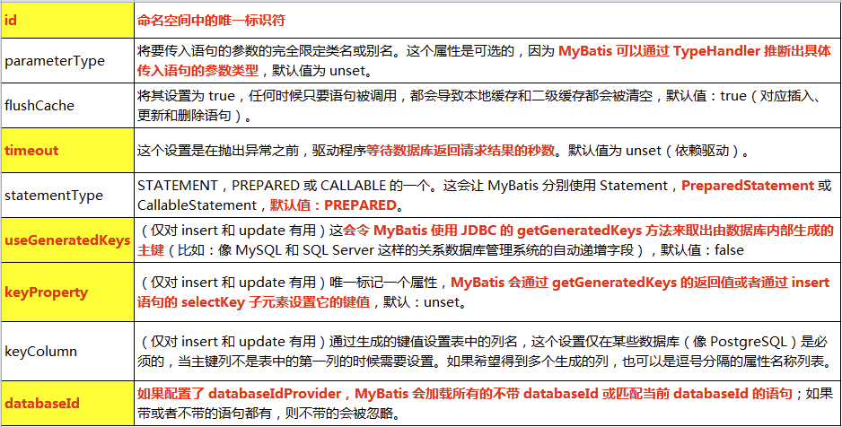

## insert操作：获取主键

- 若数据库**支持自动生成主键**的字段（比如MySQL 和SQL Server），则可以设置`useGeneratedKeys="true"`，然后再把`keyProperty`设置到目标属性上。

  ```xml
  <insert id="addEmployee" parameterType="Employee" useGeneratedKeys="true" keyProperty="id">
      insert into mybatis_test.employee (last_name, gender, email)
      values (#{lastName}, #{gender}, #{email})
  </insert>
  ```

  测试：

  ```java
   // 添加
  Employee employee = new Employee(null, "jerry", "jerry@qq.com", "0");
  mapper.addEmployee(employee);
  System.out.println(employee);// 添加之后会把上面的null设置为自增的主键值 
  ```

- 不支持自增型主键的数据库（例如Oracle），其在插入数据时，会需要先从数据库中的一个序列表中取出当前的序列号（类似于取号，每取一次号，这个号就会+1，再把这个号当做主键）；

- **不支持自增型主键的数据库**（例如Oracle），可以使用selectKey子元素：selectKey 元素将会首先运行，id 会被设置，然后插入语句会被调用。

  ```xml
      <insert id="addEmployee" parameterType="Employee"  databaseId="oracle">
          /*keyProperty: 查出主键值封装给javaBean的哪个属性*/
          /*order="BEFORE"： 当前sql在插入sql前运行*/
          <selectKey keyProperty="id" order="BEFORE" resultType="Integer">
              <!-- 编写查询主键的sql语句-->
              select EMPLOYEE_SEQ.nextval from dual
          </selectKey>
          insert into mybatis_test.employee (id, last_name, gender, email)
          values (#{id},#{lastName}, #{gender}, #{email})
      </insert>
  ```

  运行顺序：

  - 先执行selectKey查询id的sql， 查出id值封装给JavaBean（即Employee对象）的id值
  - 再运行插入数据的sql语句：就可直接用#{id}设置id属性对应的值。
  
- selectKey元素的一些属性：

  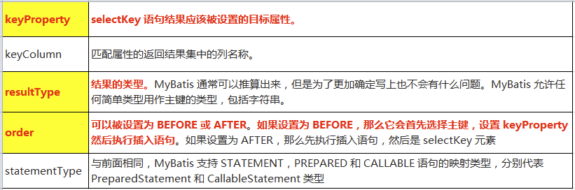

## 参数处理

### 参数传递

- **单个字面量类型的参数**：

  - 可以接受基本类型，对象类型的值。这种情况MyBatis可直接使用这个参数，不需要经过任何处理。
  - `#{参数名}`：单个参数的情况下，参数名可随意，mybatis只会直接取出参数值。

- **多个字面量类型的参数**：

  ```xml
  <!-- 接口：Employee getEmployeeByIdAndName(Integer id, String name)-->
  
  <select id="getEmployeeByIdAndName" resultType="Employee">
  	select * from mybatis_test.employee where id=#{param1}, last_name=#{param2}
  </select>
  
  ```

  - 任意多个参数，都会被MyBatis重新包装成一个Map传入。Map的key是“param1”，“param2”，……或者索引值0，1…，值就是参数的值。

  - 可进行明确的**命名参数**：为参数使用注解`@Param("name")`起一个名字`name`，MyBatis就会将这些参数封装进map中，key就是我们自己指定的名字。这样就可使用`#{指定的key}`来取出对应的参数值。

    - 接口：

      ```java
      Employee getEmployeeByIdAndName(@Param("id")Integer id, @Param("name")String name);
      ```

    - 于是mapper中就可以这样写：

      ```xml
      <select id="getEmployeeByIdAndName" resultType="Employee">
      	select * from mybatis_test.employee where id=#{id}, last_name=#{name}
      </select>
      ```

- **POJO**：

  - 如果多个参数正好是我们业务逻辑的数据模型，我们就可以直接出传入pojo；
  - `#{属性名}`：取出传入的pojo的属性值

- **Map**：

  - 我们也可以封装多个参数为map，直接传递

  - `#{key}`：取出amp对应的值

    - 接口：

      ```java
      Employee getEmployeeByIdAndName(Map<String, Object> map);
      ```

    - 测试使用：

      ```java
      Map<String, Object> map = new HashMap<>();
      map.put("id", 1);
      map.put("lastName", "Tom");
      Employee employee = mapper.getEmployeeByIdAndName(map);
      ```

    - mapper:

      ```xml
      <select id="getEmployeeByIdAndName" resultType="Employee">
      	select * from mybatis_test.employee where id=#{id}, last_name=#{lastName}
      </select>
      ```

- **TO（Transfer Object）**:

  - 如果多个参数不是业务模型中的数据，但要经常使用且这多个数据存在相关性，推荐来编写一个TO（Transfer Object）数据传输对象。如：

    ```java
    Page{
        int index;
        int size;
    }
    ```

- 一些情况：

  - ```text
    public Employee getEmp (@Param("id") Integer id， String lastName);
    取值: 
    id==>#[id/param1]  
    lastName==>#[param2]
    ```

  - ```text
    public Employee getEmp (Integer id， @Param("e") Employee emp);
    取值: 
    id==>#[param1]
    lastName===>#[param2.lastName/e.lastName)
    ```

- **Collection（List、Set）或是数组类型的参数**：

  - 如果是**Collection（List、Set）对象的参数**，首先会以字符串`collection`为key、Collection类型参数对象为值封装进map，如果这个参数对象是List对象，还会额外以字符串`list`为key、List类型参数对象封装进map。

    - 此时可以使用`#{collection[1]}`或者`#{list[1]}`(其中的collection或list为固定的`collection`或`list`字符串)

  - 如果是数组类型的参数，会以字符串`array`为key、数组对象为值封装进map。

    - 此时可以使用`#{array[1]}`取值（其中的array为固定的字符串值）。

  - 如：

    ```text
    Employee getEmployeeById(List<Integer> ids);
    取值：
    取出第一个id的值：#{list[0]}
    ```

  - **使用了注解来命名参数时，只能使用注解的命名参数或者`param1`去取出Collectio或是数组中的值**，而不能再使用`#{collection[1]}`或者`#{list[1]}`或`#{array[1]}`去取值。

### 获取参数值的两种方式

- MyBatis获取参数值的两种方式：`${}`和`#{}`
- `${}`的本质就是字符串拼接，`#{}`的本质就是占位符赋值
- `${}`使用字符串拼接的方式拼接sql，若为字符串类型或日期类型的字段进行赋值时，需要手动加单引号；
- `#{}`使用占位符赋值的方式拼接sql，属于预编译的形式将参数设置到sql语句中，此时为字符串类型或日期类型的字段进行赋值时，可以自动添加单引号。

> 用`${}`会直接字符串拼接sql，如果这种方式接受用户的输入，并用作语句参数是不安全的，会导致潜在的 SQL 注入攻击。因此，要么不允许用户输入这些字段，要么自行转义并检验这些参数。

### `#{}`更丰富的用法

- 参数位置支持的一些属性：

  - javaType、jdbcType、mode、numericScale、resultMap、typeHandler、jdbcTypeName、expression

- 参数可以指定一个特殊的数据类型。

  ```text
  #{property,javaType=int,jdbcType=NUMERIC}
  ```

- 如果null 被当作值来传递，对于所有可能为空的列，jdbcType 需要被设置。在数据为null时，有些数据库可能不能识别mybatis的默认处理，比如Oracle会报错

  - mybatis对所有的null映射默认都是原生Jdbc的OTHER类型，Oracle不兼容。

    > 此问题也可以通过在全局配置文件中的settings中设置jdbcTypeForNull=NULL
    >
    > ```xml
    > <settings>
    > 	<setting name="jdbcTypeForNull" value="NULL"/>
    > </settings>
    > ```

- mode 属性允许指定 `IN`，`OUT` 或 `INOUT` 参数。

  - 如果参数的 `mode` 为 `OUT` 或 `INOUT`，将会修改参数对象的属性值，以便作为输出参数返回。 
  - 如果 `mode` 为 `OUT`（或 `INOUT`），而且 `jdbcType` 为 `CURSOR`（也就是 Oracle 的 REFCURSOR），你必须指定一个 `resultMap` 引用来将结果集 `ResultMap` 映射到参数的类型上。要注意这里的 `javaType` 属性是可选的，如果留空并且 jdbcType 是 `CURSOR`，它会被自动地被设为 `ResultMap`。

- 对于数值类型，还可以设置 `numericScale` 指定小数点后保留的位数。

  ```text
  #{height,javaType=double,jdbcType=NUMERIC,numericScale=2}
  ```

- 尽管上面这些选项很强大，但大多时候，你只须简单指定属性名，顶多要为可能为空的列指定 `jdbcType`，其他的事情交给 MyBatis 自己去推断就行了。

  ```text
  #{firstName}
  #{middleInitial,jdbcType=VARCHAR}
  #{lastName}
  ```

## select元素查询

- Select元素来定义查询操作。其中的主要属性有：

  - `id`：用来引用这条语句，需要和接口的方法名一致
  - `parameterType`：参数类型，可以不传，mybatis会根据TypeHandler自动判断。
  - `resultType`：返回值类型，别名或者全类名，**如果返回的是集合，定义集合中元素的类型。**不能与resultMap同时使用。

  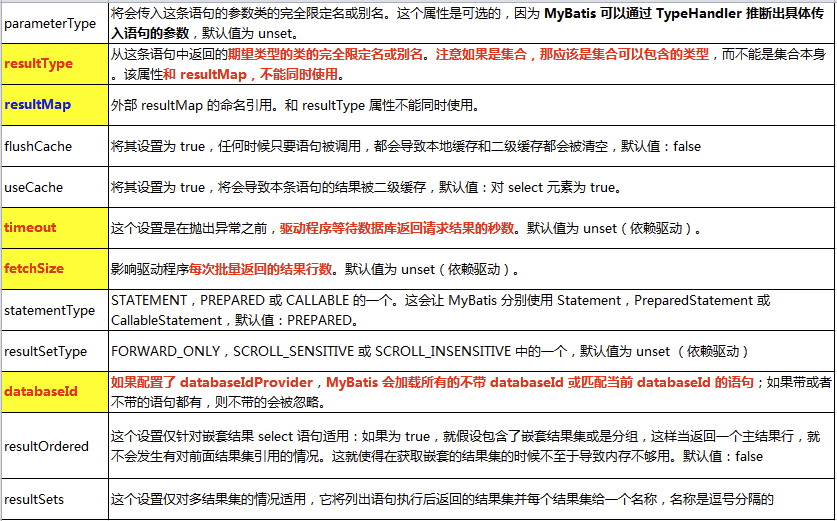

### 查询返回的记录封装成map

- **返回一条记录的map**，key就是列名，值就是对应的值

  - 接口：

    ```java
    public Map<String, Object> getEmployeeByIdReturnMap(Integer id);
    ```

  - mapper:

    ```xml
    <select id="getEmployeeByIdReturnMap" resultType="java.util.Map">
        select * from mybatis_test.employee where id=#{id}
    </select>
    ```

- **多条记录封装成一个map**，Map<Integer, Employeee>：键是这条记录的主键，值是记录封装后的javaBean。

  - 接口：

    ```java
    // 告诉mybatis封装这个map的时候使用哪个属性作为map的key
    @MapKey("id")
    public Map<Integer, Employee> getEmployeeByLastNameLikeReturnMap(String lastName);
    ```

  - mapper

    ```xml
    <select id="getEmployeeByLastNameLikeReturnMap" resultType="java.util.Map">
        select * from mybatis_test.employee where last_name like #{lastName}
    </select>
    ```

### 自定义映射resultMap

- 自动映射：
  - 全局setting设置
    - autoMappingBehavior默认是PARTIAL，开启自动映射的功能。唯一的要求是列名和javaBean属性名一致
    - 如果autoMappingBehavior设置为null则会取消自动映射
    - 数据库字段命名规范，POJO属性符合驼峰命名法，如A_COLUMNaColumn，我们可以开启自动驼峰命名规则映射功能，mapUnderscoreToCamelCase=true。
  - **自定义resultMap，实现高级结果集映射。**
- resultMap元素可设置自定义映射。resultMap元素的属性有：
  - id: 表示自定义映射的唯一标识，方便引用
  - type：自定义规则的Java类型，即查询的数据要映射的实体类的类型。
- resultMap的子标签有：
  - id：设置主键的映射关系
  - result：设置普通字段的映射关系
  - association：设置多对一的映射关系
  - collection：设置一对多的映射关系
- 各子标签的属性：
  - property：设置映射关系中实体类中的属性名
  - column：设置映射关系中表中的列名

#### 自定义字段和属性的映射关系

- 若字段名和实体类中的属性名不一致，则可以通过resultMap设置自定义映射

```xml
<mapper namespace="dao.EmployeeMapperPlus">

    <!--自定义某个javaBean的封装规则
        - type: 自定义规则的Java类型
        - id: 唯一id，方便引用
    -->
    <resultMap id="myEmp" type="bean.Employee">
        <!--指定主键列的封装规则：
        id元素定义主键底层会有优化
            - cloumn: 指定数据库表的哪一列
            - property：指定对应的javaBean属性
        -->
        <id column="id" property="id"/>
        <!--定义普通列封装规则-->
        <result column="last_name" property="lastName"/>

        <!--其他不指定的列会自动封装，但推荐我们只要写resultMap就把全部的映射规则都写上-->
        <result column="email" property="email"/>
        <result column="gender" property="gender"/>

    </resultMap>
    <select id="getEmployeeById" resultMap="myEmp">
        select * from mybatis_test.employee where id=#{id}
    </select>
</mapper>
```

#### 多对一关联查询的映射处理

- POJO中的属性可能会是一个对象

- 场景：查询Employee的同时查询员工对应的部门（employee表中存有外键department_id);一个部门有一个与之对应的部门

- bean类：

  - Employee：

    ```java
    public class Employee {
    
        private Integer id;
        private String lastName;
        private String email;
        private String gender;
        private Department department;
        //..... 
    ```

  - Department:

    ```java
    public class Department {
        private Integer id;
        private String departmentName;
        // ......
    ```

##### 级联属性封装查询结果

- 我们可以使用联合查询，并以级联属性的方式封装对象。

- Dao接口：

  ```java
  public Employee getEmployeeAndDept(Integer id);
  ```
  
- mapper:

  ```xml
  <resultMap id="emp_depart" type="bean.Employee">
      <id column="e_id" property="id"/>
      <result column="last_name" property="lastName"/>
      <result column="email" property="email"/>
      <result column="gender" property="gender"/>
      <!--级联属性进行封装-->
      <result column="d_id" property="department.id"/>
      <result column="department_name" property="department.departmentName"/>
  </resultMap>
  
  <select id="getEmployeeAndDept" resultMap="emp_depart">
      select e.id e_id, last_name, email, gender, department_id , d.id d_id, department_name
      from mybatis_test.employee e, mybatis_test.departments d
      where e.department_id = d.id and e.id=#{id}
  </select>
  ```

##### association定义关联对象嵌套封装

- resultMap标签下的association标签可以指定联合的JavaBean对象，association标签的属性：

  - `property`：指定哪个属性是联合的对象
  - `javaType`：指定该属性的Java类型（不能省略）

- 在association标签内，可对联合对象的属性与数据库列名进行映射，如同一个子resultMap。

- mapper：

  ```xml
  <resultMap id="emp_depart" type="bean.Employee">
      <id column="e_id" property="id"/>
      <result column="last_name" property="lastName"/>
      <result column="email" property="email"/>
      <result column="gender" property="gender"/>
  
      <!--association可以指定联合封装的JavaBean对象-->
      <association property="department" javaType="bean.Department">
          <id column="d_id" property="id"/>
          <result column="department_name" property="departmentName"/>
      </association>
  
  </resultMap>
  <select id="getEmployeeAndDept" resultMap="emp_depart">
      select e.id e_id, last_name, email, gender, department_id , d.id d_id, department_name
      from mybatis_test.employee e, mybatis_test.departments d
      where e.department_id = d.id and e.id=#{id}
  </select>
  ```

##### 使用association分步查询

- 使用association进行分步查询：
      1. 先按员工id查询员工信息
      2. 根据查询员工信息中的department_id值去部门表查出部门信息
      3. 部门设置到员工中

- `association`标签进行分步查询时使用的属性：

  - `select`: 表明当前属性是调用select指定的方法查出的结果，为该mapper的命名空间+方法名
  - `column`: 指定将查出的表中的哪一列传给这个方法

- 编写部门Department的Dao查询接口和mapper：

  ```java
  public interface DepartmentMapper {
      public Department getDepartmentById(Integer id);
  }
  ```

  DepartmentMapper.xml:

  ```xml
  <?xml version="1.0" encoding="UTF-8" ?>
  <!DOCTYPE mapper
          PUBLIC "-//mybatis.org//DTD Mapper 3.0//EN"
          "http://mybatis.org/dtd/mybatis-3-mapper.dtd">
  <mapper namespace="dao.DepartmentMapper">
  
      <!-- 根据部门id查出并封装成Department-->
      <select id="getDepartmentById" resultType="bean.Department">
          select id, department_name departmentName from mybatis_test.departments where id=#{id}
      </select>
  
  </mapper>
  ```

- 接口：

  ```java
  public Employee getEmployeeByIdInStep(Integer id);
  ```

  对应的mapper：

  ```xml
  <!--使用association进行分步查询：
      1. 先按员工id查询员工信息
      2. 根据查询员工信息中的department_id值去部门表查出部门信息
      3. 部门设置到员工中
      -->
  <resultMap id="emp_depart_in_step" type="bean.Employee">
      <id column="id" property="id"/>
      <result column="last_name" property="lastName"/>
      <result column="gender" property="gender"/>
      <result column="email" property="email"/>
  
      <!--association定义关联对象的封装规则
              select: 表明当前属性是调用select指定的方法查出的结果，为该mapper的命名空间+方法名
              column: 指定将查出的表中的哪一列传给这个方法
  
              流程：使用select指定方法（传入column指定的这列参数的值）查出对象，并封装给property指定的属性
          -->
      <association property="department"
                   select="dao.DepartmentMapper.getDepartmentById" 	
                   column="department_id">
          <!--将department_id作为参数传递给
          dao.DepartmentMapper.getDepartmentById方法进行执行，
          执行结果返回封装赋值给employee对象的department属性。-->
      </association>
  </resultMap>
  <select id="getEmployeeByIdInStep" resultMap="emp_depart_in_step">
      select * from mybatis_test.employee where id=#{id}
  </select>
  ```

##### association-分步查询&延迟加载

- 场景：我们每次查询Employee对象时，都会将Department部门信息一起查询出来，浪费资源。

- 在分步查询的基础上，使用延迟加载可以将部门信息在我们需要的时候再去查询出来。分步查询的基础之上加上两个配置即可实现：

	| 设置名                | 描述                                                         |
  | --------------------- | ------------------------------------------------------------ |
  | lazyLoadingEnabled    | 延迟加载的全局开关。当开启时，所有关联对象都会延迟加载。 特定关联关系中可通过设置 `fetchType` 属性来覆盖该项的开关状态。默认`false` |
  | aggressiveLazyLoading | 开启时，任一方法的调用都会加载该对象的所有延迟加载属性。 否则，每个延迟加载属性会按需加载（参考 `lazyLoadTriggerMethods`)。默认`false` |

- mybatis-config.xml:

  ```xml
  <settings>
      <!--将表中字段的下划线自动转换为驼峰-->
      <setting name="mapUnderscoreToCamelCase" value="True"/>
      <!--设置延迟加载-->
      <setting name="lazyLoadingEnabled" value="true"/>
      <setting name="aggressiveLazyLoading" value="true"/>
  </settings>
  ```

- 同时可通过`association`和`collection`标签中的`fetchType`属性设置当前的分步查询是否使用延迟加载，`fetchType="lazy(延迟加载)|eager(立即加载)"`

#### 一对多查询的映射处理

- 场景：根据部门id查询部门信息以及部门中的员工信息

- bean类：

  - Department类：

    ```java
    public class Department {
        private Integer id;
        private String departmentName;
        private List<Employee> employees;
        // ......
    ```

  

##### collection定义关联集合封装规则

- resultMap标签下的collection子标签可以封装集合类型的属性，collection标签的主要属性有：
  - `property`: 类型为集合的那个属性
  - `ofType`：集合中单个元素的所属类型

- Dao接口：

  ```java
      public Department getDepartmentByIdPlus(Integer id);
  ```

- DepartmentMapper.xml:

  ```xml
  <resultMap id="depart_emps" type="bean.Department">
          <id column="d_id" property="id"/>
          <result column="department_name" property="departmentName"/>
  
          <!--collection定义关联的集合类型的属性的封装规则
              - property: 类型为集合的那个属性
              - ofType：集合中单个元素的所属类型
          -->
          <collection property="employees" ofType="bean.Employee">
              <!--定义这个集合中元素的封装规则-->
              <id property="id" column="e_id"/>
              <result property="lastName" column="last_name"/>
              <result property="email" column="email"/>
              <result property="gender" column="gender"/>
          </collection>
      </resultMap>
      <select id="getDepartmentByIdPlus" resultMap="depart_emps">
          /*多表联查*/
          select d.id d_id, department_name, e.id e_id, last_name, email, gender
          from mybatis_test.departments d left join mybatis_test.employee e on d.id = e.department_id
          where d.id=#{id}
      </select>
  ```


##### collection分步查询&延迟加载

- 与association的分步查询类似，具体不再赘述。

- EmployeeMapperPlus接口：

  ```java
  // 根据部门id查出所有员工
  public Department getDepartmentByIdInStep(Integer id);
  ```

  对应的EmployeeMapperPlus.xml:

  ```xml
  <?xml version="1.0" encoding="UTF-8" ?>
  <!DOCTYPE mapper
          PUBLIC "-//mybatis.org//DTD Mapper 3.0//EN"
          "http://mybatis.org/dtd/mybatis-3-mapper.dtd">
  <mapper namespace="dao.EmployeeMapperPlus">
      
  <select id="getEmployeesByDepartmentId" resultType="bean.Employee">
      select * from mybatis_test.employee where department_id=#{id};
  </select>
      
  </mapper>
  ```

- DepartmentMapper接口：

  ```java
  public Department getDepartmentByIdInStep(Integer id);
  ```

  对应的DepartmentMapper.xml:

  ```xml
  <resultMap id="depart_emp_in_step" type="bean.Department">
      <id column="id" property="id"/>
      <result column="department_name" property="departmentName"/>
  
      <collection property="employees"
      select="dao.EmployeeMapperPlus.getEmployeesByDepartmentId"
      column="id"></collection>
  
  </resultMap>
  <select id="getDepartmentByIdInStep" resultMap="depart_emp_in_step">
      select id, department_name from mybatis_test.departments where id=#{id}
  </select>
  
  ```

##### 分步查询传递多列值&fetchType

- 前面的分步查询中，都只将一列column如id列传递过去；

- 如需多列的值作为参数传递过去，可将多列的值封装map传递过去：

  - 形如：`column="{key1=column1, key2=column3}"`

  - 其中的键分别为原查询方法的参数名，值为当前表的列名

  ```xml
  <collection property="employees"
      select="另一个查询方法（其中需要参数为#{dept_id}）"
      column="{dept_id=id}"></collection>
  ```

- 同时可通过`association`和`collection`标签中的`fetchType`属性设置当前的分步查询是否使用延迟加载，`fetchType="lazy(延迟加载)|eager(立即加载)"`


#### discriminator鉴别器

- `resultMap`标签下的子标签`discriminator`可以使用查询到的结果值来决定使用哪个结果映射，即可根据某列的值改变封装行为。

- `discriminator`标签中的`column`属性指定对表中哪一列的值进行判断， `javaType`属性为列值对应的Java类型。

- discriminator使用`case`标签对列值进行判断，case标签的`value`属性表示对列值的条件判断，而`resultType`属性为指定封装的结果类型，`resultType`和`resultMap`必须二选一，不能缺少。

- 如：

  ```text
  如果查出的是女生:就把部门信息查询出来，否则不查询;
  如果是男生，把 last_name 这一列的值赋值给 email;
  ```

  ```xml
  <select id="getEmployeesByDepartmentId" resultMap="emp_discriminator">
      select * from mybatis_test.employee where department_id=#{id};
  </select>
  
  <!--使用discriminator：
          - 如果查出的是女生:就把部门信息查询出来，否则不查询;
          - 如果是男生，把 last_name 这一列的值赋值给 email;
      -->
  <resultMap id="emp_discriminator" type="bean.Employee">
      <id column="id" property="id"/>
      <result column="last_name" property="lastName"/>
      <result column="gender" property="gender"/>
      <result column="email" property="email"/>
  
      <!--column：指定判定的列名
              javaType： 列值对应的Java类型
          -->
      <discriminator javaType="string" column="gender">
          <!--case标签中的value表示对value值的条件判断
                  resultType为指定封装的结果类型，resultType和resultMap二选一，不能缺少
              -->
          <case value="0" resultType="bean.Employee">
              <!--如果查出的是女生:就把部门信息查询出来，否则不查询;-->
              <association property="department"
                          select="dao.DepartmentMapper.getDepartmentById"
                           column="department_id">
              </association>
          </case>
          <case value="1" resultType="bean.Employee">
              <!--如果是男生，把 last_name 这一列的值赋值给 email;-->
              <result column="last_name" property="email"/>
          </case>
      </discriminator>
  </resultMap>
  ```


# 五、MyBatis-动态SQL

动态 SQL 是 MyBatis 的强大特性之一。如果你使用过 JDBC 或其它类似的框架，你应该能理解根据不同条件拼接 SQL 语句有多痛苦，例如拼接时要确保不能忘记添加必要的空格，还要注意去掉列表最后一个列名的逗号。利用动态 SQL，可以彻底摆脱这种痛苦。

动态SQL的元素主要有：

- if
- choose (when, otherwise)
- trim (where, set)
- foreach

## if

- 场景：查询员工，要求携带了哪个字段查询条件就带上这个字段的值。

接口：

```java
    // 携带了哪个字段、查询条件就带上这个字段的值
    public List<Employee> getEmployeeByConditionIf(Employee employee);
```

mapper.xml:

```xml
<!--查询员工，要求携带了哪个字段查询条件就带上这个字段的值-->
<select id="getEmployeeByConditionIf" resultType="bean.Employee">
    select * from mybatis_test.employee
    where 1=1
    <!-- test:判断表达式（使用OGNL表达式）
        注意是从参数中取值进行判断
        -->
    <if test="id!=null">
        and id=#{id}
    </if>
    <if test="lastName!=null and lastName!=''">
        and last_name like #{lastName}
    </if>
    <if test="email!=null and email.trim()!=''">
        and email=#{email}
    </if>
    <!--OGNL会进行字符串与数字的转换判断-->
    <if test="gender==0 or gender==1">
        and gender=#{gender}
    </if>

</select>
```

### OGNL简介

- OGNL（Object Graph Navigation Language ）对象图导航语言，这是一种强大的表达式语言，通过它可以非常方便的来操作对象属性。类似于我们的EL，SpEL等

  - 访问对象属性：`person.name`

  - 调用方法：`person.getName()`

  - 调用静态属性/方法：`@java.lang.Math@PI`、`@java.util.UUID@randomUUID()`

  - 调用构造方法：`new com.atguigu.bean.Person(‘admin’).name`

  - 运算符：`+`, `-`, `*`, `/`, `%`

  - 逻辑运算符：`in`, `not in`, `>`, `>=`, `<`, `<=`, `==`, `!=`

  - 注意：xml中特殊符号如`”`,`>`,`<`等这些都需要使用转义字符

  - 访问集合伪属性：

    | 类型           | 伪属性        | 伪属性对应的Java 方法                      |
    | -------------- | ------------- | ------------------------------------------ |
    | List、Set、Map | size、isEmpty | List/Set/Map.size(),List/Set/Map.isEmpty() |
    | List、Set      | iterator      | List.iterator()、Set.iterator()            |
    | Map            | keys、values  | Map.keySet()、Map.values()                 |
    | Iterator       | next、hasNext | Iterator.next()、Iterator.hasNext()        |

## where 查询条件

- 可以用`<where></where>`标签来将所有的查询条件包括在内。mybatis会将where标签中拼接的条件中多出来的and或者or去掉（但不会加上）。
- where只能去掉if条件中写在前面的“and”，而写在if条件中语句末尾的“and”或者“or”无法去掉。

```xml
<!--查询员工，要求携带了哪个字段查询条件就带上这个字段的值-->
<select id="getEmployeeByConditionIf" resultType="bean.Employee">
    select * from mybatis_test.employee
    <where>
        <!-- test:判断表达式（使用OGNL表达式）
        注意是从参数中取值进行判断
        -->
        <if test="id!=null">
            and id=#{id}
        </if>
        <if test="lastName!=null and lastName!=''">
            and last_name like #{lastName}
        </if>
        <if test="email!=null and email.trim()!=''">
            and email=#{email}
        </if>
        <!--OGNL会进行字符串与数字的转换判断-->
        <if test="gender==0 or gender==1">
            and gender=#{gender}
        </if>
    </where>
```

- where和if一般结合使用：
  - 若where标签中的if条件都不满足，则where标签没有任何功能，即不会添加where关键字
  - 若where标签中的if条件满足，则where标签会自动添加where关键字，并将条件最前方多余的and去掉

## trim自定义字符串截取

- `trim`用于去掉或添加标签中的内容。
- `trim`标签体重是整个字符串拼串后的结果
- 常用属性：
  - `prefix`：在trim标签中的内容的前面添加某些内容，比如在查询条件前添加“where”
  - `prefixOverrides`：在trim标签中的内容的前面去掉某些内容
  - `suffix`：在trim标签中的内容的后面添加某些内容
  - `suffixOverrides`：在trim标签中的内容的后面去掉某些内容

```xml
<select id="getEmpListByMoreTJ" resultType="Emp">
	select * from t_emp
	<trim prefix="where" suffixOverrides="and">
		<if test="ename != '' and ename != null">
			ename = #{ename} and
		</if>
		<if test="age != '' and age != null">
			age = #{age} and
		</if>
		<if test="sex != '' and sex != null">
   			 sex = #{sex}
		</if>
	</trim>
</select>
```

## choose分支选择

- choose、when、otherwise相当于swich...case...default，诸多条件中只选择其中满足的一个执行

```xml
<!--List<Emp> getEmpListByChoose(Emp emp);-->
<select id="getEmpListByChoose" resultType="Emp">
	select * from mybatis_employees
	<where>
		<choose>
			<when test="ename != '' and ename != null">
				ename = #{ename}
			</when>
			<when test="age != '' and age != null">
				age = #{age}
			</when>
			<when test="sex != '' and sex != null">
				sex = #{sex}
			</when>
			<when test="email != '' and email != null">
				email = #{email}
			</when>
            <otherwise><!-- 默认条件-->
            	gender=0
            </otherwise>
		</choose>
	</where>
</select>
```


## set与if结合的动态update操作

- 与if的结合：动态update操作

  ```xml
  <!-- public void updateEmployee(Employee employee);-->
  <update id="updateEmployee">
      update mybatis_test.employee
      <set>
          <if test="lastName!=null and lastName!=''">
              last_name = #{lastName}
          </if>
          <if test="email!=null and email.trim()!=''">
              email=#{email}
          </if>
          <!--OGNL会进行字符串与数字的转换判断-->
          <if test="gender==0 or gender==1">
              gender=#{gender}
          </if>
      </set>
      where id=#{id}
  
  </update>
  ```

- trim与if可以达到同样的效果：

  ```xml
   <!-- public void updateEmployee(Employee employee);-->
      <update id="updateEmployee">
          update mybatis_test.employee
          <trim prefix="set" suffixOverrides=",">
              <if test="lastName!=null and lastName!=''">
                  last_name = #{lastName},
              </if>
              <if test="email!=null and email.trim()!=''">
                  email=#{email},
              </if>
              <if test="gender==0 or gender==1">
                  gender=#{gender},
              </if>
          </trim>
          where id=#{id}
      </update>
  ```

## foreach遍历

- 动态SQL 的另外一个常用的必要操作是需要对一个集合进行遍历，通常是在构建IN 条件语句的时候。可以使用`foreach`实现

- 如：

  ```xml
  <!--public List<Employee> selectEmployeeIn(List<Integer> ids)-->
  <select id="selectEmployeeIn" resultType="bean.Employee">
    SELECT *
    FROM mybatis_test.employees
    <where>
      <foreach item="item_id"  index="item_index" collection="ids"
          open="id in (" separator="," close=")">
            #{item_id}
      </foreach>
    </where>
  </select>
  <!-- 批量插入（这种写法Oracle不支持，但mysql支持）-->
  <!--int insertMoreEmp(List<Emp> emps);-->
  <insert id="insertMoreEmp">
  	insert into t_emp values
  	<foreach collection="emps" item="emp" separator=",">
  (null,#{emp.ename},#{emp.age},#{emp.gender},#{emp.email},null)
  	</foreach>
  </insert>
  
  <!-- 批量删除-->
  <!--int deleteMoreByArray(int[] eids);-->
  <delete id="deleteMoreByArray">
  	delete from t_emp where
  	<foreach collection="eids" item="eid" separator="or">
  		eid = #{eid}
  	</foreach>
  </delete>
  
  <!--int deleteMoreByArray(int[] eids);-->
  <delete id="deleteMoreByArray">
  delete from t_emp where eid in
  	<foreach collection="eids" item="eid" separator="," open="(" close=")">
  		#{eid}
  	</foreach>
  </delete>
  ```

  - collection：指定要遍历的集合。list类型的参数会特殊处理封装在map中，map的key就叫list。
  - item:将当前遍历出的元素赋值给指定的变量，如`item="item_id"`，则可以在foreach标签体内使用`#{item_id}`引用该值。
  - index: 索引。遍历list时就是索引，遍历map时index为key，item为值。与item的使用相似，如`index="item_index"` 则可在标签体内使用`#{item_index}`使用该值。
  - separator：设置循环体之间的分隔符
  - open：设置foreach标签中的内容的开始符
  - close：设置foreach标签中的内容的结束符

-  *foreach* 元素的功能非常强大，它允许你指定一个集合，声明可以在元素体内使用的集合项（item）和索引（index）变量。它也允许你指定开头与结尾的字符串以及集合项迭代之间的分隔符。这个元素也不会错误地添加多余的分隔符。

- 可以将任何可迭代对象（如 List、Set 等）、Map 对象或者数组对象作为集合参数传递给 *foreach*。当使用可迭代对象或者数组时，index 是当前迭代的序号，item 的值是本次迭代获取到的元素。当使用 Map 对象（或者 Map.Entry 对象的集合）时，index 是键，item 是值。

## 内置参数`_parameter`&`_databaseId`

- mybatis默认有两个参数可以被引用来判断、取值等操作。

  - `_parameter`:代表整个参数

    - 如果有传递单个参数，`_parameter`就是这个参数
    - 如果传递了多个参数，参数会被封装为一个map，而`_parameter`就可取出这一整个map

  - `_databaseId`:如果配置了databaseIdProvider，`_databaseId`就是代表当前数据库的别名。可用这个参数放在if标签下进行判断，切换不同数据库下的sql语句。

    ```xml
    <insert id="insert">
      <selectKey keyProperty="id" resultType="int" order="BEFORE">
        <if test="_databaseId == 'oracle'">
          select seq_users.nextval from dual
        </if>
        <if test="_databaseId == 'db2'">
          select nextval for seq_users from sysibm.sysdummy1"
        </if>
      </selectKey>
      insert into users values (#{id}, #{name})
    </insert>
    ```

## bind绑定

- `bind` 元素允许你在 OGNL 表达式以外创建一个变量，并将其绑定到当前的上下文。比如：

  ```xml
  <select id="selectBlogsLike" resultType="Blog">
    <bind name="pattern" value="'%' + _parameter.getTitle() + '%'" />
    SELECT * FROM BLOG
    WHERE title LIKE #{pattern}
  </select>
  ```

## SQL片段

- sql片段，可以记录一段公共sql片段，在使用的地方通过include标签进行引入

  ```xml
  <sql id="empColumns">
  	eid,ename,age,sex,did
  </sql>
  select <include refid="empColumns"></include> from t_emp
  ```

- 在SQL片段块中，同样支持使用动态SQL的标签

- include标签体中，还可以自定义一些`<property value="" name="prop"/>`自定义属性，供这个sql片段中的sql语句使用`${prop}`（不能用`#{prop}`）去引用这些自定义的属性。

## script：接口类中使用动态 SQL

要在带注解的映射器接口类中使用动态 SQL，可以使用 *script* 元素。比如:

```java
    @Update({"<script>",
      "update Author",
      "  <set>",
      "    <if test='username != null'>username=#{username},</if>",
      "    <if test='password != null'>password=#{password},</if>",
      "    <if test='email != null'>email=#{email},</if>",
      "    <if test='bio != null'>bio=#{bio}</if>",
      "  </set>",
      "where id=#{id}",
      "</script>"})
    void updateAuthorValues(Author author);
```


# 六、MyBatis-缓存机制

- MyBatis 包含一个非常强大的查询缓存特性,它可以非常方便地配置和定制。缓存可以极大的提升查询效率。

- MyBatis系统中默认定义了两级缓存。

- 一级缓存（本地缓存）和二级缓存（二级缓存）：

  - 默认情况下，只有一级缓存（SqlSession级别的缓存，也称为本地缓存）开启。
  - 二级缓存需要手动开启和配置，他是基于namespace级别的缓存。
  - 为了提高扩展性。MyBatis定义了缓存接口Cache。我们可以通过实现Cache接口来自定义二级缓存 

  

## 一级缓存

- 一级缓存(local cache), 即本地缓存, 作用域默认为sqlSession。当Session flush 或close 后, 该Session 中的所有Cache 将被清空。
  - 与数据库同一次会话期间查询到的数据会放在本地缓存中。以后如果需要获取相同的数据，直接从缓存中拿，没必要再去查询数据库。

- 本地缓存不能被关闭, 但可以调用clearCache() 来清空本地缓存, 或者改变缓存的作用域。

- 可以配置本地缓存的作用域. 在mybatis-config.xml 中的setting中配置

  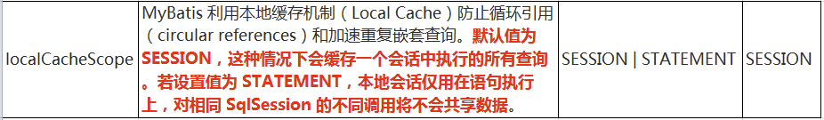

  - 同一次会话期间只要查询过的数据都会保存在当前SqlSession的一个Map中
    - key:hashCode + 查询的SqlId + 编写的sql查询语句 + 参数

- 一级缓存失效的四种情况
  - 不同的SqlSession对应不同的一级缓存
  - 同一个SqlSession但是查询条件不同
  - 同一个SqlSession两次查询期间执行了任何一次增删改操作
  - 同一个SqlSession两次查询期间手动清空了缓存

## 二级缓存

- 二级缓存(second level cache)，全局作用域缓存。**二级缓存是SqlSessionFactory级别，通过同一个SqlSessionFactory创建的SqlSession查询的结果会被缓存**，也就是说，它是基于namespace级别的缓存，一个namespace对应一个二级缓存；此后若再次执行相同的查询语句，结果就会从缓存中获取

- 二级缓存默认不开启，需要手动配置

- MyBatis提供二级缓存的接口以及实现，缓存实现要求POJO实现Serializable接口

- 二级缓存在SqlSession 关闭或提交之后才会生效。

- **工作机制：**

  1. **一个会话，查询一条数据，这个数据就会被放在当前会话的一级缓存中；**
  2. **如果会话关闭，一级缓存中的数据会被保存到二级缓存中；新的会话查询信息，就可以参照二级缓存。不同的namespace查出的数据会放在自己对应的缓存中。**

- **二级缓存开启的条件**：

  - 全局配置文件中开启二级缓存`<setting name="cacheEnabled" value="true"/>`（默认为true，不需要设置）
  - 需要使用二级缓存的映射文件处使用cache配置缓存`<cache />`
  - 二级缓存必须在SqlSession关闭或提交之后有效
  - 注意：POJO需要实现Serializable接口

- 使二级缓存失效的情况：两次查询之间执行了任意的增删改，会使一级和二级缓存同时失效

- **二级缓存的相关配置**：

  mapper.xml中`<cache />`标签的一些属性：

  ```xml
      <cache eviction="FIFO" flushInterval="60000" readOnly="false" size="1024" type=""></cache>
  ```

  - `eviction`:缓存的回收策略。主要可以是：
    - `LRU`-最近最少使用的:移除最长时间不被使用的对象。
    - `FIFO `-先进先出:按对象进入缓存的顺序来移除它们。
    - `SOFT` -软引用:移除基于垃圾回收器状态和软引用规则的对象。
    - `WEAK `-弱引用:更积极地移除基于垃圾收集器状态和弱引用规则的对象。
    - 默认的是 LRU。 
  - `flushInterval`:缓存刷新间隔缓存多长时间清空一次，默认不清空，设置一个毫秒值 
  - `readOnly`:是否只读
    - `true`：mybatis 会认为所有从缓存中获取数据的**未来操作**都是只读操作，不会修改数据。因此mybatis 为了加快获取速度，直接就会将数据在缓存中的引用交给用户。此种不安全，但是速度快。
    - `false`：非只读， mybatis 会认为从缓存中获取的数据未来可能会被修改。因此mybatis 会利用序列化&反序列的技术克隆一份新的数据给你。安全，但因有序列化和反序列化过重，速度慢。
  - `size`：缓存存放多少元素。
  - `type`：指定自定义缓存的全类名。

## 缓存有关的设置

- **全局setting的cacheEnable**：配置二级缓存的开关。一级缓存一直是打开的。

- **select标签的useCache属性**：配置这个select是否使用二级缓存。一级缓存一直是使用的

- **sql标签的flushCache属性**：增删改默认flushCache=true。sql执行以后，会同时清空一级和二级缓存。查询默认flushCache=false。

- **sqlSession.clearCache()**：只是用来清除一级缓存。

- 当在某一个作用域(一级缓存Session/二级缓存Namespaces) 进行了C/U/D 操作后，默认该作用域下所有select 中的缓存将被clear。

- 可以配置本地缓存的作用域. 在mybatis-config.xml 中的setting中配置

  


## 缓存查询的顺序

- 先查询二级缓存，因为二级缓存中可能会有其他程序已经查出来的数据，可以拿来直接使用。
- 如果二级缓存没有命中，再查询一级缓存
- 如果一级缓存也没有命中，则查询数据库
- SqlSession关闭之后，一级缓存中的数据会写入二级缓存

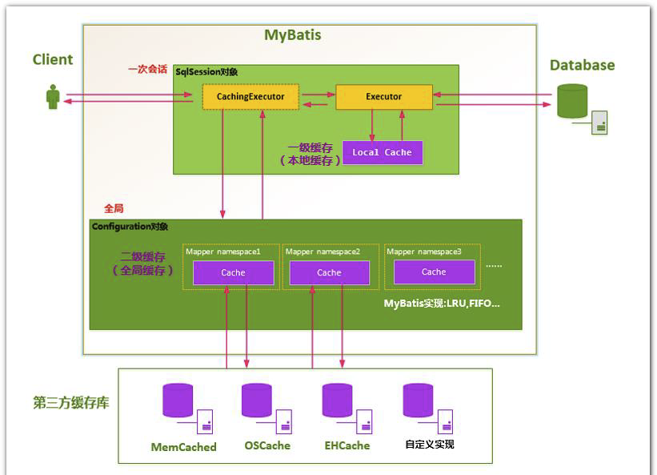

## 整合第三方缓存EHCache

- 官方教程：http://mybatis.org/ehcache-cache/

1. 添加jar包：

| jar包名称       | 作用                            |
| --------------- | ------------------------------- |
| mybatis-ehcache | Mybatis和EHCache的整合包        |
| ehcache         | EHCache核心包                   |
| slf4j-api       | SLF4J日志门面包                 |
| logback-classic | 支持SLF4J门面接口的一个具体实现 |

2. 只需在映射器 XML 文件中配置一个Cache元素:

   ```xml
   <mapper namespace="org.acme.FooMapper">
     <cache type="org.mybatis.caches.ehcache.EhcacheCache"/>
     ...
   </mapper>
   ```

3. 创建EHCache的配置文件ehcache.xml：

   ```xml
   <?xml version="1.0" encoding="utf-8" ?>
   <ehcache xmlns:xsi="http://www.w3.org/2001/XMLSchema-instance" 		 
            xsi:noNamespaceSchemaLocation="../config/ehcache.xsd">
       <!-- 磁盘保存路径 -->
       <diskStore path="D:\atguigu\ehcache"/>
   
       <defaultCache 
                     maxElementsInMemory="1000" 
                     maxElementsOnDisk="10000000" 
                     eternal="false" 
                     overflowToDisk="true" 
                     timeToIdleSeconds="120" 
                     timeToLiveSeconds="120"
                     diskExpiryThreadIntervalSeconds="120"
                     memoryStoreEvictionPolicy="LRU">
       </defaultCache>
   </ehcache>
   
   ```

   - 配置文件说明：

     | **属性名**                      | **是否必须** | **作用**                                                     |
     | ------------------------------- | ------------ | ------------------------------------------------------------ |
     | maxElementsInMemory             | 是           | 在内存中缓存的element的最大数目                              |
     | maxElementsOnDisk               | 是           | 在磁盘上缓存的element的最大数目，若是0表示无 穷大            |
     | eternal                         | 是           | 设定缓存的elements是否永远不过期。 如果为true，则缓存的数据始终有效， 如果为false那么还要根据timeToIdleSeconds、timeToLiveSeconds  判断 |
     | overflowToDisk                  | 是           | 设定当内存缓存溢出的时候是否将过期的element 缓存到磁盘上     |
     | timeToIdleSeconds               | 否           | 当缓存在EhCache中的数据前后两次访问的时间超 过timeToIdleSeconds的属性取值时， 这些数据便会删除，默认值是0,也就是可闲置时间无穷大 |
     | timeToLiveSeconds               | 否           | 缓存element的有效生命期，默认是0.,也就是  element存活时间无穷大 |
     | diskSpoolBufferSizeMB           | 否           | DiskStore(磁盘缓存)的缓存区大小。默认是30MB。每个Cache都应该有自己的一个缓冲区 |
     | diskPersistent                  | 否           | 在VM重启的时候是否启用磁盘保存EhCache中的数据，默认是false。 |
     | diskExpiryThreadIntervalSeconds | 否           | 磁盘缓存的清理线程运行间隔，默认是120秒。每 个120s， 相应的线程会进行一次EhCache中数据的清理工作 |
     | memoryStoreEvictionPolicy       | 否           | 当内存缓存达到最大，有新的element加入的时  候， 移除缓存中element的策略。 默认是LRU（最近最少使用），可选的有LFU（最不常使用）和FIFO（先进先出） |

4. 存在SLF4J时，作为简易日志的log4j将失效，此时我们需要借助SLF4J的具体实现logback来打印日志。创建logback的配置文件logback.xml

   ```xml
   <?xml version="1.0" encoding="UTF-8"?>
   <configuration debug="true">
   	<!-- 指定日志输出的位置 -->
   	<appender name="STDOUT" class="ch.qos.logback.core.ConsoleAppender">
           <encoder>
               <!-- 日志输出的格式 -->
               <!-- 按照顺序分别是：时间、日志级别、线程名称、打印日志的类、日志主体内容、换行 -->
               <pattern>[%d{HH:mm:ss.SSS}] [%-5level] [%thread] [%logger] [%msg]%n</pattern>
           </encoder>
   	</appender>
   
       <!-- 设置全局日志级别。日志级别按顺序分别是：DEBUG、INFO、WARN、ERROR -->
       <!-- 指定任何一个日志级别都只打印当前级别和后面级别的日志。 -->
       <root level="DEBUG">
           <!-- 指定打印日志的appender，这里通过“STDOUT”引用了前面配置的appender -->
           <appender-ref ref="STDOUT" />
       </root>
   
       <!-- 根据特殊需求指定局部日志级别 -->
       <logger name="com.atguigu.crowd.mapper" level="DEBUG"/>
   
   </configuration>
   
   ```


# 七、MyBatis-Spring整合

## 准备

- 查看不同MyBatis版本整合Spring时使用的适配包：

  http://www.mybatis.org/spring/

- 下载：https://mvnrepository.com/artifact/org.mybatis/mybatis-spring 

- 准备以下jar包：

  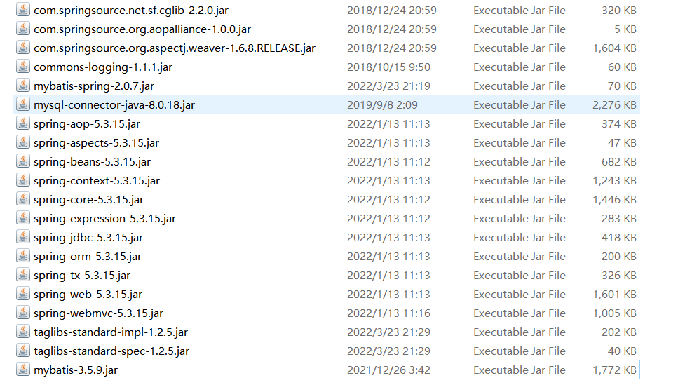

  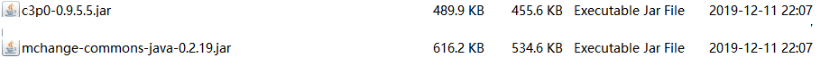

  导入以上依赖包

  

- 创建Java工程，引入Web Application模块。目录如下

  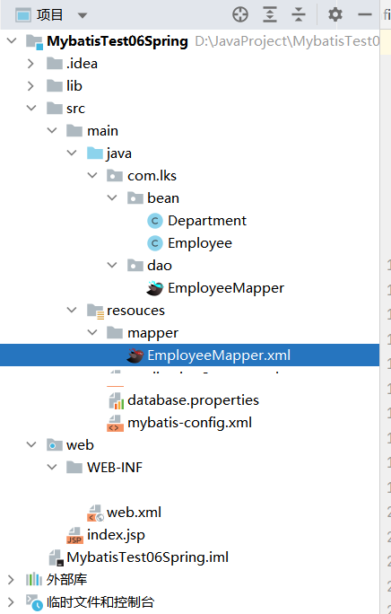

  

- 配置好如上图所示内容。

## 整合

- SpringMVC只控制网站跳转逻辑（只管Controller）
- Spring管理所有的业务逻辑组件，控制业务逻辑。数据源、事务控制、aop等
- 

- 配置web/WEB-INF/web.xml配置springMVC的支持

  ```xml
  <?xml version="1.0" encoding="UTF-8"?>
  <web-app xmlns="http://xmlns.jcp.org/xml/ns/javaee"
           xmlns:xsi="http://www.w3.org/2001/XMLSchema-instance"
           xsi:schemaLocation="http://xmlns.jcp.org/xml/ns/javaee http://xmlns.jcp.org/xml/ns/javaee/web-app_4_0.xsd"
           version="4.0">
      <!--Spring 配置-->
      <context-param>
          <param-name>contextConfigLocation</param-name>
          <param-value>classpath:applicationContext.xml</param-value>
      </context-param>
      
      <listener>
          <listener-class>org.springframework.web.context.ContextLoaderListener</listener-class>
      </listener>
  
      <!--Spring MVC配置-->
      <!--配置DispatcherServlet -->
      <servlet>
          <servlet-name>springDispatcherServlet</servlet-name>
          <servlet-class>org.springframework.web.servlet.DispatcherServlet</servlet-class>
          <init-param>
              <param-name>contextConfigLocation</param-name>
              <param-value>/WEB-INF/spring-servlet.xml</param-value>
          </init-param>
  
          <load-on-startup>1</load-on-startup>
      </servlet>
      <servlet-mapping>
          <servlet-name>springDispatcherServlet</servlet-name>
          <url-pattern>/</url-pattern>
      </servlet-mapping>
  </web-app>
  ```

- 在web.xml的相同目录下创建spring-servlet.xml:

  ```xml
  <?xml version="1.0" encoding="UTF-8"?>
  <beans xmlns="http://www.springframework.org/schema/beans"
         xmlns:xsi="http://www.w3.org/2001/XMLSchema-instance"
         xmlns:context="http://www.springframework.org/schema/context"
         xmlns:mvc="http://www.springframework.org/schema/mvc"
         xsi:schemaLocation="http://www.springframework.org/schema/beans http://www.springframework.org/schema/beans/spring-beans.xsd
                      http://www.springframework.org/schema/context http://www.springframework.org/schema/context/spring-context.xsd
                      http://www.springframework.org/schema/mvc http://www.springframework.org/schema/mvc/spring-mvc.xsd"
  >
  
      <!--只扫描控制器-->
      <context:component-scan base-package="com.lks" use-default-filters="false">
          <context:include-filter type="annotation" expression="org.springframework.stereotype.Controller"/>
      </context:component-scan>
  
      <!--视图解析器-->
      <bean class="org.springframework.web.servlet.view.InternalResourceViewResolver">
          <property name="prefix" value="/WEB-INF/pages/"></property>
          <property name="suffix" value=".jsp"></property>
      </bean>
  
      <mvc:annotation-driven></mvc:annotation-driven>
      <mvc:default-servlet-handler/>
  
  </beans>
  ```

- 在resource目录下创建applicationContext.xml文件，进行spring配置文件的基础配置：

  ```xml
  <?xml version="1.0" encoding="UTF-8"?>
  <beans xmlns="http://www.springframework.org/schema/beans"
         xmlns:xsi="http://www.w3.org/2001/XMLSchema-instance" 
         xmlns:aop="http://www.springframework.org/schema/aop"
         xmlns:tx="http://www.springframework.org/schema/tx" 
         xmlns:context="http://www.springframework.org/schema/context"
         xsi:schemaLocation="
         http://www.springframework.org/schema/beans
         http://www.springframework.org/schema/beans/spring-beans-4.0.xsd
         http://www.springframework.org/schema/tx
         http://www.springframework.org/schema/tx/spring-tx-4.0.xsd
         http://www.springframework.org/schema/aop
         http://www.springframework.org/schema/aop/spring-aop-4.0.xsd
         http://www.springframework.org/schema/context
         http://www.springframework.org/schema/context/spring-context-4.0.xsd
       ">
      <!-- Spring希望管理所有的业务逻辑组件-->
      <context:component-scan base-package="com.lks">
          <context:exclude-filter type="annotation" expression="org.springframework.stereotype.Controller"/>
      </context:component-scan>
  
      <!--Spring用来控制业务逻辑。数据源、事务控制、aop等-->
      <!--引入数据库配置文件-->
      <context:property-placeholder location="classpath:database.properties"/>
      <!--数据源-->
      <bean id="dataSource" class="com.mchange.v2.c3p0.ComboPooledDataSource">
          <property name="jdbcUrl" value="${jdbc.url}"></property>
          <property name="driverClass" value="${jdbc.driver}"></property>
          <property name="user" value="${jdbc.username}"></property>
          <property name="password" value="${jdbc.password}"></property>
       </bean>
      
          <!--spring事务管理器-->
      <bean id="dataSourceTransactionManager" class="org.springframework.jdbc.datasource.DataSourceTransactionManager">
          <!--事务管理器需要可以控制连接池里的所有连接，连接的提交、关闭、开启都是管理器控制的-->
          <property name="dataSource" ref="dataSource"/>
      </bean>
  
      <!--整合mybatis-->
  
  
  </beans>
  ```

- 在resource目录下的applicationContext.xml配置文件文件，进行整合mybatis的相关配置。

  - 整合mybatis的目的：
    1. 由spring管理所有组件。包括mapper的实现类，这样以后service层要使用Dao层时，可以直接使用`@AutoWired`自动注入mapper。避免了每次都需要从session获取mapper的繁琐操作。
    2. 由spring管理事务，spring声明事务相对强大许多。

- src/main/resouces/applicationContext.xml

  ```xml
  <?xml version="1.0" encoding="UTF-8"?>
  <beans xmlns="http://www.springframework.org/schema/beans"
         xmlns:xsi="http://www.w3.org/2001/XMLSchema-instance"
         xmlns:tx="http://www.springframework.org/schema/tx"
         xmlns:context="http://www.springframework.org/schema/context"
         xmlns:mybatis="http://mybatis.org/schema/mybatis-spring"
         xsi:schemaLocation="http://www.springframework.org/schema/context http://www.springframework.org/schema/context/spring-context.xsd
       http://www.springframework.org/schema/beans http://www.springframework.org/schema/beans/spring-beans.xsd
       http://www.springframework.org/schema/tx http://www.springframework.org/schema/tx/spring-tx.xsd
       http://mybatis.org/schema/mybatis-spring http://mybatis.org/schema/mybatis-spring.xsd">
      <!-- Spring希望管理所有的业务逻辑组件-->
      <context:component-scan base-package="com.lks">
          <context:exclude-filter type="annotation" expression="org.springframework.stereotype.Controller"/>
      </context:component-scan>
  
  
  
      <!--Spring用来控制业务逻辑。数据源、事务控制、aop等-->
      <!--引入数据库配置文件-->
      <context:property-placeholder location="classpath:database.properties"/>
      <!--数据源-->
      <bean id="dataSource" class="com.mchange.v2.c3p0.ComboPooledDataSource">
          <property name="jdbcUrl" value="${jdbc.url}"></property>
          <property name="driverClass" value="${jdbc.driver}"></property>
          <property name="user" value="${jdbc.username}"></property>
          <property name="password" value="${jdbc.password}"></property>
       </bean>
  
      <!--spring事务管理器-->
      <bean id="dataSourceTransactionManager" class="org.springframework.jdbc.datasource.DataSourceTransactionManager">
          <!--事务管理器需要可以控制连接池里的所有连接，连接的提交、关闭、开启都是管理器控制的-->
          <property name="dataSource" ref="dataSource"/>
      </bean>
  
      <!--开启基于注解的事务-->
      <tx:annotation-driven transaction-manager="dataSourceTransactionManager"></tx:annotation-driven>
  
      <!--整合mybatis：
      目的：1. 由spring管理所有组件。包括mapper的实现类，
      这样以后service层要使用Dao层时，可以直接使用@AutoWired自动注入mapper。避免了获取从session获取mapper的繁琐操作。
      -->
      <!--会创建出SqlSessionFactory对象，让Spring IOC自动创建避免我们自己手动创建-->
      <bean id="sqlSessionFactoryBean" class="org.mybatis.spring.SqlSessionFactoryBean">
          <!--SqlSessionFactory里的所有信息，以前是在全局配置文件中创建的，现在全都可在此定义-->
          <property name="dataSource" ref="dataSource"></property>
          <!--configLocation指定配置文件的路径，这样就可以结合mybatis的全局配置文件进行-->
          <property name="configLocation" value="classpath:mybatis-config.xml"></property>
          <!--mapperLocations指定mapper文件位置-->
          <property name="mapperLocations" value="classpath:mapper/*.xml"></property>
      </bean>
  
      <!--扫描所有mapper接口的实现，让mapper可以自动注入
      base-package指定mapper接口的包名
      -->
      <mybatis:scan base-package="com.lks.dao" />
      
  </beans>
  ```

- 这样src/main/resouces/mybatis-config.xml的全局配置文件可以省略一些：

  ```xml
  <?xml version="1.0" encoding="UTF-8" ?>
  <!DOCTYPE configuration
          PUBLIC "-//mybatis.org//DTD Config 3.0//EN"
          "http://mybatis.org/dtd/mybatis-3-config.dtd">
  <configuration>
  
      <settings>
          <!--将表中字段的下划线自动转换为驼峰-->
          <setting name="mapUnderscoreToCamelCase" value="True"/>
          <!--设置延迟加载-->
          <setting name="lazyLoadingEnabled" value="true"/>
          <setting name="aggressiveLazyLoading" value="true"/>
      </settings>
      <!--类型别名：为java的类型起一个简短的别名，避免冗余的全类名-->
      <typeAliases>
          <typeAlias type="com.lks.bean.Employee" alias="employee"/>
          <!--package会为该包下的所有类赋予默认别名-->
          <!--<package name="bean" />-->
      </typeAliases>
  
      <databaseIdProvider type="DB_VENDOR">
          <!--为数据库厂商标识起一个好写一点的别名-->
          <property name="SQL Server" value="sqlserver"/>
          <property name="MySQL" value="mysql"/>
          <property name="Oracle" value="oracle" />
      </databaseIdProvider>
  
  </configuration>
  ```

  

## 测试

- Mapper接口：Employee.java

  ```java
  package com.lks.dao;
  
  import com.lks.bean.Employee;
  import java.util.List;
  
  public interface EmployeeMapper {
  
      public Employee getEmployeeById(Integer id);
  
      public List<Employee> getEmployees();
  }
  ```

  mapper实现：src/main/resouces/mapper/EmployeeMapper.xml：

  ```xml
  <?xml version="1.0" encoding="UTF-8" ?>
  <!DOCTYPE mapper
          PUBLIC "-//mybatis.org//DTD Mapper 3.0//EN"
          "http://mybatis.org/dtd/mybatis-3-mapper.dtd">
  <mapper namespace="com.lks.dao.EmployeeMapper">
  
  
      <select id="getEmployeeById" resultType="com.lks.bean.Employee">
          select * from mybatis_test.employee where id=#{id}
      </select>
      <select id="getEmployees" resultType="com.lks.bean.Employee">
          select * from mybatis_test.employee
      </select>
  </mapper>
  ```

- Service层：src/main/java/com/lks/service/EmployeeService.java

  ```java
  package com.lks.service;
  
  import com.lks.bean.Employee;
  import com.lks.dao.EmployeeMapper;
  import org.springframework.beans.factory.annotation.Autowired;
  import org.springframework.stereotype.Controller;
  
  import java.util.List;
  
  @Controller
  public class EmployeeService {
  
      @Autowired
      private EmployeeMapper employeeMapper;
  
      public List<Employee> getEmployees(){
          return employeeMapper.getEmployees();
      }
  }
  
  ```

- Controller层：src/main/java/com/lks/controller/EmployeeController.java

  ```java
  package com.lks.controller;
  
  import com.lks.bean.Employee;
  import com.lks.service.EmployeeService;
  import org.springframework.beans.factory.annotation.Autowired;
  import org.springframework.stereotype.Controller;
  import org.springframework.web.bind.annotation.RequestMapping;
  
  import java.util.List;
  import java.util.Map;
  
  @Controller
  public class EmployeeController {
  
      @Autowired
      EmployeeService employeeService;
  
      @RequestMapping("/emps")
      public String getEmployees(Map<String, Object> map){
          List<Employee> employees = employeeService.getEmployees();
          map.put("all", employees);
          return "employee_list";
      }
  }
  
  ```

- 视图：

  - web/index.jsp

    ```jsp
    <%@ page contentType="text/html;charset=UTF-8" language="java" %>
    <html>
      <head>
        <title>Mybatis整合Spring测试</title>
      </head>
      <body>
      <a href="emps">查询所有员工</a>
      </body>
    </html>
    
    ```

  - web/WEB-INF/pages/employee_list.jsp

    ```jsp
    <%@ page contentType="text/html;charset=UTF-8" language="java" %>
    
    <%@taglib prefix="c" uri="http://java.sun.com/jsp/jstl/core"%>
    <html>
    <head>
        <title>员工列表</title>
    </head>
    <body>
        <table>
            <tr>
                <td>ID</td>
                <td>lastName</td>
                <td>email</td>
                <td>gender</td>
            </tr>
            <c:forEach items="${all}" var="emp">
                <tr>
                    <td>${emp.id}</td>
                    <td>${emp.lastName}</td>
                    <td>${emp.email}</td>
                    <td>${emp.gender}</td>
                </tr>
            </c:forEach>
        </table>
    
    </body>
    </html>
    
    ```

  

- 测试结果：

  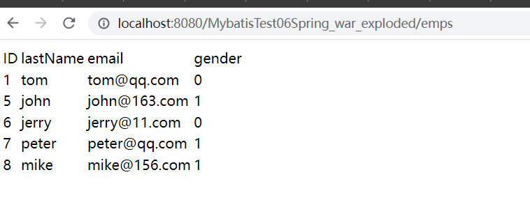

  

# 八、MyBatis-逆向工程

## 概述

- **MyBatis Generator**：简称MBG，是一个专门为MyBatis框架使用者定制的代码生成器，可以快速的根据表生成对应的映射文件，接口，以及bean类。支持基本的增删改查，以及QBC风格的条件查询。但是表连接、存储过程等这些复杂sql的定义需要我们手工编写。
- **正向工程**：先创建Java实体类，由框架负责根据实体类**生成数据库表**。Hibernate是支持正向工程的。
- **逆向工程**：先创建数据库表，由框架负责根据数据库表，反向生成如下资源：
  - Java实体类
  - Mapper接口
  - Mapper映射文件
- 官方文档：http://mybatis.org/generator/

- 下载：https://github.com/mybatis/generator/releases ，下载其中的mybatis-generator-core-bundle.zip，导入压缩包中的jar包。

## 创建逆向工程的步骤

1. 导入mybatis-generator-core jar包

2. 创建配置文件generatorConfig.xml

   ```xml
   <!DOCTYPE generatorConfiguration PUBLIC
           "-//mybatis.org//DTD MyBatis Generator Configuration 1.0//EN"
           "http://mybatis.org/dtd/mybatis-generator-config_1_0.dtd">
   <generatorConfiguration>
       <!--引入数据库配置文件-->
       <properties resource="database.properties"></properties>
   
       <!--targetRuntime指定了生成资源时的复杂程度-->
       <context id="simple" targetRuntime="MyBatis3Simple">
           <!--配置数据库连接-->
           <jdbcConnection driverClass="${jdbc.driver}"
                           connectionURL="${jdbc.url}"
                           userId="${jdbc.username}"
                           password="${jdbc.password}"
           />
   
           <!--配置java bean文件生成的策略-->
           <javaModelGenerator targetPackage="bean" targetProject="src"/>
   
           <!--sql映射生成策略-->
           <sqlMapGenerator targetPackage="mappers" targetProject="src/Resources">
               <property name="enableSubPackages" value="true"/>
           </sqlMapGenerator>
   
           <!--指定mapper接口-->
           <javaClientGenerator type="XMLMAPPER" targetPackage="dao" targetProject="src"/>
   
           <!--指定哪些表要创建JavaBean-->
           <table tableName="departments" domainObjectName="Department"/>
           <table tableName="employee" domainObjectName="Employee" />
   
       </context>
   </generatorConfiguration>
   ```

3. 编写Java类运行：

   ```java
       @Test
       public void test2() throws IOException, XMLParserException, SQLException, InterruptedException, InvalidConfigurationException {
           List<String> warnings = new ArrayList<String>();
           boolean overwrite = true;
           File configFile = new File("src/Resources/generatorConfig.xml");
           ConfigurationParser cp = new ConfigurationParser(warnings);
           Configuration config = cp.parseConfiguration(configFile);
           DefaultShellCallback callback = new DefaultShellCallback(overwrite);
           MyBatisGenerator myBatisGenerator = new MyBatisGenerator(config, callback, warnings);
           myBatisGenerator.generate(null);
       }
   ```

4. 运行后即会生成简单的增删改查方法。

- 整个工程目录如下：

  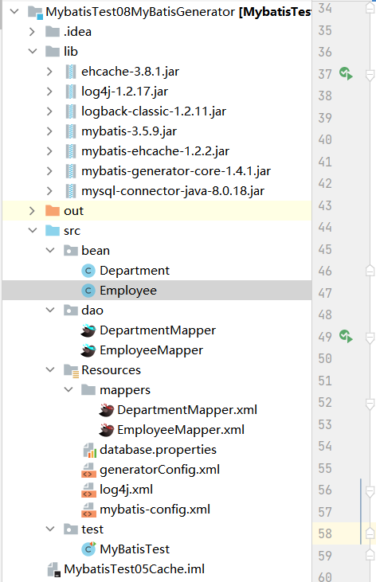


# 九、MyBatis-工作原理


- 框架分层架构：

  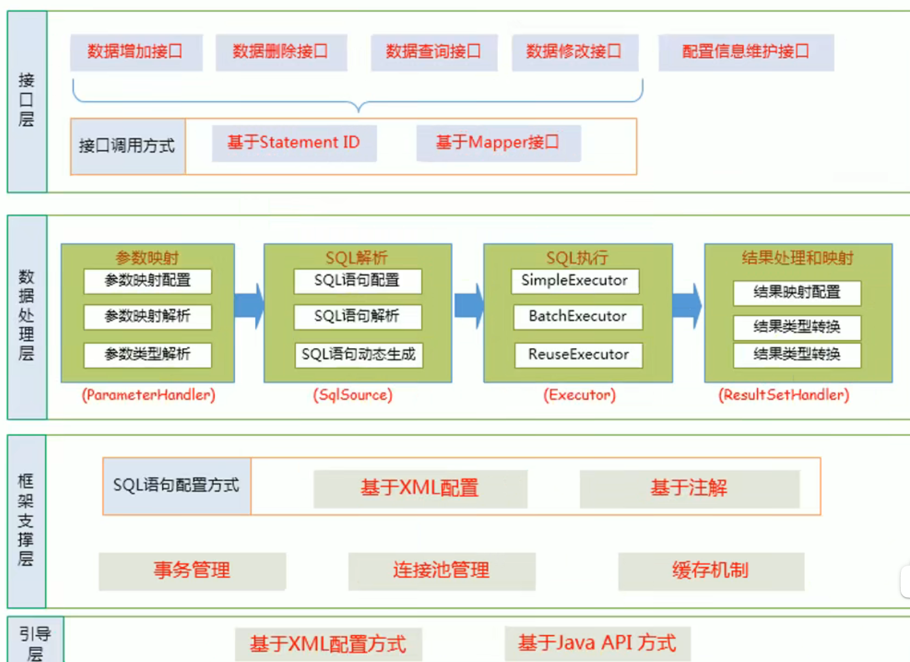

- 以HelloWorld项目为例去分析运行过程：

  ```java
   @Test
      public void test() throws IOException {
          // 1. 根据xml配置文件（全局配置文件）创建一个SqlSessionFactory对象
          String resource = "mybatis-config.xml";
          InputStream inputStream = Resources.getResourceAsStream(resource);
          SqlSessionFactory sqlSessionFactory = new SqlSessionFactoryBuilder().build(inputStream);
  
          // 2. 从SqlSessionFactory中获取SqlSession实例，SqlSession可以执行已经映射的Sql语句
          SqlSession session = sqlSessionFactory.openSession();
  
          try {
              // 3. 获得Mapper代理对象
               EmployeeMapper mapper = session.getMapper(EmployeeMapper.class);
              // 4. 通过mapper代理对象去执行查询方法获得数据对象
              Employee employee = mapper.selectByPrimaryKey(1);
              System.out.println(employee);
          }finally {
              session.close();
          }
      }
  ```

  


## SqlSessionFactory的初始化过程

- 主要代码：

  ```java
   // 1. 根据xml配置文件（全局配置文件）创建一个SqlSessionFactory对象
          String resource = "mybatis-config.xml";
          InputStream inputStream = Resources.getResourceAsStream(resource);
          SqlSessionFactory sqlSessionFactory = new SqlSessionFactoryBuilder().build(inputStream);
  ```

  

- 运行流程图（流程图的源码）：

  ```sequence
  SqlSessionFactoryBuilder->SqlSessionFactoryBuilder: 1. 创建sqlSessionFactory对象
  SqlSessionFactoryBuilder->XmlConfigBuilder:2. build(inputStream)
  XmlConfigBuilder->XmlConfigBuilder: 3. 创建解析器parser
  XmlConfigBuilder->Configuration: 4. 解析全局配置文件中的每一个标签，\n把详细信息保存在Configuration中
  Configuration-->XmlConfigBuilder: 4返回
  XmlConfigBuilder->Configuration: 5. 解析mapper.xml
  Note right of XmlConfigBuilder: 将Mapper.xml中的每一个元素信息解析出来\n并保存在全局配置Configuration中,\n并将其中的每一个增删改查标签每一个属性都解析出来\n封装成MappedStatement：\n一个mappedStatement就代表一个增删改查标签的详细信息
  Note right of Configuration: Configuration保存了全局配置文件和\nmapper映射文件的所有配置信息，包括sql语句。
  Configuration-->XmlConfigBuilder:6.返回了封装了所有配置信息的Configuration
  XmlConfigBuilder->DefaultSqlSessionFactory:7. build(Configuration)
  DefaultSqlSessionFactory->DefaultSqlSessionFactory:new DefaultSqlSessionFactory()
  DefaultSqlSessionFactory-->SqlSessionFactoryBuilder:9. 返回创建的DefaultSqlSessionFactory,包含了保存全局配置信息的Configuration
  ```

- 运行流程图

  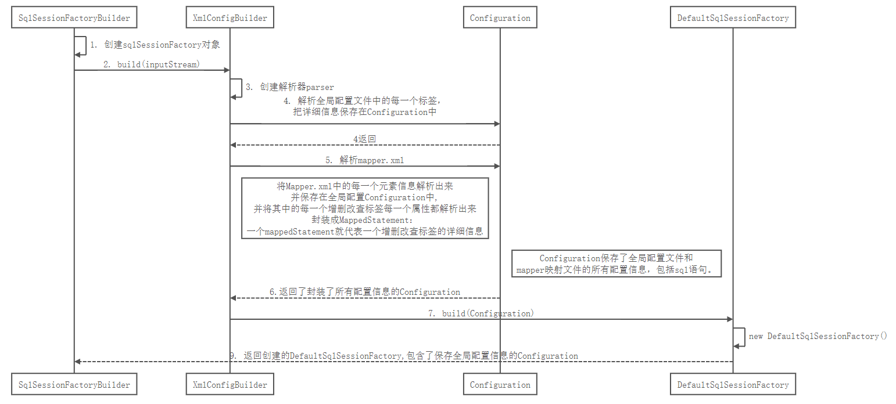

- SqlSessionFactory的初始化过程总结：

  - 把配置文件（全局配置文件、mapper映射文件中的信息解析并保存在Configuration对象中，返回并包含了Configuration对象的DefaultSqlSessionFatory对象。
  - Configuration中存放有MappedStatement，一条MappedStatement代表mapper映射文件中的一个增删改查标签的详细信息（包括sql语句）。

## openSession获取SqlSession对象的过程

- 主要代码

  ```java
   // 2. 从SqlSessionFactory中获取SqlSession实例，SqlSession可以执行已经映射的Sql语句
          SqlSession session = sqlSessionFactory.openSession();
  ```

- 运行流程图（流程图的源码）：

```sequence
Note right of sqlSessionFactory: SqlSessionFactory\n的类型为\nDefaultSqlSessionFactory
sqlSessionFactory->sqlSessionFactory:1. openSession()
sqlSessionFactory->Configuration:2. openSessionFromDataSource()
Configuration->Configuration:3. 获取一些信息，创建tx
Configuration-->sqlSessionFactory:返回tx
Configuration->Configuration.Executor():4. new Executor(tx,执行器类型)
Note right of Configuration.Executor(): Executor对象是用来执行增删改查等方法的  
Configuration.Executor()->Configuration.Executor(): 5.根据Executor在全局配置文件中的类型，\n创建出Simple|Reuse|Batch Executor
Configuration.Executor()->Configuration.Executor(): 6. 如果有二级缓存配置开启，\n创建CachingExecutor(executor)\n包装一下执行器executor
Configuration.Executor()->Configuration.Executor(): 7. (Executor)interceptorChain.pluginAll(executor);\n使用每一个拦截器重新包装executor
Configuration.Executor()-->sqlSessionFactory:8. 返回executor对象
sqlSessionFactory->DefaultSqlSession:9.new DefaultSqlSession(configuration,executor, autoCommit)
DefaultSqlSession-->sqlSessionFactory: 10.获得SqlSession对象（DefaultSqlSession）
```

- 运行流程图：

  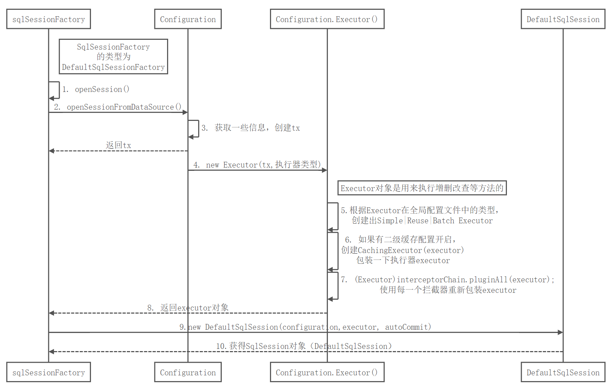

- openSession获取SqlSession对象总结：
  - 返回SqlSession的实现类DefaultSqlSession对象。该对象中包含Executor和Configuration。
  - Executor在这一步会被创建。

## getMapper获取Mapper接口的代理对象的过程

- 主要代码

  ```java
  // 3. 获得Mapper代理对象
               EmployeeMapper mapper = session.getMapper(EmployeeMapper.class);
  ```

- 运行流程图（流程图的源码）：

  ```sequence
  DefaultSqlSession->Configuration:1. getMapper(Mapper.class)
  Note right of Configuration:Configuration对象在初始化后存放有\nmapperRegitry对象，\n而在MapperRigistry中有一个Map knownMapper,\nknownMapper中存放有\n每一个mapper对应的代理对象工厂
  Configuration->MapperRegistry:2. getMapper(Mapper.class, sqlSession)
  MapperRegistry->MapperRegistry:3. getMapper(Mapper.class, sqlSession)
  MapperRegistry->MapperProxyFactory: 4. 根据接口类型获取MapperProxyFactory：\nknownMapper.get(Mapper.class);
  MapperProxyFactory->MapperProxyFactory:5. newInstance(sqlSession)
  MapperProxyFactory->MapperProxy:6. 创建MapperProxy对象，\n它是一个能用来创建动态代理的InvocationHandler
  MapperProxy-->MapperProxyFactory: 返回new MapperProxy对象
  MapperProxyFactory->Proxy:7. 使用Proxy类创建Mapper的代理对象：\nProxy.newProxyInstance(classLoader, mapper接口，mapperProxy)
  Proxy-->DefaultSqlSession:获得Mapper的代理对象
  ```

  > java动态代理机制中有两个重要的类和接口InvocationHandler（接口）和Proxy（类），这一个类Proxy和接口InvocationHandler是我们实现动态代理的核心；
  >
  > 1. **InvocationHandler接口是proxy代理实例的调用处理程序实现的一个接口，每一个proxy代理实例都有一个关联的调用处理程序；在代理实例调用方法时，方法调用被编码分派到调用处理程序的invoke方法。**
  >
  >    每一个动态代理类的调用处理程序都必须实现InvocationHandler接口，并且每个代理类的实例都关联到了实现该接口的动态代理类调用处理程序中，当我们通过动态代理对象调用一个方法时候，这个方法的调用就会被转发到实现InvocationHandler接口类的invoke方法来调用。
  >
  > 2. **Proxy类就是用来创建一个代理对象的类，它提供了很多方法，但是我们最常用的是newProxyInstance方法。**
  >
  > 在Spring中的两大核心IOC和AOP中的AOP(面向切面编程)的思想就是动态代理，在代理类的前面和后面加上不同的切面组成面向切面编程。
  >
  > ------------------------------------------------
  > 版权声明：本文为CSDN博主「艾米莉Emily」的原创文章，遵循CC 4.0 BY-SA版权协议，转载请附上原文出处链接及本声明。
  > 原文链接：https://blog.csdn.net/yaomingyang/article/details/80981004

- 运行流程图：

  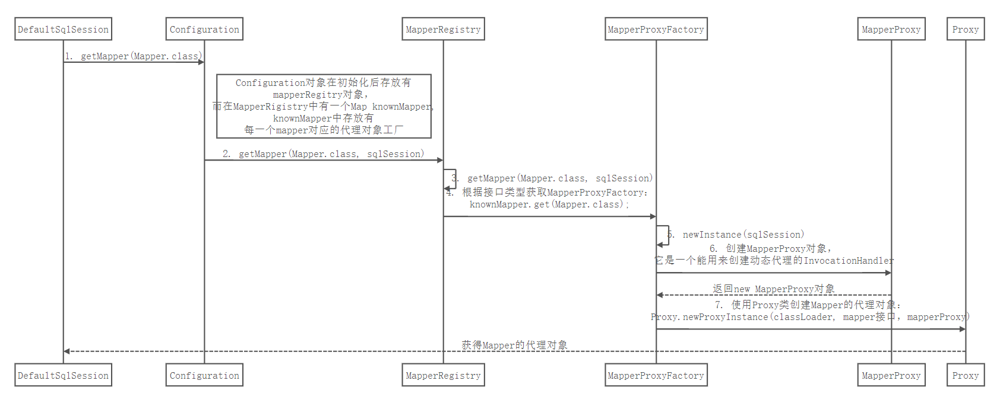

- 总结：

  - Configuration类在sqlSessionFactory初始化过程中，就已将每个Mapper对应的代理对象工厂准备好。
  - 创建代理对象实际就是使用类Proxy和接口InvocationHandler实现动态代理的过程。
  - Mapper代理对象中包含有mapper的接口、sqlSession（DefaultSqlSession），而DefaultSqlSession对象中包含Executor和Configuration。

## 查询的过程

- 主要代码：

  ```java
    // 4. 通过mapper代理对象去执行查询方法获得数据对象
              Employee employee = mapper.selectByPrimaryKey(1);
  ```

- 运行流程图（流程图的源码）：

  1. 参数的转换过程：

     ```sequence
     方法调用->MapperProxy:1. 使用代理实现类的\ninvoke()去执行\nselectByPrimaryKey(1)
     MapperProxy->MapperMethod:2. 调用MapperMethod\n.execute(\nsqlsession,\n args)
     MapperMethod->MapperMethod:3. 判断sql类型（增|删|改|查）
     Note right of method: method对象类型为\nMapperMethod的内部类\nMethodSignature
     MapperMethod->method: 4. 判断sql的返回类型\n(空|多个|Map|游标|其它)
     method-->MapperMethod: 返回sql语句返回值的各种类型的判断
     Note right of MapperMethod:
     MapperMethod->method: 5. 返回类型为其它时：先进行参数的转换\nconvertArgsToSqlCommandParam(args)
     method->ParamNameResolver.getNameParams(): 7. 使用参数名解析器\n进行参数转换\nparamNameResolver\n.getNameParams(args)
     ParamNameResolver.getNameParams()->ParamNameResolver.getNameParams(): 如果参数为空，直接返回
     Note right of ParamNameResolver.getNameParams():
     ParamNameResolver.getNameParams()->ParamNameResolver.wrapToMapIfCollection(): 如果未使用参数注解、且参数仅有一个，\n直接取出args中第一个参数:\n 判断该参数是否是Collection或数组类型
     
     ParamNameResolver.wrapToMapIfCollection()->ParamNameResolver.wrapToMapIfCollection():如果该参数是Collection类型的，\n以"collection"为key、参数对象为value包装进map；\n如果同时还是List类型的，\n额外再以"list"为key、参数对象为value加进map。
     ParamNameResolver.wrapToMapIfCollection()->ParamNameResolver.wrapToMapIfCollection():如果该参数是数组类型的，\n以"array"为key、参数对象为value加进map。
     ParamNameResolver.wrapToMapIfCollection()->ParamNameResolver.wrapToMapIfCollection():不是Collection也不是数组，直接返回参数对象，\n不用包装成map。
     ParamNameResolver.wrapToMapIfCollection()-->ParamNameResolver.getNameParams():返回原参数对象，或者返回将集合或数组包装好了的map
     
     ParamNameResolver.getNameParams()->ParamNameResolver.getNameParams(): 其他情况：参数包装进Map：\n对于每个参数：\n先以["arg"+下标0]为key\n(如果有注解就是注解），参数对象为value包装进map；\n再以["param"+序号1]为键、参数对象为value包装进map。
     ParamNameResolver.getNameParams()-->MapperMethod:返回原参数对象或者已包装为map的参数集合赋值给param。
     MapperMethod->DefaultSqlSession:8.sqlSession.selectOne(command.getName(), param)
     DefaultSqlSession-->MapperMethod:返回selectList所查询得到的list中的第一个元素
     MapperMethod-->方法调用:返回查询结果
     ```

     

  2. 数据查询过程（接上面的参数转换过程）：

  ```sequence
  
  Note right of MapperMethod:参数转换过程详见步骤1
  
  MapperMethod->DefaultSqlSession:8.sqlSession.selectOne(\ncommand.getName(), param)
  Note right of MapperMethod:步骤2的数据查询由此开始
  DefaultSqlSession->DefaultSqlSession:9. selectList()\n
  DefaultSqlSession->Configuration:configuration\n.getMappedStatement(statement)
  Configuration-->DefaultSqlSession:10.从Configuration对象中\n获得MappedStatement
  
  
  DefaultSqlSession->Executor:11.执行sql语句 executor.query(ms,\n wrapCollection(parameter),rowBounds,handler)
  Note right of DefaultSqlSession: 这里的wrapCollection()\n也就是ParamNameResolver\n.wrapToMapIfCollection()
  Executor->Executor:12.从MappedStatement中获得BoundSql，\n其中包含sql语句、\n语句中?参数的映射等\nsql语句的详细信息
  Executor->Executor:13.（CachingExecutor）\n创建一个缓存key
  Note right of Executor:.
  Executor->SimpleExecutor:14.executor.query():\n先检查一下二级缓存是否有，\n没有再调delegate\n[其实就是SimpleExecutor]\n的query()方法去查询
  
  SimpleExecutor->SimpleExecutor:15.先看本地（一级）缓存中\n有没有这个数据，\n没有的话再调用\nqueryFromDatabase()\n从数据库中查询数据\n查出后又保存在本地缓存中。
  Note right of SimpleExecutor:.
  SimpleExecutor->BaseExecutor:16.doQuery()
  Note right of StatementHandler: StatementHandler可以创建出Statement对象
  BaseExecutor->StatementHandler:17.创建StatementHandler,\n PreparedStatementHandler
  StatementHandler->StatementHandler:18. (StatementHandler)interceptorChain\n.pluginAll(statementHandler)\n使用每一个拦截器\n重新包装StatementHandler
  StatementHandler->StatementHandler:19.创建ParameterHandler：\ninterceptorChain.\n pluginAll(parameterHandler)
  StatementHandler->StatementHandler:20.创建ResultSetHandler：\ninterceptorChain.\n pluginAll(resultSetHandler)
  StatementHandler->StatementHandler:21.预编译sql产生\n preparedStatement对象
  StatementHandler->StatementHandler:22.调用ParameterHandler设置参数
  StatementHandler->StatementHandler:23.调用TypeHandler给sql预编译设置参数
  StatementHandler->StatementHandler:24.查出数据后使用resultSetHandler封装结果;\n使用TypeHandler获取value值
  StatementHandler-->DefaultSqlSession:25. 返回结果，关闭相关连接。
  DefaultSqlSession-->MapperMethod:26.返回selectList所查询得到的list中的第一个元素
  
  ```

- 运行流程图：

  1. 参数转换过程：

     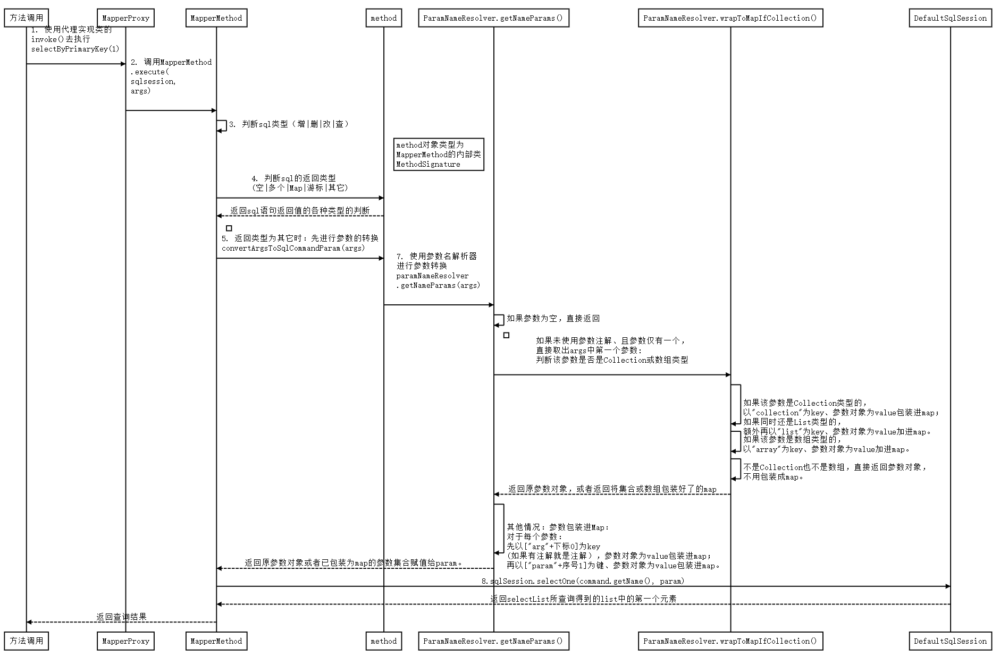

     
  
  2. 数据查询过程：
  
     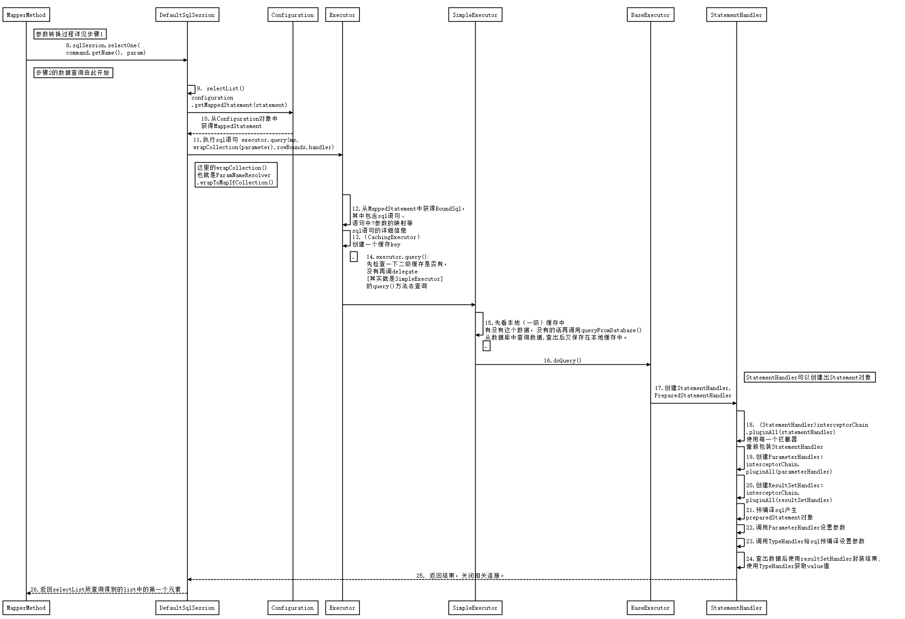
  
- 总结：

  - 代理对象使用了DefaultSqlSession进行增删改查，而DefaultSqlSession使用的是Executor进行增删改查。
  - Executor使用StatementHandler处理sql语句预编译、设置参数等工作。
  - StatementHandler创建出ParameterHandler和ResultSetHandler。主要使用ParameterHandler设置预编译参数，而使用ResultSet处理查询后的结果。在整个过程中，这俩Handler都会使用一个TypeHandler进行数据库类型和JavaBean类型的映射。
  - 以上最终都会使用原生的JDBC操作，如Statement、PreparedStatement。

## 流程小结

1. 根据配置文件（全局，sql映射）初始化出Configuration对象；
2. 创建一个DefaultSqlSession对象，里面包含Configuration以及Executor（根据全局配置文件中的defaultExecutorType创建出对应的Executor）；
3. DefaultSqlSession.getMapper()：拿到Mapper接口对应的MapperProxy；
4. MapperProxy里面有DefaultSqlSession；
5. 执行增删改查方法：
   - 调用DefaultSqlSession的增删改查（最终调用Executor）；
   - Executor最终会创建一个StatementHandler对象.(同时也会创建出ParameterHandler和ResultSetHandler对象)
   - 调用StatementHandler中的ParameterHandler进行预编译参数以及设置参数值；
   - 调用StatementHandler的增删改查方法；
   - 使用ResultSetHandler封装查询结果；

- 注意：四大对象（Executor、StatementHandler、ParameterHandler、ResultSetHandler）每个创建的时候都有一个interceptorChain.pluginAll()。


# 十、MyBatis-插件开发

## 概述

- MyBatis在四大对象的创建过程中，都会有插件进行介入。插件可以利用动态代理机制一层层的包装目标对象，而实现在目标对象执行目标方法之前进行拦截的效果。
- MyBatis 允许在已映射语句执行过程中的某一点进行拦截调用。
- 插件机制，我们可以使用插件为四大对象创建一个代理对象，代理对象可以拦截到四大对象的每一个执行，在目标对象执行的前后可以先执行我们自定义的方法，即AOP面向切面的过程。
- 默认情况下，MyBatis 允许使用插件来拦截的方法调用包括：
  - Executor(update, query, flushStatements, commit, rollback, getTransaction, close, isClosed)
  - ParameterHandler(getParameterObject, setParameters)
  - ResultSetHandler(handleResultSets, handleOutputParameters)
  - StatementHandler(prepare, parameterize, batch, update, query)

## 插件编写步骤

- 编写插件的实现类，实现Interceptor接口；

- 使用@Intercepts注解完成插件签名；

  ```java
  package dao;
  
  import org.apache.ibatis.executor.statement.StatementHandler;
  import org.apache.ibatis.plugin.*;
  
  import java.util.Properties;
  
  // 完成插件的签名：告诉MyBatis当前插件用来拦截哪个对象的哪个方法
  @Intercepts(
          {
                  /*
                   * type: 拦截四大对象的哪一个类型
                   * method:拦截对象中的哪一个方法
                   * args：拦截的方法可能有重载，需要参数来确定哪个方法
                   * */
                  @Signature(type = StatementHandler.class, method = "parameterize", args = java.sql.Statement.class)
          }
  )
  public class MyFirstPlugin implements Interceptor {
  
      /**
       * interceptor:拦截
       *      拦截目标对象的目标方法的执行
       */
      @Override
      public Object intercept(Invocation invocation) throws Throwable {
          System.out.println("myFirstPlugin...intercept:"+ invocation);
          // 执行目标方法
          Object proceed = invocation.proceed();
  
          // 返回执行后的返回值
          return proceed;
      }
  
      /**
       *plugin: 包装目标对象
       * 包装：为目标对象创建一个代理对象
       */
      @Override
      public Object plugin(Object target) {
          // 我们可以借助Plugin的wrap方法来使用当前Interceptor包装我们目标对象
          System.out.println("myFirstPlugin...plugin:将要包装的对象"+ target);
          Object wrap = Plugin.wrap(target, this);
          // 返回当前target创建的动态代理
          return wrap;
      }
  
      /**
       * setProperties:
       * 将插件注册时的property属性设置进来
       */
      @Override
      public void setProperties(Properties properties) {
          System.out.println("插件配置信息："+ properties);
      }
  }
  
  ```

- 在全局配置文件中注册插件：

  ```xml
  <?xml version="1.0" encoding="UTF-8" ?>
  <!DOCTYPE configuration
          PUBLIC "-//mybatis.org//DTD Config 3.0//EN"
          "http://mybatis.org/dtd/mybatis-3-config.dtd">
  <configuration>
  
  
      <!--引入外部properties文件-->
      <properties resource="database.properties"></properties>
  
      <settings>
          <!--将表中字段的下划线自动转换为驼峰-->
          <setting name="mapUnderscoreToCamelCase" value="True"/>
          <!--设置延迟加载-->
          <setting name="lazyLoadingEnabled" value="true"/>
          <setting name="aggressiveLazyLoading" value="true"/>
      </settings>
  
      <!--类型别名：为java的类型起一个简短的别名，避免冗余的全类名-->
      <typeAliases>
          <typeAlias type="bean.Employee" alias="Employee"/>
          <!--package会为该包下的所有类赋予默认别名-->
          <!--<package name="bean" />-->
      </typeAliases>
  
      <!--注册插件-->
      <plugins>
          <plugin interceptor="dao.MyFirstPlugin">
              <property name="username" value="root"/>
          </plugin>
      </plugins>
  
      <environments default="development">
  
          <environment id="development">
              <!--environment 元素体中包含了事务管理和连接池的配置。-->
              <transactionManager type="JDBC"/>
              <dataSource type="POOLED">
                  <property name="driver" value="${jdbc.driver}"/>
                  <property name="url" value="${jdbc.url}"/>
                  <property name="username" value="${jdbc.username}"/>
                  <property name="password" value="${jdbc.password}"/>
              </dataSource>
          </environment>
      </environments>
  
      <mappers>
          <!--mappers 元素则包含了一组映射器（mapper），这些映射器的 XML 映射文件包含了 SQL 代码和映射定义信息。-->
          <mapper resource="mappers/EmployeeMapper.xml"/>
  
      </mappers>
  
  
  </configuration>
  ```

## 插件原理

- 按照插件注解声明，按照插件配置顺序调用插件plugin方法，生成被拦截对象的动态代理

- 多个插件依次生成目标对象的代理对象，层层包裹，先声明的先包裹；形成代理链

- 目标方法执行时依次从外到内执行插件的intercept方法。

  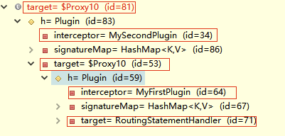

- 多个插件情况下，我们往往需要在某个插件中分离出目标对象。可以借助MyBatis提供的SystemMetaObject类来进行获取最后一层的h以及target属性的值

- 常用代码：

  ```java
  //1、分离代理对象。由于会形成多次代理，所以需要通过一个while循环分离出最终被代理对象，从而方便提取信息
  MetaObject metaObject = SystemMetaObject.forObject(target);
  while(metaObject.hasGetter("h")) {
  Object h = metaObject.getValue("h");
  metaObject = SystemMetaObject.forObject(h);
  }
  //2、获取到代理对象中包含的被代理的真实对象
  Object obj = metaObject.getValue("target");
  
  //3、获取被代理对象的MetaObject方便进行信息提取
  MetaObject forObject = SystemMetaObject.forObject(obj);
  ```

## 例子：改变sql运行的参数

-  改变一下sql运行的参数：以前是1号员工，现在查5号员工

```java
@Override
public Object intercept(Invocation invocation) throws Throwable {
    System.out.println("myFirstPlugin...intercept:"+ invocation);
    // 偷梁换柱
    // 动态地改变一下sql运行的参数：以前是1号员工，现在查5号员工
    // 拦截到的对象：
    Object target = invocation.getTarget();
    System.out.println("当前拦截到的对象："+ invocation.getTarget());

    // 仅需拿到StatementHandler==》ParameterHandler==>ParameterObject

    // 可通过SystemMetaObject的forObject(target)拿到target的元数据
    MetaObject metaObject = SystemMetaObject.forObject(target);
    Object value = metaObject.getValue("parameterHandler.parameterObject");
    System.out.println("sql语句中用到的参数是："+value);
    // 修改该值
    metaObject.setValue("parameterHandler.parameterObject", 5);

    // 执行目标方法
    Object proceed = invocation.proceed();
    System.out.println("myFirstPlugin...intercept之后:"+ invocation);
    // 返回执行后的返回值
    return proceed;
}
```


# 扩展：MyBatis实用场景

## PageHelper插件进行分页

- 官方参考文档https://github.com/pagehelper/Mybatis-PageHelper/blob/master/README_zh.md

- 使用步骤：

  1. 导入相关包pagehelper.jar和jsqlparser.jar

  2. 配置插件：

     ```xml
     <plugins>
     <!--设置分页插件-->
     <plugin interceptor="com.github.pagehelper.PageInterceptor"></plugin>
     </plugins>
     ```

  3. 分页插件的简单使用：

     ```java
         @Test
         public void test3() throws IOException {
             SqlSessionFactory sqlSessionFactory = getSqlSessionFactory();
             SqlSession sqlSession = sqlSessionFactory.openSession();
             try {
                 EmployeeMapper mapper = sqlSession.getMapper(EmployeeMapper.class);
                 // 第1页，每页2条数据
                 Page<Object> page = PageHelper.startPage(2, 2);
                 List<Employee> employees = mapper.selectAll();
                 for (Employee employee : employees) {
                     System.out.println(employee);
                 }
                 System.out.println("当前页码："+page.getPageNum());
                 System.out.println("总记录数："+ page.getTotal());
                 System.out.println("每页显示："+ page.getPageSize());
                 System.out.println("总页码：" + page.getPages());
             }finally {
                 sqlSession.close();
             }
         }
     ```

- 例子：

  - 例1：

    ```java
    //获取第1页，10条内容，默认查询总数count
    PageHelper.startPage(1, 10);
    //紧跟着的第一个select方法会被分页
    List<User> list = userMapper.selectIf(1);
    assertEquals(2, list.get(0).getId());
    assertEquals(10, list.size());
    //分页时，实际返回的结果list类型是Page<E>，如果想取出分页信息，需要强制转换为Page<E>
    assertEquals(182, ((Page) list).getTotal());
    ```

  - 例2：

    ```java
    //获取第1页，10条内容，默认查询总数count
    PageHelper.startPage(1, 10);
    List<User> list = userMapper.selectAll();
    //用PageInfo对结果进行包装
    PageInfo page = new PageInfo(list);
    //测试PageInfo全部属性
    //PageInfo包含了非常全面的分页属性
    assertEquals(1, page.getPageNum());
    assertEquals(10, page.getPageSize());
    assertEquals(1, page.getStartRow());
    assertEquals(10, page.getEndRow());
    assertEquals(183, page.getTotal());
    assertEquals(19, page.getPages());
    assertEquals(1, page.getFirstPage());
    assertEquals(8, page.getLastPage());
    assertEquals(true, page.isFirstPage());
    assertEquals(false, page.isLastPage());
    assertEquals(false, page.isHasPreviousPage());
    assertEquals(true, page.isHasNextPage());
    ```

  - 例3：可以获得在页面显示时的页码导航(免去繁琐的计算)：

    ```java
    // navigatePages为页面上需要连续显示的页码数量，比如5
    PageInfo<T> pageInfo = new PageInfo<>(List<T> list, int navigatePages);
    int[] nums = pageInfo.getNavigatepageNums();
    ```


## 批量操作BatchExecutor

- 默认的`openSession()`方法没有参数,它会创建有如下特性的

  - 会开启一个事务(也就是不自动提交)
  - 连接对象会从由活动环境配置的数据源实例得到。
  - 事务隔离级别将会使用驱动或数据源的默认设置。
  - 预处理语句不会被复用,也不会批量处理更新。

  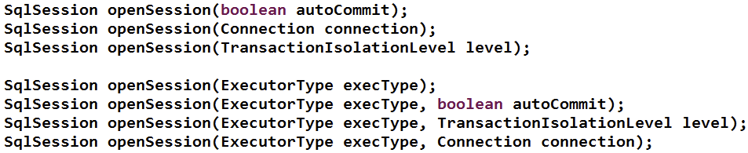

- `openSession `方法的`ExecutorType`类型的参数为枚举类型:

  - `ExecutorType.SIMPLE`: 这个执行器类型不做特殊的事情（这是默认装配的）。它为每个语句的执行创建一个新的预处理语句。
  - `ExecutorType.REUSE`: 这个执行器类型会复用预处理语句。
  - `ExecutorType.BATCH`: 这个执行器会批量执行所有更新语句。

- 批量操作我们是使用MyBatis提供的BatchExecutor进行的，他的底层就是**通过jdbc攒sql的方式**进行的。我们可以让他**攒够一定数量后发给数据库**一次。

  ```java
  public void test01() {
      SqlSession openSession = build.openSession(ExecutorType.BATCH);
      UserDao mapper = openSession.getMapper(UserDao.class);
      longstart = System.currentTimeMillis();
      for(int i = 0; i < 100000; i++) {
          String name = UUID.randomUUID().toString().substring(0, 5);
          mapper.addUser(newUser(null, name, 13));
      }
      openSession.commit();
      openSession.close();
      longend = System.currentTimeMillis();
      System.out.println("耗时时间："+(end-start));
  }
  ```

- 与Spring整合中，我们推荐，额外的配置一个可以专门用来执行批量操作的sqlSession

  ```xml
  <bean id="sqlSession" class="org.mybatis.spring.SqlSessionTemplate">		
      <constructor-arg name="sqlSessionFactory" ref="sqlSessionFactoryBean"></constructor-arg>
      <constructor-arg name="executorType" value= "BATCH"></constructor-arg></bean>
  ```

  - 需要用到批量操作的时候，我们可以注入配置的这个批量SqlSession。通过他获取到mapper映射器进行操作。

- 注意：

  - 批量操作是在`session.commit()`以后才发送sql语句给数据库进行执行的
  - 如果我们想让其提前执行，以方便后续可能的查询操作获取数据，我们可以使用`sqlSession.flushStatements()`方法，让其直接冲刷到数据库进行执行。

## 存储过程

- 实际开发中，我们通常也会写一些存储过程，MyBatis也支持对存储过程的调用。

  > 存储过程（Stored Procedure）是在大型数据库系统中，一组为了完成特定功能的SQL 语句集，它存储在数据库中，一次编译后永久有效，用户通过指定存储过程的名字并给出参数（如果该存储过程带有参数）来执行它。存储过程是数据库中的一个重要对象。在数据量特别庞大的情况下利用存储过程能达到倍速的效率提升。

- 存储过程的调用：

  - select标签中`statementType="CALLABLE"`
  - 标签体中调用语法：
    `{call procedure_name(#{param1_info},#{param2_info})}`

- **游标处理**:MyBatis对存储过程的游标提供了一个JdbcType=CURSOR的支持，可以智能的把游标读取到的数据，映射到我们声明的结果集中。

- 例子：

  - 数据库中定义的存储过程：

    ```sql
    create or replace procedure 
    hello_test(p_start in int,
               p_end in int,
               p_count out int,
               ref_cur out sys_refcursor) AS 
    BEGIN 
    	select count (*) into p_count from emp;
    	open ref_cur for 
    		select * from (select e.*, rownum as r1 from emp e where rownum<p_end) where r1>p_start;
    END hello_test;
    ```

  - 存储过程相关的bean类：

    ```java
    public class PageEmp {
        privateintstart;
        privateintend;
        privateintcount;
        privateList<Emp> emps;
        //...
    }
    ```

  - mapper:

    ```xml
    <resultMap type="bean.Employee" id="TestEmp">
        <id column= "id" property="id"/>
        <result column="last_name" property="LastName"/>
    </resultMap>
    <select id= "getPage" parameterType="PageEmp" statementType= "CALLABLE" databaseId= "oracle">
        {call PAGE_EMP(
        #{start, mode=IN,jdbcType=INTEGER},
        #{end, mode=IN, jdbcType=INTEGER},
        #{count, mode=OUT, jdbcType=INTEGER},
        #{emps, mode=OUT, jdbcType=CURSOR, javaType=ResultSet, resultMap=TestEmp }
    </select>
    ```

## 自定义类型处理器TypeHandler处理枚举

- 我们可以通过自定义TypeHandler的形式来在设置参数或者取出结果集的时候自定义参数封装策略。

- 步骤：

  - 一个代表员工状态的枚举类

    ```java
    package bean;
    
    public enum EmpStatus{
        WORKING(100, "工作中"),
        MEETING(200, "开会中"),
        VOCATION(300, "休假中");
    
        private Integer code;
        private String msg;
        private EmpStatus(Integer code, String msg){
            this.code = code;
            this.msg = msg;
        }
    
        public Integer getCode() {
            return code;
        }
    
        public void setCode(Integer code) {
            this.code = code;
        }
    
        public String getMsg() {
            return msg;
        }
    
        public void setMsg(String msg) {
            this.msg = msg;
        }
    
        public static EmpStatus getStatusByCode(int code){
            switch (code){
                case 100:
                    return WORKING;
                case 200:
                    return MEETING;
                case 300:
                    return VOCATION;
                default:
                    return null;
            }
        }
    }
    
    ```

  - 全局配置文件:

    ```xml
        <typeHandlers>
            <!--配置自定义类型处理器-->
            <typeHandler handler="dao.MyEnumEmpStatusTypeHandler" javaType="bean.EmpStatus"/>
        </typeHandlers>
    ```

    - 也可以在mapper中单独配置：

      ```xml
      <insert id= "addDept">
          insert into employee (emp_name，status) values (
          #{empName}， 
          #{EmpStatus， typeHandler=dao.MyEnumEmpStatusTypeHandler}
          )
      </insert>
      ```

      

  - 自定义TypeHandler：实现TypeHandler接口或者继承BaseTypeHandler：

    ```java
    package dao;
    
    import bean.EmpStatus;
    import org.apache.ibatis.type.JdbcType;
    import org.apache.ibatis.type.TypeHandler;
    
    import java.sql.CallableStatement;
    import java.sql.PreparedStatement;
    import java.sql.ResultSet;
    import java.sql.SQLException;
    
    public class MyEnumEmpStatusTypeHandler implements TypeHandler<EmpStatus> {
    
    
        /**
         * 定义当前数据如何保存到数据库中
         */
        @Override
        public void setParameter(PreparedStatement ps, int i, EmpStatus parameter, JdbcType jdbcType) throws SQLException {
            ps.setString(i, parameter.getCode().toString());
        }
    
        /**
         * getResult()定义从数据库的数据到对象如何生成
         */
        @Override
        public EmpStatus getResult(ResultSet rs, String columnName) throws SQLException {
            int code = rs.getInt(columnName);
            return EmpStatus.getStatusByCode(code);
        }
    
        @Override
        public EmpStatus getResult(ResultSet rs, int columnIndex) throws SQLException {
            int code = rs.getInt(columnIndex);
            return EmpStatus.getStatusByCode(code);
        }
    
        @Override
        public EmpStatus getResult(CallableStatement cs, int columnIndex) throws SQLException {
            int code = cs.getInt(columnIndex);
            return EmpStatus.getStatusByCode(code);
        }
    }
    
    ```

    

    
