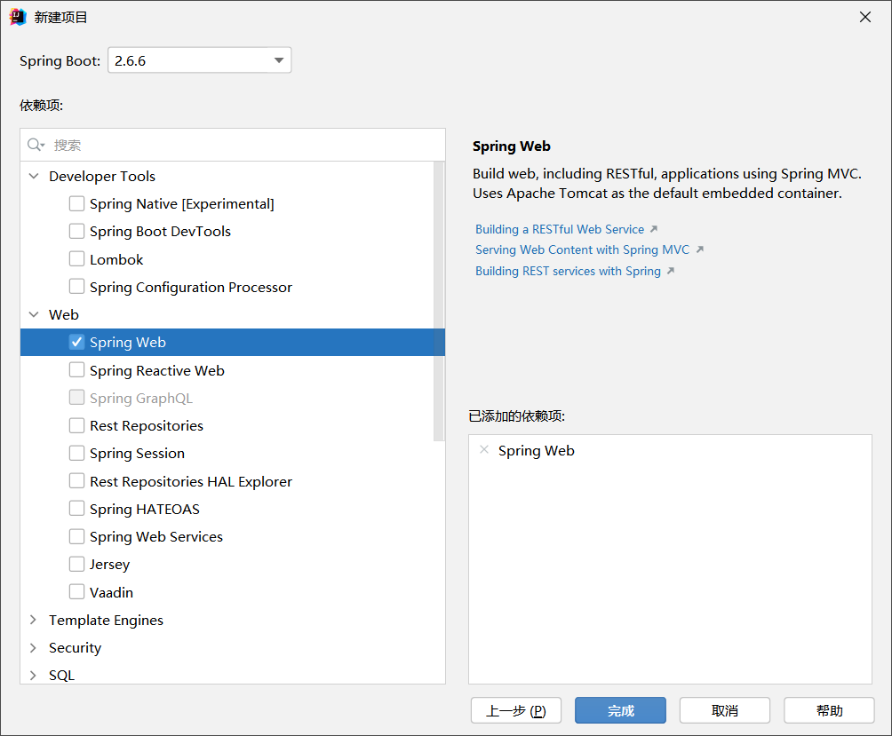

# 一、SpringBoot概述

## SpringBoot概述

- SpringBoot 提供了一种快速使用 Spring 的方式 ，基于约定优于配置的思想，可以让开发人员不必在配置与逻辑业务之间进行思维的切换，全身心的投入到逻辑业务的代码编写中，从而大大提高了开发的效率，一定程度上缩短了项目周期。 2014 年 4 月， Spring Boot 1.0.0 发布。 Spring 的顶级项目之一 (https://spring.io )

## Spring缺点

- **配置繁琐**：

  虽然 Spring 的组件代码是轻量级的，但它的配置却是重量级的。一开始， Spring 用 XML 配置，而且是很多
  XML 配置。 Spring 2.5 引入了基于注解的组件扫描，这消除了大量针对应用程序自身组件的显式 XML 配置。
  Spring 3.0 引入了基于 Java 的配置，这是一种类型安全的可重构配置方式，可以代替 XML。所有这些配置都代表了开发时的损耗。因为在思考Spring 特性配置和解决业务问题之间需要进行思维切换，所以**编写配置挤占了编写应用程序逻辑的时间**。和所有框架一样， Spring 实用，但它要求的回报也不少。

- **依赖繁琐**：

  项目的依赖管理也是一件耗时耗力的事情。在环境搭建时，需要分析要导入哪些库的坐标，而且还需要分析导入与之有依赖关系的其他库的坐标，一旦选错了依赖的版本，随之而来的不兼容问题就会严重阻碍项目的开发进度。

## SpringBoot功能

- **自动配置：**

  Spring Boot的自动配置是一个运行时（更准确地说，是应用程序启动时）的过程，考虑了众多因素，才决定Spring 配置应该用哪个，不该用哪个。该过程是 SpringBoot 自动完成的。

- **起步依赖：**

  起步依赖本质上是一个Maven 项目对象模型（ Project Object Model,POM ），定义了对其他库的**传递依赖**，这些东西加在一起即支持某项功能。简单的说，起步依赖就是将具备某种功能的坐标打包到一起，并提供一些默认的功能。

- **辅助功能：**（内置服务器，……）

  提供了一些大型项目中常见的非功能性特性，如嵌入式服务器、安全、指标，健康检测、外部配置等。

- **SpringBoot并不是对 Spring 功能上的增强，而是提供了一种快速使用 Spring 的方式。**


# 二、SpringBoot HelloWorld


- 官方文档：https://docs.spring.io/spring-boot/docs/current/reference/htmlsingle/#getting-started.installing
- 需求：搭建SpringBoot 工程，定义 HelloController.hello 方法，返回 ”Hello SpringBoot 。
- 官方项目初始化（快速构建出项目框架）：https://start.spring.io/

## 实现步骤

1. 创建Maven工程

2. 导入起步依赖：pom.xml：

   ```xml
   <?xml version="1.0" encoding="UTF-8"?>
   <project xmlns="http://maven.apache.org/POM/4.0.0"
            xmlns:xsi="http://www.w3.org/2001/XMLSchema-instance"
            xsi:schemaLocation="http://maven.apache.org/POM/4.0.0 http://maven.apache.org/xsd/maven-4.0.0.xsd">
       <modelVersion>4.0.0</modelVersion>
   
       <groupId>com.lks</groupId>
       <artifactId>SpringBoot01HelloWorld</artifactId>
       <version>1.0-SNAPSHOT</version>
   
       <!--springboot的工程需要继承的父工程-->
       <parent>
           <groupId>org.springframework.boot</groupId>
           <artifactId>spring-boot-starter-parent</artifactId>
           <version>2.6.6</version>
       </parent>
   
   
       <dependencies>
   
           <!--Web应用开发的起步依赖-->
           <dependency>
               <groupId>org.springframework.boot</groupId>
               <artifactId>spring-boot-starter-web</artifactId>
           </dependency>
           
       </dependencies>
   
       <properties>
           <maven.compiler.source>8</maven.compiler.source>
           <maven.compiler.target>8</maven.compiler.target>
       </properties>
   
   </project>
   ```

3. 编写Controller类：

   ```java
   package com.lks.controller;
   
   import org.springframework.web.bind.annotation.RequestMapping;
   import org.springframework.web.bind.annotation.RestController;
   
   @RestController
   public class HelloController {
   
       @RequestMapping("/hello")
       public String hello(){
           return "hello Spring Boot!";
       }
   
   }
   ```

4. 编写引导类：

   ```java
   package com.lks;
   
   import org.springframework.boot.SpringApplication;
   import org.springframework.boot.autoconfigure.SpringBootApplication;
   
   /**
    * 引导类， SpringBoot项目的入口
    */
   @SpringBootApplication
   public class HelloApplication {
       public static void main(String[] args) {
           SpringApplication.run(HelloApplication.class, args);
           
           // 可以发现bean类仍然存在
            HelloController bean = ctx.getBean(HelloController.class);
           System.out.println("bean======>" + bean);
       }
   }
   
   ```

   - SpringBoot本身是为了加速Spring程序的开发的，而Spring程序运行的基础是需要创建自己的Spring容器对象（IoC容器）并将所有的对象交给Spring的容器管理，也就是一个一个的Bean。当前这个类运行后就会产生一个Spring容器对象，并且可以将这个对象保存起来，通过容器对象直接操作Bean。

5. 直接运行引导类即可，会自动启动tomcat运行当前项目，浏览器访问http://localhost:8080/hello。

   

   - 内嵌Tomcat服务器是SpringBoot辅助功能之一

   - 内嵌Tomcat工作原理是将Tomcat服务器作为对象运行，并将该对象交给Spring容器管理

   -  变更内嵌服务器思想是去除现有服务器，添加全新的服务器，如：

      ```xml
      <dependencies>
          <dependency>
              <groupId>org.springframework.boot</groupId>
              <artifactId>spring-boot-starter-web</artifactId>
              <exclusions>
                  <exclusion>
                      <groupId>org.springframework.boot</groupId>
                      <artifactId>spring-boot-starter-tomcat</artifactId>
                  </exclusion>
              </exclusions>
          </dependency>
          <dependency>
              <groupId>org.springframework.boot</groupId>
              <artifactId>spring-boot-starter-jetty</artifactId>
          </dependency>
      </dependencies>
      ```

      

      

## Idea快速构建项目

1. idea新建项目：

   

2. 添加Web依赖项：

   

   完成后即可生成整个项目目录架构。

   

# 三、 SpringBoot起步依赖原理分析

- 我们的工程继承 parent ，引入 starter 后，通过依赖传递，就可以简单方便获得需要的 jar 包，并且不会存在
  版本冲突等问题。

## spring-boot-starter-parent

- ```xml
  <parent>
      <groupId>org.springframework.boot</groupId>
      <artifactId>spring-boot-starter-parent</artifactId>
      <version>2.6.6</version>
      <relativePath/> <!-- lookup parent from repository -->
  </parent>
  ```

- 而它的父项目又为：

  ```xml
    <parent>
      <groupId>org.springframework.boot</groupId>
      <artifactId>spring-boot-dependencies</artifactId>
      <version>2.6.6</version>
    </parent>
  ```

  而在这个spring-boot-dependencies中，几乎声明了所有开发中常用的依赖的版本号，自动版本仲裁机制。

## spring-boot-starter-web

```xml
        <dependency>
            <groupId>org.springframework.boot</groupId>
            <artifactId>spring-boot-starter-web</artifactId>
        </dependency>
```

- 见到很多 spring-boot-starter-* ： *就某种场景
- 只要引入starter，这个场景的所有常规需要的依赖我们都自动引入
- SpringBoot所有支持的场景
  https://docs.spring.io/spring-boot/docs/current/reference/html/using-spring-boot.html#using-boot-starter
- 见到的  *-spring-boot-starter： 第三方为我们提供的简化开发的场景启动器。
- 所有场景启动器最底层的依赖

- 其中，spring-boot-starter-web的依赖如下：

  ```xml
  <dependencies>
      <!--spring boot的基本依赖，比如自动配置等-->
      <dependency>
        <groupId>org.springframework.boot</groupId>
        <artifactId>spring-boot-starter</artifactId>
        <version>2.6.6</version>
        <scope>compile</scope>
      </dependency>
      
      <!--json的支持-->
      <dependency>
        <groupId>org.springframework.boot</groupId>
        <artifactId>spring-boot-starter-json</artifactId>
        <version>2.6.6</version>
        <scope>compile</scope>
      </dependency>
      
      <!--● 自动配好Tomcat
    			○ 引入Tomcat依赖。
   			○ 配置Tomcat-->
      <dependency>
        <groupId>org.springframework.boot</groupId>
        <artifactId>spring-boot-starter-tomcat</artifactId>
        <version>2.6.6</version>
        <scope>compile</scope>
      </dependency>
      
      <!--● 自动配好Web常见功能，如：字符编码问题
    ○ SpringBoot帮我们配置好了所有web开发的常见场景-->
      <dependency>
        <groupId>org.springframework</groupId>
        <artifactId>spring-web</artifactId>
        <version>5.3.18</version>
        <scope>compile</scope>
      </dependency>
      
      <!--● 自动配好SpringMVC
    ○ 引入SpringMVC全套组件
    ○ 自动配好SpringMVC常用组件（功能）-->
      <dependency>
        <groupId>org.springframework</groupId>
        <artifactId>spring-webmvc</artifactId>
        <version>5.3.18</version>
        <scope>compile</scope>
      </dependency>
    </dependencies>
  ```

  

## 依赖管理

- 引入依赖默认都可以不写版本

- 引入非版本仲裁的jar，要写版本号。

- 查看spring-boot-dependencies里面规定当前依赖的版本用的 key。在当前项目里面重写配置
  ```xml
      <properties>
          <mysql.version>5.1.43</mysql.version>
      </properties>
  ```

  

# 四、Spring Boot配置

SpringBoot默认配置文件是application.properties, 其中的配置项可以在此寻找和参照：https://docs.spring.io/spring-boot/docs/current/reference/html/application-properties.html#appendix.application-properties

## 配置文件分类

SpringBoot是基于约定的，所以很多配置都有默认值，但如果想使用自己的配置替换默认配置的话，就可以使用application.properties 或者 application.yml (application.yaml) 进行配置。

- properties:

  ```properties
  server.port=8080
  ```

- yaml:

  ```yaml
  server: 
  	port: 8080
  ```

- **在同一级目录下优先级为： properties > yml > yaml**

## yaml配置文件

- YAML全称是 YAML Ain t Markup Language（YAML 不是一种标记语言） 。 YAML 是一种直观的能够被电脑识别的的数据数据序列化格式，并且容易被人类阅读，容易和脚本语言交互的，可以被支持 YAML 库的不同的编程语言程序导入，比如： C/C++, Ruby, Python, Java, Perl, C#, PHP等。 YML 文件是以数据为核心的，比传统的 xml 方式更加简洁。

- YAML文件的扩展名可以使用 .yml 或者 .yaml 。

- 示例：

  ```yaml
  server: 
    port: 8080
    address: 127.0.0.1
  ```

### yaml基本语法格式

- `key: value`；kv之间要有空格
- 大小写敏感
- 使用缩进表示层级关系
- **缩进不允许使用tab，只允许空格**
- 缩进的空格数不重要，只要相同层级的元素左对齐即可
- **'#'表示注释**
- 字符串无需加引号，如果要加，''与""表示字符串内容，后者会识别转义字符，而单引号中不会识别转义字符（原样输出）

### yaml数据类型格式

- 字面量：单个的、不可再分的值。date、boolean、string、number、null

  ```yaml
  k: v
  
  msg1: 'hello \n world' # 单引号忽略转义字符
  msg2: "hello \n world" # 双引号会识别转义字符
  ```

- 对象：键值对的集合。map、hash、set、object

  ```yaml
  # 行内写法
  k: {k1: v1,k2: v2,k3: v3}
  person: {name: zhangsan,age: 20}
  # 或：
  K: 
    k1: v1
    k2: v2
    k3: v3
  ```

- 数组：一组按次序排列的值。array、list、queue

  ```yaml
  # 行内写法：
  k: [v1,v2,v3]
  # 或者：
  k: 
    - v1
    - v2
    - v3
  ```

- 参数引用：

  ```yaml
  name: Lisa
  person: 
    name: ${name} # 引用上面定义的name值
  ```


## 配置文件内容的使用

### 方式一：通过Value注解自动注入

- yaml文件：

```yaml
name: abc

# 对象
person:
  name: jerry
  age: 12
  
# 数组
address:
  - beijing
  - wuhan
```

- java中读取：

```java
@RestController
public class HelloController{
    @Value("${name}")
    private String name;
    
    // 对象属性的读取
    @Value("${person.name}")
    private String name;
    
    @Value("${person.age}")
    private int age;
    
    // 数组元素的读取
    @Value("${address[0]}")
    private String address;
    
}
```


### 方式二：通过自动注入的Environment对象读取

```java
@RestController
public class HelloController{
    @Autowired
    private Environment env;
    
    public void test(){
        env.getProperty("person.name");
        env.getProperty("address[0]");
        
    }
    
}
```


### 方式三：通过@ConfigurationProperties自动注入bean中

- 可以通过@ConfigurationProperties注解自动将配置文件中的对象对应属性注入到对应bean的成员属性中。

  - 配置文件application.yaml

    ```yaml
    person:
      name: jerry
      age: 12
      address: 
        - beijing
        - shanghai
    ```

  - 对应的bean类Person.java:

    ```java
    package com.lks.springboot01helloworld02;
    
    import org.springframework.boot.context.properties.ConfigurationProperties;
    import org.springframework.stereotype.Component;
    
    import java.util.Arrays;
    
    @Component
    @ConfigurationProperties(prefix = "person")
    public class Person {
        String name;
        int age;
        String[] address;
    
        public String[] getAddress() {
            return address;
        }
    
        public void setAddress(String[] address) {
            this.address = address;
        }
    
        public String getName() {
            return name;
        }
    
        public void setName(String name) {
            this.name = name;
        }
    
        public int getAge() {
            return age;
        }
    
        public void setAge(int age) {
            this.age = age;
        }
    
        @Override
        public String toString() {
            return "Person{" +
                    "name='" + name + '\'' +
                    ", age=" + age +
                    ", address=" + Arrays.toString(address) +
                    '}';
        }
    }
    
    ```

  - Controller:

    ```java
    import org.springframework.beans.factory.annotation.Autowired;
    import org.springframework.web.bind.annotation.RequestMapping;
    import org.springframework.web.bind.annotation.RestController;
    
    @RestController
    public class HelloController {
    
        @Autowired
        Person person;
    
        @RequestMapping("/hello")
        public String hello(){
            System.out.println(person);
            return "hello Spring Boot!";
        }
    }
    ```

## profile配置

- 我们在开发Spring Boot 应用时，通常同一套程序会被安装到不同环境，比如：开发、测试、生产等。其中数据库地址、服务
  器端口等等配置都不同，如果每次打包时，都要修改配置文件，那么非常麻烦。 **profile 功能就是来进行动态配置切换的。**

### profile配置方式

- 多 profile 文件方式：提供多个配置文件，每个代表一种环境。

  - application-dev.properties/yml 开发环境
  - application-test.properties/yml 测试环境
  - application-pro.properties/yml 生产环境
  - application.properties 主配置文件
  - 在主配置文件中配置：`spring.profiles.active=dev`即可切换到开发环境

- yml 多文档方式：在 yml 中使用`---`分隔不同配置。如：

  ```yaml
  ---
  server: 
    port: 8081
  
  spring: 
    profiles: dev
  ---
  server: 
    port: 8082
    
  spring: 
    profiles: test
  ---
  server: 
    port: 8083
    
  spring: 
    profiles: pro
  ---
  
  # 设置激活哪个配置
  spring: 
    profiles:
      active: pro
  ```

- profile激活方式
  - **配置文件**： 在配置文件中配置： `spring.profiles.active=dev`
  - **虚拟机参数**：在 VM options 指定： `-Dspring.profiles.active=dev`
  - **命令行参数**： 在打包成jar包之后，在控制台运行时附带参数：`java -jar xxx.jar --spring.profiles.active=dev`

## 配置的加载

### 内部配置加载顺序

- Springboot程序启动时，会从以下位置加载配置文件，加载顺序为下面的排列顺序，最前面的优先生效：
  1. 当前项目下的 config 目录下
  2. 当前项目的根目录
  3. classpath(编译后的main的java目录和Resources目录中的文件会编译为classpath目录) ，即jar包内源码编译的 config 目录
  4. classpath 的根目录(现在写的放在Resources目录下的打包都会放在这个目录下)即jar包内源码编译的根目录

### 外部配置的加载

- Spring Boot 允许将配置外部化，以便您可以在不同的环境中使用相同的应用程序代码。您可以使用各种外部配置源，包括 Java 属性文件、YAML 文件、环境变量和命令行参数。

- 顺序参考https://docs.spring.io/spring-boot/docs/current/reference/html/features.html#features.external-config

- 在打包成jar包之后，在控制台运行时附带参数去加载外部的配置文件，处于E盘的application.properties：`java -jar xxx.jar --spring.config.location=e://application.properties`

- 自动加载配置的顺序优先级：

  1. 打包在 jar 中的配置文件`application.properties`（和 YAML 变体）。

  2. 打包在jar中的特定于配置文件（`application-{profile}.properties`和 YAML 变体）中的配置。
  3. 生成jar包之外的配置文件（`application.properties`和 YAML 变体）。
  4. 生成的jar包之外的特定于配置文件（`application-{profile}.properties`和 YAML 变体）的配置。

- 其中，命令行运行jar包时，会自动从以下路径加载配置文件：

  - 当前目录下的application.properties
  - 当前目录下的config文件夹中的application.properties
  - 当前目录下的config文件夹中直接子文件夹中的application.properties
  - 再到包内找配置文件

- 如果您不喜欢`application`作为配置文件名，您可以通过指定`spring.config.name`环境属性来切换到另一个文件名。例如，要查找`myproject.properties`和`myproject.yaml`文件，您可以按如下方式运行应用程序：

  ```shell
  java -jar myproject.jar --spring.config.name=myproject
  ```

  

# 五、SpringBoot整合其他框架

## SpringBoot整合Junit

- 创建SpringBoot工程时，会自动加入以下依赖：

  ```xml
          <dependency>
              <groupId>org.springframework.boot</groupId>
              <artifactId>spring-boot-starter-test</artifactId>
              <scope>test</scope>
          </dependency>
  ```

  这个依赖会自动整合Junit。

- 测试模块示例：

  ```java
  @SpringBootTest
  class SpringBootWithOthersApplicationTests {
  
      @Autowired
      UserService userService;
  
      @Test
      void contextLoads() {
          userService.add();
      }
  }
  ```

  - 需要使用`@SpringBootTest`将测试类标为测试类
  - 可使用自动装配的形式添加要测试的对象
  - 使用`@Test`将测试方法标注。

- 测试类如果存在于引导类所在包或子包中无需指定引导类，**但测试类如果不存在于==引导类所在的包或子包==中需要通过classes属性指定引导类**

  ```java
  @SpringBootTest(class=SpringBootWithOthersApplication.class )
  class SpringBootWithOthersApplicationTests {
  
      @Autowired
      UserService userService;
  
      @Test
      void contextLoads() {
          userService.add();
      }
  }
  ```

  

## SpringBoot整合MyBatis

- 新建项目时勾选MyBatis Framework和MySQL Driver依赖项即可。

  - 新加入的依赖：

  ```xml
  <dependency>
      <groupId>org.mybatis.spring.boot</groupId>
      <artifactId>mybatis-spring-boot-starter</artifactId>
      <version>2.2.2</version>
  </dependency>
  
  <dependency>
      <groupId>mysql</groupId>
      <artifactId>mysql-connector-java</artifactId>
      <scope>runtime</scope>
  </dependency>
  ```

  - 配置数据源配置信息和mybatis的一些配置，src/main/resources/application.yml：

    ```yaml
    # 配置数据库信息：
    spring:
      datasource:
        driver-class-name: com.mysql.cj.jdbc.Driver
        url: jdbc:mysql://localhost:3306/mybatis_test?serverTimezone=UTC&useUnicode=true&characterEncoding=UTF-8&useSSL=false&allowPublicKeyRetrieval=true
        username: root
        password: 8510514guo
        
    # 进行mybatis的一些配置
    mybatis:
      mapper-locations: classpath:mappers/*.xml # 配置mappers文件位置
      configuration:
        map-underscore-to-camel-case: true # 开启驼峰命名
        log-impl: org.apache.ibatis.logging.stdout.StdOutImpl # 日志显示形式为控制台输出
    
    ```

  - 创建数据库对应的bean类

  - 编写Dao接口类src/main/java/com/lks/springbootwithmybatis/dao/EmployeeMapper.java，需要在类名上方添加`@Mapper`注解。

    ```java
    package com.lks.springbootwithmybatis.dao;
    
    
    
    import com.lks.springbootwithmybatis.bean.Employee;
    import org.apache.ibatis.annotations.Mapper;
    import org.apache.ibatis.annotations.Param;
    
    import java.util.List;
    
    @Mapper
    public interface EmployeeMapper {
    
        // 单个字面量类型的参数
        Employee getEmployeeById(Integer id);
    
        // 两个字面量类型的参数
        Employee getEmployeeByIdAndName(@Param("id") Integer id, String name);
    
    }
    
    ```

  - 编写mapper文件src/main/resources/mappers/EmployeeMapper.xml：

    ```xml
    <?xml version="1.0" encoding="UTF-8" ?>
    <!DOCTYPE mapper
            PUBLIC "-//mybatis.org//DTD Mapper 3.0//EN"
            "http://mybatis.org/dtd/mybatis-3-mapper.dtd">
    <mapper namespace="com.lks.springbootwithmybatis.dao.EmployeeMapper">
    
        <!--Employee getEmployeeById(Integer id); 单参数-->
        <select id="getEmployeeById" resultType="com.lks.springbootwithmybatis.bean.Employee">
            select * from mybatis_test.employee where id=#{id}
        </select>
    
        <!-- 多个字面量类型的参数-->
        <!--Employee getEmployeeByIdAndName(Integer id, String name);-->
        <select id="getEmployeeByIdAndName" resultType="com.lks.springbootwithmybatis.bean.Employee">
            select * from mybatis_test.employee where id=#{arg0} and last_name=#{arg1}
        </select>
    
     
    
    </mapper>
    ```

  - 测试类：

    ```java
    @SpringBootTest
    class SpringBootWithMybatisApplicationTests {
    
        @Autowired
        EmployeeMapper employeeMapper;
        @Test
        void contextLoads() {
            Employee employee = employeeMapper.getEmployeeById(1);
            System.out.println(employee);
        }
    }
    ```

  

## SpringBoot整合Druid

- SpringBoot默认使用Hikari作为数据源，可自行更换数据源

  1. 导入对应的坐标（注意，是坐标，此处不是starter）

     ```xml
     <dependencies>
         <dependency>
                 <groupId>com.alibaba</groupId>
                 <artifactId>druid</artifactId>
                 <version>1.1.23</version>
         </dependency>
     </dependencies>
     ```

  2. 修改配置，在数据源配置中有一个type属性，专用于指定数据源类型

     ```yaml
     # 配置数据库信息：
     spring:
       datasource:
         driver-class-name: com.mysql.cj.jdbc.Driver
         url: jdbc:mysql://localhost:3306/mybatis_test?serverTimezone=UTC&useUnicode=true&characterEncoding=UTF-8&useSSL=false&allowPublicKeyRetrieval=true
         username: root
         password: 8510514guo
         type: com.alibaba.druid.pool.DruidDataSource
     ```

- 上面的数据源配置格式是一个通用格式，不管你换什么数据源都可以用这种形式进行配置。如果对数据源进行个性化的配置，例如配置数据源对应的连接数量。由于每个数据源技术对应的配置名称都不一定一样，需要使用专用的配置格式。这个时候上面这种通用格式就不能使用了，需要按照SpringBoot整合其他技术的通用规则来套啊，导入对应的starter，进行相应的配置即可。

  > 需要的时候可以在https://mvnrepository.com/ 搜索对应的依赖版本

  1. 导入对应的starter：

     ```xml
             <!-- https://mvnrepository.com/artifact/com.alibaba/druid-spring-boot-starter -->
             <dependency>
                 <groupId>com.alibaba</groupId>
                 <artifactId>druid-spring-boot-starter</artifactId>
                 <version>1.2.8</version>
             </dependency>
     ```

  2. 修改配置：示例：

     ```yaml
     # 配置数据库信息：
     spring:
       datasource:
         driver-class-name: com.mysql.cj.jdbc.Driver
         url: jdbc:mysql://localhost:3306/mybatis_test?serverTimezone=UTC&useUnicode=true&characterEncoding=UTF-8&useSSL=false&allowPublicKeyRetrieval=true
         username: root
         password: 8510514guo
         druid:
           filter:
             slf4j:
               enabled: true
           max-active: 100
     ```

     

# 六、SSMP整合案例——图书管理系统

整体技术：

1. 实体类开发————使用Lombok快速制作实体类
2. Dao开发————整合MyBatisPlus，制作数据层测试
3. Service开发————基于MyBatisPlus进行增量开发，制作业务层测试类
4. Controller开发————基于Restful开发，使用PostMan测试接口功能
5. Controller开发————前后端开发协议制作
6. 页面开发————基于VUE+ElementUI制作，前后端联调，页面数据处理，页面消息处理
   - 列表
   - 新增
   - 修改
   - 删除
   - 分页
   - 查询
7. 项目异常处理
8. 按条件查询————页面功能调整、Controller修正功能、Service修正功能

## 0. 预备工作

- 新建模块，加载要使用的技术对应的starter（Lombok、Spring Web、MySQL Driver），修改配置文件格式为yml格式。

  - pom.xml需要添加的依赖:

    ```xml
    <!-- https://mvnrepository.com/artifact/com.baomidou/mybatis-plus-boot-starter
     配置mybatis-plus-->
    <dependency>
        <groupId>com.baomidou</groupId>
        <artifactId>mybatis-plus-boot-starter</artifactId>
        <version>3.5.1</version>
    </dependency>
    
    <!-- https://mvnrepository.com/artifact/com.alibaba/druid-spring-boot-starter
     配置Druid数据源-->
    <dependency>
        <groupId>com.alibaba</groupId>
        <artifactId>druid-spring-boot-starter</artifactId>
        <version>1.2.8</version>
    </dependency>
    ```

  

## 1. 实体类开发

- 对应的数据库表：

  ```sql
  -- ----------------------------
  -- Table structure for tbl_book
  -- ----------------------------
  DROP TABLE IF EXISTS `tbl_book`;
  CREATE TABLE `tbl_book`  (
    `id` int(11) NOT NULL AUTO_INCREMENT,
    `type` varchar(20) CHARACTER SET utf8 COLLATE utf8_general_ci NULL DEFAULT NULL,
    `name` varchar(50) CHARACTER SET utf8 COLLATE utf8_general_ci NULL DEFAULT NULL,
    `description` varchar(255) CHARACTER SET utf8 COLLATE utf8_general_ci NULL DEFAULT NULL,
    PRIMARY KEY (`id`) USING BTREE
  ) ENGINE = InnoDB AUTO_INCREMENT = 51 CHARACTER SET = utf8 COLLATE = utf8_general_ci ROW_FORMAT = Dynamic;
  
  -- ----------------------------
  -- Records of tbl_book
  -- ----------------------------
  INSERT INTO `tbl_book` VALUES (1, '计算机理论', 'Spring实战 第5版', 'Spring入门经典教程，深入理解Spring原理技术内幕');
  INSERT INTO `tbl_book` VALUES (2, '计算机理论', 'Spring 5核心原理与30个类手写实战', '十年沉淀之作，手写Spring精华思想');
  INSERT INTO `tbl_book` VALUES (3, '计算机理论', 'Spring 5 设计模式', '深入Spring源码剖析Spring源码中蕴含的10大设计模式');
  INSERT INTO `tbl_book` VALUES (4, '计算机理论', 'Spring MVC+MyBatis开发从入门到项目实战', '全方位解析面向Web应用的轻量级框架，带你成为Spring MVC开发高手');
  INSERT INTO `tbl_book` VALUES (5, '计算机理论', '轻量级Java Web企业应用实战', '源码级剖析Spring框架，适合已掌握Java基础的读者');
  INSERT INTO `tbl_book` VALUES (6, '计算机理论', 'Java核心技术 卷I 基础知识（原书第11版）', 'Core Java 第11版，Jolt大奖获奖作品，针对Java SE9、10、11全面更新');
  INSERT INTO `tbl_book` VALUES (7, '计算机理论', '深入理解Java虚拟机', '5个维度全面剖析JVM，大厂面试知识点全覆盖');
  INSERT INTO `tbl_book` VALUES (8, '计算机理论', 'Java编程思想（第4版）', 'Java学习必读经典,殿堂级著作！赢得了全球程序员的广泛赞誉');
  INSERT INTO `tbl_book` VALUES (9, '计算机理论', '零基础学Java（全彩版）', '零基础自学编程的入门图书，由浅入深，详解Java语言的编程思想和核心技术');
  INSERT INTO `tbl_book` VALUES (10, '市场营销', '直播就该这么做：主播高效沟通实战指南', '李子柒、李佳琦、薇娅成长为网红的秘密都在书中');
  INSERT INTO `tbl_book` VALUES (11, '市场营销', '直播销讲实战一本通', '和秋叶一起学系列网络营销书籍');
  INSERT INTO `tbl_book` VALUES (12, '市场营销', '直播带货：淘宝、天猫直播从新手到高手', '一本教你如何玩转直播的书，10堂课轻松实现带货月入3W+');
  ```

- 实体类的编写可以使用lombok简化开发

  > - Lombok，一个Java类库，提供了一组注解，简化POJO实体类开发，SpringBoot目前默认集成了lombok技术，并提供了对应的版本控制
  > - 使用lombok可以通过一个注解`@Data`完成一个实体类对应的getter，setter，toString，equals，hashCode等操作的快速添加

- Book类：

  ```java
  package com.lks.springbootdemo01.bean;
  
  import lombok.Data;
  
  @Data
  public class Book {
      private Integer id;
      private String type;
      private String name;
      private String description;
  }
  
  ```


## 2. Dao层

- 配置数据库连接相关内容：

  ```yaml
  spring:
    datasource:
      druid:
        driver-class-name: com.mysql.cj.jdbc.Driver
        url: jdbc:mysql://localhost:3306/mybatis_test?serverTimezone=UTC&useUnicode=true&characterEncoding=UTF-8&useSSL=false&allowPublicKeyRetrieval=true
        username: root
        password: 8510514guo
  
  mybatis-plus:
    global-config:
      db-config:
        table-prefix: tbl_    #设置表名通用前缀
        id-type: auto     #设置主键id字段的生成策略为参照数据库设定的策略，当前数据库设置id生成策略为自增
    configuration:
      log-impl: org.apache.ibatis.logging.stdout.StdOutImpl      # 设置日志显示方式为控制台输出
  #  mapper-locations: classpath:/mapper/*.xml # mapper存放路径
  
  
  ```

- 数据层接口：

  直接继承mybatis-plus的BaseMapper即可：

  ```java
  package com.lks.springbootdemo01.dao;
  
  import com.baomidou.mybatisplus.core.mapper.BaseMapper;
  import com.lks.springbootdemo01.bean.Book;
  import org.apache.ibatis.annotations.Mapper;
  
  @Mapper
  public interface BookDao extends BaseMapper<Book> {
  }
  
  ```

- 测试类：

  ```java
  package com.lks.springbootdemo01;
  
  import com.lks.springbootdemo01.bean.Book;
  import com.lks.springbootdemo01.dao.BookDao;
  import org.junit.jupiter.api.Test;
  import org.springframework.beans.factory.annotation.Autowired;
  import org.springframework.boot.test.context.SpringBootTest;
  
  @SpringBootTest
  public class BookDaoTest {
  
      @Autowired
      BookDao bookDao;
  
      @Test
      public void getBookById(){
          Book book = bookDao.selectById(1);
          System.out.println(book);
      }
  
  }
  
  ```

## 3. 数据层

### 分页插件

- 分页功能需要手动配置分页插件：通过如下配置：

  ```java
  @Configuration
  @MapperScan("scan.your.mapper.package")
  public class MybatisPlusConfig {
  
      @Bean
      public MybatisPlusInterceptor mybatisPlusInterceptor() {
          MybatisPlusInterceptor interceptor = new MybatisPlusInterceptor();// 配置拦截器
          interceptor.addInnerInterceptor(new PaginationInnerInterceptor());// 添加内置的分页拦截器
          return interceptor;
      }
  
  }
  ```

  

- Mybatis-Plus提供了分页操作的api，其提供了一个IPage类来封装分页数据。IPage类的构造函数需要提供两个参数，一个为当前的页码，另一个为每页的记录数。使用如下：

  ```java
  @Test
  public void testGetPage(){
      IPage page = new Page(2, 5); // 两个参数，一个为当前的页码，另一个为每页的记录数
      bookDao.selectPage(page, null); // 使用IPage对象再封装一次分页的数据
      System.out.println(page.getCurrent());		//当前页码值
      System.out.println(page.getSize());			//每页显示数
      System.out.println(page.getTotal());		//数据总量
      System.out.println(page.getPages());		//总页数
      System.out.println(page.getRecords());		//详细数据
  }
  
  ```

  

### 条件查询功能

- MybatisPlus提供了条件查询的功能，条件构造器QueryWrapper对象是一个用于封装查询条件的对象，该对象可以动态使用API调用的方法添加条件，最终转化成对应的SQL语句。如：

  ```java
  @Test
  void testGetBy(){
      QueryWrapper<Book> qw = new QueryWrapper<>();
      qw.like("name","Spring");// 第一个参数为数据库列名，第二个则是查询条件，即 where name like %Spring%
      bookDao.selectList(qw);
  }
  ```

  - 具体的条件使用，参见https://baomidou.com/pages/10c804/#abstractwrapper

- mybatis的条件构造器支持lambda表达式，也支持动态拼写SQL，如

  ```java
  @Test
  void testGetBy2(){
      String name = "Spring";
      LambdaQueryWrapper<Book> lqw = new LambdaQueryWrapper<Book>();
      	//方式一：JAVA代码控制
      // Lambda表达式使用bean类方法来检查语法，避免错误
      // 下面代码等同于 if(name != null) lqw.like(Book::getName,name);	
      lqw.like(name != null, Book::getName, name);				//方式二：API接口提供控制开关
      bookDao.selectList(lqw);
  }
  ```

## 4. 业务层Service

- 业务层组织业务逻辑功能，并根据业务需求，对数据持久层发起调用，即调用数据层。

- Service接口类：

  ```java
  package com.lks.springbootdemo01.service;
  
  import com.baomidou.mybatisplus.core.metadata.IPage;
  import com.lks.springbootdemo01.bean.Book;
  
  import java.util.List;
  
  public interface BookService {
      Boolean save(Book book);
      Boolean update(Book book);
      Boolean delete(Integer id);
      Book getById(Integer id);
      List<Book> getAll();
      IPage<Book> getPage(int currentPage, int pageSize);
  }
  
  ```

- Service实现类：

  ```java
  package com.lks.springbootdemo01.service;
  
  import com.baomidou.mybatisplus.core.metadata.IPage;
  import com.baomidou.mybatisplus.extension.plugins.pagination.Page;
  import com.lks.springbootdemo01.bean.Book;
  import com.lks.springbootdemo01.dao.BookDao;
  import org.springframework.beans.factory.annotation.Autowired;
  import org.springframework.stereotype.Service;
  
  import java.util.List;
  
  @Service
  public class BookServiceImpl implements BookService{
      @Autowired
      private BookDao bookDao;
  
      @Override
      public Boolean save(Book book) {
          return bookDao.insert(book) > 0;
      }
  
      @Override
      public Boolean update(Book book) {
          return bookDao.updateById(book) > 0;
      }
  
      @Override
      public Boolean delete(Integer id) {
          return bookDao.deleteById(id) > 0;
      }
  
      @Override
      public Book getById(Integer id) {
          return bookDao.selectById(id);
      }
  
      @Override
      public List<Book> getAll() {
          return bookDao.selectList(null);
      }
  
      @Override
      public IPage<Book> getPage(int currentPage, int pageSize) {
          IPage page = new Page(currentPage,pageSize);
          bookDao.selectPage(page,null);
          return page;
      }
  }
  
  ```

- 测试类：

  ```java
  @SpringBootTest
  public class BookServiceTest {
      @Autowired
      BookService bookService;
  
      @Test
      public void testGetById(){
          System.out.println(bookService.getById(1));
      }
  }
  ```

  

## 5. 表现层Controller

- 开发使用基于Restful的表现层接口开发，功能测试通过Postman工具进行。

- 基于Restful制作表现层接口

  - 新增：POST
  - 删除：DELETE
  - 修改：PUT
  - 查询：GET

-  接收参数

   - 实体数据：`@RequestBody`
   - 路径变量：`@PathVariable`

- src/main/java/com/lks/springbootdemo01/controller/BookController.java：

  ```java
  package com.lks.springbootdemo01.controller;
  
  import com.baomidou.mybatisplus.core.metadata.IPage;
  import com.lks.springbootdemo01.bean.Book;
  import com.lks.springbootdemo01.service.BookService;
  import org.springframework.beans.factory.annotation.Autowired;
  import org.springframework.web.bind.annotation.*;
  
  import java.util.List;
  
  @RestController
  @RequestMapping("/books")
  public class BookController {
      @Autowired
      private BookService bookService;
  
      @GetMapping
      public List<Book> getAll(){
          return bookService.getAll();
      }
  
      @PostMapping
      public Boolean save(@RequestBody Book book){
          return bookService.save(book);
      }
  
      @PutMapping
      public Boolean update(@RequestBody Book book){
          return bookService.update(book);
      }
  
      @DeleteMapping("{id}")
      public Boolean delete(@PathVariable Integer id){
          return bookService.delete(id);
      }
  
      @GetMapping("{id}")
      public Book getById(@PathVariable Integer id){
          return bookService.getById(id);
      }
  
      @GetMapping("{currentPage}/{pageSize}")
      public IPage<Book> getPage(@PathVariable int currentPage, @PathVariable int pageSize){
          return bookService.getPage(currentPage, pageSize);
      }
  
  }
  
  ```

#### 表现层消息一致性处理——前后端开发协议

- 后端所有操作的返回格式应保持一致，不能有时返回单个变量如true|false、而有时又返回Json对象。必须将所有操作的操作结果数据格式统一起来，需要设计表现层返回结果的模型类，用于后端与前端进行数据格式统一，也称为**前后端数据协议**。

- 设计统一的返回值结果类型便于前端开发读取数据

-  返回值结果类型可以根据需求自行设定，没有固定格式

-  返回值结果模型类用于后端与前端进行数据格式统一，也称为前后端数据协议

- 在此处，我们约定如下的返回结果的模型类：

  ```java
  @Data
  public class R {
      private Boolean flag; // 标识操作是否成功
      private Object data; 	// 封装数据
  }
  ```

  前端接收的结果如：

  ```json
  {
      "flag": true,
      "data":{
          "id": 1,
          "type": "计算机理论",
          "name": "Spring实战 第5版",
          "description": "Spring入门经典教程"
      }
  }
  ```

- 新建 R类：

  ```java
  package com.lks.springbootdemo01.bean;
  
  import lombok.Data;
  import lombok.NoArgsConstructor;
  import lombok.RequiredArgsConstructor;
  
  @Data
  public class R {
      boolean flag;
      Object data;
  
      public R(){
      }
  
      public R(boolean flag){
          this.flag = flag;
      }
  
      public R(boolean flag, Object data){
          this.flag = flag;
          this.data = data;
      }
  }
  
  ```

  - 对应修改Controller：

  ```java
  package com.lks.springbootdemo01.controller;
  
  import com.baomidou.mybatisplus.core.metadata.IPage;
  import com.lks.springbootdemo01.bean.Book;
  import com.lks.springbootdemo01.bean.R;
  import com.lks.springbootdemo01.service.BookService;
  import org.springframework.beans.factory.annotation.Autowired;
  import org.springframework.web.bind.annotation.*;
  
  import java.util.List;
  
  @RestController
  @RequestMapping("/books")
  public class BookController {
      @Autowired
      private BookService bookService;
  
      @GetMapping
      public R getAll(){
          return new R(true, bookService.getAll() );
      }
  
      @PostMapping
      public R save(@RequestBody Book book){
          boolean flag = bookService.save(book);
          return new R(flag);
      }
  
      @PutMapping
      public R update(@RequestBody Book book){
  
          return new R(bookService.update(book));
      }
  
      @DeleteMapping("{id}")
      public R delete(@PathVariable Integer id){
          return new R(bookService.delete(id));
      }
  
      // localhost:8080/books/1
      @GetMapping("{id}")
      public R getById(@PathVariable Integer id){
          return new R(true, bookService.getById(id));
      }
  
      @GetMapping("{currentPage}/{pageSize}")
      public R getPage(@PathVariable int currentPage, @PathVariable int pageSize){
       IPage<Book> page = bookService.getPage(currentPage, pageSize);
      //如果当前页码值大于了总页码值，那么重新执行查询操作，使用最大页码值作为当前页码值
      if( currentPage > page.getPages()){
          page = bookService.getPage((int)page.getPages(), pageSize);
      }
      return new R(true, page);
      }
  
  }
  
  ```

## 6. 前后端联通

- 页面保存到resources目录下的static目录中，建议执行maven的clean生命周期，避免缓存的问题出现。

  

- 具体books.html页面如：

  ```html
  <!DOCTYPE html>
  
  <html>
  
  <head>
  
      <!-- 页面meta -->
  
      <meta charset="utf-8">
  
      <meta http-equiv="X-UA-Compatible" content="IE=edge">
  
      <title>基于SpringBoot整合SSM案例</title>
  
      <meta content="width=device-width,initial-scale=1,maximum-scale=1,user-scalable=no" name="viewport">
  
      <!-- 引入样式 -->
  
      <link rel="stylesheet" href="../plugins/elementui/index.css">
  
      <link rel="stylesheet" href="../plugins/font-awesome/css/font-awesome.min.css">
  
      <link rel="stylesheet" href="../css/style.css">
  
  </head>
  
  <body class="hold-transition">
  
  <div id="app">
  
      <div class="content-header">
  
          <h1>图书管理</h1>
  
      </div>
  
      <div class="app-container">
  
          <div class="box">
  
              <div class="filter-container">
                  <el-input placeholder="图书类别" v-model="pagination.type" style="width: 200px;" class="filter-item"></el-input>
                  <el-input placeholder="图书名称" v-model="pagination.name" style="width: 200px;" class="filter-item"></el-input>
                  <el-input placeholder="图书描述" v-model="pagination.description" style="width: 200px;" class="filter-item"></el-input>
                  <el-button @click="getAll()" class="dalfBut">查询</el-button>
                  <el-button type="primary" class="butT" @click="handleCreate()">新建</el-button>
              </div>
  
              <el-table size="small" current-row-key="id" :data="dataList" stripe highlight-current-row>
  
                  <el-table-column type="index" align="center" label="序号"></el-table-column>
  
                  <el-table-column prop="type" label="图书类别" align="center"></el-table-column>
  
                  <el-table-column prop="name" label="图书名称" align="center"></el-table-column>
  
                  <el-table-column prop="description" label="描述" align="center"></el-table-column>
  
                  <el-table-column label="操作" align="center">
  
                      <template slot-scope="scope">
  
                          <el-button type="primary" size="mini" @click="handleUpdate(scope.row)">编辑</el-button>
  
                          <el-button type="danger" size="mini" @click="handleDelete(scope.row)">删除</el-button>
  
                      </template>
  
                  </el-table-column>
  
              </el-table>
  
              <!--分页组件-->
              <div class="pagination-container">
  
                  <el-pagination
                          class="pagiantion"
  
                          @current-change="handleCurrentChange"
  
                          :current-page="pagination.currentPage"
  
                          :page-size="pagination.pageSize"
  
                          layout="total, prev, pager, next, jumper"
  
                          :total="pagination.total">
  
                  </el-pagination>
  
              </div>
  
              <!-- 新增标签弹层 -->
  
              <div class="add-form">
  
                  <el-dialog title="新增图书" :visible.sync="dialogFormVisible">
  
                      <el-form ref="dataAddForm" :model="formData" :rules="rules" label-position="right" label-width="100px">
  
                          <el-row>
  
                              <el-col :span="12">
  
                                  <el-form-item label="图书类别" prop="type">
  
                                      <el-input v-model="formData.type"/>
  
                                  </el-form-item>
  
                              </el-col>
  
                              <el-col :span="12">
  
                                  <el-form-item label="图书名称" prop="name">
  
                                      <el-input v-model="formData.name"/>
  
                                  </el-form-item>
  
                              </el-col>
  
                          </el-row>
  
  
                          <el-row>
  
                              <el-col :span="24">
  
                                  <el-form-item label="描述">
  
                                      <el-input v-model="formData.description" type="textarea"></el-input>
  
                                  </el-form-item>
  
                              </el-col>
  
                          </el-row>
  
                      </el-form>
  
                      <div slot="footer" class="dialog-footer">
  
                          <el-button @click="cancel()">取消</el-button>
  
                          <el-button type="primary" @click="handleAdd()">确定</el-button>
  
                      </div>
  
                  </el-dialog>
  
              </div>
  
              <!-- 编辑标签弹层 -->
  
              <div class="add-form">
  
                  <el-dialog title="编辑检查项" :visible.sync="dialogFormVisible4Edit">
  
                      <el-form ref="dataEditForm" :model="formData" :rules="rules" label-position="right" label-width="100px">
  
                          <el-row>
  
                              <el-col :span="12">
  
                                  <el-form-item label="图书类别" prop="type">
  
                                      <el-input v-model="formData.type"/>
  
                                  </el-form-item>
  
                              </el-col>
  
                              <el-col :span="12">
  
                                  <el-form-item label="图书名称" prop="name">
  
                                      <el-input v-model="formData.name"/>
  
                                  </el-form-item>
  
                              </el-col>
  
                          </el-row>
  
                          <el-row>
  
                              <el-col :span="24">
  
                                  <el-form-item label="描述">
  
                                      <el-input v-model="formData.description" type="textarea"></el-input>
  
                                  </el-form-item>
  
                              </el-col>
  
                          </el-row>
  
                      </el-form>
  
                      <div slot="footer" class="dialog-footer">
  
                          <el-button @click="cancel()">取消</el-button>
  
                          <el-button type="primary" @click="handleEdit()">确定</el-button>
  
                      </div>
  
                  </el-dialog>
  
              </div>
  
          </div>
  
      </div>
  
  </div>
  
  </body>
  
  <!-- 引入组件库 -->
  
  <script src="../js/vue.js"></script>
  
  <script src="../plugins/elementui/index.js"></script>
  
  <script type="text/javascript" src="../js/jquery.min.js"></script>
  
  <script src="../js/axios-0.18.0.js"></script>
  
  <script>
      var vue = new Vue({
          el: '#app',
          data:{
              dataList: [],//当前页要展示的列表数据
              dialogFormVisible: false,//添加表单是否可见
              dialogFormVisible4Edit:false,//编辑表单是否可见
              formData: {},//表单数据
              rules: {//校验规则
                  type: [{ required: true, message: '图书类别为必填项', trigger: 'blur' }],
                  name: [{ required: true, message: '图书名称为必填项', trigger: 'blur' }]
              },
              pagination: {//分页相关模型数据
                  currentPage: 1,//当前页码
                  pageSize:10,//每页显示的记录数
                  total:0,//总记录数
                  type:"",
                  name:"",
                  description:""
              }
          },
  
          //钩子函数，VUE对象初始化完成后自动执行
          created() {
              // 调用查询全部数据的操作
              this.getAll()
          },
  
          methods: {
              //列表
              getAll() {
                  //1.获取查询条件,拼接查询条件
                  param = "?name="+this.pagination.name;
                  param += "&type="+this.pagination.type;
                  param += "&description="+this.pagination.description;
                  console.log("-----------------"+ param);
                  axios.get("/books/"+this.pagination.currentPage+"/"+this.pagination.pageSize+param).then((res) => {
                      this.dataList = res.data.data.records;
                      this.pagination.total = res.data.data.total;
                      this.pagination.currentPage = res.data.data.current;
                      this.pagination.pageSize = res.data.data.size;
                  });
              },
  
              //弹出添加窗口
              handleCreate() {
                  this.dialogFormVisible = true;
                  this.resetForm();
              },
  
              //重置表单
              resetForm() {
                  this.formData = {};
              },
  
              //添加
              handleAdd () {
                  //发送异步请求
                  axios.post("/books",this.formData).then((res)=>{
                      //如果操作成功，关闭弹层，显示数据
                      if(res.data.flag){
                          this.dialogFormVisible = false;
                          this.$message.success("添加成功");
                      }else {
                          this.$message.error(res.data.msg + " 添加失败");
                      }
                  }).finally(()=>{
                      this.getAll();
                  });
              },
  
              //取消
              cancel(){
                  this.dialogFormVisible = false;
                  this.$message.info("操作取消");
              },
              // 删除
              handleDelete(row) {
                  //1.弹出提示框
                  this.$confirm("此操作永久删除当前数据，是否继续？","提示",{
                      type:'info'
                  }).then(()=>{
                      //2.做删除业务
                      axios.delete("/books/"+row.id).then((res)=>{
                          if(res.data.flag){
                              this.$message.success("删除成功");
                          }else{
                              this.$message.error(res.data.msg+ " 删除失败");
                          }
                      }).finally(()=>{
                          this.getAll();
                      });
                  }).catch(()=>{
                      //3.取消删除
                      this.$message.info("取消删除操作");
                  });
              },
  
              //弹出编辑窗口
              handleUpdate(row) {
                  axios.get("/books/"+row.id).then((res)=>{
                      if(res.data.flag){
                          //展示弹层，加载数据
                          this.formData = res.data.data;
                          this.dialogFormVisible4Edit = true;
                      }else{
                          this.$message.error(res.data.msg + "数据同步失败，自动刷新");
                      }
                  });
              },
  
              //修改
              handleEdit() {
                  axios.put("/books",this.formData).then((res)=>{
                      //如果操作成功，关闭弹层并刷新页面
                      if(res.data.flag){
                          this.dialogFormVisible4Edit = false;
                          this.$message.success("修改成功");
                      }else {
                          this.$message.error(res.data.msg);
                      }
                  }).finally(()=>{
                      this.getAll();
                  });
              },
  
              //分页查询
  
              //切换页码
              handleCurrentChange(currentPage) {
                  this.pagination.currentPage = currentPage;
                  this.getAll();
              },
  
              //条件查询
          }
      })
  
  </script>
  
  </html>
  ```

## 7. 条件查询

- Service类和接口新增：

  ```java
   @Override
      public IPage<Book> getPage(Integer currentPage, Integer pageSize, Book queryBook) {
      
          IPage page = new Page(currentPage,pageSize);
          LambdaQueryWrapper<Book> lqw = new LambdaQueryWrapper<Book>();
          lqw.like(Strings.isNotEmpty(queryBook.getName()), Book::getName,queryBook.getName());
          lqw.like(Strings.isNotEmpty(queryBook.getType()), Book::getType,queryBook.getType());
          lqw.like(Strings.isNotEmpty(queryBook.getDescription()), Book::getDescription,queryBook.getDescription());
          return bookDao.selectPage(page,lqw);
  
      }

- Controller类调整,其中Book对象会由SpringMVC自动封装传递：

  ```java
      @GetMapping("{currentPage}/{pageSize}")
      public R getPage(@PathVariable int currentPage, @PathVariable int pageSize, Book book){
  
          IPage<Book> page = bookService.getPage(currentPage, pageSize, book);
          //如果当前页码值大于了总页码值，那么重新执行查询操作，使用最大页码值作为当前页码值
          if( currentPage > page.getPages()){
              page = bookService.getPage((int)page.getPages(), pageSize,book);
          }
          return new R(true, page);
      }
  ```

## 8. 异常处理的消息一致性

- 程序出bug时如500，前端收到的情况为：

  ```json
  {
      "timestamp": "2021-09-15T03:27:31.038+00:00",
      "status": 500,
      "error": "Internal Server Error",
      "path": "/books"
  }
  ```

- 所以不仅要对正确的操作数据格式做处理，还要对错误的操作数据格式做同样的格式处理。

  ```java
  @Data
  public class R{
      private Boolean flag;
      private Object data;
      private String msg;		//用于封装消息
  }
  ```

  

- 同时SpringMVC提供了异常处理器，可以做统一的异常处理。

  - 使用注解`@RestControllerAdvice`定义SpringMVC异常处理器用来处理异常的
  - 异常处理器必须被扫描加载，否则无法生效
  - 表现层返回结果的模型类中添加消息属性用来传递消息到页面

  ```java
  @RestControllerAdvice
  public class ProjectExceptionAdvice {
      @ExceptionHandler(Exception.class)
      public R doOtherException(Exception ex){
          //记录日志
          //发送消息给运维
          //发送邮件给开发人员,ex对象发送给开发人员
          ex.printStackTrace();
          return new R(false,null,"系统错误，请稍后再试！");
      }
  }
  ```

