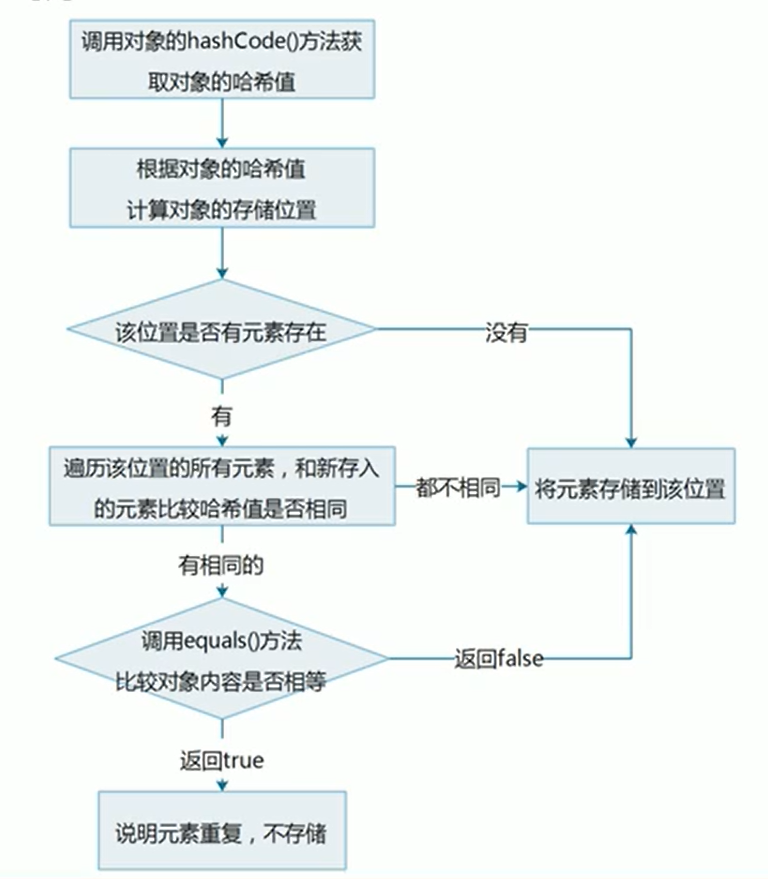

[TOC]


##  继承

- 继承是面向对象三大特征之一，可以使得子类具有父类的属性和方法，还可以在子类中重新定义、追加属性和方法。

- 格式：`public class 子类名 extends 父类名{}`
- 父类：也被称为基类、超类
- 子类：也被称为派生类
- 继承中子类的特点：
  - 子类可以有父类的内容
  - 子类还可以有自己特有的内容

### 继承的好处和弊端

- 继承好处
  - 提高了代码的复用性
  - 提高了代码的维护性（方法代码需要修改，修改一处即可）
- 继承弊端
  - 继承让类与类之间产生了关系，类的耦合性增强了，当父类发生变化时子类实现也不得不跟着变化，削弱了子类的独立性。
- 什么时候使用继承
  - 继承体现的关系：is a（猫是一种动物）

### 继承中变量的访问特点

在子类方法中访问一个变量

- 在子类局部范围找
- 子类成员范围找
- 父类成员范围找
- 找父亲的父亲……
- 没有就报错

### super 关键字

- super与this类似

  - this：代表对本类对象的引用

  - super：代表对父类存储空间的标识（可以理解为父类对象引用）

- 用法

  - 它可以向上在父类中找到父类的成员，直到找到为止（如在父类的父类中）。

  - `super.成员变量`：访问父类成员变量
  - `super(...)`：访问父类构造方法
  - `super.成员方法(...)`：访问父类成员方法

### 继承中构造方法的访问特点

- 每一个子类构造方法的第一条语句默认都是`super()`
- 如果父类中没有无参构造方法，只有带参构造方法：
  - 需要通过使用super关键字去显式地调用父类的带参构造方法。
  - 或：在父类中自己提供一个无参构造方法。

### 继承中成员方法的访问特点

- 通过子类对象访问一个方法
  - 先到子类成员范围去找
  - 父类成员范围找
  - 父亲的父亲中去找
  - 没有就报错

### 方法重写（Override）

- 概述

  子类中出现了和父类中一模一样的方法声明、

- 应用

  当子类需要父类的功能，而功能主体子类有自己特有内容是，可以重写父类中的方法，这样，既沿袭了父类的功能，右定义了子类的内容。

- 使用`@override`注解可以帮助检查重写方法的方法声明的正确性。

- 方法重写的注意事项

  - 父类中私有方法子类不能重写（父类私有成员子类是不能继承的）。
  - 子类方法访问权限不能更低（`public`>默认>`private`）

### Java中继承的注意事项

- Java类只支持单个继承，不支持多个继承。

  如Son类不能同时`extend Father， Mother`。

- 但支持多层继承。

  如Father类继承GrandDad类，Son类继承Father类。

## 修饰符

### 包package

- 作用：对类进行分类和管理

- 格式：`package 报名`（多级包用`.`分开）

- 带包的java类编译和执行
  - 手动建包：
    1. 按照以前的格式编译Java文件`javac HelloWorld.java`
    2. 手动创建包（建文件夹）
    3. 将编译的.class文件放进文件夹的最里面中。
    4. 带包执行 `java 包名.HelloWorld`
  - 自动建包：
    1. `javax -d. HelloWorld.java`
    2. `java 包名.HelloWorld`

- 导包import

  `import 包名`

### 权限修饰符

- private：只能在同一个类中访问
- 默认：只能在同一个类中、或同一个包中的子类和无关类中访问
- protected：可以在同一个类中、或同一个包中的子类和无关类、或不同包中的子类进行访问
- public：在同一个类中、同一个包中子类和无关类、不同包中的子类和无关类都可进行访问

### 状态修饰符final和static

#### final

- 意为最终， 可以修饰类、成员方法、成员变量。
- final修饰的特点：
  - 修饰方法：表明该方法是最终方法，不能被重写
  - 修饰变量：表明该变量是常量，不能再次被赋值
  - 修饰类：表明该类是最终类，不能被继承
- final修饰局部变量
  - 变量是基本类型：final修饰指的是基本类型的数据值不能发生改变
  - 变量是引用类型：final 修饰指的是引用类型的地址值不能发生改变，但是地址里面的内容可以发生改变。

#### static

- 静态的意思，可以修饰成员方法、成员变量。
- static修饰的特点
  - 被类的所有对象共享，这也是我们判断是否要使用静态关键字的条件。
  - 可以通过类名调用（也可以通过对象名调用，不推荐）

- static访问的特点
  - 静态成员方法只能访问静态成员（变量、方法）


## 多态

- 概述

  同一个对象，在不同时刻表现出来 的不同形态

  比如：

  - 猫是猫：`Cat cat = new Cat()`（在内存中申请的空间仍为Cat对象的空间）
  - 猫是动物：`Animal cat = new Cat()`

  这里的猫在不同时刻表现出来了不同的形态，这就是多态。

- 多态的前提和体现
  - 有继承或实现关系
  - 有方法重写（有同一个方法如`Cat.eat()`和`Animal.eat()`）
  - 有父类引用指向子类对象（如`Animal cat = new Cat()`）

### 多态中成员访问特点

- 访问成员变量：编译看左边，执行看左边

  全部取决于修饰类型的成员变量，如`Animal cat = new Cat()`,通过cat访问到的全为Animal对象的成员变量

- 访问成员方法：编译看左边，执行看右边。

  如`Animal cat = new Cat()`，其在编译过程中，只将cat编译为一个Animal对象，该对象无法访问Cat类型的独有方法，而只能访问Animal中的方法，但如果Cat中重写了Animal的方法，那么通过cat访问的方法实际执行的会是Cat类中重写的方法。

### 多态的优点和弊端

- 好处：提高了程序的扩展性

  具体体现 ：定义方法的时候，使用父类型作为参数，将来在使用的时候，使用具体的子类型参与操作。

- 弊端：不能使用子类的特有方法

### 多态中的转型

- 向上转型

  从子到父

  父类引用指向子类对象

- 向下转型

  - (**前提是这个父类的引用在创建对象时就是创建的该子类的对象，否则会抛出ClassCastException**)

  从父到子

  父类引用转为子类对象

## 抽象类

在Java中，一个没有方法体的方法应该定义为抽象方法，而类中如果有抽象方法，该类必须定义为抽象类。

### 抽象类的特点

- 抽象类和抽象方法必须使用`abstract`关键字修饰

  - `public abstract class 类名 {}`

  - `public abstract void 方法名()`

- 抽象类中不一定有抽象方法，有抽象方法的类一定是抽象类

- 抽象类不能实例化

  - 抽象类的实例化要参照多态的方式，通过子类对象实例化，这叫抽象类多态

- 抽象类的子类

  - 要么重写抽象类中的所有抽象方法
  - 要么是抽象类

### 抽象类的成员特点

- 成员变量：可以是变量，也可以是常量
- 构造方法：
  - 有构造方法，但不能直接实例化
  - 其构造方法用于子类访问父类数据的初始化
- 成员方法
  - 可以有抽象方法：限定子类必须完成某些动作
  - 也可以有非抽象方法：提高代码复用性

## 接口

- 接口是一种**公共的规范标准**，只要符合规范标准，大家都可以通用

- Java中的接口更多的体现在对**行为的抽象**

### 接口的特点

- 接口用关键字`interface`修饰

  `public interface 接口名{}`

- 类实现接口用`implements`表示

  `public class 类名 implements 接口名{}`

- 接口不能实例化

  - 接口的实例化需要参照多态的方式，通过实现类对象实例化，这叫接口多态。

  > - 多态的形式：具体类多态，**抽象类多态**，**接口类多态**
  > - 多态的前提：有继承或实现关系；有方法重写；有父（类|接口）引用指向（子|实现）类对象。

- 接口的实现类

  - 要么重写接口中的所有抽象方法
  - 要么是抽象类

### 接口的成员特点

- 成员变量

  - 只能常量
  - 默认修饰符：`public static final`

- 构造方法

  - 接口没有构造方法，因为接口主要是对行为进行抽象的，是没有具体存在的

  > - `Object`类是类层次结构的根。每个类都有 `Object`作为超类。所有对象，包括数组，实现这个类的方法。
  >
  > 一个类如果没有父类，默认继承自Object类，所以接口的实现类的构造方法会调用Object类的构造方法。

- 成员方法

  - 只能抽象方法
  - 默认修饰符：`public abstract`

### 类和接口的关系

- 类和类的关系：继承关系，只能单继承，但是可以多层继承
- 类和接口的关系：实现关系，可以单实现，也可以多实现，还可以在继承一个类的同时实现多个接口。
- 接口和接口的关系：继承关系，可以单继承，也可以多继承。

### 抽象类和接口的区别

- 成员区别
  - 抽象类：变量，常量；有构造方法；有抽象方法，也有非抽象方法
  - 接口：常量；抽象方法
- 关系区别
  - 类与类：继承，单继承
  - 类与接口：实现，可以单实现，也可以多实现
  - 接口和接口：继承，单继承，多继承
- 设计理念区别
  - 抽象类：对类抽象，包括属性、 行为（对事物的抽象）
  - 接口：对行为抽象，主要是行为（对行为的抽象）

### 更新的接口组成变化

- 接口的组成
  - 常量：`public static final`（可省略）
  - 抽象方法`public abstract`（可省略）
  - **默认方法（java 8）**
  - **静态方法（java 8）**
  - **私有方法（Java 9）**
- 接口中的默认方法
  - 格式：`public default 返回值类型 方法名(参数列表) {方法体}`（public可省略）
  - 默认方法不是抽象方法，所以不强制被重写。但是可以被重写，重写时候去掉default关键字
- 接口中的静态方法
  - 格式：`public static 返回值类型 方法名(参数列表){ 方法体}`（public 可省略）
  - 静态方法只能通过接口名调用，不能通过实现类名或者对象名调用。
- 接口中的私有方法
  - Java 9中新增了带方法体的私有方法，这其实在 Java8中就埋下了伏笔：Java8允许在接口中定义带方法体的默认方法和静态方法。这样可能就会引发一个问题：当两个默认方法或者静态方法中包含一段相同的代码实现时，程序必然考虑将这段实现代码抽取成一个共性方法，而这个共性方法是不需要让别人使用的，因此用私有给隐藏起来，这就是 Java 9增加私有方法的必然性
  - 格式1：`private 返回值类型 方法名(参数列表){方法体}`
  - 格式2：`private static 返回值类型 方法名(参数列表){方法体}`
  - 默认方法可以调用私有的静态方法和非静态方法
  - 静态方法只能调用私有的静态方法

## 形参和返回值

- 类名作为形参和返回值
  - 方法的形参是类名，其实需要的是该类的对象
  - 方法的返回值是类名，其实返回的是该类的对象
- 抽象类名作为形参和返回值
  - 方法的形参是抽象类名，其实 需要的是该抽象类的**子类对象**
  - 方法的返回值是抽象类名，其实返回的是该抽象类的**子类对象**
- 接口名作为形参和返回值
  - 方法的形参是接口名，其实需要的是改接口的实现类对象
  -  方法的返回值是接口名，其实返回的是该接口的实现类对象

## 内部类

- 就在在一个类中定义的另一个类。

- 格式：

  ```java
  public class 外部类名{
      修饰符 class 内部类名{
          // 一般内部类不应该暴露给外部
      }
  }
  ```

- 内部类的访问特点

  - 内部类可以直接访问外部类的成员，包括私有
  - 外部类要访问内部类的成员，必须要创建对象

-  内部类可以分为：

  - 在类的成员位置：成员内部类
  - 在类的局部位置：局部内部类（包括匿名内部类）

### 成员内部类

- 外界使用成员内部类：创建对象
  - 格式：`外部类名.内部类名 对象名 = 外部类对象.内部类对象;`
  - 例子：`Outer.Inner oi = new Outer().new Innner();`
  - 成员内部类一般不使用public修饰符（而使用private），故一般情况下也不暴露给外界。

### 局部内部类

- 局部内部类是在方法中定义的类
- 外界无法直接访问，需要在方法内部创建对象并使用
- 局部内部类可以直接访问外部类的成员，也可以访问方法内的局部变量

### 匿名内部类

- 前提：存在一个类或者接口，这里的类可以是具体类也可以是抽象类

- 格式：

  ```java
  new 类名或者接口名(){
      重写方法;
  };
  
  new Inter(){
      public void show(){
          //
      }
  }
  ```

- 本质：是一个继承了该类或者实现了该接口的子类的匿名对象

- 使用：可以方便地创建出一个只使用很少次数的实现了某个接口或继承了某个类的对象，随用随造，不需要单独再创建Java类。

- > 匿名内部类可以使你的代码更加简洁，你可以在定义一个类的同时对其进行实例化。它与局部类很相似，不同的是它没有类名，如果某个局部类你只需要用一次，那么你就可以使用匿名内部类（Anonymous classes enable you to make your code more concise. They enable you to declare and instantiate a class at the same time. They are like local classes except that they do not have a name. Use them if you need to use a local class only once.）
  >
  > - [java document-Anonymous Classes](https://docs.oracle.com/javase/tutorial/java/javaOO/anonymousclasses.html) 

- 匿名类无法访问其封闭范围内未声明为`final`或实际上未声明为final 的局部变量。

## 常用API

### Math类

- 类`Math`包含用于执行基本数字运算的方法，例如基本指数，对数，平方根和三角函数。 

### System类

- `System`类包含几个有用的类字段和方法。它不能被实例化。
- `System`类提供的设施包括标准输入，标准输出和错误输出流; 访问外部定义的属性和环境变量; 一种加载文件和库的方法; 以及用于快速复制阵列的一部分的实用方法。 

### Object类

- `Object`类是类层次结构的根。每个类都有  `Object`作为超类。所有对象，包括数组，实现这个类的方法。 

- > 看方法的源码，在idea中可选中方法名，按下ctrl+B

- `Object.toString()`:返回对象的字符串表示形式。总的来说，这 `toString`方法返回一个字符串，“以文本方式表示”这个对象。**建议所有子类都重写此方法。**

-  `Object`类的`toString`方法返回一个包含该类的对象是一个实例的名称字符串的符号  `@` ，和符号进制表示的对象的哈希码。换句话说，此方法返回一个等于值的字符串：
```java
getClass().getName() + '@' + Integer.toHexString(hashCode())
```
- `Object.equals()`：比较的是引用值（地址值）。

  - 请注意，它一般是必要覆盖`hashCode`方法重写此方法，以保持对`hashCode`方法的一般合同，即平等的对象必须具有相等的散列码。

  - 重写该方法（idea可自动生成，alt+insert）：

    ```java
     @Override
        public boolean equals(Object o) {
            // 比较地址值是否相同，相同则直接true
            if (this == o) return true;
            
            /*
            先判断参数是否为null
            再判断两个对象是否来自同一个类
            只要有一种就可以直接false
            */
            if (o == null || getClass() != o.getClass()) return false;
    		// 向下转型
            Animal animal = (Animal) o;
            
    		// 比较各个成员变量
            if (age != animal.age) return false;
            return name != null ? name.equals(animal.name) : animal.name == null;
        }
    ```

### Arrays

- 这个类包含用于操作数组（如排序和搜索）的各种方法。此类还包含一个允许数组被视为列表的静态工厂。 
- 常用：
  - `Arrays.toString()`
  - `Arrays.sort()`

### 基本包装类型

- 将基本数据类型封装成对象的好处在于可以在对象中定义更多的功能方法操作该数据

- 常用的操作之一：用于基本数据类型与字符串之间的转换

- | 基本数据类型 | 包装类    |
  | ------------ | --------- |
  | byte         | Byte      |
  | short        | Short     |
  | int          | Integer   |
  | long         | Long      |
  | float        | Float     |
  | double       | Double    |
  | char         | Character |
  | boolean      | Boolean   |

#### 以Interger类的使用为例

- 得到该类的对象：
  - `Integer.valueOf(int i)`
  - `Integer.valueOf(String s)`
- `int`转换为`String`类型：
  - `String.valueOf(int num)`
- `String`转为`int`：
  - `Integer.valueOf(String s).intValue()`
  - `Integer.parseInt(String s)`(推荐)

### 自动装箱和拆箱

- 装箱：把基本数据类型转换为对应的包装类型
- 拆箱：把包装类类型转换为基本数据类型。
- 装箱和拆箱都可以自动完成。（需要对包装类类型做判null的处理）

### 日期类

#### Date类

- Date代表了一个特定时间，精确到毫秒
  - `Date()`：得到一个当前时间和日期的信息
  - `Date(long date)`：date表示从标准基准时间起指定的毫秒数，从其生成时间日期信息
- 常用方法：
  - `public long getTime() `：获取的是日期对象从1970年1月1日0时到现在的毫秒值
  - `public void setTime(long time)`：设置时间，time为毫秒值

#### SimpleDateFormat类

- `SimpleDateFormat`是一个具体的类，用于以区域设置敏感的方式格式化和解析日期。  它允许格式化（日期文本），解析（文本日期）和规范化。 

- | 模式字母 | 表示 |
  | -------- | ---- |
  | `y`      | 年   |
  | `M`      | 月   |
  | `d`      | 日   |
  | `H`      | 时   |
  | `m`      | 分   |
  | `s`      | 秒   |
  |          |      |
  |          |      |

- 构造方法

  - `SimpleDateFormat()`：使用默认模式和日期格式
  - `SimpleDateFormat(String pattern)`：使用给定的模式和默认的日期格式

- 格式化和解析日期

  - 格式化（从Date到String）： `public final String format(Date date)`，将日期格式化成日期|时间字符串
  - 解析（从String到Date）：`public Date parse(String source)`， 从给定字符串的开始解析文本以生成日期

```java
// 格式化
        Date d = new Date();
        SimpleDateFormat sdf = new SimpleDateFormat("yyyy年MM月dd日 HH:mm:ss");
        String s = sdf.format(d);
        System.out.println(s);
        // 解析
        String ss = "2021-12-08 00:23:05";
        SimpleDateFormat sdf2 = new SimpleDateFormat("yyyy-MM-dd HH:mm:ss");
        Date dd = sdf2.parse(ss);
        System.out.println(dd);
/*
输出：
2021年12月08日 00:25:20
Wed Dec 08 00:23:05 CST 2021
*/
```

#### Calendar类

- Calendar为抽象类

- Calendar为某一时刻和一组日历字段之间的转换提供了一些方法，并为操作日历字段提供了一些方法

- Calendar提供了一个类方法`getInstance`用于获取Calendar对象，其日历字段已使用当前日期和时间初始化
  - `Calendar rightnow = Calendar.getInstance();`（多态的形式得到对象，获得的是Calendar的子类对象）

- 获取Calendar中的字段

  - 年：`rightnow.get(Calendar.YEAR) `
  - 月：`rightnow.get(Calendar.MONTH) +1`（月份从0开始）
  - 日：`rightnow.get(Calendar.DATE) `

- 其他常用方法：

  - `public abstract void add(int field, int amount)`：根据日历的规则，将指定的时间量添加或减去给定的日历字段

    ```java
    // 10年后的5天前
    rightnow.add(Calendar.YEAR, 10);
    rightnow.add(Calendar.Date, -5);
    ```

    

  - `public final void set(int year, int month, int date)`：设置当前日历的年月日

## 异常

- `Throwable`类是Java语言中所有错误和异常的超类。  只有作为此类（或其一个子类）的实例的对象由Java虚拟机抛出，或者可以由Java `throw`语句抛出。  类似地，只有这个类或其子类可以是`catch`子句中的参数类型。

- `Throwable`两个子类的实例[`Error`](../../java/lang/Error.html)和[`Exception`](../../java/lang/Exception.html)通常用于表示出现异常情况。

  - 一个`Error`是的子类`Throwable`表示严重的问题，合理的应用程序**不应该试图捕获**。  大多数这样的错误是异常情况（如硬件层面问题，内存不足等，一般在Java层面不进行捕捉处理）。

  - `Exception`及其子类，表示合理应用程序可能想要捕获的条件。

    `Exception`类和不是`RuntimeException`的子类的任何子类都是*检查异常* （需要进行捕获检查处理）。  检查异常需要在方法或构造函数的`throws`子句中声明，如果它们可以通过执行方法或构造函数抛出，并在方法或构造函数边界之外传播。 

  - `RuntimeException`是在Java虚拟机的正常操作期间可以抛出的异常的超类。`RuntimeException`及其子类是*未经检查的异常* （一般需要检查代码存在的问题）。  unchecked异常*不需要*在方法或构造函数的拟申报`throws`条款

- 异常处理有两种方法：

  - 捕捉异常
  - 向外抛出异常

### JVM的默认处理方案

如果程序出现了问题，我们没做任何处理，最终JVM会做默认的处理：

- 把异常的名称，异常的原因以及异常出现的位置等信息输出在控制台
- 程序停止运行

### 异常处理try...catch...

- 格式

  ```java
  try{
      //可能出现异常的代码
  } catch(异常类名 变量名) {
      // 异常的处理代码
  }
  ```

- 执行流程

  - 程序从try里面的代码开始执行
  - 出现异常时，会自动生成一个异常类对象，该异常对象将被提交给Java运行时系统。
  - 当Java运行时系统接收到的异常对象时，会到catch中去找匹配的异常类，找到后进行异常的处理
  - 执行完毕之后，程序还可以继续往下执行（try中的代码会停在出现异常的地方，不会继续）。

### Throwable类的成员方法

- `public String getMessage()`返回此Throwable的详细信息（细节）字符串
- `public String toString()`返回此可抛出的简短描述
- `public void printStackTrace()`把异常的错误信息输出在控制台

### 编译时异常和运行时异常的区别

- Java中的异常被分为两大类：**编译时异常**和**运行时异常**，也称为**受检异常**和**非受检异常**
- 所有的RuntimeException类及其子类被称为运行时异常，其他的异常都是编译时异常。
- 编译时异常：必须显示处理，否则程序就会发生错误，无法通过编译
- 运行时异常，无需显示处理，也可以和编译时异常一样处理

### 异常处理之throws

- 有时异常出现时无权限处理，就需要将异常向外抛出（在方法声明中做异常标记)，由方法调用者进行捕捉处理

- 格式：

  ```java
  public void 方法名() throws Exception{
      //方法代码
  }
  ```

### 自定义异常

- 继承自Exception类，带参构造方法调用`super(message)`传递message错误信息。
- 在需要手动抛出异常的地方，使用`throw`关键字抛出异常对象
  - 如：`throw new MyException(message);`

### throws 和throw的区别

- throws
  - 用在方法声明后面，跟的是异常类名
  - 表示抛出异常，由该方法的调用者来处理异常
  - 表示会出现异常的一种可能性，并不一定会发生这些异常
- throw
  - 用在方法体内，跟的是异常对象名
  - 表示抛出异常，由方法体内的语句处理
  - 执行throw一定抛出了某种异常

## 集合

集合类的特点：提供一种存储空间可变的存储模型，存储的数据容量可以随时发生改变。

集合的体系结构：

- Collection接口（单列）
  - List接口（可重复）
    - ArrayList
    - LinkedList
    - ……
  - Set接口（不可重复）
    - HashSet
    - TreeSet
    - ……
- Map接口（双列）
  - HashMap
  - ……

### Collection接口

- 是单例集合的顶层接口，它表示一组对象，这些对象也称为Collection的元素

- JDK中不提供Collection接口的直接实现，而是提供了其更具体的子类接口Set和List的实现。

- 创建Collection集合的对象

  - 多态的方式
  - 具体的实现类ArrayList

  ```java
  // 创建Collection集合的对象
  Collection<String> c = new ArrayList<String>();
  // 添加元素
  c.add("h1");
  c.add("h2");
  System.out.println(c);
  ```

- 常用方法

  - `boolean add(E e)`添加元素（ArrayList中，在容量满足的情况下永远返回true）
  - `boolean remove(Object o)`从集合中移除指定的元素
  - `void clear()`清空集合中的元素
  - `boolean contains(Object o)`判断集合中是否存在指定的元素
  - `boolean isEmpty()`判断集合是否为空 
  - `int size()`集合的长度，也就是集合中元素的个数

#### Collection集合的遍历

- `Iterator`：迭代器，集合的专用遍历方式

  - `Iterator<E> iterator()`:返回此集合中元素的迭代器，通过集合的`iterator()`方法得到
  - 迭代器是通过集合的iterator()方法得到的，所以我们说它是依赖于集合而存在的

- `Iterator`中的常用方法

  - `E next()`：返回迭代中的下一个元素
  - `boolean hasNext()`：如果迭代具有更多元素，则返回true

   ```java
   Iterator<String> it = c.iterator();
   while(it.hasNext()) {
       System.out.println(it.next());
   }
   ```

- 注意：ArrayList在迭代的时候如果同时对其进行修改就会抛出`java.util.ConcurrentModificationException`异常（如在迭代时添加元素，虽然`hasNext()`为true，但`next()`方法会抛出该异常）

### List

-  继承自`Collection`
-  List为有序集合（也称为序列），用户可以**精确**控制列表中每个元素的插入位置。用户可以通过整数**索引访问**元素，并搜索列表中的元素
-  与Set集合不同，列表通常允许重复的元素
-  特点：
   - 有序：存储和取出的元素顺序一致
   - 可重复：存储的元素可重复

```java
List<String> list = new ArrayList<String>()
```

- List **特有**方法
  - `void add(int index, E element)`在此集合中的指定位置插入指定的元素
  - `E remove(int index)`删除指定索引处的元素,返回被删除的元素
  - `E set(int index, E element)`修改指定索引处的元素,返回被修改的元素
  - `E get(int index)`返回指定索引处的元素
- `ListIterator`：列表迭代器
  - 通过List集合的`listIterator()`方法得到,所以说它是List集合特有的迭代器
  - 用于允许程序员沿任一方向遍历列表的列表迭代器,在迭代期间修改列表,并获取列表中迭代器的当前位置
- `ListIterator`中的常用方法
  - `E next()`:返回迭代中的下一个元素
  - `boolean hasNext()`:如果迭代具有更多元素,则返回true 
  - `E previous()`:返回列表中的上一个元素
  - `boolean has Previous()`:如果此列表迭代器在相反方向遍历列表时具有更多元素,则返回true 
  - `void add(E e)`:将指定的元素插入列表

#### 增强for循环(for-each loop)

- 增强for:简化数组和 Collection集合的遍历

  - 实现 `Iterable`接口的类允许其对象成为增强型for语句的目标
  - 它是JDK5之后出现的,其内部原理是一个 `lterator`迭代器

- 格式

  ```java
  for(元素数据类型 变量名 ： 数组或Collection集合) {
      // 在此处使用变量即可，该变量就是元素
  }
  ```

- 注意其内部原理是一个`Iterator`迭代器，所以在该for循环中，不可对集合元素进行修改操作。否则会抛出并发修改异常。

#### List集合子类特点

List集合常用子类：`ArrayList`、`LinkedList`

- `ArrayList`：底层数据结构是数组，查询快，增删慢
- `LinkedList`：底层数据结构是链表，查询慢，增删快

#### LinkedList集合的特有功能

其底层是链表，故提供了一些对头尾操作的方法：

- `public void addFirst(E e)`在该列表开头插入指定的元素
- `public void addLast(E e)`将指定的元素追加到此列表的末尾
- `public E getFirst()`返回此列表中的第一个元素
- `public E getLast()`返回此列表中的最后一个元素
- `public E removeFirst()`从此列表中删除并返回第一个元素
- `public E removeLast()`从此列表中删除并返回最后一个元素

### Set集合

- Set集合特点
  - 不包含重复元素的集合
  - 没有带索引的方法，所以不能使用普通for循环遍历

```java
Set<String> set = new HashSet<String>();
set.add("zz");
set.add("hh");
set.add("gg");
set.add("hh");// 不会存储重复元素
set.add("ee");

// 遍历
for(String s : set){
   System.out.println(s);
}
System.out.println(set);
```

#### 哈希值（Hash）

- 哈希值：是JDK根据对象的**地址**或者**字符串**或者**数字**算出来的int类型的**数值**。

- Object类中有一个方法可以获取对象的哈希值
  - `public int hashCode()`：返回对象的哈希值
  - 默认情况下，不同对象的哈希值是不相同的
  - 通过方法重写，可以实现不同对象的哈希值是相同的

#### HashSet集合概述和特点

`HashSet`集合特点：

- 底层数据结构是哈希表
- 对集合的迭代顺序不作任何保证,也就是说不保证存储和取出的元素顺序一致
- 没有带索引的方法,所以不能使用普通for循环遍历
- 由于是Set集合,所以是不包含重复元素的集合

#### HashSet集合保证元素唯一性

```java
// Hashset存储元素的相关源码分析
// 创建集合对象
Set<String> set = new HashSet<String>();
// 添加元素
set.add("zz");
-----------------------------------

public boolean add(E e) {
    return map.put(e, PRESENT)==null;
}

static final int hash(Object key) {
    int h;
    return (key == null) ? 0 : (h = key.hashCode()) ^ (h >>> 16);
}

public V put(K key, V value) {
    return putVal(hash(key), key, value, false, true);
}

// hash值和元素的hashCode()方法相关
final V putVal(int hash, K key, V value, boolean onlyIfAbsent,
                   boolean evict) {
        Node<K,V>[] tab; Node<K,V> p; int n, i;

        // 如果哈希表未初始化，就对其进行初始化
        if ((tab = table) == null || (n = tab.length) == 0)
            n = (tab = resize()).length;

        // 根据对象的哈希值计算对象的存储位置,如果该位置没有元素,就存储元素
        if ((p = tab[i = (n - 1) & hash]) == null)
            tab[i] = newNode(hash, key, value, null);
        else { //该位置有元素
            Node<K,V> e; K k;
            /*
            存入的元素和以前的元素比较哈希值
                如果哈希值不同,会继续向下执行,把元素添加到集合
                如果哈希值相同,会调用对象的equals()方法比较
                    如果返回false,会继续向下执行,把元素添加到集合
                    如果返回true,说明元素重复,不存储
            */
            if (p.hash == hash &&
                ((k = p.key) == key || (key != null && key.equals(k))))
                e = p;// 不存储
            else if (p instanceof TreeNode)
                e = ((TreeNode<K,V>)p).putTreeVal(this, tab, hash, key, value);
            else {
                for (int binCount = 0; ; ++binCount) {
                    if ((e = p.next) == null) {
                        p.next = newNode(hash, key, value, null);
                        if (binCount >= TREEIFY_THRESHOLD - 1) // -1 for 1st
                            treeifyBin(tab, hash);
                        break;
                    }
                    if (e.hash == hash &&
                        ((k = e.key) == key || (key != null && key.equals(k))))
                        break;
                    p = e;
                }
            }
            if (e != null) { // existing mapping for key
                V oldValue = e.value;
                if (!onlyIfAbsent || oldValue == null)
                    e.value = value;
                afterNodeAccess(e);
                return oldValue;
            }
        }
        ++modCount;
        if (++size > threshold)
            resize();
        afterNodeInsertion(evict);
        return null;
    }

```


- HashSet集合添加一个元素的过程：

  

- 要保证元素唯一性，需要重写`hashCode()`和`equals()`

#### 哈希表

- JDK8之前,底层采用**数组+链表**实现,可以说是一个元素为链表的数组

- JDK8以后,在长度比较长时候,底层实现了优化

- HashSet使用的HashMap默认容量为16

  


#### LinkedHashSet集合

- 继承自`HashSet`、实现了Set接口

- `LinkedHashSet` 集合特点
  - 哈希表和链表实现的 Set 接口，具有可预测的迭代次序
  - 由链表保证元素有序，也就是说元素的存储和取出顺序是一致的
  - 由哈希表保证元素唯一，也就是说没有重复的元素

#### TreeSet集合

- `Treeset`集合特点：
  - 元素有序，这里的顺序不是指存储和取出的顺序，而是按照一定的规则进行排序，具体排序方式取决于构造方法
    - `TreeSet()`: 根据其元素的自然排序进行排序 
    - `TreeSet(Comparator comparator)`:根据指定的比较器进行排序
  - 没有带索引的方法，所以不能使用普通 for 循环遍历
  - 由于是 Set 集合，所以不包含重复元素的集合

#### 自然排序Comparable的使用

- 用 `TreeSet` 集合存储自定义对象，无参构造方法使用的是自然排序对元素进行排序的
- 自然排序，就是让元素所属的类实现 `Comparable` 接口，重写 `compareTo(O o)`方法
- 重写方法时，一定要注意排序规则必须按照要求的主要条件和次要条件来写
- `compareTo(O o)`方法返回0时， 代表两个元素相等，返回正数时，代表该元素比o大，返回负数则相反。

#### 比较器排序Comparator的使用

```java
// 可以直接使用匿名内部类
TreeSet<Student> ts = new TreeSet<Student>(new Comparator<Student>() {
        @Override
        public int compare(Student s1, Student s2) {
            int num = s1.getAge() - s2.getAge();
            return num == 0 ? s1.getName().compareTo(s2.getName()) : num;
        }
    });

```

-  用 `TreeSet` 集合存储自定义对象，带参构造方法使用的是比较器排序对元素进行排序的
- 比较器排序，就是让集合构造方法接收 Comparator 的实现类对象，重写 `compare（To1，T o2）`方法
- 重写方法时，一定要注意排序规则必须按照要求的主要条件和次要条件来写

### 泛型

- 泛型：是 JDK5中引入的特性，它提供了编译时类型安全检测机制，该机制允许在编译时检测到非法的类型。它的本质是**参数化类型**，也就是说所操作的数据类型被指定为一个参数

- 参数化类型：顾名思义，就是**将类型由原来的具体的类型参数化，然后在使用/调用时传入具体的类型**

- 这种参数类型可以用在类、方法和接口中，分别被称为泛型类、泛型方法、泛型接口
- 泛型定义格式：
  - `<类型>`：指定一种类型的格式。这里的类型可以看成是形参
  - `<类型1，类型2..>`：指定多种类型的格式，多种类型之间用逗号隔开。这里的类型可以看成是形参
  - 将来具体调用时候给定的类型可以看成是实参，并且实参的类型只能是引用数据类型
- 泛型的好处：
  - 把运行期间的问题提前到了编译期间
  - 避免了强制类型转换

#### 泛型类

- 泛型类的定义格式：
  - 格式：`修饰符 class 类名<类型>{}`
  - 范例：`public class ClassName<T>{}`
    此处` T `可以随便写为任意标识，常见的如 `T`、`E`、`K`、`V `等形式的参数常用于表示泛型

#### 泛型方法

- 范例：

  ```java
  public <T> void show(T t) {
      Systen.out.println(t);
  }
  ```

#### 泛型接口

- 格式：`修饰符 interface 接口名<类型>{}`
- 范例：`public interface Generic<T> {}`

```java
publuic interface Generic<T> {
    void show(T t);
}

public class GnericImpl<T> implements Generic<T> {
    @Override
    public void show(T t) {
        System.out.println(t)
    }
}

public class GenericDemo{
    public static void main(String[] args){
        Generic<String> g1 = new GenericImpl<String>();
        g1.show("qwer");
         
    }
}
```

#### 类型通配符

为了表示各种泛型 List 的父类，可以使用类型通配符

- 类型通配符：`<?>`
- `List<?>`：表示元素类型未知的 List，它的元素可以匹配**任何的类型**
- 这种带通配符的 List 仅表示它是各种泛型 List 的父类，并不能把元素添加到其中
- 如果说我们不希望 List<?>是任何泛型 List 的父类， 只希望它代表某一类泛型 List 的父类， 可以使用类型通配符的上限
  - 类型通配符上限`<?extends 类型>`
  - `List<? extends Number>`：它表示的类型是 Number 或者其子类型
- 除了可以指定类型通配符的上限，我们也可以指定类型通配符的下限
  - 类型通配符下限: `<? super 类型>`
  - `List<? super Number>`:它表示的类型是 Number  或者其父类型

```java
public class GenericDemo {
    public static void main(String[] args){
        //类型通配符：<?>
        List<?> list1=new ArrayList<Object>();
        List<?> list2 =new ArrayList<Number>();
		List<?> list3 =new ArrayList<Integer>();
		System.out.println("--------");
        
		//类型通配符上限：<?extends 类型>
        //List<? extends Number> list4 = new ArrayList<Object>();不符合上限
		List<? extends Number> list5 = new ArrayList<Number>();
		List<? extends Number> list6 = new ArrayList<Integer>();
		System.out.println("--------");
        
		//类型通配符下限：<?super 类型>
        List<? super Number> list7 = new ArrayList<Object>();
		List<? super Number> list8 =new ArrayList<Number>();
		// List<? super Number> List9 =new ArrayList<Integer>();不符合下限
```

#### 可变参数

- 可变参数又称参数个数可变，用作方法的形参出现，那么方法参数个数就是可变的了

- 格式：`修饰符 返回值类型 方法名(数据类型...变量名){ }`
- 范例:` public static int sum(int...a){}`
- 可变参数注意事项
  - 这里的变量其实是一个数组
  - 如果一个方法有多个参数，包含可变参数，可变参数要放在最后

```java
public static void main(String[] args) {
    System.out.println(sum(10,20));
	System.out.println(sum(10,20,30));
	System.out.println(sum(10,20,30,40));
	System.out.println(sum(10,20,30,40,50));
	System.out.println(sum(10,20,30,40,50,60));
}
// 这里的变量其实是一个数组
public static int sum(int...a) {
	int sum = 0;
	for(int i : a){
    	sum += i;
	}
    return sum;
}
```

#### 可变参数的使用

- Arrays 工具类中有一个静态方法：
  - `public static <T> List<T> asList(T...a) `：返回由指定数组支持的**固定大小**的列表 (列表元素不能增删，但可以修改)
- List 接口中有一个静态方法：
  -  `public static <E> List<E> of(E...elements) `：返回包含任意数量元素的**不可变**列表 
- Set 接口中有一个静态方法：
  - `public static <E> Set<E> of(E...elements) `：返回一个包含任意数量元素的**不可变**集合，且`elements`中不能存在重复的元素

```java
List<String> list = Arrays.asList("hello", "world", "java");

List<String> list = List.of("hh", "wwww", "jajj");

Set<String> set = Set.of("hh", "wwww", "jajj") 
```


### Map

 Map是将键映射到值的对象。

- `Interface Map<K， V>`：K为键的类型、V为值的类型
- 将键映射到值的对象；
- 不能包含重复的键；
- 每个键可以映射到最多一个值
- 值可重复
- 创建Map集合的对象：
  - 多态的方式
  - 具体的实现类HashMap

```java
// 创建集合对象
map<String, String> map = new Hashmap<String, String>();
// 存入元素
map.put("001", "zhangyi");
map.put("002", "zxbn");
map.put("003", "ddff");

```

- Map集合的基本功能
  - `V put(K key, V value)`添加元素
  -  `V remove(Object key)`根据键删除键值对元素 
  - `void clear()`移除所有的键值对元素
  - `boolean containsKey(Object key)`判断集合是否包含指定的键
  -  `boolean containsValue(Object value)`判断集合是否包含指定的值 
  - `boolean isEmpty()`判断集合是否为空
  - `int size() `集合的长度，也就是集合中键值对的个数
- Map集合的获取功能
  - `V get(Object key)`根据键获取值
  - `Set<K> keySet() `获取所有键的集合
  - `Collection<V> values()` 获取所有值的集合
  - `Set<Map.Entry<K,V>> entrySet() `获取所有键值对对象的集合
- `Map.Entry`：是Map的条目（键值对）。`Map.entrySet()`会返回Map条目的集合，集合中的元素即属于此`Map.Entry`类。
  - `map.Entry`中的`getKey()`可返回该键值对条目的键
  - `map.Entry`中的`getValue()`可返回该键值对条目的值
  - `map.Entry`中的`setValue(V value)`可用指定的值替换该条目的值。

### Collections

- 是针对集合操作的工具类，全是静态方法
- Collections 类的常用方法
  - `public static <T extends Comparable<? super T>> void sort(List<T> list)`:将指定的列表按升序排序
  - `public static void reverse(List<?> list)`:反转指定列表中元素的顺序
  - `public static void shuffle(List<?> list)`:使用默认的随机源随机排列指定的列表

## IO流


### File类

- 它是文件和目录路径名的抽象表示。

  - 文件和目录是可以通过 File 封装成对象的

  - 对于 File 而言,其封装的并不是一个真正存在的文件,仅仅是一个路径名而已。它可以是存在的,也可以是不存在的。将来是要通过具体的操作把这个路径的内容转换为具体存在的。

- 构造方法

  - `File(String pathname)` 通过将给定的路径名字符串转换为抽象路径名来创建新的 File实例
  -  `File(String parent, String child)`从父路径名字符串和子路径名字符串创建新的 File 实例
  -  `File(File parent, String child)` 从父抽象路径名和子路径名字符串创建新的 File 实例

  ```java
  File f1 = new File("D:\\java\\test.txt");
  System.out.println(f1);
  File f2 = new File("D:\\java", "test.txt");
  System.out.println(f2);
  File f3 = new File("D:\\java");
  File f4 = new File(f3, "test.txt");
  System.out.println(f4);
  
  /* 输出：
  D:\java\test.txt
  D:\java\test.txt
  D:\java\test.txt
  */
  ```

- 创建功能

  - `public boolean createNewFile()`当具有该名称的文件不存在时,创建一个由该抽象路径名命名的新空文件；如果文件存在，则不做改变，返回false。
  - `public boolean mkdir() `创建由此抽象路径名命名的目录（目录不存在的话） ，不可以创建多级目录。
  - ` public boolean mkdirs()`创建由此抽象路径名命名的目录,包括任何必需但不存在的父目录 

- File类判断和获取功能

  - `public boolean isDirectory()` 测试此抽象路径名表示的 File是否为目录
  - ` public boolean isFile() `测试此抽象路径名表示的 File 是否为文件 
  - `public boolean exists `测试此抽象路径名表示的 File 是否存在 
  - `public String getAbsolutePath()`返回此抽象路径名的绝对路径名字符串
  - `public String getPath()` 将此抽象路径名转换为路径名字符串 
  - `public String getName()`返回由此抽象路径名表示的文件或目录的名称
  - `public String[] list() `返回此抽象路径名表示的目录中的文件和目录的名称字符串数组
  - `public File[] listFiles()`返回此抽象路径名表示的目录中的文件和目录的 File 对象数组

- File类删除功能

  - `public boolean delete()`删除由此抽象路径名表示的文件或目录
  - 如果一个目录中有目录或文件，不能直接删除。应先删除目录中的内容，最后才能删目录。

### 字节流

#### IO流概述和分类

- 概述
  - IO即为输入输出，流为一种抽象概念，是对数据传输的总称。也就是说数据在设备间的传输称为流，流的本质是数据传输。
- 按数据流向分类
  - 输入流
  - 输出流
- 按数据类型分类
  - 字节流
  - 字符流

#### 字节流写数据

- 字节流抽象基类
  - `InputStream`:这个抽象类是表示字节输入流的所有类的超类 
  - `OutputStream`:这个抽象类是表示字节输出流的所有类的超类
  - 子类名特点：子类名称都是以其父类名作为子类名的后缀

- `FileOutputStream`：文件输出流用于将数据写入 File 

  - `FileOutputStream(String name) `：创建文件输出流以指定的名称写入文件

  ```java
  FileOutputStream fos = new FileOutputStream("mydir\\fos.txt");
  /*
  做了三件事：
  	1. 调用系统功能创建了文件
  	2. 创建了字节输出流对象
  	3. 让字节输出流对象指向创建好的文件
  	*/
  fos.write(97);// 对应字母a
  fos.write(57); // 对应数字9
  
  // 与IO相关的操作最后都要释放资源
  fos.close();
  ```

- 使用字节输出流写数据的步骤:

  - 创建字节输岀流对象(调用系统功能创建了文件,创建字节输岀流对象,让字节输出流对象指向文件)
  - 调用字节输出流对象的写数据方法
  - 释放资源(关闭此文件输出流并释放-与此流相关联的任何系统资源)

#### 字节流写数据的三种方式

- `void write(int b)`将指定的字节写入此文件输出流，一次写一个字节数据 

- `void write(byte[] b)`将 b.length 字节从指定的字节数组写入此文件输出流，一次写一个字节数组数据 

- `void write(byte[] b, int off, int len)`将 len 字节从指定的字节数组开始，从偏移量 off 开始写入此文件输出流，一次写一个字节数组的部分数据、

- 实现换行：

  ```java
  fos.write("hello\n".getBytes());
  /*
  各个操作系统的换行符不同：
    windows：\r\n
    linux:\n
    mac:\r
  */
  fos.close();
  ```

- 追加写入：

  - ` public FileOutputStream (String name, boolean append)`创建文件输出流以指定的名称写入文件。如果第二个参数为 true ,则字节将写入文件的末尾而不是开头。

  ```java
  FileOutputStream fos = new FileOutputStream("mydir\\fos.txt", true);
  
  fos.write("hello\n".getBytes());
  fos.close();
  ```

#### 字节流写数据加异常处理

- finally：在异常处理时提供 finally 块来执行所有清除操作。比如说 IO 流中的释放资源

- 特点：被 finally 控制的语句一定会执行，除非 JVM 退出

- 格式：

  ```java
  try {
      // 可能出现异常的代码
  } catch(异常类名 变量名){
      // 异常的处理代码；
  } finally{
     // 执行所有清除操作；
  }
  ```

示例：

```java
FileOutputStream fos = null;
try {
    // 可能出现异常的代码
    fos = new FileOutputStream("mydir\\fos.txt");
    fos.write("hello\n".getBytes());
} catch(IOException e){
    // 异常的处理代码；
    e.printStack();
} finally{
    // 执行所有清除操作；
    if(fos != null){
         try{
        	fos.close;
    	}catch(IOException e){
        	e.printStack();
    	}
    } 
}
```

#### 字节流读数据

- `FilelnputStream`:从文件系统中的文件获取输入字节 
  - `FilelnputStream(String name)`:通过打开与实际文件的连接来创建一个 `FilelnputStream`，该文件由文件系统中的路径名 name 命名

- 步骤：
  - 1:创建字节输入流对象
  - 2:调用字节输入流对象的读数据方法
  - 3:释放资源
- 一次读取一个字节数据：

    ```java
    FileInputStream fis = new FileInputStream("mydir\\fos.txt");
    int by = fis.read();
    while(by != -1){
        System.out.println(by);
        System.out.println((char)by);
        by = fis.read();
    }
    
    // 可以这样写
    int by;
    while( (by = fis.read()) != -1) {
        System.out.print((char)by);
    }
    
    fis.close();
    ```

- 一次读取一个字节数组：

  ```java
  FileInputStream fis = new FileInputStream("mydir\\fos.txt");
  bytes[] bys = new byte[5];
  int len = fis.read(bys);// len返回实际读取的字符的个数，读到末尾返回-1
  System.out.println(len);
  System.out.println(new String(bys));
  fis.close();
  
  // 或者这样写：
  
  FileInputStream fis = new FileInputStream("mydir\\fos.txt");
  bytes[] bys = new byte[1024]; 
  
  int len;
  while( (len = fis.read(bys)) != -1) {
  	System.out.print(new String(bys, 0, len));
  }
  
  fis.close();
  ```

#### 字节缓冲流

- `BufferOutputStream`:该类实现缓冲输出流。通过设置这样的输出流,应用程序可以向底层输出流写入字节,而不必为写入的每个字节导致底层系统的调用 
- `BufferedInputStream`:创建 `BufferedInputStream `将创建一个内部缓冲区数组。当从流中读取或跳过字节时,内部缓冲区将根据需要从所包含的输入流中重新填充,一次很多字节
- 构造方法：
  - 字节缓冲输出流：`BufferedOutputStream(OutputStream out)` ，默认缓冲大小都为8192个字节。
  - 字节缓冲输入流：`BufferedInputStream(InputStream in)`，默认缓冲大小都为8192个字节。

```java
// 写数据
BufferedOutputStream bos = new BufferedOutputStream(new FileOutputStream("mydir\\bos.txt"));
bos.write("hello\r\n".getBytes());
bos.write("world\r\n".getBytes());
bos.close()
  
```

```java
BufferedInputStream bis = new BufferedInputStream( new FileInputStream("mydir\\bos.txt"));

// 第一种读取方式
int by;
while( (by = bis.read()) != -1) {
    System.out.print( (char)by );
}

// 第二种读取方式
byte[] bytes = new byte[1024];
int len;
while( (len = bis.read(bys)) != -1) {
    System.out.print(new String(bys, 0, len) );
}
bis.close();
```

### 字符流

> 一个汉字存储：
>
> - GBK编码：占用2个字节
> - UTF-8编码： 占用3个字节
> - 汉字在存储时，无论选择哪种编码存储，第一个字节都是负数

由于字节流操作中文不是特别方便，所以Java提供字符流

- 字符流 = 字节流 + 编码表

#### 编码表

- ASCII字符集

  - ASCII（American Standard Code for Information Interchange，美国信息交换标准代码）：是基于拉丁字母的一套电脑编码系统，用于显示现代英语，主要包括控制字符（回车键、退格、换行键等）和可显示字符（英文大小写字符、阿拉伯数字和西文符号）
  - 基本的 ASCII 字符集，使用7位表示一个字符，共128字符。ASCII 的扩展字符集使用8位表示一个字符，共256字符，方便支持欧洲常用字符。是一个系统支持的所有字符的集合，包括各国家文字、标点符号、图形符号、数字等

- GB XXX字符集

  - GB2312：简体中文码表。一个小于127的字符的意义与原来相同，但两个大于127的字符连在一起时，就表示一个汉字，这样大约可以组合了包含7000多个简体汉字，此外数学符号、罗马希腊的字母、日文的假名等都编进去了，连在 ASC 里本来就有的数字、标点、字母都统统重新编了两个字节长的编码，这就是常说的“全角“字符，而原来在127号以下的那些就叫“半角字符了·
  - **GBK**：最常用的中文码表。是在 GB2312标准基础上的扩展规范，使用了双字节编码方案，共收录了21003个汉字，完全兼容 GB2312标准，同时支持繁体汉字以及日韩汉字等
  - GB18030：最新的中文码表。收录汉字70244个，采用多字节编码，每个字可以由1个、2个或4个字节组成。支持中国国内少数民族的文字，同时支持繁体汉字以及日韩汉字等

- Unicode字符集

  - 为表达任意语言的任意字符而设计，是业界的一种标准，也称为统一码、标准万国码。它最多使用4个字节的数字来表达每个字母、符号，或者文字。有三种编码方案，UTF-8、UTF-16和 UTF32。最为常用的 UTF-8编码 
  - **UTF-8编码**：可以用来表示 Unicode 标准中任意字符，它是电子邮件、网页及其他存储或传送文字的应用中，优先采用的编码。互联网工程工作小组（IETF）要求所有互联网协议都必须支持 UTF-8编码。它使用一至四个字节为每个字符编码。

  - UTF-8编码规则：
    - 128个 US-ASC 字符,只需一个字节编码
    - 拉丁文等字符,需要二个字节编码
    - 大部分常用字(含中文),使用三个字节编码
    - 其他极少使用的 Unicode 辅助字符,使用四字节编码

#### 字符串中的编码解码

- 编码
  - 默认（与平台有关）：`byte[] getBytes()`
  - 指定字符集：`byte[] getBytes(String charsetName)`
- 解码
  - 默认（与平台有关）：`String(byte[] bytes)`
  - 指定字符集：`String(byte[] bytes , String charsetName)`

#### 字符流中的编码解码

- 字符流抽象基类
  -  `Reader`:字符输入流的抽象类
  -  `Writer`:字符输出流的抽象类
- `InputStreamReader`:是从字节流到字符流的桥梁
  - 它读取字节,并使用指定的编码将其解码为字符
  - 它使用的字将集可以由名称指定,也可以被明确指定,或者可以接受平台的默认字符集
- `OutputStreamWriter`:是从字符流到字节流的桥梁
  - 是从字符流到字节流的桥梁,使用指定的编码将写入的字符编码为字节
  - 它使用的字符集可以由名称指定,也可以被明确指定,或者可以接受平台的默认字符集
- 对于文件的字符流读写，只要**不涉及编码**的问题，可以直接使用`FileReader`类和`FileWriter`类，其分别是`InputStreamReader`和`OutputStreamWriter`的子类。

````java
OutputStreamWriter osw = new OutputStreamWriter(new FileOutputStream("JAVA\\out.txt"),"UTF-8");
osw.write("中国");
osw.close();

InputStreamReader isr = new InputStreamReader(new FileInputStream("JAVA\\out.txt"), "UTF-8");
int ch;
while ( (ch = isr.read()) != -1) {
    System.out.println( (char)ch );
}
isr.close();
````

#### 字符流写数据的5中方式

- `void write(int c)`写一个字符 
- `void write(char[] cbuf)`写入一个字符数组
- `void write(char[] cbuf, int of, int len)`写入字符数组的一部分 
- `void write(String str)`写一个字符串
-  `void write(String str, int off, int len)`写一个字符串的一部分
- 注意：`OutputStreamWriter`在写入操作时再底层是使用字节流进行写入，而这字符流与字节流之间具有写入缓冲，写入之后，如果不进行`close()`操作就需要调用`flush()`方法才能将缓冲的内容写进.

#### 字符流读数据的2种方式

- `int read()`一次读一个字符数据
- ` int read(char[] cbuf)`一次读一个字符数组数据

#### 字符缓冲流

- `BufferedWriter`:将文本写入字符输出流,缓冲字符,以提供单个字符,数组和字符串的高效写入,可以指定缓冲区大小,或者可以接受默认大小。默认值足够大,可用于大多数用途 
- `BufferedReader`:从字符输入流读取文本,缓冲字符,以提供字符,数组和行的高效读取,可以指定缓冲区大小,或者可以使用默认大小。默认值足够大,可用于大多数用途
- 构造方法:
  - `BufferedWriter(Writer out)`
  - `BufferedReader(Reader in)`

```java
BufferedWriter bw = new BufferedWriter(new FileWriter("test\\out.txt"));
bw.write("hello\r\n");
bw.close();
BufferedReader br = new BufferedReader(new FileReader("test\\out.txt"));
int ch;
while( (ch = br.read()) != -1) {
    System.out.println( (char)ch );
}
br.close();
```

#### 字符缓冲流的特有功能

- `BufferedWriter`:
  - `void newLine()`:写一行行分隔符，行分隔符字符串由系统属性定义
- `Buffered reader `
  - `public String readLine()`:读一行文字。结果包含行的内容的字符串,不包括任何行终止字符（如换行符）,如果流的结尾已经到达,则为 null

#### 异常处理

- 方式一：try……catch……finally……，在finally中释放资源

- 方式二：JDK7以上的改进，可以自动释放资源

  ```java
  try(定义流对象){
      可能出现异常的代码
  }catch(异常类名 变量名){
      异常的处理代码
  }
  // 例子
  try(BufferedWriter bw = new BufferedWriter(new FileWriter("test\\out.txt"));){
      FileWriter("test\\out.txt"));
  	bw.write("hello\r\n");
  }catch(IOException e){
      e.printStack();
  }
  ```

- 方式三：JDK9以上的改进，可以自动释放资源

  ```java
  定义输入流对象;
  定义输出流对象;
  try(输入流对象;输出流对象){
      可能出现异常的代码;
  }catch(异常类名 变量名){
      异常的处理代码;
  }
  ```


### 特殊操作流

#### 标准输入输出流

System 类中有两个静态的成员变量：

- `public static final InputStream in`：标准输入流。通常该流对应于键盘输入或由主机环境或用户指定的另一个输入源 

  ```java
  BufferedReader br = new BufferedReader(new InputStreamReader(Syetem.in));
  System.out.println("请输入一个字符串：");
  String line = br.readLine(); 
  System.out.println("请输入一个整数：");
  int i = Integer.parseInt(br.readLine());
  
  // 相当于Scanner的实现
  ```

  

- `public static final PrintStream out`：标准输出流。通常该流对应于显示输出或由主机环境或用户指定的另一个输出目标

#### 打印流

打印流分类：

- 字节打印流：`PrintStream`
- 字符打印流：`PrintWriter`

打印流的特点：

- 只负责输出数据，不负责读取数据
- 有自己的特有方法`print()` 

#### 对象序列化流

- 对象序列化：就是将对象保存到磁盘中，或者在网络中传输对象

- 这种机制就是使用一个字节序列表示一个对象，该字节序列包含：对象的类型、对象的数据和对象中存储的属性等信息字节序列写到文件之后，相当于文件中持久保存了一个对象的信息

- 反之，该字节序列还可以从文件中读取回来，重构对象，对它进行反序列化

- 要实现序列化和反序列化，就要使用对象序列化流和对象反序列化流

  - 对象序列化流：`ObjectOutputStream`
  - 对象反序列化流：`ObjectInputStream`

- 对象序列化流：`ObjectOutputStream`

  - 将 Java 对象的原始数据类型和图形写入 `OutputStream`。可以使用 `ObjectlnputStream` 读取（重构）对象。可以通过使用流的文件来实现对象的持久存储。如果流是网络套接字流，则可以在另一个主机上或另一个进程中重构对象
  - 构造方法：`ObjectOutputStream(OutputStream out)`:创建一个写入指定的 `OutputStream` 的 `ObjectOutputStream` 
  - 序列化对象的方法：`void writeObject（Object obj)`：将指定的对象写入 `ObjectOutputStream` 

- 注意：

  - 一个对象要想被序列化，该对象所属的类必须必须实现 `Serializable `接口 
  - `Serializable` 是一个标记接口，实现该接口，不需要重写任何方法

- 对象反序列化流: `ObjectInputStream `

  - `ObjectInputStream `反序列化先前使用 `ObjectOutputStream` 编写的原始数据和对象
  - 构造方法:`ObjectInputStream( inputStream in)`:创建从指定的 `InputStream `读取的 `ObjectInputStream `反序列化对象的方法
  -  `Object readObject()`:从 `ObjectInputStream` 读取—个对象

- 注意：

  - 应该在可序列化的类中显式地声明一个序列化UID，这样在序列化了该类的对象之后对该类进行修改后，反序列化仍能正常进行：

    ```java
    private static final long serialVersionUID = 42L;
    ```

  - 如果一个对象中的某个成员变量的值不想被序列化，则需要给该成员变量加上`transient`关键字修饰，该关键字标记的成员变量不参与序列化过程。

> 1. **transient的作用**
>
>   我们都知道一个对象只要实现了Serilizable接口，这个对象就可以被序列化，java的这种序列化模式为开发者提供了很多便利，我们可以不必关系具体序列化的过程，只要这个类实现了Serilizable接口，这个类的所有属性和方法都会自动序列化。
>   然而在实际开发过程中，我们常常会遇到这样的问题，这个类的有些属性需要序列化，而其他属性不需要被序列化，打个比方，如果一个用户有一些敏感信息（如密码，银行卡号等），为了安全起见，不希望在网络操作（主要涉及到序列化操作，本地序列化缓存也适用）中被传输，这些信息对应的变量就可以加上transient关键字。换句话说，这个字段的生命周期仅存于调用者的内存中而不会写到磁盘里持久化。
>   总之，java 的transient关键字为我们提供了便利，你只需要实现Serilizable接口，将不需要序列化的属性前添加关键字transient，序列化对象的时候，这个属性就不会序列化到指定的目的地中。
>
> 2. **transient使用小结** 
>
> 1）一旦变量被transient修饰，变量将不再是对象持久化的一部分，该变量内容在序列化后无法获得访问。
>
> 2）transient关键字只能修饰变量，而不能修饰方法和类。注意，本地变量是不能被transient关键字修饰的。变量如果是用户自定义类变量，则该类需要实现Serializable接口。
>
> 3）被transient关键字修饰的变量不再能被序列化，一个静态变量不管是否被transient修饰，均不能被序列化。
>
> ------------------------------------------------
> 版权声明：本文为CSDN博主「love others as self」的原创文章，遵循CC 4.0 BY-SA版权协议，转载请附上原文出处链接及本声明。
> 原文链接：https://blog.csdn.net/sinat_29581293/article/details/51810805

#### Properties

Properties 类表示一组持久的属性。Properties 可以**保存到流中或从流中加载**。属性列表中的每个键及其对应的值都是一个字符串。

- Properties 继承于 Hashtable。表示一个持久的属性集，属性列表中每个键及其对应值都是一个字符串。

- Properties 类被许多 Java 类使用。例如，在获取环境变量时它就作为 System.getProperties() 方法的返回值。

- 特有方法
  - `Object setProperty(String key,String value)`设置集合的键和值，都是 String 类型，底层调用 `Hashtable `方法 put 
  - `String getProperty(String key)`使用此属性列表中指定的键搜索属性
  - `Set<String> stringPropertyNames()`从该属性列表中返回一个不可修改的键集，其中键及其对应的值是字符串 
- Properties和IO流结合的方法
  - `void load(InputStream inStream)`从输入字节流读取属性列表（键和元素对）
  - `void load(Reader reader)`从输入字符流读取属性列表（键和元素对）
  - `void store(OutputStream out， String comments)`将此属性列表（键和元素对）写入此 Properties 表中，以适合于使用` load(lnputStream)`方法的格式写入输出字节流
  - `void store(Writer writer， String comments)`将此属性列表(鍵和元素对)写入此 Properties 表中,以适合使用` load(Reader)`方法的格式写入输出字符流

## 多线程

### 进程与线程

- 进程：是正在运行的程序，是系统进行资源分配和调用的独立单位，每一个进程都有它自己的内存空间和系统资源。
- 线程：是进程的单个顺序控制流，是一条执行路径
  - 单线程：一个进程只有一条执行路径
  - 多线程：一个进程有多条执行路径

#### 方法一：继承Thread类实现多线程

1. 定义一个类继承Thread类
2. 在该类中重写run()方法
3. 创建对象
4. 启动线程`start()`

- `run()`和`start()`方法的区别
  - `run()`:封装线程执行的代码,直接调用,相当于普通方法的调用 
  - `start():`启动线程；然后由JVM 调用此线程的 run()方法。
- Thread 类中设置和获取线程名称的方法
  - `void setName(String name)`：将此线程的名称更改为等于参数 name 
  - `String getName()`:返回此线程的名称
  - 通过构造方法也可以设置线程名称
  - `Thread.currentThread()`方法返回当前正在执行的线程对象的引用

#### 线程调度

- 线程的两种调度模型
  - 分时调度模型：所有线程轮流使用CPU的使用权，平均分配每个线程占用CPU的时间片
  - 抢占式调度模型：优先让优先级高的线程使用cpu，如果线程的优先级相同，那么会随机选择一个，优先级高的线程获取的CPU时间片相对多一些
  - Java采用的是抢占式调度模型
- Thread类中设置和获取线程优先级的方法
  - `public final int getPriority()`：返回此线程的优先级
  - `public final void setPriority(int newPriority)`：更改此线程的优先级
  - 可使用`Thread.MAX_PRIORITY`、`Thread.MIN_PRIORITY`、`Thread.NORM_PRIORITY`查看优先级的最大（一般为10）、最小优先级（1）、默认优先级（5）
  - 线程优先级高仅仅表示线程获取的 CPU 时间片的几率高，但是要在次数比较多，或者多次运行的时候才能看到你想要的效果

#### 线程控制

- `static void sleep(long millis)`使当前正在执行的线程停留（暂停执行）指定的毫秒数
- `void join()`等待这个线程死亡 (其他线程必须等待这个线程结束后才能执行)
- `void setDaemon(boolean on)`将此线程标记为守护线程，当运行的线程都是守护线程时，Java 虚拟机将退出

#### 方法二：实现Runnable接口实现多线程

- 步骤：
  1. 定义一个类 My Runnable 实现 Runnable 接口
  2. 在 My Runnable 类中重写 run()方法
  3. 创建 My Runnable 类的对象
  4. 创建 Thread 类的对象， 把 My Runnable 对象作为构造方法的参数
  5. 启动线程
- 相比继承 Thread 类,实现 Runnable 接口的好处
  - 避免了 Java 单继承的局限性
  - 适合多个相同程序的代码去处理同一个资源的情况,把线程和程序的代码、数据有效分离,较好的体现了面向对象的设计思想

### 线程同步

#### 同步代码块

```java
synchronized(任意对象) {
    多条语句操作共享数据的代码
}

```

- `synchronized(任意对象）`：就相当于给代码加锁了，任意对象就可以看成是一把锁，而只要这个锁是同一把锁（对象），它就只能单次资源访问保证同步。

- 同步的好处和弊端好处:
  - 解决了多线程的数据安全问题弊端
  - 当线程很多时,因为每个线程都会去判断同步上的锁,这是很耗费资源的,无形中会降低程序的运行效率

#### 同步方法

- 同步方法：就是把 synchronized 关键字加到方法上

  - 格式：
    `修饰符 synchronized 返回值类型 方法名（方法参数）｛｝`

  - 同步方法的锁其实就是`this`

- 同步静态方法：就是把 synchronized 关键字加到静态方法上
  - 格式：`修饰符 static synchronized 返回值类型 方法名(方法参数){ }`
  - 同步静态方法的锁对象是`类名.class`

#### 线程安全的类

- StringBuffer 
  - 线程安全,可变的字符序列
  - 从版本 JDK 5开始,被 StringBuilder 替代。通常应该使用 StringBuilder 类,因为它支持所有相同的操作,但它更快,因为它不执行同步 
- Vector 
  - 从 Java 2平台 v1.2开始,该类改进了 List 接口,使其成为 Java Collections Framework 的成员。与新的集合实现不同, Vector 被同步。如果不需要线程安全的实现,建议使用 Arraylist 代替 Vector 
- Hashtable 
  - 该类实现了一个哈希表,它将键映射到值。任何非 null 对象都可以用作键或者值
  - 从 Java 2平台 v1.2开始,该类进行了改进，实现了 Map 接口，使其成为 Java Collections Framework 的成员。与新的集合实现不同， Hashtable 被同步。如果不需要线程安全的实现，建议使用 HashMap 代替 Hashtable。
- `Collections.synchronizedList()`、`Collections.synchronizedMap()`、`Collections.synchronizedSet()`等方法可将线程不安全的集合类转换为线程安全的集合列表。

#### Lock锁

虽然我们可以理解同步代码块和同步方法的锁对象问题，但是我们并没有直接看到在哪里加上了锁，在哪里释放了锁，为了更清晰的表达如何加锁和释放锁，JDK5以后提供了一个新的锁对象 Lock 。

- Lock 实现提供比使用 synchronized 方法和语句可以获得更广泛的锁定操作
-  Lock 中提供了获得锁和释放锁的方法 
  - `void lock()`:获得锁 
  - `void unlock()`:释放锁 
- Lock 是接口不能直接实例化,这里采用它的实现类 ReentrantLock 来实例化 
- ReentrantLock 的构造方法 
  - `ReentrantLock()`:创建一个 ReentrantLock 的实例

### 生产者和消费者

- 生产者消费者模式是一个十分经典的多线程协作的模式
- 所谓生产者消费者问题,实际上主要是包含了两类线程:
  - 一类是生产者线程用于生产数据
  - 一类是消费者线程用于消费数据
- 为了解耦生产者和消费者的关系,通常会采用共享的数据区域,就像是一个仓库
  - 生产者生产数据之后直接放置在共享数据区中，并不需要关心消费者的行为
  - 消费者只需要从共享数据区中去获取数据，并不需要关心生产者的行为
- Object类中的等待和唤醒方法
  - `void wait()`导致当前线程等待，直到另一个线程调用该对象的` notify()`方法或` notifyAll()`方法
  - `void notify() `唤醒正在等待对象监视器的单个线程 
  - `void notifyAll()`唤醒正在等待对象监视器的所有线程

## 网络编程

### 基础

- 三要素
  - ip地址
  - 端口
  - 协议

#### IP地址

- IP 地址:是网络中设备的唯一标识 

- IP 地址分为两大类
  -  IPv4:是给每个连接在网络上的主机分配一个32bit 地址。按照 TCP/IP 规定, IP 地址用二进制来表示,每个 IP 地址长32bit,也就是4个字节 例如一个采用二进制形式的 IP 是"11000000 10101000 000000010 01000010",这么长的地址,处理起来也太费劲了。为了方便使用, IP 地址经常被写成十进制的形式,中间使用符号"."分隔不同的字节。于是，上面的 IP 地址可以表示为"192.168.1.66" 。 IP 地址的这种表示法叫做“点分十进制表示法"，这显然比1和0容易记忆得多 
  - IPv6:由于互联网的蓬勃发展， IP 地址的需求量愈来愈大，但是网络地址资源有限，使得 IP 的分配越发紧张。为了扩大地址空间,通过 IPv6重新定义地址空间，采用128位地址长度，每16个位 一组，分成8组十六进制数，这样就解决了网络地址资源数量不够的问题

#### InetAddress

为了方便我们对 IP 地址的获取和操作, Java 提供了一个类 InetAddress 供我们使用

- `InetAddress`:此类表示 Internet 协议(IP)地址

- `static InetAddress getByName(String host)` 确定主机名称的 IP 地址。主机名称可以是机器名称,也可以是 IP 地址 
- `String getHostName()`获取此 IP 地址的主机名
- ` String getHostAddress()`返回文本显示中的 IP 地址宇符串

```java
InetAddress address = InetAddress.getByName("guohang-pc");
System.out.println(address.getHostName() + address.getHostAddress());
                   
```

#### 端口

- 端口：设备上应用程序的唯一标识

- 端口号：用两个字节表示的整数,它的取值范围是0~65535，其中， 0-1023之间的端口号用于一些知名的网络服务和应用，普通的应用程序需要使用1024上的端口号。如果端口号被另外一个服务或应用所占用，会导致当前程序启动失败

#### 协议

协议:计算机网络中,连接和通信的规则被称为网络通信协议 

##### UDP 协议

- 用户数据报协议(User Datagram Protocol)
- UDP 是无连接通信协议,即在数据传输时,数据的发送端和接收端不建立逻辑连接。简单来说,当一台计算机向另外一台计算机发送数据时,发送端不会确认接收端是否存在,就会发出数据,同样接收端在收到数据时,也不会向发送端反馈是否收到数据。
- 由于使用 UDP 协议消耗资源小,通信效率高,所以通常都会用于音频、视频和普通数据的传输
- 例如视频会议通常采用 UDP 协议,因为这种情况即使偶尔丢失一两个数据包,也不会对接收结果产生太大影响。但是在使用 UDP 协议传送数据时,由于 UDP 的面向无连接性,不能保证数据的完整性,因此在传输重要数据时不建议使用 UDP 协议

##### TCP协议

- 传输控制协议(Transmission Control Protocol)
- TCP 协议是面向连接的通信协议， 即传输数据之前， 在发送端和接收端建立逻辑连接， 然后再传输数据，它提供了两台计算机之间可靠无差错的数据传输。在 TCP 连接中必须要明确客户端与服务器端， 由客户端向服务端发出连接请求，每次连接的创建都需要经过“三次握手”
- 三次握手：TCP 协议中， 在发送数据的准备阶段， 客户端与服务器之间的三次交互， 以保证连接的可靠
  - 第一次握手，客户端向服务器端发出连接请求，等待服务器确认
  - 第二次握手，服务器端向客户端回送一个响应，通知客户端收到了连接请求
  - 第三次握手，客户端再次向服务器端发送确认信息，确认连接
- 完成三次握手，连接建立后，客户端和服务器就可以开始进行数据传输了。由于这种面向连接的特性，TCP 协议可以保证传输数据的安全，所以应用十分广泛。例如上传文件、下载文件、浏览网页等

> 所谓三次握手（Three-Way Handshake）即建立TCP连接，就是指建立一个TCP连接时，需要客户端和服务端总共发送3个包以确认连接的建立。在socket编程中，这一过程由客户端执行connect来触发，整个流程如下图所示：
>
> 
>
> 
>
> （1）第一次握手：Client将标志位SYN置为1，随机产生一个值seq=J，并将该数据包发送给Server，Client进入SYN_SENT状态，等待Server确认。
>
> （2）第二次握手：Server收到数据包后由标志位SYN=1知道Client请求建立连接，Server将标志位SYN和ACK都置为1，ack=J+1，随机产生一个值seq=K，并将该数据包发送给Client以确认连接请求，Server进入SYN_RCVD状态。
>
> （3）第三次握手：Client收到确认后，检查ack是否为J+1，ACK是否为1，如果正确则将标志位ACK置为1，ack=K+1，并将该数据包发送给Server，Server检查ack是否为K+1，ACK是否为1，如果正确则连接建立成功，Client和Server进入ESTABLISHED状态，完成三次握手，随后Client与Server之间可以开始传输数据了。
>
> 
>
> 作者：RaphetS
> 链接：https://www.jianshu.com/p/ef892323e68f
> 来源：简书

- 四次挥手

> **TCP四次挥手**
>
> 所谓四次挥手（Four-Way Wavehand）即终止TCP连接，就是指断开一个TCP连接时，需要客户端和服务端总共发送4个包以确认连接的断开。在socket编程中，这一过程由客户端或服务端任一方执行close来触发，整个流程如下图所示：
>
> 
>
> 
>
> 由于TCP连接时全双工的，因此，每个方向都必须要单独进行关闭，这一原则是当一方完成数据发送任务后，发送一个FIN来终止这一方向的连接，收到一个FIN只是意味着这一方向上没有数据流动了，即不会再收到数据了，但是在这个TCP连接上仍然能够发送数据，直到这一方向也发送了FIN。首先进行关闭的一方将执行主动关闭，而另一方则执行被动关闭，上图描述的即是如此。
>
> （1）第一次挥手：Client发送一个FIN，用来关闭Client到Server的数据传送，Client进入FIN_WAIT_1状态。
>
> （2）第二次挥手：Server收到FIN后，发送一个ACK给Client，确认序号为收到序号+1（与SYN相同，一个FIN占用一个序号），Server进入CLOSE_WAIT状态。
>
> （3）第三次挥手：Server发送一个FIN，用来关闭Server到Client的数据传送，Server进入LAST_ACK状态。
>
> （4）第四次挥手：Client收到FIN后，Client进入TIME_WAIT状态，接着发送一个ACK给Server，确认序号为收到序号+1，Server进入CLOSED状态，完成四次挥手。
>
> #### 为什么建立连接是三次握手，而关闭连接却是四次挥手呢？
>
> 这是因为服务端在LISTEN状态下，收到建立连接请求的SYN报文后，把ACK和SYN放在一个报文里发送给客户端。而关闭连接时，当收到对方的FIN报文时，仅仅表示对方不再发送数据了但是还能接收数据，己方也未必全部数据都发送给对方了，所以己方可以立即close，也可以发送一些数据给对方后，再发送FIN报文给对方来表示同意现在关闭连接，因此，己方ACK和FIN一般都会分开发送。
>
> 作者：RaphetS
> 链接：https://www.jianshu.com/p/ef892323e68f
> 来源：简书

### UDP通信程序

UDP 协议是一种不可靠的网络协议，它在通信的两端各建立一个 Socket 对象，但是这两个 Socket 只是发送、接收数据的对象因。此对于基于 UDP 协议的通信双方而言，没有所谓的客户端和服务器的概念。

- Java 提供了 `DatagramSocket `类作为基于 UDP 协议的 Socket

#### UDP发送数据

- 发送数据的步骤

  - 创建发送端的 Socket 对象（DatagramSocket)

    `DatagramSocket()`

  - 创建数据，并把数据打包

    `DatagramPacket(byte[] buf, int length, InetAddress address, int port)`

  - 调用 DatagramSocket 对象的方法发送数据

    `void send(DatagramPacket p)`

  - 关闭发送端

    `void close()`

  ```java
  DatagramSocket ds = new DatagramSocket();
  
  byte [] bys ="hello说你是谁".getBytes();
  int length = bys.length;
  InetAddress address = InetAddress.getByName("192.168.137.1");
  int port = 10086;
  DatagramPacket dp = new DatagramPacket(bys, length, address,port);
  
  ds.send(dp);
  ds.close();
  ```

  

#### UDP接收数据

- 接收数据的步骤

  - ①创建接收端的 Socket 对象（DatagramSocket）

    `DatagramSocket(int port)`

  - ②创建一个数据包，用于接收数据

    `DatagramPacket(byte[] buf, int length)`

  - ③调用 DatagramSocket 对象的方法接收数据

    `void receive(DatagramPacket p)`

  - ④解析数据包，并把数据在控制台显示

    `byte[] getData()`

    `int getLength()`

  - ⑤关闭接收端

    `void close()`

  ```java
  
  DatagramSocket ds =new DatagramSocket(10086);
  
  byte[] bys = new byte[1024];
  DatagramPacket dp = new DatagramPacket(bys, bys.length);
  
  ds.receive(dp);
  
  byte[] datas = dp.getData();
  int len = dp.getLength();
  String dataString = new String(datas,0, len);
  System.out.println(dataString);
  ds.close();
  ```

   

### TCP通信程序

TCP 通信协议是一种可靠的网络协议，它在通信的两端各建立一个 Socket 对象，从而在通信的两端形成网络虚拟链路，一旦建立了虚拟的网络链路，两端的程序就可以通过虚拟链路进行通信。

- Java 对基于 TCP 协议的的网络提供了良好的封装，使用 Socket 对象来代表两端的通信端口，并通过 Socket 产生 IO 流来进行网络通信
- Java 为客户端提供了 Socket 类,为服务器端提供了 `ServerSocket` 类

#### TCP发送数据

- TCP发送数据的步骤

  - 创建客户端的Socket对象（Socket）

    `Socket(String host, int port)`

  - 获取输出流，写数据

    `OutputStream getOutputStream()`

  - 告诉服务器断开连接

    `void shutdownOutput()`

  - 释放资源

    `void close()`

  ```java
  Socket s = new Socket("192.168.137.1", 10000);
  
  OutputStream os = s.getOutputStream();
  os.write("hello,tcp".getBytes());
  s.shutdownOutput();
  s.close();
  
  ```

#### TCP接收数据

- TCP接收数据的步骤

  - 创建服务器端的Socket对象（ServerSocket）

    `ServerSocket(int port)`

  - 监听客户端连接，返回一个Socket对象

    `Socket accept()`

  - 获取输入流，读数据，并把数据显示在控制台

    `InputStream getInputStream()`

  - 释放资源

    `void close()`

  ```java
  ServerSocket ss = new ServerSocket(10011);
  
  Socket socket = ss.accept();
  
  InputStream inputStream = socket.getInputStream();
  byte[] bys = new byte[1024];
  int len = inputStream.read(bys);
  String data = new String(bys, 0, len);
  System.out.println(data);
  
  socket.close();
  ss.close();
  ```

## Lambda表达式


面向对象思想强调“必须通过对象的形式来做事情”；

函数式思想则尽量忽略面向对象的复杂语法：“**强调做什么，而不是以什么形式去做**”

```java
// 匿名内部类
new Thread(new Runnable(){
    @Override
    public void run(){
        System.out.println("多线程启动了");
    }
}).start();
// Lambda表达式
new Thread( () -> {
    System.out.println("多线程启动了");
} ).start();
```

- 组成Lambda表达式的三要素：**形式参数，箭头，代码块**

- Lambda表达式的格式：
  - 格式：`(形式参数)->{代码块}`
  - 形式参数：如果有多个参数，参数之间用逗号隔开；如果没有参数，留空即可。
  - `->`：由英文中画线和大于符号组成，固定写法。代表指向动作。
  - 代码块：是我们具体要做的事情，也就是我们写的方法体内容
  
- Lambda表达式使用的前提：
  - 有一个接口
  - 接口中有且仅有一个抽象方法
  - 要有上下文环境（可以从上下文中推导出是这个Lambda表达式是实现哪个接口）
  
- Lambda表达式的省略模式规则
  - 在形式参数中的参数类型可以省略不写（存在多个形参的时候，要么全都省略，要么都不省略，不可只省略一部分）
  - 如果形式参数有且仅有一个，那么表达式前面的小括号可以省略，省略之后即为`形式参数->{代码块}`
  - 如果代码块的语句只有一条，那么可以省略大括号和代码后的分号
  - 如果代码块的语句只有一条，且语句为return语句，省略大括号和代码后的分号的时候，需要把return也省略掉。

- 例子：

  Addable接口：

  ```java
  public interface Addable{
      int add(int x, int y)
  }
  ```

  Flyable接口：

  ```java
  public interface Flyable{
      void fly(String s);
  }
  ```

  测试：

  ```java
  // 存在如下两个方法
  private static void useFlyable(Flyable f){
      f.fly("我要飞我要飞");
  }
  
  private static void useAddable(Addable a){
      int sum = a.add(10, 20);
      System.out.println(sum);
  }
  ```

  lambda表达式：

  ```java
  useFlyable( s -> System.out.println(s) );
  // 是下面的省略版本
  useFlyable( (String s) -> {
      System.out.println(s);
  })
  
  useAddable( (x, y) -> x + y );
  // 是以下的简化版本
  useAddable( (int x, int y) -> {
      return x + y;
  } )
  ```

- Lambda注意事项

  - 使用Lambda必须有接口，并且要求接口中有且仅有一个抽象方法
  - 必须有上下文环境，才能推导出Lambda对应的接口

  ```java
  // 范例1：根据局部变量的赋值得知Lambda对应的接口
  Runnable r = () -> System.out.println("111");
  new Thread(r).start();
  
  // 范例2：根据调用的方法的参数得知Lambda对应的接口
  new Thread( () -> System.out.println("2222")).start();
  ```

- Lambda表达式与匿名内部类的区别

  -  所需类型不同
    - 匿名内部类：可以是接口，也可以是抽象类，还可以是具体类
    - Lambda 表达式：只能是接口
  - 使用限制不同
    - 如果接口中有且仅有一个抽象方法， 可以使用 Lambda 表达式， 也可以使用匿名内部类
    - 如果接口中多于一个抽象方法， 只能使用匿名内部类， 而不能使用 Lambda 表达式
  - 实现原理不同
    - 匿名内部类：编译之后， 产生一个单独的.class 字节码文件
    - Lambda 表达式：编译之后， 没有一个单独的.class 字节码文件。对应的字节码会在运行的时候动态生成。

## 方法引用

- 方法引用符：`::`

  - 该符号为引用运算符，而它所在的表达式被称为方法引用

  ```java
  // lambda表达式
  usePrintable((String s) -> {
      System.out.println(s);
  });
  // 简化后的Lambda表达式
  usePrintable(s -> System.out.println(s));
  
  // 方法引用
  usePrintable(System.out::println);
  ```

  - 方法引用也是需要通过上下文推导，基本规则与lambda表达式一致。
  - 方法引用是Lambda的孪生兄弟，不需要写出形式参数和箭头等符号。

### Lambda表达式支持的方法引用

常见的引用方式：

- 引用类方法

  - 其实就是引用类的静态方法
  - 格式：`类名::静态方法`

- 引用对象的实例方法

  - 其实就是引用类中的成员方法
  - 格式：`对象::成员方法`

- 引用类的实例方法

  - 其实还是引用类中的成员方法
  - 格式：`类名::成员方法`，其中类名由Lambda表达式中的第一个参数提供，这个第一个参数也是作为调用者去调用成员方法。表达式中的后面其他形式参数全部传递给该成员方法作为参数。

  ```java
  // useMyString方法的形式参数为一个接口
  // 普通Lambda表达式
  useMyString( (String s, int x, int y) -> {
      return s.substring(x, y);
  });
  
  // 带有方法引用的Lambda表达式，引用类的实例方法
  useMyString(String::substring);
  // (String s, int x, int y)中的第一个参数String类型的s，作为调用者。
  // 其余的参数x和y作为参数传入调用的方法substring作为参数。
  
  ```

  

- 引用构造器

  - 其实就是引用构造方法
  - 格式：`类名::new`
  - Lambda对应的形参将全部作为构造方法的参数传入。

  ```java
  // useStudentBuilder(StudentBuilder sb),其中StudentBuilder是一个接口，其中的抽象方法返回一个Student对象
  // Lambda表达式
  useStudentBuilder( (String name, int age) -> {
      return new Student(name, age)
  });
  // 简化
  useStudentBuilder( (name, age) -> new Student(name, age));
  
  // 方法引用：全部形参将作为参数传入构造方法
  useStudentBuilder(Student::new);
  ```

## 函数式接口

### 函数式接口概述

- 函数式接口：有且仅有一个抽象方法的接口（但是可以有接口的其他默认方法，私有方法等）

- Java 中的函数式编程体现就是 Lambda 表达式,所以函数式接口就是可以适用于 Lambda 使用的接口

- 只有确保接口中有且仅有一个抽象方法,Java 中的 ambda 才能顺利地进行推导

- 使用注解`@FunctionalInterface`来标记函数式接口

- 如果方法的参数是一个函数式接口，我们可以用Lambda表达式作为参数传递。

- 如果方法的返回值是一个函数式接口，我们可以使用Lambda表达式作为结果返回。

  ```java
  // Comparator<T> 是一个函数式接口
  private static Comparator<String> getComparator(){
      return (s1,s2) -> s1.length() - s2.length();
  }
  ```

### 常用的函数式接口

Java 8在 java.util.function 包下预定义了大量的函数式接口供我们使用。

其中有：

- Supplier接口
- Consumer接口
- Predicate接口
- Function接口

#### Supplier接口

生产数据用的。

- `Supplier<T>`:包含一个无参的方法
  - `T get()`:获得结果
  - 该方法不需要参数，它会按照某种实现逻辑（由 Lambda 表达式实现）返回一个数据
- `Supplier<T>`接口也被称为生产型接口，如果我们指定了接口的泛型是什么类型，那么接口中的 get 方法就会生产什么类型的数据供我们使用

```java
public class SupplierDemo {
    public static void main(String[] args) {

        String s = getString(() -> "新串串");
        System.out.println(s);

        Integer i = getInteger(() -> 10);
        System.out.println(i);
        
    }
    private static Integer getInteger(Supplier<Integer> sup){
        return sup.get();
    }
    private static String getString(Supplier<String> sup){
        return sup.get();
    }
}
```

#### Consumer接口

- `Consumer<T>`:包含两个方法
  - `void accept(T t)`:对给定的参数执行此操作
  - `default consumer<T> andThen( Consumer after)`:返回一个组合的 Consumer，依次执行此操作，然后执行 after 操作
- `Consumer<T>`接口也被称为消费型接口，它消费的数据的数据类型由泛型指定

```java
public class ConsumerDemo {
    public static void main(String[] args) {
        // Lambda表达式
        operatorString("字符串", s -> System.out.println(s));
        // 方法引用实现同样
        operatorString("字符串", System.out::println);
        
        operatorString("字符串", System.out::println, s -> System.out.println(s.charAt(0)));
    }
    // 用不同的方式消费同一个字符串两次
    private static void operatorString(String name, Consumer<String> consumer1, Consumer<String> consumer2){
        //consumer1.accept(name);
        //consumer2.accept(name);
        // 上面两句与下面一句同样
        consumer1.andThen(consumer2).accept(name);
    }
    // 消费一个字符串数据
    private static void operatorString(String name, Consumer<String> consumer){
        consumer.accept(name);
    }
}
```

#### Predicate接口

- `Predicate<T>`:常用的四个方法
  - `boolean test(T t)`:对给定的参数进行判断（判断逻辑由 Lambda 表达式实现）,返回一个布尔值
  - `default Predicate<T> negate()`:返回一个逻辑的否定，对应逻辑非
  - `default Predicate<T> and(Predicate other)`:返回一个组合判断，对应短路与
  - `default Predicate<T>or(Predicate other)`:返回一个组合判断，对应短路或
- `Predicate<T>`接口通常用于判断参数是否满足指定的条件

```java
public class PredicateDemo1 {
    public static void main(String[] args) {
        boolean b1 = checkString("hello" , s -> s.length()>8 );
        System.out.println(b1);

        boolean b3 = checkString("hello", s -> s.length()>8, s -> s.length()>15);
    }
    // 同一个字符串给出两个不同的判断条件，最后把这两个结果做逻辑与运算的结果作为最终结果
    private static boolean checkString(String s, Predicate<String> pre1, Predicate<String> pre2){
//        boolean b1 = pre1.test(s);
//        boolean b2 = pre2.test(s);
//        boolean b3 = b1 && b2;
//        return b3;
        // 与上面结果相同
        return pre1.and(pre2).test(s);// 逻辑与
         //return pre1.or(pre2).test(s);// 逻辑或
    }

    // 判断给定的字符串是否满足要求
    private static boolean checkString(String s, Predicate<String> pre){
         return pre.test(s);
        // 逻辑非
        //return pre.negate().test(s);
    }
}
```

#### Function接口

- `Function<T,R>`:常用的两个方法
  - `R apply(T t)`:将此函数应用于给定的参数 
  - `default <V> Function andThen(Function after)`:返回一个组合函数,首先将该函数应用于输入,然后将 after 函数应用于结果
- `Function<T,R>`接口通常用于对参数进行处理，转换（处理逻辑由 Lambda 表达式实现）,然后返回一个新的值

```java
public class FunctionDemo {
    public static void main(String[] args) {
        // 把一个字符串转换int 类型,在控制台输出
        convert("100", Integer::parseInt);

        //把一个 int 类型的数据加上一个整数之后,转为字符串在控制台输出
        convert(100, i -> String.valueOf(i + 5));

        // 把一个字符串转换 int 类型,把 int 类型的数据加上一个整数之后,转为字符串在控制台输出
        convert("100", Integer::parseInt, i -> String.valueOf(i+5));
    }
    //定义一个方法,把一个字符串转换int 类型,在控制台输出
    private static void convert(String s, Function<String, Integer> fun){
        int i = fun.apply(s);
        System.out.println(i);
    }

    // 定义一个方法,把一个 int 类型的数据加上一个整数之后,转为字符串在控制台输出
    private static void convert(int i, Function<Integer, String> fun){
        String s = fun.apply(i);
        System.out.println(s);
    }

    // 定义一个方法,把一个字符串转换 int 类型,把 int 类型的数据加上一个整数之后,转为字符串在控制台输出
    private static void convert(String s, Function<String, Integer> fun1, Function<Integer, String> fun2){
//        Integer i = fun1.apply(s);
//        String s1 = fun2.apply(i);
        // 与上两行相同效果
        String s1 = fun1.andThen(fun2).apply(s);
        System.out.println(s1);
    }
}
```

## Stream流

```java
ArrayList<String> list = new ArrayList<String>();
list.add("林青霞");
list.add("张曼玉");
list.add("王祖贤");
list.add("刘艳");
list.add("张敏");
list.add("张无忌");

// Stream流完成选择：以张开头，长度为3
list.stream().filter(s->s.startWith("张")).filter(s->s.length()==3).forEach(System.out::println);
```

- Stream 流把真正的函数式编程风格引入到 Java 中

### Stream流的使用

- 生成流
  - 通过数据源（集合，数组等）生成流
  - `list.stream()`
- 中间操作
  - 一个流后面可以跟随0个或多个中间操作，其目的主要是打开流，做某种程度的数据过滤/映射，然后返回一个新的流，交给下一个操作使用
  - `filter()`
- 终结操作
  - 一个流只能有一个终结操作，当这个操作执行后，流就被使用“光”了，无法再被操作。所以这必定是流的最后一个操作。
  - `forEach()`

#### Stream流的生成方式

- Collection 体系的集合可以使用默认方法 `stream()`生成流 

  `default Stream<E> stream()`

  ```java
  // Collection 体系的集合可以使用默认方法 `stream()`生成流 
  List<String> list = new ArrayList<String>();
  Stream<String> listStream = list.stream();
  
  Set<String> set = new HashSet<String>();
  Stream<String> setStream = set.stream();
  ```

- Map 体系的集合,间接地生成流

  ```java
  Map<String, Integer> map = new HashMap<String,Integer>();
  
  Stream<String> keyStream = map.keySet().stream();
  Stream<Integer> valueStream = map.values().stream();
  
  Stream< Map.Entry<String,Integer> > entryStream = map.entrySet().stream();
  ```

  

- 数组可以通过 Stream 接口的静态方法` of(T... values)`生成流

  ```java
  String[] strArray = {"hello", "java","hi"};
  Stream<String> strArrayStream = Stream.of(strArray);
  
  Stream<String> strArrayStream = Stream.of("hello", "java","hi");
  
  Stream<Integer> intStream = Stream.of(10,20, 30);
  
  ```

#### Stream流的常见中间操作方法

- `Stream<T> filter(Predicate predicate)`:用于对流中的数据进行过滤
  -  Predicate 接口中的方法 `boolean test(T t)`:对给定的参数进行判断,返回一个布尔值
- `Stream<T> limit(long maxSize)`:返回此流中的元素组成的流，截取前指定参数个数的数据 
- `Stream<T> skip(long n)`:跳过指定参数个数的数据，返回由该流的剩余元素组成的流
- `static <T> Stream<T> concat(Stream a，Stream b)`：合并 a 和 b 两个流为一个流 
- `Stream<T> distinct()`：返回由该流的不同元素（根据 `Object.equals(Object)`）组成的流
- `Stream<T> sorted()`:返回由此流的元素组成的流,根据自然顺序排序
- ` Stream<T> sorted(Comparator comparator)`:返回由该流的元素组成的流,根据提供的 Comparator 进行排序
- `<R> Stream<R> map(Function mapper)`:返回由给定函数应用于此流的元素的结果组成的流
  -  Function 接口中的方法 `R apply(T t)`
- `IntStream mapTolnt(TolntFunction mapper)`:返回一个 IntStream 其中包含将给定函数应用于此流的元素的结果
  -  `IntStream`:表示原始 int 流 
  - `TolntFunction` 接口中的方法 `int applyAslnt(T value)`

#### Stream流的常见终结操作方法

- `void forEach(Consumer action)` ：对此流的每个元素执行操作
  - Consumer 接口中的方法 `void accept(T t)` ：对给定的参数执行此操作 
- `long count()`：返回此流中的元素数


### Stream流中的收集操作

对数据使用 Stream 流的方式操作完毕后，我想把流中的数据收集到集合中，该怎么办呢？

- Stream 流的收集方法
  - `R collect(Collector collector)`
  - 但是这个收集方法的参数是一个 Collector 接口
- 工具类 Collectors 提供了具体的收集方式
- `public static <T> Collector toList()`:把元素收集到 List 集合中
- `public static <T> Collector toSet()`:把元素收集到 Set 集合中
- `public static Collector toMap(Function keyMapper, Function valueMapper)`:把元素收集到 Map 集合中

## 反射

### 类加载

- 类加载：当程序要使用某个类时，如果该类还未被加载到内存中，则系统会通过**类的加载**，**类的连接**，**类的初始化**这三个步骤来对类进行初始化。如果不出现意外情况，JVM 将会连续完成这三个步骤，所以有时也把这三个步骤统称为类加载或者类初始化
- 类的加载
  - 就是指将 class 文件读入内存，并为之创建一个 java.lang.Class 对象
  - 任何类被使用时，系统都会为之建立一个 java.lang.Class 对象

- 类的连接

  - 验证阶段:用于检验被加载的类是否有正确的内部结构,并和其他类协调一致
  - 准备阶段:负责为类的类变量分配内存,并设置默认初始化值
  - 解析阶段:将类的二进制数据中的符号引用替换为直接引用

- 类的初始化

  - 在该阶段，主要就是对类变量进行初始化

- 类的初始化步骤

  1. 假如类还未被加载和连接，则程序先加载并连接该类
  2. 假如该类的直接父类还未被初始化，则先初始化其直接父类
  3. 假如类中有初始化语句，则系统依次执行这些初始化语句

  - 注意：在执行第2个步骤的时候，系统对直接父类的初始化步骤也遵循初始化步骤1-3

- 类的初始化时机：

  - 创建类的实例
  - 调用类的类方法
  - 访问类或者接口的类变量，或者为该类变量赋值
  - 使用反射方式来强制创建某个类或接口对应的 java.lang.Class 对象
  - 初始化某个类的子类
  - 直接使用 java.exe 命令来运行某个主类

### 类加载器

- 类加载器的作用：负责将.class文件加载到内存中，并为之生成对应的java.lang.Class文件
- JVM 的类加载机制
  - 全盘负责：就是当一个类加载器负责加载某个 Class 时，该 Class 所依赖的和引用的其他 Class 也将由该类加载器负责载入，除非显示使用另外一个类加载器来载入
  - 父类委托：就是当一个类加载器负责加载某个 Class 时，先让父类加载器试图加载该 Class，只有在父类加载器无法加载该类时才尝试从自己的类路径中加载该类
  - 缓存机制：保证所有加载过的 Class 都会被缓存，当程序需要使用某个 Class 对象时，类加载器先从缓存区中搜索该 Class，只有当缓存区中不存在该 Class 对象时，系统才会读取该类对应的二进制数据，并将其转换成 Class 对象，存储到缓存区
- ClassLoader：是负责加载类的对象
- Java 运行时具有以下内置类加载器 
  - Bootstrap class loader：它是虚拟机的内置类加载器， 通常表示为 null， 并且没有父 null 
  - Platform class loader：平台类加载器可以看到所有平台类， 平台类包括由平台类加载器或其祖先定义的 Java SE 平台 API，其实现类和 JDK 特定的运行时类
  - System class loader：它也被称为应用程序类加载器， 与平台类加载器不同。系统类加载器通常用于定义应用程序类路径，模块路径和 JDK 特定工具上的类
  - 类加载器的继承关系：System 的父加载器为 Platform， 而 Platform 的父加载器为 Bootstrap 
- ClassLoader 中的两个方法 
  - `static ClassLoader getSystemClassLoader()`：返回用于委派的系统类加载器
  - `ClassLoader getParent()` ：返回父类加载器进行委派

### 反射

#### 反射概述

- Java 反射机制：是指在运行时去获取一个类的变量和方法信息。然后通过获取到的信息来创建对象，调用方法的一种机制。由于这种动态性，可以极大的增强程序的灵活性，程序不用在编译期就完成确定，在运行期仍然可以扩展

#### 获取Class类的对象

我们要想通过反射去使用一个类,首先我们要获取到该类的字节码文件对象,也就是类型为 Class 类型的对象

这里我们提供三种方式获取 Class 类型的对象。

- 使用类的 class 属性来获取该类对应的 Class 对象。举例: Student.class 将会返回 Student 类对应的 Class 对象
- 调用对象的 getClass()方法,返回该对象所属类对应的 Class 对象
  - 该方法是 Object 类中的方法,所有的 Java 对象都可以调用该方法
- 使用 Class 类中的静态方法 `forName(String className)`,该方法需要传入字符串参数,该字符串参数的值是某个类的全路径,也就是完整包名的路径

#### 反射获取构造方法并使用

- Class 类中用于获取构造方法的方法 
  - `Constructor<?>[] getConstructors()`:返回所有公共构造方法对象的数组
  - ` Constructor<?> getDeclaredConstructors()`:返回所有构造方法对象的数组
  - `Constructor<T> getConstructor(Class<?>...parameterTypes)`:返回单个公共构造方法对象 
  - `Constructor<T> getDeclaredConstructor(Class<?>...parameterTypes)`:返回单个构造方法（包括私有）对象
- Constructor 类中用于创建对象的方法
  - `T newInstance(Object...initargs)`:根据指定的构造方法创建对象

```java
Class<?> c = Class.forName("com.pakage.Student");

Constructor<?> con = c.getConstructor();// 获取无参构造
Object obj = con.newInstance();// 通过反射从无参构造获取对象

Constructor<?> con1 = c.getConstructor(String.class, int.class, String.class);// 获取三个参数对应的那个构造方法
Object obj2 = con1.newInstance("林三", 30, 西安); // 通过反射的有参构造方法获取对象

Constructor<?> con2 = c.getDeclaredConstructor(String.class);// 获取类的私有构造方法
// 暴力反射，可以通过类的私有构造方法获得对象
con2.setAccessible(true); // 取消访问权限的检查
Object obj = con2.newInstance("林三");

```

#### 反射获取成员变量并使用

- Class 类中用于获取成员变量的方法
  - `Field[] getFields()`:返回所有公共成员变量对象的数组
  - `Field[] getDeclaredFields()`:返回所有成员变量对象的数组
  - `Field getField(String name)`:返回单个公共成员变量对象
  - `Field getDeclaredField(String name)`:返回单个成员变量对象 
- Field 类中用于给成员变量赋值的方法 
  - `void set(Object obj,Object value)`:给 obj 对象的成员变量赋值为 value

```java
Class<?> c = Class.forName("com.pakage.Student");

Constructor<?> con = c.getConstructor();// 获取无参构造
Object obj = con.newInstance();// 通过反射从无参构造获取对象

Field addressField = c.getField("address"); // 获取成员变量(public修饰)
// 暴力使用私有成员变量
Field nameField = c.getDeclaredField("name"); // name为私有成员
nameField.setAccessible(true);

nameField.set(ogj, "林三");
addressField.set(obj, "西安");// 给obj的成员变量addressField赋值为西安

```

#### 反射获取成员方法并使用

- Class 类中用于获取成员方法的方法
  - `Method[] getMethods()`:返回所有公共成员方法对象的数组,包括继承的
  - `Method[] getDeclaredMethods()`:返回所有成员方法对象的数组,不包括继承的
  - ` Method getMethod(String name, Class<?>... parameterTypes)` :返回单个公共成员方法对象
  - `Method getDeclaredMethod(String name, Class<?>... parameterTypes):`返回单个成员方法对象
- Method 类中用于调用成员方法的方法
  - `Object invoke(Object obj, Object... args)`:调用 obj 对象的成员方法,参数是 args,返回值是 Object 类型

```java
Class<?> c = Class.forName("com.pakage.Student");

Constructor<?> con = c.getConstructor();// 获取无参构造
Object obj = con.newInstance();// 通过反射从无参构造获取对象

Method method1 = c.getMethod("method1");// 获取名为method1的成员方法,该方法无形参
method1.invoke(obj);// 使用obj的成员方法method1

Method method2 = c.getMethod("method2", String.class);// 获取名为method1的成员方法,该方法传入一个String类型的参数
method2.invoke(obj, "林大伞");

// 获取名为method1的成员方法,该方法传入一个String类型和一个int类型的参数，返回一个字符串
Method method3 = c.getMethod("method3", String.class, int.class);
Object o = method3.invoke(obj, "林三", 30);

// method4为私有方法，需要暴力反射
Method method4 = c.getDeclaredMethod("function");
method4.setAccessible(true);
method4.invoke(obj);
```

## 模块化

Java 语言随着这些年的发展已经成为了一门影响深远的编程语言，无数平台，系统都采用 Java 语言编写。但是,伴随着发展，Java 也越来越庞大，逐渐发展成为一门“雕肿”的语言。而且，无论是运行一个大型的软件系统，还是运行一个小的程序，即使程序只需要使用 Java 的部分核心功能，JVM 也要加载整个 JRE 环境。
为了给 Java“瘦身”，让 Java 实现轻量化，Java9正式的推出了模块化系统。Java 被拆分为 N 多个模块，并允许 Java 程序可以根据需要选择加载程序必须的 Java 模块，这样就可以让 Java 以轻量化的方式来运行。 

其实，Java7的时候已经提出了模块化的概念，但由于其过于复杂，Java7,Java8都一直未能真正推出，直到 Java9才真正成熟起来。对于 Java 语言来说，模块化系统是一次真正的自我革新，这种革新使得“古老而庞大”的 Java 语言重新焕发年轻的活力。

- 模块的基本使用步骤

  - 创建模块(按照以前的讲解方式创建模块，创建包，创建类，定义方法)
  - 在模块的 src 目录下新建一个名为 module-info.java 的描述性文件， 该文件专门定义模块名， 访问权限， 模块依赖等信息描述性文件中使用模块导出和模块依赖来进行配置并使用
  - 模块中所有未导出的包都是模块私有的，他们是不能在模块之外被访问的
    - 模块导出格式：`exports 包名`；
  - 一个模块要访问其他的模块，必须明确指定依赖哪些模块，未明确指定依赖的模块不能访问
  - 模块依赖格式：`requires 模块名`；
    注意：写模块名报错， 需要按下 Alt+Enter 提示， 然后选择模块依赖

- 模块服务的使用

  - 服务：从 Java6开始,Java 提供了一种服务机制,允许服努提供者和服务使用者之间完成解耦
  - 简单的说,就是服务使用者只面向接口编程,但不清楚服务提供者的实现类 
  - Java9的模块化系统则进步的简化了 Java 的服务机制。Java9允许将服务接口定义在一个模块中,并使用` uses` 语句来声明该服务接口,然后针对该服务接口提供不同的服务实现类,这些服务实现类可以分布在不同的模块中,服务实现模块则使用` provides` 语句为服务接口指定实现类
  - 服务使用者只需要面向接口编程即可

  
