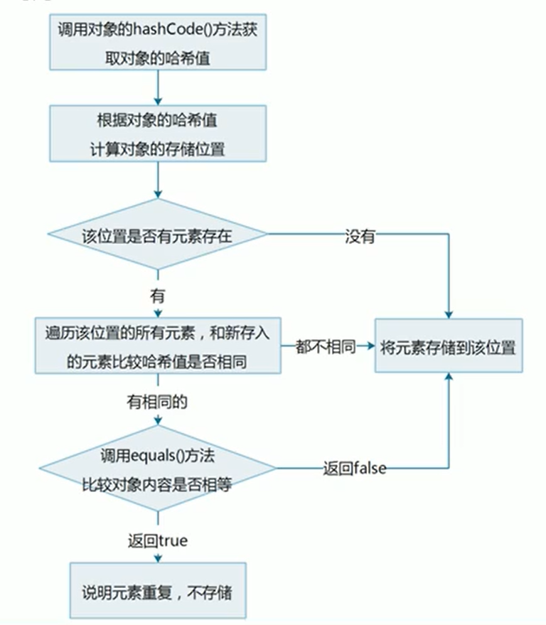
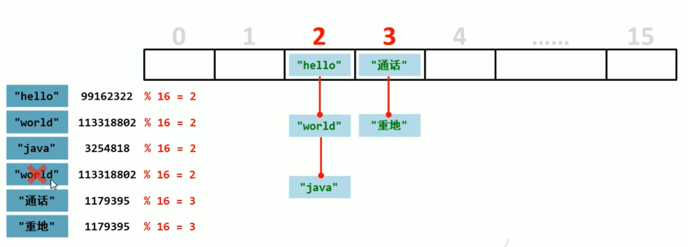

[TOC]


###  继承

- 继承是面向对象三大特征之一，可以使得子类具有父类的属性和方法，还可以在子类中重新定义、追加属性和方法。

- 格式：`public class 子类名 extends 父类名{}`
- 父类：也被称为基类、超类
- 子类：也被称为派生类
- 继承中子类的特点：
  - 子类可以有父类的内容
  - 子类还可以有自己特有的内容

#### 继承的好处和弊端

- 继承好处
  - 提高了代码的复用性
  - 提高了代码的维护性（方法代码需要修改，修改一处即可）
- 继承弊端
  - 继承让类与类之间产生了关系，类的耦合性增强了，当父类发生变化时子类实现也不得不跟着变化，削弱了子类的独立性。
- 什么时候使用继承
  - 继承体现的关系：is a（猫是一种动物）

#### 继承中变量的访问特点

在子类方法中访问一个变量

- 在子类局部范围找
- 子类成员范围找
- 父类成员范围找
- 找父亲的父亲……
- 没有就报错

#### super 关键字

- super与this类似

  - this：代表对本类对象的引用

  - super：代表对父类存储空间的标识（可以理解为父类对象引用）

- 用法

  - 它可以向上在父类中找到父类的成员，直到找到为止（如在父类的父类中）。

  - `super.成员变量`：访问父类成员变量
  - `super(...)`：访问父类构造方法
  - `super.成员方法(...)`：访问父类成员方法

#### 继承中构造方法的访问特点

- 每一个子类构造方法的第一条语句默认都是`super()`
- 如果父类中没有无参构造方法，只有带参构造方法：
  - 需要通过使用super关键字去显式地调用父类的带参构造方法。
  - 或：在父类中自己提供一个无参构造方法。

#### 继承中成员方法的访问特点

- 通过子类对象访问一个方法
  - 先到子类成员范围去找
  - 父类成员范围找
  - 父亲的父亲中去找
  - 没有就报错

#### 方法重写（Override）

- 概述

  子类中出现了和父类中一模一样的方法声明、

- 应用

  当子类需要父类的功能，而功能主体子类有自己特有内容是，可以重写父类中的方法，这样，既沿袭了父类的功能，右定义了子类的内容。

- 使用`@override`注解可以帮助检查重写方法的方法声明的正确性。

- 方法重写的注意事项

  - 父类中私有方法子类不能重写（父类私有成员子类是不能继承的）。
  - 子类方法访问权限不能更低（`public`>默认>`private`）

#### Java中继承的注意事项

- Java类只支持单个继承，不支持多个继承。

  如Son类不能同时`extend Father， Mother`。

- 但支持多层继承。

  如Father类继承GrandDad类，Son类继承Father类。

### 修饰符

#### 包package

- 作用：对类进行分类和管理

- 格式：`package 报名`（多级包用`.`分开）

- 带包的java类编译和执行
  - 手动建包：
    1. 按照以前的格式编译Java文件`javac HelloWorld.java`
    2. 手动创建包（建文件夹）
    3. 将编译的.class文件放进文件夹的最里面中。
    4. 带包执行 `java 包名.HelloWorld`
  - 自动建包：
    1. `javax -d. HelloWorld.java`
    2. `java 包名.HelloWorld`

- 导包import

  `import 包名`

#### 权限修饰符

- private：只能在同一个类中访问
- 默认：只能在同一个类中、或同一个包中的子类和无关类中访问
- protected：可以在同一个类中、或同一个包中的子类和无关类、或不同包中的子类进行访问
- public：在同一个类中、同一个包中子类和无关类、不同包中的子类和无关类都可进行访问

#### 状态修饰符final和static

##### final

- 意为最终， 可以修饰类、成员方法、成员变量。
- final修饰的特点：
  - 修饰方法：表明该方法是最终方法，不能被重写
  - 修饰变量：表明该变量是常量，不能再次被赋值
  - 修饰类：表明该类是最终类，不能被继承
- final修饰局部变量
  - 变量是基本类型：final修饰指的是基本类型的数据值不能发生改变
  - 变量是引用类型：final 修饰指的是引用类型的地址值不能发生改变，但是地址里面的内容可以发生改变。

##### static

- 静态的意思，可以修饰成员方法、成员变量。
- static修饰的特点
  - 被类的所有对象共享，这也是我们判断是否要使用静态关键字的条件。
  - 可以通过类名调用（也可以通过对象名调用，不推荐）

- static访问的特点
  - 静态成员方法只能访问静态成员（变量、方法）


### 多态

- 概述

  同一个对象，在不同时刻表现出来 的不同形态

  比如：

  - 猫是猫：`Cat cat = new Cat()`（在内存中申请的空间仍为Cat对象的空间）
  - 猫是动物：`Animal cat = new Cat()`

  这里的猫在不同时刻表现出来了不同的形态，这就是多态。

- 多态的前提和体现
  - 有继承或实现关系
  - 有方法重写（有同一个方法如`Cat.eat()`和`Animal.eat()`）
  - 有父类引用指向子类对象（如`Animal cat = new Cat()`）

#### 多态中成员访问特点

- 访问成员变量：编译看左边，执行看左边

  全部取决于修饰类型的成员变量，如`Animal cat = new Cat()`,通过cat访问到的全为Animal对象的成员变量

- 访问成员方法：编译看左边，执行看右边。

  如`Animal cat = new Cat()`，其在编译过程中，只将cat编译为一个Animal对象，该对象无法访问Cat类型的独有方法，而只能访问Animal中的方法，但如果Cat中重写了Animal的方法，那么通过cat访问的方法实际执行的会是Cat类中重写的方法。

#### 多态的优点和弊端

- 好处：提高了程序的扩展性

  具体体现 ：定义方法的时候，使用父类型作为参数，将来在使用的时候，使用具体的子类型参与操作。

- 弊端：不能使用子类的特有方法

#### 多态中的转型

- 向上转型

  从子到父

  父类引用指向子类对象

- 向下转型

  - (**前提是这个父类的引用在创建对象时就是创建的该子类的对象，否则会抛出ClassCastException**)

  从父到子

  父类引用转为子类对象

### 抽象类

在Java中，一个没有方法体的方法应该定义为抽象方法，而类中如果有抽象方法，该类必须定义为抽象类。

#### 抽象类的特点

- 抽象类和抽象方法必须使用`abstract`关键字修饰

  - `public abstract class 类名 {}`

  - `public abstract void 方法名()`

- 抽象类中不一定有抽象方法，有抽象方法的类一定是抽象类

- 抽象类不能实例化

  - 抽象类的实例化要参照多态的方式，通过子类对象实例化，这叫抽象类多态

- 抽象类的子类

  - 要么重写抽象类中的所有抽象方法
  - 要么是抽象类

#### 抽象类的成员特点

- 成员变量：可以是变量，也可以是常量
- 构造方法：
  - 有构造方法，但不能直接实例化
  - 其构造方法用于子类访问父类数据的初始化
- 成员方法
  - 可以有抽象方法：限定子类必须完成某些动作
  - 也可以有非抽象方法：提高代码复用性

### 接口

- 接口是一种**公共的规范标准**，只要符合规范标准，大家都可以通用

- Java中的接口更多的体现在对**行为的抽象**

#### 接口的特点

- 接口用关键字`interface`修饰

  `public interface 接口名{}`

- 类实现接口用`implements`表示

  `public class 类名 implements 接口名{}`

- 接口不能实例化

  - 接口的实例化需要参照多态的方式，通过实现类对象实例化，这叫接口多态。

  > - 多态的形式：具体类多态，**抽象类多态**，**接口类多态**
  > - 多态的前提：有继承或实现关系；有方法重写；有父（类|接口）引用指向（子|实现）类对象。

- 接口的实现类

  - 要么重写接口中的所有抽象方法
  - 要么是抽象类

#### 接口的成员特点

- 成员变量

  - 只能常量
  - 默认修饰符：`public static final`

- 构造方法

  - 接口没有构造方法，因为接口主要是对行为进行抽象的，是没有具体存在的

  > - `Object`类是类层次结构的根。每个类都有 `Object`作为超类。所有对象，包括数组，实现这个类的方法。
  >
  > 一个类如果没有父类，默认继承自Object类，所以接口的实现类的构造方法会调用Object类的构造方法。

- 成员方法

  - 只能抽象方法
  - 默认修饰符：`public abstract`

#### 类和接口的关系

- 类和类的关系：继承关系，只能单继承，但是可以多层继承
- 类和接口的关系：实现关系，可以单实现，也可以多实现，还可以在继承一个类的同时实现多个接口。
- 接口和接口的关系：继承关系，可以单继承，也可以多继承。

#### 抽象类和接口的区别

- 成员区别
  - 抽象类：变量，常量；有构造方法；有抽象方法，也有非抽象方法
  - 接口：常量；抽象方法
- 关系区别
  - 类与类：继承，单继承
  - 类与接口：实现，可以单实现，也可以多实现
  - 接口和接口：继承，单继承，多继承
- 设计理念区别
  - 抽象类：对类抽象，包括属性、 行为（对事物的抽象）
  - 接口：对行为抽象，主要是行为（对行为的抽象）

### 形参和返回值

- 类名作为形参和返回值
  - 方法的形参是类名，其实需要的是该类的对象
  - 方法的返回值是类名，其实返回的是该类的对象
- 抽象类名作为形参和返回值
  - 方法的形参是抽象类名，其实 需要的是该抽象类的**子类对象**
  - 方法的返回值是抽象类名，其实返回的是该抽象类的**子类对象**
- 接口名作为形参和返回值
  - 方法的形参是接口名，其实需要的是改接口的实现类对象
  -  方法的返回值是接口名，其实返回的是该接口的实现类对象

### 内部类

- 就在在一个类中定义的另一个类。

- 格式：

  ```java
  public class 外部类名{
      修饰符 class 内部类名{
          // 一般内部类不应该暴露给外部
      }
  }
  ```

- 内部类的访问特点

  - 内部类可以直接访问外部类的成员，包括私有
  - 外部类要访问内部类的成员，必须要创建对象

-  内部类可以分为：

  - 在类的成员位置：成员内部类
  - 在类的局部位置：局部内部类（包括匿名内部类）

#### 成员内部类

- 外界使用成员内部类：创建对象
  - 格式：`外部类名.内部类名 对象名 = 外部类对象.内部类对象;`
  - 例子：`Outer.Inner oi = new Outer().new Innner();`
  - 成员内部类一般不使用public修饰符（而使用private），故一般情况下也不暴露给外界。

#### 局部内部类

- 局部内部类是在方法中定义的类
- 外界无法直接访问，需要在方法内部创建对象并使用
- 局部内部类可以直接访问外部类的成员，也可以访问方法内的局部变量

#### 匿名内部类

- 前提：存在一个类或者接口，这里的类可以是具体类也可以是抽象类

- 格式：

  ```java
  new 类名或者接口名(){
      重写方法;
  };
  
  new Inter(){
      public void show(){
          //
      }
  }
  ```

- 本质：是一个继承了该类或者实现了该接口的子类的匿名对象

- 使用：可以方便地创建出一个只使用很少次数的实现了某个接口或继承了某个类的对象，随用随造，不需要单独再创建Java类。

- > 匿名内部类可以使你的代码更加简洁，你可以在定义一个类的同时对其进行实例化。它与局部类很相似，不同的是它没有类名，如果某个局部类你只需要用一次，那么你就可以使用匿名内部类（Anonymous classes enable you to make your code more concise. They enable you to declare and instantiate a class at the same time. They are like local classes except that they do not have a name. Use them if you need to use a local class only once.）
  >
  > - [java document-Anonymous Classes](https://docs.oracle.com/javase/tutorial/java/javaOO/anonymousclasses.html) 

- 匿名类无法访问其封闭范围内未声明为`final`或实际上未声明为final 的局部变量。

### 常用API

#### Math类

- 类`Math`包含用于执行基本数字运算的方法，例如基本指数，对数，平方根和三角函数。 

#### System类

- `System`类包含几个有用的类字段和方法。它不能被实例化。
- `System`类提供的设施包括标准输入，标准输出和错误输出流; 访问外部定义的属性和环境变量; 一种加载文件和库的方法; 以及用于快速复制阵列的一部分的实用方法。 

#### Object类

- `Object`类是类层次结构的根。每个类都有  `Object`作为超类。所有对象，包括数组，实现这个类的方法。 

- > 看方法的源码，在idea中可选中方法名，按下ctrl+B

- `Object.toString()`:返回对象的字符串表示形式。总的来说，这 `toString`方法返回一个字符串，“以文本方式表示”这个对象。**建议所有子类都重写此方法。**

-  `Object`类的`toString`方法返回一个包含该类的对象是一个实例的名称字符串的符号  `@` ，和符号进制表示的对象的哈希码。换句话说，此方法返回一个等于值的字符串：
```java
getClass().getName() + '@' + Integer.toHexString(hashCode())
```
- `Object.equals()`：比较的是引用值（地址值）。

  - 请注意，它一般是必要覆盖`hashCode`方法重写此方法，以保持对`hashCode`方法的一般合同，即平等的对象必须具有相等的散列码。

  - 重写该方法（idea可自动生成，alt+insert）：

    ```java
     @Override
        public boolean equals(Object o) {
            // 比较地址值是否相同，相同则直接true
            if (this == o) return true;
            
            /*
            先判断参数是否为null
            再判断两个对象是否来自同一个类
            只要有一种就可以直接false
            */
            if (o == null || getClass() != o.getClass()) return false;
    		// 向下转型
            Animal animal = (Animal) o;
            
    		// 比较各个成员变量
            if (age != animal.age) return false;
            return name != null ? name.equals(animal.name) : animal.name == null;
        }
    ```

#### Arrays

- 这个类包含用于操作数组（如排序和搜索）的各种方法。此类还包含一个允许数组被视为列表的静态工厂。 
- 常用：
  - `Arrays.toString()`
  - `Arrays.sort()`

#### 基本包装类型

- 将基本数据类型封装成对象的好处在于可以在对象中定义更多的功能方法操作该数据

- 常用的操作之一：用于基本数据类型与字符串之间的转换

- | 基本数据类型 | 包装类    |
  | ------------ | --------- |
  | byte         | Byte      |
  | short        | Short     |
  | int          | Integer   |
  | long         | Long      |
  | float        | Float     |
  | double       | Double    |
  | char         | Character |
  | boolean      | Boolean   |

##### 以Interger类的使用为例

- 得到该类的对象：
  - `Integer.valueOf(int i)`
  - `Integer.valueOf(String s)`
- `int`转换为`String`类型：
  - `String.valueOf(int num)`
- `String`转为`int`：
  - `Integer.valueOf(String s).intValue()`
  - `Integer.parseInt(String s)`(推荐)

#### 自动装箱和拆箱

- 装箱：把基本数据类型转换为对应的包装类型
- 拆箱：把包装类类型转换为基本数据类型。
- 装箱和拆箱都可以自动完成。（需要对包装类类型做判null的处理）

#### 日期类

##### Date类

- Date代表了一个特定时间，精确到毫秒
  - `Date()`：得到一个当前时间和日期的信息
  - `Date(long date)`：date表示从标准基准时间起指定的毫秒数，从其生成时间日期信息
- 常用方法：
  - `public long getTime() `：获取的是日期对象从1970年1月1日0时到现在的毫秒值
  - `public void setTime(long time)`：设置时间，time为毫秒值

##### SimpleDateFormat类

- `SimpleDateFormat`是一个具体的类，用于以区域设置敏感的方式格式化和解析日期。  它允许格式化（日期文本），解析（文本日期）和规范化。 

- | 模式字母 | 表示 |
  | -------- | ---- |
  | `y`      | 年   |
  | `M`      | 月   |
  | `d`      | 日   |
  | `H`      | 时   |
  | `m`      | 分   |
  | `s`      | 秒   |
  |          |      |
  |          |      |

- 构造方法

  - `SimpleDateFormat()`：使用默认模式和日期格式
  - `SimpleDateFormat(String pattern)`：使用给定的模式和默认的日期格式

- 格式化和解析日期

  - 格式化（从Date到String）： `public final String format(Date date)`，将日期格式化成日期|时间字符串
  - 解析（从String到Date）：`public Date parse(String source)`， 从给定字符串的开始解析文本以生成日期

```java
// 格式化
        Date d = new Date();
        SimpleDateFormat sdf = new SimpleDateFormat("yyyy年MM月dd日 HH:mm:ss");
        String s = sdf.format(d);
        System.out.println(s);
        // 解析
        String ss = "2021-12-08 00:23:05";
        SimpleDateFormat sdf2 = new SimpleDateFormat("yyyy-MM-dd HH:mm:ss");
        Date dd = sdf2.parse(ss);
        System.out.println(dd);
/*
输出：
2021年12月08日 00:25:20
Wed Dec 08 00:23:05 CST 2021
*/
```

##### Calendar类

- Calendar为抽象类

- Calendar为某一时刻和一组日历字段之间的转换提供了一些方法，并为操作日历字段提供了一些方法

- Calendar提供了一个类方法`getInstance`用于获取Calendar对象，其日历字段已使用当前日期和时间初始化
  - `Calendar rightnow = Calendar.getInstance();`（多态的形式得到对象，获得的是Calendar的子类对象）

- 获取Calendar中的字段

  - 年：`rightnow.get(Calendar.YEAR) `
  - 月：`rightnow.get(Calendar.MONTH) +1`（月份从0开始）
  - 日：`rightnow.get(Calendar.DATE) `

- 其他常用方法：

  - `public abstract void add(int field, int amount)`：根据日历的规则，将指定的时间量添加或减去给定的日历字段

    ```java
    // 10年后的5天前
    rightnow.add(Calendar.YEAR, 10);
    rightnow.add(Calendar.Date, -5);
    ```

    

  - `public final void set(int year, int month, int date)`：设置当前日历的年月日

### 异常

- `Throwable`类是Java语言中所有错误和异常的超类。  只有作为此类（或其一个子类）的实例的对象由Java虚拟机抛出，或者可以由Java `throw`语句抛出。  类似地，只有这个类或其子类可以是`catch`子句中的参数类型。

- `Throwable`两个子类的实例[`Error`](../../java/lang/Error.html)和[`Exception`](../../java/lang/Exception.html)通常用于表示出现异常情况。

  - 一个`Error`是的子类`Throwable`表示严重的问题，合理的应用程序**不应该试图捕获**。  大多数这样的错误是异常情况（如硬件层面问题，内存不足等，一般在Java层面不进行捕捉处理）。

  - `Exception`及其子类，表示合理应用程序可能想要捕获的条件。

    `Exception`类和不是`RuntimeException`的子类的任何子类都是*检查异常* （需要进行捕获检查处理）。  检查异常需要在方法或构造函数的`throws`子句中声明，如果它们可以通过执行方法或构造函数抛出，并在方法或构造函数边界之外传播。 

  - `RuntimeException`是在Java虚拟机的正常操作期间可以抛出的异常的超类。`RuntimeException`及其子类是*未经检查的异常* （一般需要检查代码存在的问题）。  unchecked异常*不需要*在方法或构造函数的拟申报`throws`条款

- 异常处理有两种方法：

  - 捕捉异常
  - 向外抛出异常

#### JVM的默认处理方案

如果程序出现了问题，我们没做任何处理，最终JVM会做默认的处理：

- 把异常的名称，异常的原因以及异常出现的位置等信息输出在控制台
- 程序停止运行

#### 异常处理try...catch...

- 格式

  ```java
  try{
      //可能出现异常的代码
  } catch(异常类名 变量名) {
      // 异常的处理代码
  }
  ```

- 执行流程

  - 程序从try里面的代码开始执行
  - 出现异常时，会自动生成一个异常类对象，该异常对象将被提交给Java运行时系统。
  - 当Java运行时系统接收到的异常对象时，会到catch中去找匹配的异常类，找到后进行异常的处理
  - 执行完毕之后，程序还可以继续往下执行（try中的代码会停在出现异常的地方，不会继续）。

#### Throwable类的成员方法

- `public String getMessage()`返回此Throwable的详细信息（细节）字符串
- `public String toString()`返回此可抛出的简短描述
- `public void printStackTrace()`把异常的错误信息输出在控制台

#### 编译时异常和运行时异常的区别

- Java中的异常被分为两大类：**编译时异常**和**运行时异常**，也称为**受检异常**和**非受检异常**
- 所有的RuntimeException类及其子类被称为运行时异常，其他的异常都是编译时异常。
- 编译时异常：必须显示处理，否则程序就会发生错误，无法通过编译
- 运行时异常，无需显示处理，也可以和编译时异常一样处理

#### 异常处理之throws

- 有时异常出现时无权限处理，就需要将异常向外抛出（在方法声明中做异常标记)，由方法调用者进行捕捉处理

- 格式：

  ```java
  public void 方法名() throws Exception{
      //方法代码
  }
  ```

#### 自定义异常

- 继承自Exception类，带参构造方法调用`super(message)`传递message错误信息。
- 在需要手动抛出异常的地方，使用`throw`关键字抛出异常对象
  - 如：`throw new MyException(message);`

#### throws 和throw的区别

- throws
  - 用在方法声明后面，跟的是异常类名
  - 表示抛出异常，由该方法的调用者来处理异常
  - 表示会出现异常的一种可能性，并不一定会发生这些异常
- throw
  - 用在方法体内，跟的是异常对象名
  - 表示抛出异常，由方法体内的语句处理
  - 执行throw一定抛出了某种异常

### 集合

集合类的特点：提供一种存储空间可变的存储模型，存储的数据容量可以随时发生改变。

集合的体系结构：

- Collection接口（单列）
  - List接口（可重复）
    - ArrayList
    - LinkedList
    - ……
  - Set接口（不可重复）
    - HashSet
    - TreeSet
    - ……
- Map接口（双列）
  - HashMap
  - ……

#### Collection接口

- 是单例集合的顶层接口，它表示一组对象，这些对象也称为Collection的元素

- JDK中不提供Collection接口的直接实现，而是提供了其更具体的子类接口Set和List的实现。

- 创建Collection集合的对象

  - 多态的方式
  - 具体的实现类ArrayList

  ```java
  // 创建Collection集合的对象
  Collection<String> c = new ArrayList<String>();
  // 添加元素
  c.add("h1");
  c.add("h2");
  System.out.println(c);
  ```

- 常用方法

  - `boolean add(E e)`添加元素（ArrayList中，在容量满足的情况下永远返回true）
  - `boolean remove(Object o)`从集合中移除指定的元素
  - `void clear()`清空集合中的元素
  - `boolean contains(Object o)`判断集合中是否存在指定的元素
  - `boolean isEmpty()`判断集合是否为空 
  - `int size()`集合的长度，也就是集合中元素的个数

##### Collection集合的遍历

- `Iterator`：迭代器，集合的专用遍历方式

  - `Iterator<E> iterator()`:返回此集合中元素的迭代器，通过集合的`iterator()`方法得到
  - 迭代器是通过集合的iterator()方法得到的，所以我们说它是依赖于集合而存在的

- `Iterator`中的常用方法

  - `E next()`：返回迭代中的下一个元素
  - `boolean hasNext()`：如果迭代具有更多元素，则返回true

   ```java
   Iterator<String> it = c.iterator();
   while(it.hasNext()) {
       System.out.println(it.next());
   }
   ```

- 注意：ArrayList在迭代的时候如果同时对其进行修改就会抛出`java.util.ConcurrentModificationException`异常（如在迭代时添加元素，虽然`hasNext()`为true，但`next()`方法会抛出该异常）

#### List

-  继承自`Collection`
-  List为有序集合（也称为序列），用户可以**精确**控制列表中每个元素的插入位置。用户可以通过整数**索引访问**元素，并搜索列表中的元素
-  与Set集合不同，列表通常允许重复的元素
-  特点：
   - 有序：存储和取出的元素顺序一致
   - 可重复：存储的元素可重复

```java
List<String> list = new ArrayList<String>()
```

- List **特有**方法
  - `void add(int index, E element)`在此集合中的指定位置插入指定的元素
  - `E remove(int index)`删除指定索引处的元素,返回被删除的元素
  - `E set(int index, E element)`修改指定索引处的元素,返回被修改的元素
  - `E get(int index)`返回指定索引处的元素
- `ListIterator`：列表迭代器
  - 通过List集合的`listIterator()`方法得到,所以说它是List集合特有的迭代器
  - 用于允许程序员沿任一方向遍历列表的列表迭代器,在迭代期间修改列表,并获取列表中迭代器的当前位置
- `ListIterator`中的常用方法
  - `E next()`:返回迭代中的下一个元素
  - `boolean hasNext()`:如果迭代具有更多元素,则返回true 
  - `E previous()`:返回列表中的上一个元素
  - `boolean has Previous()`:如果此列表迭代器在相反方向遍历列表时具有更多元素,则返回true 
  - `void add(E e)`:将指定的元素插入列表

##### 增强for循环(for-each loop)

- 增强for:简化数组和 Collection集合的遍历

  - 实现 `Iterable`接口的类允许其对象成为增强型for语句的目标
  - 它是JDK5之后出现的,其内部原理是一个 `lterator`迭代器

- 格式

  ```java
  for(元素数据类型 变量名 ： 数组或Collection集合) {
      // 在此处使用变量即可，该变量就是元素
  }
  ```

- 注意其内部原理是一个`Iterator`迭代器，所以在该for循环中，不可对集合元素进行修改操作。否则会抛出并发修改异常。

##### List集合子类特点

List集合常用子类：`ArrayList`、`LinkedList`

- `ArrayList`：底层数据结构是数组，查询快，增删慢
- `LinkedList`：底层数据结构是链表，查询慢，增删快

##### LinkedList集合的特有功能

其底层是链表，故提供了一些对头尾操作的方法：

- `public void addFirst(E e)`在该列表开头插入指定的元素
- `public void addLast(E e)`将指定的元素追加到此列表的末尾
- `public E getFirst()`返回此列表中的第一个元素
- `public E getLast()`返回此列表中的最后一个元素
- `public E removeFirst()`从此列表中删除并返回第一个元素
- `public E removeLast()`从此列表中删除并返回最后一个元素

#### Set集合

- Set集合特点
  - 不包含重复元素的集合
  - 没有带索引的方法，所以不能使用普通for循环遍历

```java
Set<String> set = new HashSet<String>();
set.add("zz");
set.add("hh");
set.add("gg");
set.add("hh");// 不会存储重复元素
set.add("ee");

// 遍历
for(String s : set){
   System.out.println(s);
}
System.out.println(set);
```

##### 哈希值（Hash）

- 哈希值：是JDK根据对象的**地址**或者**字符串**或者**数字**算出来的int类型的**数值**。

- Object类中有一个方法可以获取对象的哈希值
  - `public int hashCode()`：返回对象的哈希值
  - 默认情况下，不同对象的哈希值是不相同的
  - 通过方法重写，可以实现不同对象的哈希值是相同的

##### HashSet集合概述和特点

`HashSet`集合特点：

- 底层数据结构是哈希表
- 对集合的迭代顺序不作任何保证,也就是说不保证存储和取出的元素顺序一致
- 没有带索引的方法,所以不能使用普通for循环遍历
- 由于是Set集合,所以是不包含重复元素的集合

##### HashSet集合保证元素唯一性

```java
// Hashset存储元素的相关源码分析
// 创建集合对象
Set<String> set = new HashSet<String>();
// 添加元素
set.add("zz");
-----------------------------------

public boolean add(E e) {
    return map.put(e, PRESENT)==null;
}

static final int hash(Object key) {
    int h;
    return (key == null) ? 0 : (h = key.hashCode()) ^ (h >>> 16);
}

public V put(K key, V value) {
    return putVal(hash(key), key, value, false, true);
}

// hash值和元素的hashCode()方法相关
final V putVal(int hash, K key, V value, boolean onlyIfAbsent,
                   boolean evict) {
        Node<K,V>[] tab; Node<K,V> p; int n, i;

        // 如果哈希表未初始化，就对其进行初始化
        if ((tab = table) == null || (n = tab.length) == 0)
            n = (tab = resize()).length;

        // 根据对象的哈希值计算对象的存储位置,如果该位置没有元素,就存储元素
        if ((p = tab[i = (n - 1) & hash]) == null)
            tab[i] = newNode(hash, key, value, null);
        else { //该位置有元素
            Node<K,V> e; K k;
            /*
            存入的元素和以前的元素比较哈希值
                如果哈希值不同,会继续向下执行,把元素添加到集合
                如果哈希值相同,会调用对象的equals()方法比较
                    如果返回false,会继续向下执行,把元素添加到集合
                    如果返回true,说明元素重复,不存储
            */
            if (p.hash == hash &&
                ((k = p.key) == key || (key != null && key.equals(k))))
                e = p;// 不存储
            else if (p instanceof TreeNode)
                e = ((TreeNode<K,V>)p).putTreeVal(this, tab, hash, key, value);
            else {
                for (int binCount = 0; ; ++binCount) {
                    if ((e = p.next) == null) {
                        p.next = newNode(hash, key, value, null);
                        if (binCount >= TREEIFY_THRESHOLD - 1) // -1 for 1st
                            treeifyBin(tab, hash);
                        break;
                    }
                    if (e.hash == hash &&
                        ((k = e.key) == key || (key != null && key.equals(k))))
                        break;
                    p = e;
                }
            }
            if (e != null) { // existing mapping for key
                V oldValue = e.value;
                if (!onlyIfAbsent || oldValue == null)
                    e.value = value;
                afterNodeAccess(e);
                return oldValue;
            }
        }
        ++modCount;
        if (++size > threshold)
            resize();
        afterNodeInsertion(evict);
        return null;
    }

```


- HashSet集合添加一个元素的过程：

  

- 要保证元素唯一性，需要重写`hashCode()`和`equals()`

##### 哈希表

- JDK8之前,底层采用**数组+链表**实现,可以说是一个元素为链表的数组

- JDK8以后,在长度比较长时候,底层实现了优化

- HashSet使用的HashMap默认容量为16

  


##### LinkedHashSet集合

- 继承自`HashSet`、实现了Set接口

- `LinkedHashSet` 集合特点
  - 哈希表和链表实现的 Set 接口，具有可预测的迭代次序
  - 由链表保证元素有序，也就是说元素的存储和取出顺序是一致的
  - 由哈希表保证元素唯一，也就是说没有重复的元素

##### TreeSet集合

- `Treeset`集合特点：
  - 元素有序，这里的顺序不是指存储和取出的顺序，而是按照一定的规则进行排序，具体排序方式取决于构造方法
    - `TreeSet()`: 根据其元素的自然排序进行排序 
    - `TreeSet(Comparator comparator)`:根据指定的比较器进行排序
  - 没有带索引的方法，所以不能使用普通 for 循环遍历
  - 由于是 Set 集合，所以不包含重复元素的集合

##### 自然排序Comparable的使用

- 用 `TreeSet` 集合存储自定义对象，无参构造方法使用的是自然排序对元素进行排序的
- 自然排序，就是让元素所属的类实现 `Comparable` 接口，重写 `compareTo(O o)`方法
- 重写方法时，一定要注意排序规则必须按照要求的主要条件和次要条件来写
- `compareTo(O o)`方法返回0时， 代表两个元素相等，返回正数时，代表该元素比o大，返回负数则相反。

##### 比较器排序Comparator的使用

```java
// 可以直接使用匿名内部类
TreeSet<Student> ts = new TreeSet<Student>(new Comparator<Student>() {
        @Override
        public int compare(Student s1, Student s2) {
            int num = s1.getAge() - s2.getAge();
            return num == 0 ? s1.getName().compareTo(s2.getName()) : num;
        }
    });

```

-  用 `TreeSet` 集合存储自定义对象，带参构造方法使用的是比较器排序对元素进行排序的
- 比较器排序，就是让集合构造方法接收 Comparator 的实现类对象，重写 `compare（To1，T o2）`方法
- 重写方法时，一定要注意排序规则必须按照要求的主要条件和次要条件来写

#### 泛型

- 泛型：是 JDK5中引入的特性，它提供了编译时类型安全检测机制，该机制允许在编译时检测到非法的类型。它的本质是**参数化类型**，也就是说所操作的数据类型被指定为一个参数

- 参数化类型：顾名思义，就是**将类型由原来的具体的类型参数化，然后在使用/调用时传入具体的类型**

- 这种参数类型可以用在类、方法和接口中，分别被称为泛型类、泛型方法、泛型接口
- 泛型定义格式：
  - `<类型>`：指定一种类型的格式。这里的类型可以看成是形参
  - `<类型1，类型2..>`：指定多种类型的格式，多种类型之间用逗号隔开。这里的类型可以看成是形参
  - 将来具体调用时候给定的类型可以看成是实参，并且实参的类型只能是引用数据类型
- 泛型的好处：
  - 把运行期间的问题提前到了编译期间
  - 避免了强制类型转换

##### 泛型类

- 泛型类的定义格式：
  - 格式：`修饰符 class 类名<类型>{}`
  - 范例：`public class ClassName<T>{}`
    此处` T `可以随便写为任意标识，常见的如 `T`、`E`、`K`、`V `等形式的参数常用于表示泛型

 ##### 泛型方法

- 范例：

  ```java
  public <T> void show(T t) {
      Systen.out.println(t);
  }
  ```

##### 泛型接口

- 格式：`修饰符 interface 接口名<类型>{}`
- 范例：`public interface Generic<T> {}`

```java
publuic interface Generic<T> {
    void show(T t);
}

public class GnericImpl<T> implements Generic<T> {
    @Override
    public void show(T t) {
        System.out.println(t)
    }
}

public class GenericDemo{
    public static void main(String[] args){
        Generic<String> g1 = new GenericImpl<String>();
        g1.show("qwer");
         
    }
}
```

##### 类型通配符

为了表示各种泛型 List 的父类，可以使用类型通配符

- 类型通配符：`<?>`
- `List<?>`：表示元素类型未知的 List，它的元素可以匹配**任何的类型**
- 这种带通配符的 List 仅表示它是各种泛型 List 的父类，并不能把元素添加到其中
- 如果说我们不希望 List<?>是任何泛型 List 的父类， 只希望它代表某一类泛型 List 的父类， 可以使用类型通配符的上限
  - 类型通配符上限`<?extends 类型>`
  - `List<? extends Number>`：它表示的类型是 Number 或者其子类型
- 除了可以指定类型通配符的上限，我们也可以指定类型通配符的下限
  - 类型通配符下限: `<? super 类型>`
  - `List<? super Number>`:它表示的类型是 Number  或者其父类型

```java
public class GenericDemo {
    public static void main(String[] args){
        //类型通配符：<?>
        List<?> list1=new ArrayList<Object>();
        List<?> list2 =new ArrayList<Number>();
		List<?> list3 =new ArrayList<Integer>();
		System.out.println("--------");
        
		//类型通配符上限：<?extends 类型>
        //List<? extends Number> list4 = new ArrayList<Object>();不符合上限
		List<? extends Number> list5 = new ArrayList<Number>();
		List<? extends Number> list6 = new ArrayList<Integer>();
		System.out.println("--------");
        
		//类型通配符下限：<?super 类型>
        List<? super Number> list7 = new ArrayList<Object>();
		List<? super Number> list8 =new ArrayList<Number>();
		// List<? super Number> List9 =new ArrayList<Integer>();不符合下限
```

##### 可变参数

- 可变参数又称参数个数可变，用作方法的形参出现，那么方法参数个数就是可变的了

- 格式：`修饰符 返回值类型 方法名(数据类型...变量名){ }`
- 范例:` public static int sum(int...a){}`
- 可变参数注意事项
  - 这里的变量其实是一个数组
  - 如果一个方法有多个参数，包含可变参数，可变参数要放在最后

```java
public static void main(String[] args) {
    System.out.println(sum(10,20));
	System.out.println(sum(10,20,30));
	System.out.println(sum(10,20,30,40));
	System.out.println(sum(10,20,30,40,50));
	System.out.println(sum(10,20,30,40,50,60));
}
// 这里的变量其实是一个数组
public static int sum(int...a) {
	int sum = 0;
	for(int i : a){
    	sum += i;
	}
    return sum;
}
```

##### 可变参数的使用

- Arrays 工具类中有一个静态方法：
  - `public static <T> List<T> asList(T...a) `：返回由指定数组支持的**固定大小**的列表 (列表元素不能增删，但可以修改)
- List 接口中有一个静态方法：
  -  `public static <E> List<E> of(E...elements) `：返回包含任意数量元素的**不可变**列表 
- Set 接口中有一个静态方法：
  - `public static <E> Set<E> of(E...elements) `：返回一个包含任意数量元素的**不可变**集合，且`elements`中不能存在重复的元素

```java
List<String> list = Arrays.asList("hello", "world", "java");

List<String> list = List.of("hh", "wwww", "jajj");

Set<String> set = Set.of("hh", "wwww", "jajj") 
```


#### Map

 Map是将键映射到值的对象。

- `Interface Map<K， V>`：K为键的类型、V为值的类型
- 将键映射到值的对象；
- 不能包含重复的键；
- 每个键可以映射到最多一个值
- 值可重复
- 创建Map集合的对象：
  - 多态的方式
  - 具体的实现类HashMap

```java
// 创建集合对象
map<String, String> map = new Hashmap<String, String>();
// 存入元素
map.put("001", "zhangyi");
map.put("002", "zxbn");
map.put("003", "ddff");

```

- Map集合的基本功能
  - `V put(K key, V value)`添加元素
  -  `V remove(Object key)`根据键删除键值对元素 
  - `void clear()`移除所有的键值对元素
  - `boolean containsKey(Object key)`判断集合是否包含指定的键
  -  `boolean containsValue(Object value)`判断集合是否包含指定的值 
  - `boolean isEmpty()`判断集合是否为空
  - `int size() `集合的长度，也就是集合中键值对的个数
- Map集合的获取功能
  - `V get(Object key)`根据键获取值
  - `Set<K> keySet() `获取所有键的集合
  - `Collection<V> values()` 获取所有值的集合
  - `Set<Map.Entry<K,V>> entrySet() `获取所有键值对对象的集合
- `Map.Entry`：是Map的条目（键值对）。`Map.entrySet()`会返回Map条目的集合，集合中的元素即属于此`Map.Entry`类。
  - `map.Entry`中的`getKey()`可返回该键值对条目的键
  - `map.Entry`中的`getValue()`可返回该键值对条目的值
  - `map.Entry`中的`setValue(V value)`可用指定的值替换该条目的值。

#### Collections

- 是针对集合操作的工具类，全是静态方法
- Collections 类的常用方法
  - `public static <T extends Comparable<? super T>> void sort(List<T> list)`:将指定的列表按升序排序
  - `public static void reverse(List<?> list)`:反转指定列表中元素的顺序
  - `public static void shuffle(List<?> list)`:使用默认的随机源随机排列指定的列表

  
